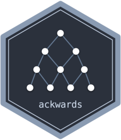

<!-- README.md is generated from README.Rmd. Please edit that file. -->

```{r setup, include = FALSE}
knitr::opts_chunk$set(
  collapse = TRUE,
  comment = "#>",
  fig.path = "man/figures/README-",
  out.width = "100%",
  fig.width = 8,
  fig.height = 5
)
```

# ackwards <a href="https://jmgirard.github.io/ackwards/"></a>

[](https://github.com/jmgirard/ackwards/actions/workflows/R-CMD-check.yaml)
[](https://app.codecov.io/gh/jmgirard/ackwards?branch=master)
[](https://lifecycle.r-lib.org/articles/stages.html#stable)
[](https://opensource.org/licenses/MIT)

> Bass-ackwards hierarchical structural analysis in R

**ackwards** implements Goldberg's (2006) bass-ackwards method and its modern
extensions for mapping the hierarchical structure of multivariate data.

The core insight is simple: instead of asking *how many* factors best describe
your data, ask *how the solutions at different levels of resolution are related
to one another*. A 1-factor solution captures the broadest shared variance; a
5-factor solution captures narrower, more specific dimensions. Bass-ackwards
analysis traces how broad factors split into narrow ones — and which narrow
factors are redundant re-combinations of broader ones.

The package supports three extraction engines (PCA, EFA, ESEM) and polychoric
correlations for ordinal data. Beyond fitting, it is a full analysis toolkit:
`suggest_k()` brackets the plausible depth, `comparability()` gates that depth on
split-half replicability, Forbes's (2023) `prune()` flags redundant or
artifactual factors from the skip-level connections, `boot_edges()` puts
bootstrap confidence intervals on every edge, and `predict()` scores new
observations out of sample.

## Installation

Install the released version from CRAN:

```{r install, eval = FALSE}
install.packages("ackwards")
```

Or the development version from GitHub:

```{r install-dev, eval = FALSE}
# install.packages("pak")
pak::pak("jmgirard/ackwards")
```

## Quick start

We use `bfi25`, the built-in 25-item Big Five example dataset (see `?bfi25` for
provenance). Because its items are recorded on a 6-point ordinal scale, we set
`cor = "polychoric"`, and we fit the dataset directly (rather than `na.omit()`-ing
it first) so its built-in IPIP item labels flow through to `top_items()`.

### Step 1 — Suggest a range of k

`suggest_k()` runs five complementary criteria — two forms of parallel analysis
(PC and FA basis), MAP, VSS, and optionally Comparison Data — to help you choose
an upper bound for the hierarchy depth.

```{r suggest, message = FALSE, warning = FALSE}
library(ackwards)

sk <- suggest_k(bfi25)
```

```{r suggest-print}
sk
```

The criteria converge on a consensus range that covers k = 5, consistent with
the known Big Five structure of this instrument.

### Step 2 — Fit the hierarchy

`ackwards()` fits factor models at every level from 1 to `k_max` and computes the
between-level factor-score correlations that define the hierarchy.

```{r fit}
x <- ackwards(bfi25, k_max = 5, cor = "polychoric", missing = "listwise")
x
```

### Step 3 — Visualize

`autoplot()` draws the hierarchical diagram. Each row is a level (k = 1 at top,
k = 5 at bottom); arrows connect each narrow factor to the broad factor it
inherits from, with thickness encoding |r| and colour encoding sign (both
legended). The
[visualization vignette](https://jmgirard.github.io/ackwards/articles/ackwards-visualization.html)
covers the encodings, `direction = "horizontal"`, and the rest of the styling.

```{r plot, message = FALSE, warning = FALSE, dev = "png", dpi = 150}
autoplot(x)
```

The five-factor level cleanly splits into the Big Five. The single broad factor
at k = 1 (roughly *general positive character*) differentiates first into
positive vs. negative affect (k = 2), then into successively narrower traits.

### Step 4 — Interpret and score

`top_items()` lists each factor's salient items — printed with `bfi25`'s built-in
IPIP labels — so you can read what a factor means; `augment()` turns the
hierarchy into factor scores for downstream analysis.

```{r top-items}
# What does each of the five factors mean? (salient items, |loading| >= 0.5)
top_items(x, level = 5, cut = 0.5)
```

```{r augment, warning = FALSE}
# Append factor scores for all 15 factors (1+2+3+4+5) to your data
# (incomplete rows score as NA -- see ?augment)
scored <- augment(x, data = bfi25)
ncol(scored) - ncol(bfi25) # 15 new .m{k}f{j} score columns
```

### Beyond the basics

A serious analysis rarely stops at one fit. Three verbs turn the hierarchy from a
picture into a defensible result, and one scores new data:

- **`comparability(bfi25, k_max = 6)`** gates hierarchy *depth* on split-half
  replicability — the deepest level at which every factor re-emerges in random
  halves of the sample (Everett 1983; Saucier et al. 2005).
- **`prune(x, "redundant")`** flags factors that persist across levels without
  differentiating — Forbes's (2023) redundancy question.
- **`boot_edges(x, bfi25)`** attaches bootstrap confidence intervals to every
  between-level edge.
- **`predict(x, newdata)`** scores observations the model never saw, in the
  training metric — the standard cross-validation pattern.

The
[recommended-workflow vignette](https://jmgirard.github.io/ackwards/articles/ackwards-girard.html)
strings these into a six-step analysis.

## Learn more

| Vignette | Topic |
|----------|-------|
| [Introduction](https://jmgirard.github.io/ackwards/articles/ackwards-intro.html) | The basics end-to-end: `suggest_k` → `ackwards` → summarize → plot → interpret → score |
| [Recommended workflow](https://jmgirard.github.io/ackwards/articles/ackwards-girard.html) | Replicability-gated hierarchies: gate depth on split-half `comparability()` |
| [Choosing k](https://jmgirard.github.io/ackwards/articles/ackwards-suggest-k.html) | Five criteria explained: pros/cons, bias direction, engine pairing |
| [Forbes extension](https://jmgirard.github.io/ackwards/articles/ackwards-forbes.html) | Skip-level edges, redundancy pruning, `pairs = "all"` |
| [Engines & rotation](https://jmgirard.github.io/ackwards/articles/ackwards-engines.html) | When to choose EFA or ESEM over PCA; convergence and loading comparison |
| [Ordinal data](https://jmgirard.github.io/ackwards/articles/ackwards-ordinal.html) | Polychoric correlations, attenuation bias, and WLSMV estimation |
| [Interpreting & labeling](https://jmgirard.github.io/ackwards/articles/ackwards-interpret.html) | `top_items()`, hierarchy-aware naming, `label_template()` round-trip |
| [Visualization](https://jmgirard.github.io/ackwards/articles/ackwards-visualization.html) | Styling `autoplot()`: sign/magnitude encoding, layout orientation, labels, publication figures |

## Citation

If you use **ackwards** in your research, please cite the package:

```{r citation}
citation("ackwards")
```

Please also cite the relevant method paper(s): Goldberg (2006)
<https://doi.org/10.1016/j.jrp.2006.01.001> for the bass-ackwards method itself,
and Forbes (2023) <https://doi.org/10.1037/met0000546> if you use the extended
method (`pairs = "all"`, redundancy/artifact pruning).
