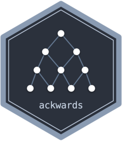

<!-- README.md is generated from README.Rmd. Please edit that file. -->

```{r setup, include = FALSE}
knitr::opts_chunk$set(
  collapse = TRUE,
  comment = "#>",
  fig.path = "man/figures/README-",
  out.width = "100%",
  fig.width = 8,
  fig.height = 5
)
```

# ackwards <a href="https://jmgirard.github.io/ackwards/"></a>

[](https://CRAN.R-project.org/package=ackwards)
[](https://github.com/jmgirard/ackwards/actions/workflows/R-CMD-check.yaml)
[](https://app.codecov.io/gh/jmgirard/ackwards?branch=master)
[](https://lifecycle.r-lib.org/articles/stages.html#stable)
[](https://opensource.org/licenses/MIT)

> Bass-ackwards hierarchical structural analysis in R

**ackwards** implements Goldberg's (2006) bass-ackwards method and its modern
extensions for mapping the hierarchical structure of multivariate data.

The core idea is this. Instead of asking *how many* factors best describe your
data, ask *how the solutions at different levels of detail relate to one
another*. A factor is a summary variable that stands in for a group of items
that tend to move together. A 1-factor solution captures the broadest shared
variance. A 5-factor solution captures narrower, more specific dimensions.
Bass-ackwards analysis traces how broad factors split into narrow ones. It also
shows which narrow factors are only re-combinations of broader ones.

The package supports three extraction engines. PCA (principal component
analysis) summarizes the items with weighted sums called components. EFA
(exploratory factor analysis) instead models the items as caused by latent
factors plus item-specific noise. ESEM (exploratory structural equation
modeling) fits the same kind of factor model inside a structural equation
framework, which adds fit indices and standard errors. Ordinal data are items
with a few ordered categories, such as a 1 to 5 rating. For such data the
package can use polychoric correlations, which estimate the correlation between
the continuous traits assumed to underlie the ordered responses.

Beyond fitting, the package is a full analysis toolkit. `suggest_k()` brackets
the plausible depth of the hierarchy. `comparability()` gates that depth on
split-half replicability. That is, it checks whether each factor re-emerges
when the sample is split into two random halves. Forbes's (2023) `prune()`
flags redundant factors (factors that persist across levels without changing)
and artifactual factors from the connections between non-adjacent levels.
`boot_edges()` puts bootstrap confidence intervals on every edge. `predict()`
scores new observations out of sample.

## Installation

Install the released version from CRAN:

```{r install, eval = FALSE}
install.packages("ackwards")
```

Or the development version from GitHub:

```{r install-dev, eval = FALSE}
# install.packages("pak")
pak::pak("jmgirard/ackwards")
```

## Quick start

We use `bfi25`, the built-in 25-item Big Five example dataset (see `?bfi25` for
provenance). Its items are recorded on a 6-point ordinal scale, so we set
`cor = "polychoric"`. We also fit the dataset directly rather than removing
incomplete rows first, so its built-in IPIP item labels flow through to
`top_items()`.

### Step 1: Suggest a range of k

`suggest_k()` runs five complementary criteria to help you choose an upper
bound for the hierarchy depth. Two of them are forms of parallel analysis,
which compares the eigenvalues of your data against those of random data with
the same shape. The others are MAP, VSS, and optionally Comparison Data.

```{r suggest, message = FALSE, warning = FALSE}
library(ackwards)

sk <- suggest_k(bfi25)
```

```{r suggest-print}
sk
```

The criteria converge on a consensus range that covers k = 5, consistent with
the known Big Five structure of this instrument.

### Step 2: Fit the hierarchy

`ackwards()` fits factor models at every level from 1 to `k_max`. It then
computes the correlations between the factor scores at neighbouring levels,
and those correlations define the hierarchy. A factor score is each person's
estimated standing on a factor, computed from their item responses. The
result is a set of linked solutions whose edges are score correlations, never
a fitted hierarchical model.

```{r fit}
x <- ackwards(bfi25, k_max = 5, cor = "polychoric", missing = "listwise")
x
```

### Step 3: Visualize

`autoplot()` draws the hierarchical diagram. Each row is a level, with k = 1 at
the top and k = 5 at the bottom. Arrows connect each narrow factor to the broad
factor it inherits from. Arrow thickness encodes the size of the correlation
and colour encodes its sign, and both are legended. The
[visualization vignette](https://jmgirard.github.io/ackwards/articles/ackwards-visualization.html)
covers the encodings, `direction = "horizontal"`, and the rest of the styling.

```{r plot, message = FALSE, warning = FALSE, dev = "png", dpi = 150}
autoplot(x)
```

The five-factor level cleanly splits into the Big Five. The single broad factor
at k = 1 (roughly *general positive character*) differentiates first into
positive vs. negative affect (k = 2), then into successively narrower traits.

### Step 4: Interpret and score

`top_items()` lists each factor's salient items, printed with the built-in IPIP
labels of `bfi25`, so you can read what a factor means. An item is salient
when its loading, the correlation between the item and the factor, is large.
`augment()` turns the hierarchy into factor scores for downstream analysis.

```{r top-items}
# What does each of the five factors mean? (salient items, |loading| >= 0.5)
top_items(x, level = 5, cut = 0.5)
```

```{r augment, warning = FALSE}
# Append factor scores for all 15 factors (1+2+3+4+5) to your data
# (incomplete rows score as NA -- see ?augment)
scored <- augment(x, data = bfi25)
ncol(scored) - ncol(bfi25) # 15 new .m{k}f{j} score columns
```

### Beyond the basics

A serious analysis rarely stops at one fit. Three verbs turn the hierarchy from a
picture into a defensible result, and one scores new data:

- **`comparability(bfi25, k_max = 6)`** gates hierarchy *depth* on split-half
  replicability. It finds the deepest level at which every factor re-emerges in
  random halves of the sample (Everett 1983, Saucier et al. 2005).
- **`prune(x, "redundant")`** flags factors that persist across levels without
  differentiating, which is the redundancy question of Forbes (2023).
- **`boot_edges(x, bfi25)`** attaches bootstrap confidence intervals to every
  between-level edge.
- **`predict(x, newdata)`** scores observations the model never saw, in the
  training metric, which is the standard cross-validation pattern.

The
[recommended-workflow vignette](https://jmgirard.github.io/ackwards/articles/ackwards-girard.html)
strings these into a six-step analysis.

## Learn more

| Vignette | Topic |
|----------|-------|
| [Introduction](https://jmgirard.github.io/ackwards/articles/ackwards-intro.html) | The basics end-to-end: `suggest_k` to `ackwards` to summarize, plot, interpret, and score |
| [Recommended workflow](https://jmgirard.github.io/ackwards/articles/ackwards-girard.html) | Replicability-gated hierarchies: gate depth on split-half `comparability()` |
| [Choosing k](https://jmgirard.github.io/ackwards/articles/ackwards-suggest-k.html) | Five criteria explained: pros and cons, bias direction, engine pairing |
| [Forbes extension](https://jmgirard.github.io/ackwards/articles/ackwards-forbes.html) | Skip-level edges, redundancy pruning, `pairs = "all"` |
| [Engines & rotation](https://jmgirard.github.io/ackwards/articles/ackwards-engines.html) | When to choose EFA or ESEM over PCA, with convergence and loading comparison |
| [Ordinal data](https://jmgirard.github.io/ackwards/articles/ackwards-ordinal.html) | Polychoric correlations, attenuation bias, and WLSMV estimation |
| [Interpreting & labeling](https://jmgirard.github.io/ackwards/articles/ackwards-interpret.html) | `top_items()`, hierarchy-aware naming, `label_template()` round-trip |
| [Visualization](https://jmgirard.github.io/ackwards/articles/ackwards-visualization.html) | Styling `autoplot()`: sign and magnitude encoding, layout orientation, labels, publication figures |

## Citation

If you use **ackwards** in your research, please cite the package:

```{r citation}
citation("ackwards")
```

Please also cite the relevant method paper(s). Cite Goldberg (2006)
<https://doi.org/10.1016/j.jrp.2006.01.001> for the bass-ackwards method itself.
Cite Forbes (2023) <https://doi.org/10.1037/met0000546> if you use the extended
method (`pairs = "all"`, redundancy or artifact pruning).
