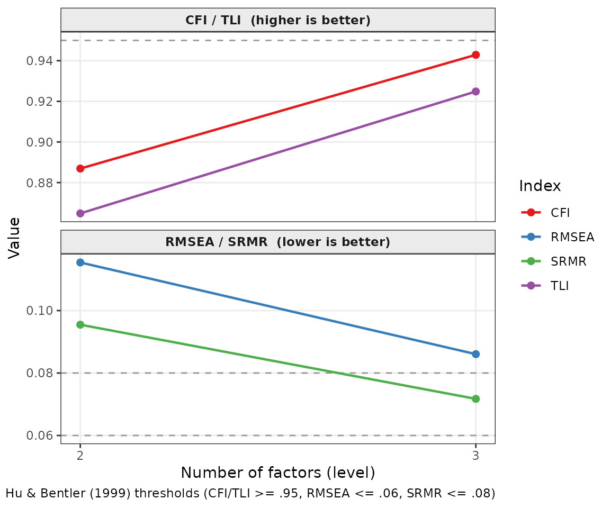

# Choosing an Engine: PCA, EFA, and ESEM

**ackwards** supports three factor extraction engines. They share the
same downstream machinery — the same rotation, the same tenBerge scoring
weights, the same between-level correlation algebra — but differ in
their statistical model and what they report. This vignette explains
when each one is appropriate and what the differences look like in
practice.

## The three engines at a glance

|  | `"pca"` | `"efa"` | `"esem"` |
|----|----|----|----|
| **What it models** | Total item variance | Common (latent) variance | Common variance via lavaan |
| **Communalities** | All 1.0 (by definition) | Estimated from data | Estimated from data |
| **Fit indices** | Eigenvalues only | chi, RMSEA, TLI, BIC | CFI, TLI, RMSEA, SRMR + chi |
| **Loading SEs** | No | No | Yes (WLSMV for ordinal) |
| **Speed** | Fast | Moderate | Slowest |
| **Best for** | Exploration, large k | Latent-factor inference | Model evaluation, ordinal data |

All three produce the same labels (`m{k}f{j}`), the same
[`tidy()`](https://generics.r-lib.org/reference/tidy.html) /
[`glance()`](https://generics.r-lib.org/reference/glance.html) /
[`augment()`](https://generics.r-lib.org/reference/augment.html)
interface, and comparable between-level edges for well-structured data.
The hierarchy they reveal is usually the same; the statistical
guarantees differ.

## Setup

``` r

library(ackwards)
bfi <- na.omit(bfi25)
```

We use the BFI-25 with polychoric correlations throughout so that
differences in output reflect the engine, not the correlation basis.

## PCA: components from total variance

PCA extracts **principal components** — linear combinations of the
observed variables that capture maximum variance, including measurement
error. Every item is modeled with communality 1.0: the components
account for 100% of each item’s variance. This is not a true latent
variable model; it is a data reduction method.

In the bass-ackwards context, PCA is the natural default. It is fast,
always converges, and produces eigenvalues that can guide the choice of
k. Waller (2007) showed that the between-level algebra (`W'RW`) holds
exactly for components, making the edges algebraically exact rather than
approximated from materialized scores.

``` r

x_pca <- ackwards(bfi, k_max = 3, cor = "polychoric")
x_pca
#> 
#> ── Bass-Ackwards Analysis (ackwards) ───────────────────────────────────────────
#> Engine: pca
#> Rotation: varimax
#> Basis: polychoric
#> n: 875
#> k (max): 3
#> 
#> ── Levels ──
#> 
#> ✔ k = 1: 1 factor, 23.2% variance
#> ✔ k = 2: 2 factors, 35.5% variance
#> ✔ k = 3: 3 factors, 44.6% variance
#> 
#> ── Edges ──
#> 
#> 5 of 8 edges have |r| ≥ 0.3
#> ────────────────────────────────────────────────────────────────────────────────
#> Note: This is a series of linked solutions, not a fitted hierarchical model.
#> Cross-level edges are descriptive score correlations. Per-level fit indices
#> (EFA/ESEM) describe how well a k-factor model fits the items at that level --
#> they do not validate the edges or the hierarchy itself.
```

The “fit” for PCA is just the eigenvalue of each component — the amount
of variance it captures. There are no chi-square tests, no RMSEA, no
model rejection.

``` r

tidy(x_pca, what = "fit")
#>   level           index    value
#> 1     1 eigenvalue.m1f1 5.802803
#> 2     2 eigenvalue.m2f1 5.802803
#> 3     2 eigenvalue.m2f2 3.067627
#> 4     3 eigenvalue.m3f1 5.802803
#> 5     3 eigenvalue.m3f2 3.067627
#> 6     3 eigenvalue.m3f3 2.275419
```

## EFA: factors from common variance

EFA extracts **latent factors** that model only the variance shared
among items. Each item retains a unique variance (communality \< 1.0)
that the factors do not explain. This is the classical common-factor
model, and it is more appropriate than PCA when you believe the items
are fallible indicators of latent constructs rather than the constructs
themselves.

``` r

x_efa <- ackwards(bfi, k_max = 3, engine = "efa", cor = "polychoric")
x_efa
#> 
#> ── Bass-Ackwards Analysis (ackwards) ───────────────────────────────────────────
#> Engine: efa
#> Rotation: varimax
#> Basis: polychoric
#> n: 875
#> k (max): 3
#> 
#> ── Levels ──
#> 
#> ✔ k = 1: 1 factor, 20.3% variance
#> ✔ k = 2: 2 factors, 30.8% variance
#> ✔ k = 3: 3 factors, 37.7% variance
#> 
#> ── Edges ──
#> 
#> 5 of 8 edges have |r| ≥ 0.3
#> ────────────────────────────────────────────────────────────────────────────────
#> Note: This is a series of linked solutions, not a fitted hierarchical model.
#> Cross-level edges are descriptive score correlations. Per-level fit indices
#> (EFA/ESEM) describe how well a k-factor model fits the items at that level --
#> they do not validate the edges or the hierarchy itself.
```

EFA produces genuine goodness-of-fit indices. These tell you whether the
k factors are sufficient to reproduce the observed correlation matrix
within sampling error.

``` r

tidy(x_efa, what = "fit")
#>    level   index        value
#> 1      1     chi 4939.7638666
#> 2      1     dof  275.0000000
#> 3      1 p_value    0.0000000
#> 4      1   RMSEA    0.1448964
#> 5      1     TLI    0.3429279
#> 6      1     BIC 3464.3179512
#> 7      2     chi 2483.1990595
#> 8      2     dof  251.0000000
#> 9      2 p_value    0.0000000
#> 10     2   RMSEA    0.1220036
#> 11     2     TLI    0.5337688
#> 12     2     BIC 1820.0486615
#> 13     3     chi 1407.2742765
#> 14     3     dof  228.0000000
#> 15     3 p_value    0.0000000
#> 16     3   RMSEA    0.1077785
#> 17     3     TLI    0.6358514
#> 18     3     BIC 1001.1717891
```

The RMSEA values here are large (\> 0.10), indicating that 1–3 factors
do not fully account for the BFI item correlations — unsurprising,
because the true structure is 5 factors. Fit improves steadily from k =
1 to k = 3, which is exactly the kind of evidence bass-ackwards analysis
is designed to make visible.

### How close are EFA and PCA loadings?

For clean, continuous data with moderate-to-strong factor structure, EFA
and PCA loadings are highly correlated but not identical. EFA loadings
are systematically somewhat smaller because they model only the common
variance; PCA inflates loadings by fitting noise alongside signal.

The table below compares primary loadings — the loading of each item on
its dominant factor — for six representative items (two each from the
Neuroticism, Extraversion, and Conscientiousness families) at k = 3. The
Δ column is the teaching point: how much smaller EFA loadings are in
absolute value once measurement error is partitioned into uniqueness.
Using \|EFA\| − \|PCA\| keeps the attenuation consistently negative
regardless of loading sign.

[TABLE]

EFA loadings for the same items are consistently a few points lower —
the PCA loadings include some noise variance that EFA partitions into
uniqueness. The factor structure (which items define which factor) is
unchanged.

## ESEM: EFA with full model diagnostics

ESEM (exploratory structural equation modeling, Asparouhov & Muthén,
2009) fits the same common-factor model as EFA but uses **lavaan** as
the engine. This unlocks two capabilities that EFA cannot provide:

1.  **Standard errors for every loading**, enabling confidence intervals
    and significance tests.
2.  **The WLSMV estimator** for ordinal data, which is the appropriate
    maximum-likelihood-adjacent estimator for categorical indicators.
    When `cor = "polychoric"` is set with `engine = "esem"`, WLSMV is
    used automatically.

``` r

x_esem <- ackwards(bfi, k_max = 3, engine = "esem", cor = "polychoric")
x_esem
#> 
#> ── Bass-Ackwards Analysis (ackwards) ───────────────────────────────────────────
#> Engine: esem
#> Rotation: varimax
#> Basis: polychoric
#> n: 875
#> k (max): 3
#> 
#> ── Levels ──
#> 
#> ✔ k = 1: 1 factor, 23.5% variance
#> ✔ k = 2: 2 factors, 32.9% variance
#> ✔ k = 3: 3 factors, 39.5% variance
#> 
#> ── Edges ──
#> 
#> 5 of 8 edges have |r| ≥ 0.3
#> ────────────────────────────────────────────────────────────────────────────────
#> Note: This is a series of linked solutions, not a fitted hierarchical model.
#> Cross-level edges are descriptive score correlations. Per-level fit indices
#> (EFA/ESEM) describe how well a k-factor model fits the items at that level --
#> they do not validate the edges or the hierarchy itself.
```

ESEM fit indices include CFI and SRMR in addition to RMSEA and TLI,
giving a richer picture of model adequacy. See the “Per-level fit”
section below for how to report and interpret these indices.

### Loading standard errors and confidence intervals

The unique output from ESEM is the rotation-aware **standard error** of
every loading. These SEs are now returned as part of
`tidy(what = "loadings")`, alongside `ci_lower` and `ci_upper` columns:

``` r

ld <- tidy(x_esem, what = "loadings")
head(ld)
#>   level factor item    loading         se   ci_lower   ci_upper
#> 1     1   m1f1   A1 -0.3155807 0.02831633 -0.3710796 -0.2600817
#> 2     1   m1f1   A2  0.5584169 0.02316777  0.5130089  0.6038249
#> 3     1   m1f1   A3  0.6424786 0.01971862  0.6038308  0.6811264
#> 4     1   m1f1   A4  0.4261675 0.02777029  0.3717387  0.4805962
#> 5     1   m1f1   A5  0.6588505 0.01870826  0.6221830  0.6955180
#> 6     1   m1f1   C1  0.4138252 0.02754885  0.3598304  0.4678200
```

The intervals are computed as loading ± *z* × SE (default 95%; set
`conf_level = 0.99` for wider intervals). For the BFI with \> 2,000
participants the SEs are small; with smaller samples they are important
for judging which loadings are meaningfully non-zero. For PCA and EFA
objects the `se`, `ci_lower`, and `ci_upper` columns are present but
`NA` — those engines carry no loading SEs.

## Per-level fit: what it tells you (and what it doesn’t)

### The key distinction

Bass-ackwards produces a **series of independent factor solutions**, not
a fitted hierarchical model. The between-level edges are descriptive
correlations between factor scores — they have no sampling distribution
of their own. Per-level fit indices therefore describe something
narrower: **does a k-factor model adequately reproduce the items at this
level?**

That is a real, bounded question. A level that fits terribly is one you
shouldn’t over-interpret — the k factors are not cleanly separating the
items. A level that fits well tells you the factor structure at that
depth is stable. But good fit at k = 3 does **not** validate the edges
connecting k = 3 to k = 2; it only says the k = 3 solution itself is
trustworthy. Keep that boundary in mind whenever you report or interpret
fit.

### Reporting fit with `tidy()` and `autoplot()`

`tidy(what = "fit")` returns the raw long table. For reporting,
`format = "wide"` gives one row per level:

``` r

tidy(x_esem, what = "fit", format = "wide")
#>   level      chi dof p_value       CFI       TLI      RMSEA       SRMR
#> 1     2 3172.628 251      NA 0.8869038 0.8648252 0.11540374 0.09547997
#> 2     3 1703.232 228      NA 0.9428938 0.9248602 0.08604131 0.07172502
```

Add `cutoffs = TRUE` to flag each index against the Hu & Bentler (1999)
conventional thresholds (CFI/TLI ≥ .95, RMSEA ≤ .06, SRMR ≤ .08):

``` r

tidy(x_esem, what = "fit", format = "wide", cutoffs = TRUE)
#>   level      chi chi_meets dof dof_meets p_value p_value_meets       CFI
#> 1     2 3172.628        NA 251        NA      NA            NA 0.8869038
#> 2     3 1703.232        NA 228        NA      NA            NA 0.9428938
#>   CFI_meets       TLI TLI_meets      RMSEA RMSEA_meets       SRMR SRMR_meets
#> 1     FALSE 0.8648252     FALSE 0.11540374       FALSE 0.09547997      FALSE
#> 2     FALSE 0.9248602     FALSE 0.08604131       FALSE 0.07172502       TRUE
```

> **Thresholds are conventional and contested.** They were derived from
> specific simulation conditions (continuous, well-distributed items;
> balanced designs). WLSMV fit for ordinal data tends to produce lower
> CFI and higher RMSEA than ML on the same underlying structure; do not
> interpret WLSMV cutoffs as strictly as ML-based rules. Use the cutoffs
> as a rough orientation, not a gatekeeping criterion.

`autoplot(x, what = "fit")` visualises the trajectory across levels,
with cutoff reference lines:

``` r

autoplot(x_esem, what = "fit")
```



The shape of the trajectory matters as much as the absolute values: a
sharp improvement from k = 2 to k = 3 suggests the third factor is
capturing genuine signal; flat or worsening indices suggest adding
another level is splitting noise.

[`glance()`](https://generics.r-lib.org/reference/glance.html) now also
carries the deepest-level fit for quick inspection:

``` r

glance(x_esem)
#>   engine rotation        cor k_max n_obs deepest_converged n_edges       CFI
#> 1   esem  varimax polychoric     3   875                 3       8 0.9428938
#>         TLI      RMSEA       SRMR BIC
#> 1 0.9248602 0.08604131 0.07172502  NA
```

### Should you care about fit in a bass-ackwards workflow?

It depends on your goal:

- **Exploratory** (finding the hierarchical structure): fit is a
  secondary check. Start with PCA for speed, confirm with EFA or ESEM.
  If a level’s fit is poor, consider whether you have too many factors
  at that depth, or whether the items at that level are genuinely
  multidimensional.
- **Confirmatory / publication**: fit is table-stakes for ESEM or EFA.
  Report per-level CFI, TLI, RMSEA (and SRMR for ESEM) alongside the
  hierarchy. The wide table and `autoplot(what = "fit")` are designed
  for this.
- **Ordinal data**: WLSMV (ESEM) gives fit indices appropriate for
  categorical items; EFA’s RMSEA/TLI under Pearson correlation is a
  rougher diagnostic.

The bottom line: **per-level fit qualifies each level of the hierarchy;
it does not bless the hierarchy as a whole.** Use it to decide how deep
the structure is credibly resolved, not to claim the overall model is
“good”.

## How much do the edges differ?

The primary output of bass-ackwards analysis is the between-level edges.
For well-structured, continuous data, all three engines should agree
closely on the hierarchy.

The table below compares the primary-parent edge strength for every
adjacent level transition. The Δ column is the shift in connection
strength (\|EFA\| − \|PCA\|) — a direct, sign-robust measure of how much
the latent-variable model changes your inference about the hierarchy.

[TABLE]

The r values are very close between engines: the hierarchy that PCA
reveals is essentially the same hierarchy that EFA reveals. This
convergence across methods is reassuring — it suggests the structure is
real and not an artifact of the extraction method.

When the engines disagree on edges, that is itself informative: it
usually indicates factors whose definition depends on whether you
account for measurement error (EFA/ESEM) or not (PCA).

## Choosing an engine

| Situation | Recommendation |
|----|----|
| Exploratory, large k, unknown structure | Start with `"pca"` |
| Latent-variable theory, want to test model fit | `"efa"` |
| Ordinal items + model fit + loading SEs | `"esem"` with `cor = "polychoric"` |
| Replicating Goldberg (2006) or [`psych::bassAckward()`](https://rdrr.io/pkg/psych/man/bassAckward.html) | `"pca"`, `fm = "pca"` |
| Publication with formal model evaluation | `"esem"` |

A practical workflow: start with PCA to get a feel for the hierarchy and
choose k. Switch to EFA or ESEM to confirm and report. If PCA and
EFA/ESEM edges agree, you have robust evidence for the hierarchy; if
they disagree, investigate why.

## Missing data

[`ackwards()`](https://jmgirard.github.io/ackwards/reference/ackwards.md)
accepts a `missing` argument with three options.

**`"pairwise"` (default).** Use all available observations pairwise. The
exact behaviour depends on the engine and estimator:

- **PCA/EFA:** `stats::cor(use = "pairwise.complete.obs")` — uses all
  rows that contribute to each variable pair. MCAR-valid; N = total
  rows.
- **ESEM WLSMV/ULSMV (ordinal):** lavaan `missing = "available.cases"` —
  computes polychoric thresholds and correlations from every row
  contributing to each pair. MCAR-valid; uses the full N, not just
  complete cases. This is the honest interpretation of “pairwise” for
  ordinal data.
- **ESEM ML/MLR (continuous):** lavaan uses listwise deletion internally
  while edge correlations are computed from a separately-computed
  pairwise correlation matrix. This minor inconsistency (fit statistics
  at complete-case N, edges at full N) is documented in `$meta`. Prefer
  `"listwise"` or `"fiml"` when missingness is substantial.

A warning is emitted whenever incomplete rows are detected with this
option.

``` r

# Default: pairwise (warns if NAs present)
x <- ackwards(data_with_nas, k_max = 4)
```

**`"listwise"`.** Data are reduced to complete cases before *all*
downstream steps — correlation matrix, engine fitting, and edges — so
the three quantities are fully consistent. `x$n_obs` and
`x$meta$n_complete` both reflect the reduced sample size. Valid for all
three engines.

``` r

# Consistent complete-case analysis
x <- ackwards(data_with_nas, k_max = 4, missing = "listwise")
x$n_obs         # complete-case N
x$meta$missing  # "listwise"
```

**`"fiml"`.** Full Information Maximum Likelihood — available only for
`engine = "esem"` with `estimator = "ML"` or `"MLR"`. FIML uses
information from all rows (including those with partial data) when
estimating loadings and fit. Edge correlations are derived from lavaan’s
FIML-estimated saturated model (the h1 unrestricted model), ensuring
that fits and edges use the same information. Note: FIML improves
*estimation* but does not impute item responses; score materialisation
(`keep_scores = TRUE`) still yields `NA` for incomplete rows.

``` r

# FIML for ESEM with continuous data
x <- ackwards(data_with_nas, k_max = 4, engine = "esem",
              estimator = "ML", missing = "fiml")
```

`"fiml"` errors clearly for unsupported combinations:

``` r

# Errors: PCA and EFA are correlation-based, not raw-data likelihood
ackwards(data, k_max = 4, engine = "pca", missing = "fiml")

# Errors: WLSMV is limited-information WLS, no FIML extension
ackwards(data, k_max = 4, engine = "esem", cor = "polychoric",
         missing = "fiml")
```

### Which option to use?

| Situation | Recommendation |
|----|----|
| Continuous data, little missingness | `"pairwise"` (default) |
| Ordinal data + WLSMV, any missingness | `"pairwise"` (uses `available.cases` — MCAR-valid, full N) |
| Want consistent fit statistics and edges (continuous ML/MLR) | `"listwise"` |
| ESEM ML/MLR, meaningful missingness, want all rows used in estimation | `"fiml"` |
| MAR-valid with ordinal (not yet built-in) | MI via `lavaan.mi` or `mirt` |

## Correlation-matrix input

When you have a pre-computed correlation matrix — a published table, a
polychoric matrix computed externally, or a subset you want to analyse
without refitting — you can pass it directly to
[`ackwards()`](https://jmgirard.github.io/ackwards/reference/ackwards.md)
or
[`suggest_k()`](https://jmgirard.github.io/ackwards/reference/suggest_k.md).
The matrix is auto-detected from its shape (square, symmetric, unit
diagonal).

``` r

R <- cor(bfi25, use = "pairwise.complete.obs")

# PCA from a correlation matrix (n_obs optional for PCA; required for EFA)
x_R <- ackwards(R, k_max = 5)
# EFA requires n_obs for fit indices:
x_efa_R <- ackwards(R, k_max = 5, engine = "efa", n_obs = 875L)

# Edges are identical to the raw-data run (same W'RW algebra):
x_d <- ackwards(bfi25, k_max = 5)
all.equal(tidy(x_R)$r, tidy(x_d)$r) # TRUE within floating-point tolerance
```

### Constraints

| Constraint | Detail |
|----|----|
| **Engine** | `"pca"` and `"efa"` only — `"esem"` errors (lavaan needs raw data) |
| **`n_obs`** | Required for `"efa"`; optional for `"pca"` (stored as `NA`) |
| **`cor` argument** | Ignored (basis is fixed); warns if set explicitly |
| **`missing` argument** | Ignored; warns if set explicitly |
| **Factor scores** | `keep_scores = TRUE`, [`augment()`](https://generics.r-lib.org/reference/augment.html), `tidy(what = "scores")` all error |
| **`$cor` field** | Stored as `NA`; shown as `"(user-supplied matrix)"` in print |

### suggest_k() with a correlation matrix

``` r

sk_R <- suggest_k(R, n_obs = 875L)
# CD is skipped (resampling requires raw item distributions)
# PA, MAP, and VSS run normally
```

## Performance with many items (ESEM)

Bass-ackwards analyses often involve large item pools (sometimes
hundreds of items), and the ESEM engine is the most expensive because it
fits a separate `lavaan` model at every level. Two things keep this
manageable:

**Sample statistics are computed once.** For ordinal data
(`cor = "polychoric"`, WLSMV), lavaan must estimate item thresholds, the
polychoric correlation matrix, and an asymptotic weight matrix from the
raw data. These depend only on the data — not on the number of factors —
so
[`ackwards()`](https://jmgirard.github.io/ackwards/reference/ackwards.md)
computes them once at the first level and reuses them for every deeper
level. The solutions are identical; only the redundant recomputation is
removed. This is the single biggest saving at large item counts, and it
happens automatically.

**Levels can be fit in parallel.** The per-level model fits are
independent. If you install the `future.apply` package,
[`ackwards()`](https://jmgirard.github.io/ackwards/reference/ackwards.md)
dispatches them through the [future](https://future.futureverse.org)
framework. The default plan is sequential (no change in behaviour); to
parallelize, set a plan once before your call:

``` r

# install.packages(c("future", "future.apply"))
future::plan(future::multisession, workers = 4) # multicore on Linux/macOS

x <- ackwards(items, k_max = 8, engine = "esem", cor = "polychoric", seed = 1)

future::plan(future::sequential) # restore when done
```

Parallelism pays off when the per-level fits are genuinely heavy (large
`p`, several levels); for small problems the worker startup cost can
outweigh the gain. Results are reproducible across plans when you pass
`seed`. PCA and EFA already compute their correlation matrix once and do
not need this.

If you only need the hierarchy (loadings and edges) and not ESEM’s
rotation-aware standard errors and per-level fit indices,
`engine = "efa"` with `cor = "polychoric"` computes the polychoric
matrix once and runs
[`psych::fa()`](https://rdrr.io/pkg/psych/man/fa.html) at each level —
substantially cheaper than k WLSMV fits — and recovers the same
structure.

## References

Goldberg, L. R. (2006). Doing it all bass-ackwards. *Journal of Research
in Personality*, *40*(4), 347–358.

Waller, N. G. (2007). A general method for computing hierarchical
component structures by Bass-Ackward factor analysis. *Journal of
Research in Personality*, *41*(4), 745–752.

Asparouhov, T., & Muthén, B. (2009). Exploratory structural equation
modeling. *Structural Equation Modeling*, *16*(3), 397–438.
