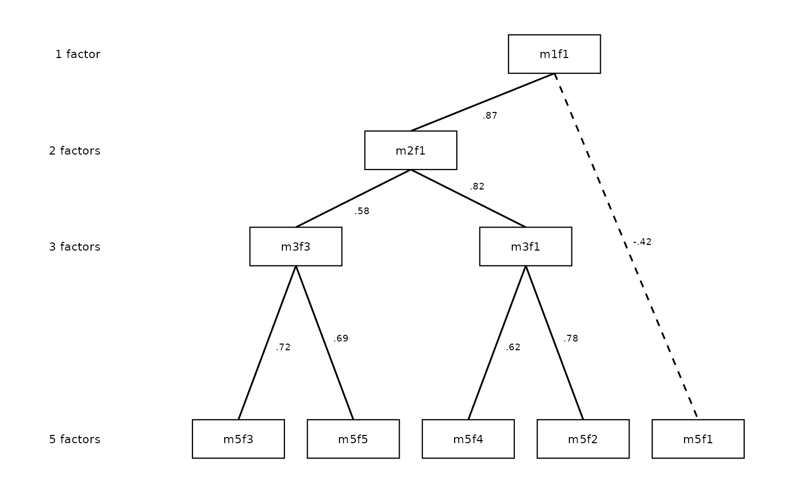
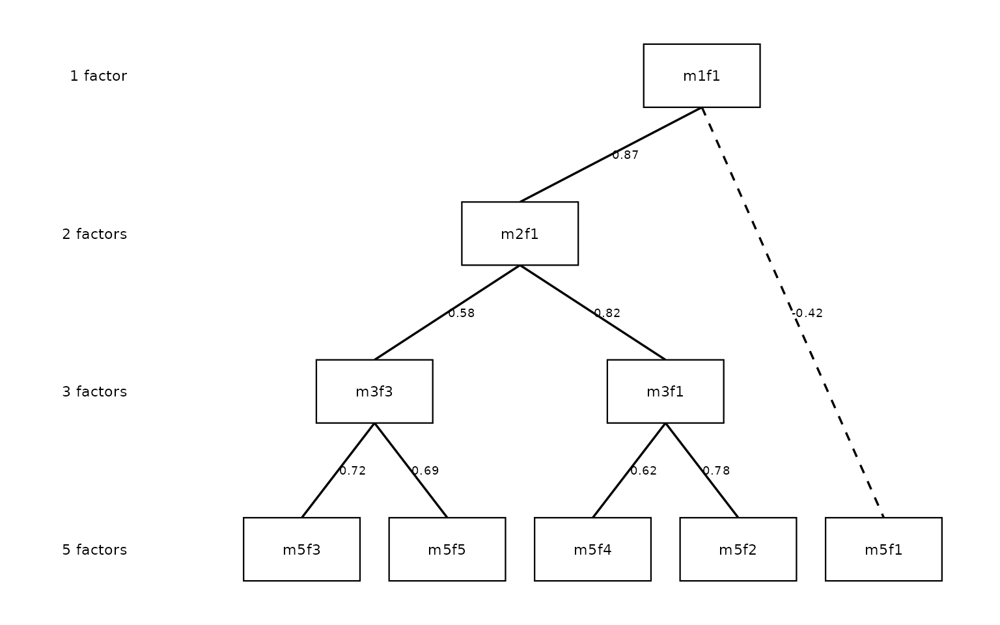

# The Forbes Extension: Skip-Level Connections and Pruning

The classic Goldberg (2006) method computes between-level factor-score
correlations only for *adjacent* levels: 1↔︎2, 2↔︎3, 3↔︎4, and so on.
Forbes (2023) extended this in two ways: computing correlations across
*all* level pairs (not just adjacent), and using those extra connections
to identify and flag **redundant** or **artifactual** factors in the
hierarchy.

This vignette covers both extensions: `pairs = "all"` and `prune`.

## The limitation of adjacent-only edges

An adjacent-only hierarchy shows you the immediate parent–child
relationships. What it cannot tell you is whether a factor at level k is
essentially the same construct as a factor several levels up — a sign
that the intermediate levels are adding noise rather than resolution.

Consider a factor that appears at k = 2, k = 3, and k = 4 and correlates
\> 0.97 with its counterpart at every adjacent level. The adjacent-only
diagram shows three consecutive arrows, each nearly perfect. But nothing
in the diagram directly flags that the k = 3 factor is redundant: you
could skip straight from k = 2 to k = 4 without losing any information.

**Skip-level correlations** make this visible by computing the
correlation between every pair of levels, not just neighbors.

## Setup

``` r

library(ackwards)
bfi <- na.omit(bfi25)
```

## Computing every between-level correlation with `pairs = "all"`

Adding `pairs = "all"` extends the edge table from adjacent pairs only
to every combination of levels.

``` r

# Classic adjacent-only
x_adj <- ackwards(bfi, k_max = 5, cor = "polychoric")

# All pairs
x_all <- ackwards(bfi, k_max = 5, cor = "polychoric", pairs = "all")

# How many edges?
nrow(tidy(x_adj, what = "edges")) # adjacent only
#> [1] 40
nrow(tidy(x_all, what = "edges")) # all pairs
#> [1] 85
```

With k = 5, the adjacent-only model has 40 edges (1×2 + 2×3 + 3×4 +
4×5). The all-pairs model adds every non-adjacent pair — 1↔︎3, 1↔︎4, 1↔︎5,
2↔︎4, 2↔︎5, 3↔︎5 — for 85 edges total.

### Reading the skip-level edge table

The table below keeps the non-adjacent edges (levels more than one
apart) with `|r| >= 0.5`, strongest first — drawn from
`tidy(x_all, what = "edges")`:

| Strongest skip-level edges (\|r\| ≥ 0.5, non-adjacent levels) |  |  |  |  |
|----|----|----|----|----|
| Sorted by \|r\|; shows at most 12 rows |  |  |  |  |
| From | To | Level (from) | Level (to) | r |
| m3f2 | m5f2 | 3 | 5 | 0.98 |
| m2f2 | m4f2 | 2 | 4 | 0.97 |
| m2f2 | m5f2 | 2 | 5 | 0.97 |
| m2f1 | m4f1 | 2 | 4 | 0.85 |
| m3f1 | m5f1 | 3 | 5 | 0.82 |
| m1f1 | m3f1 | 1 | 3 | 0.77 |
| m1f1 | m4f1 | 1 | 4 | 0.75 |
| m3f3 | m5f3 | 3 | 5 | 0.73 |
| m2f1 | m5f1 | 2 | 5 | 0.69 |
| m3f3 | m5f5 | 3 | 5 | 0.68 |
| m1f1 | m5f1 | 1 | 5 | 0.61 |
| m3f1 | m5f4 | 3 | 5 | 0.56 |

Several factors connect across two or more levels with correlations
above 0.90. m3f2 (level 3, factor 2) correlates 0.98 with m5f2 (level 5,
factor 2), jumping *two* levels. This tells you that m3f2 and m5f2 are
essentially the same construct — the intermediate levels are just
refinements within a stable dimension.

### How certain is the strongest edge? `boot_edges()`

Reading the *strongest* edge off a table of many correlations is a form
of selection. With k = 5 the all-pairs table holds 85 edges; the maximum
of that many correlations is biased upward even when every individual
estimate is honest. Before leaning on “m3f2 and m5f2 are the same
construct,” it is worth asking how precisely each edge is estimated.

[`boot_edges()`](https://jmgirard.github.io/ackwards/reference/boot_edges.md)
attaches a nonparametric bootstrap standard error and percentile
confidence interval to every edge. Each replicate resamples respondents,
recomputes the correlations, refits the whole hierarchy, and —
importantly — re-anchors each replicate’s factors to the full-sample
solution (matching and sign-orienting them) so that factor
label-switching across replicates does not contaminate the intervals.

[`boot_edges()`](https://jmgirard.github.io/ackwards/reference/boot_edges.md)
runs on the PCA and EFA engines with a Pearson or Spearman basis; it
does not bootstrap a polychoric matrix in every replicate (slow and
unstable, the same scope as
[`comparability()`](https://jmgirard.github.io/ackwards/reference/comparability.md)).
For an ordinal instrument like the BFI, fit the final model with
`cor = "polychoric"` but screen edge stability on a Pearson-basis EFA of
the same items:

``` r

set.seed(1)
x_boot <- ackwards(bfi, k_max = 5, engine = "efa", pairs = "all") |>
  boot_edges(bfi, n_boot = 200, seed = 1)
#> Warning: ! 25 columns look like ordinal/Likert items (<= 7 distinct integer values):
#>   "A1", "A2", "A3", "A4", "A5", "C1", …, "O4", and "O5".
#> ℹ Results use a "pearson" basis. Consider `cor = "polychoric"` for ordinal
#>   data.
#> This warning is displayed once per session.
#> ℹ Fitting 200 bootstrap replicates (EFA, k = 1-5)...
#> ✔ Fitting 200 bootstrap replicates (EFA, k = 1-5)... [36.5s]
#> 

boot_tbl <- tidy(x_boot, what = "edges", sort = "strength")
skip_boot <- boot_tbl[
  abs(boot_tbl$level_to - boot_tbl$level_from) > 1 & abs(boot_tbl$r) >= 0.5,
  c("from", "to", "r", "lo", "hi")
]
head(skip_boot, 6)
#>    from   to         r        lo        hi
#> 4  m3f2 m5f1 0.9897391 0.9673909 0.9973950
#> 6  m2f2 m4f2 0.9759641 0.9183303 0.9932987
#> 7  m2f2 m5f1 0.9733982 0.9138369 0.9901712
#> 11 m3f3 m5f3 0.8960495 0.6732509 0.9768403
#> 14 m2f1 m4f1 0.8806961 0.7226635 0.9256204
#> 15 m1f1 m3f1 0.7974610 0.7248725 0.8533350
```

The `lo`/`hi` columns are the 95% percentile interval. A skip-level edge
whose interval sits comfortably above
[`prune()`](https://jmgirard.github.io/ackwards/reference/prune.md)’s
`redundancy_r` threshold (0.9 by default) is a defensible “same
construct” claim; one whose interval straddles the threshold should not
be treated as decisively redundant.

A caution the intervals **cannot** resolve: they describe each edge on
its own. They do not correct for having *searched* the 85-edge table for
the largest value. Treat them as per-edge error bars, not a familywise
guarantee — if the strongest-edge claim is load-bearing, pre-specify
which pair you care about rather than reporting whichever came out
largest.

## Pruning: identifying redundant factors

The [`prune()`](https://jmgirard.github.io/ackwards/reference/prune.md)
verb uses the skip-level correlations to automatically flag factors that
may not be adding genuine information to the hierarchy.

### Chains of near-identical factors with `prune(x, "redundant")`

A **redundant chain** is a sequence of factors connected by near-perfect
correlations (\|r\| ≥ 0.9 by default) across levels. If m2f2 → m3f2 →
m4f2 → m5f1 all share r \> 0.97, the chain reaches the deepest level, so
its bottom node m5f1 — the most specific, best-defined manifestation —
is retained and the others (m2f2, m3f2, m4f2) are flagged as redundant:
they repeat rather than refine the same dimension. A chain that stops
*short* of the deepest level instead keeps its **top** node, the
broadest manifestation (Forbes, 2023).

``` r

x_prune <- ackwards(bfi, k_max = 5, cor = "polychoric", pairs = "all") |>
  prune("redundant")
#> ℹ Redundancy pruning (|r| ≥ 0.9) flagged 6 nodes.
#> ℹ Nodes are retained in the object; inspect with `x$prune$nodes` and
#>   `x$prune$chains`.
```

| Node-level pruning annotation        |       |          |           |
|--------------------------------------|-------|----------|-----------|
| 6 of 15 factors flagged as redundant |       |          |           |
| Factor                               | Level | Flagged? | Reason    |
| m1f1                                 | 1     | FALSE    | —         |
| m2f1                                 | 2     | FALSE    | —         |
| m2f2                                 | 2     | TRUE     | redundant |
| m3f1                                 | 3     | FALSE    | —         |
| m3f2                                 | 3     | TRUE     | redundant |
| m3f3                                 | 3     | FALSE    | —         |
| m4f1                                 | 4     | TRUE     | redundant |
| m4f2                                 | 4     | TRUE     | redundant |
| m4f3                                 | 4     | TRUE     | redundant |
| m4f4                                 | 4     | TRUE     | redundant |
| m5f1                                 | 5     | FALSE    | —         |
| m5f2                                 | 5     | FALSE    | —         |
| m5f3                                 | 5     | FALSE    | —         |
| m5f4                                 | 5     | FALSE    | —         |
| m5f5                                 | 5     | FALSE    | —         |

6 factors are flagged as redundant (m2f2, m3f2, m4f1, m4f2, m4f3, m4f4):
1 factor at k = 2, 1 factor at k = 3, the entire k = 4 level. This is a
striking finding: for this dataset and this k, the four-factor level
adds little beyond what you already know from k = 3 and k = 5.

The flagged factors are not removed from the object —
[`prune()`](https://jmgirard.github.io/ackwards/reference/prune.md) is
purely a diagnostic annotation, not a deletion. You can still inspect
their loadings, use their scores, and include them in the diagram.
Pruning flags guide interpretation; they do not alter the model.

### The pruned-factor diagram

For presentations and publications it is cleaner to omit the flagged
factors entirely and draw direct connections from each retained factor
to its single strongest kept ancestor — even when that ancestor is
several levels away. This is the Forbes (2023) pruned-factor diagram,
activated by `drop_pruned = TRUE`.

Forbes (2023) presents two variants: one with correlation labels on each
arrow and one without. The first is useful when the strength of each
spanning connection matters to the interpretation; the second is cleaner
for presentations. Both are reproduced below using the same publication
style — black lines, uniform width, plain line ends, and no legend.

**With correlation labels** (`show_r = TRUE`):

``` r

autoplot(x_prune,
  drop_pruned = TRUE, show_r = TRUE,
  color_pos = "black", color_neg = "black",
  edge_linewidth = 0.6, show_arrows = FALSE, legend = FALSE
)
```



**Without labels** (cleaner for slides or when the exact values are not
the focus):

``` r

autoplot(x_prune,
  drop_pruned = TRUE,
  color_pos = "black", color_neg = "black",
  edge_linewidth = 0.6, show_arrows = FALSE, legend = FALSE
)
```


Level 4 is entirely pruned, leaving a visible gap in the y-axis. The gap
is intentional: it shows *which* level was removed. Spanning arrows
bridge directly from level 3 factors to level 5 factors (and from level
2 to level 5 where intermediate levels were flagged). In this
publication style every drawn line has the same uniform weight
(`edge_linewidth = 0.6`); only connections with \|r\| at or above the
display threshold (`cut_show`, default 0.3) are drawn at all.

To close the gaps and compact the layout while retaining the original
level numbers on the axis:

``` r

autoplot(x_prune,
  drop_pruned = TRUE, compress_levels = TRUE,
  color_pos = "black", color_neg = "black",
  edge_linewidth = 0.6, show_arrows = FALSE, legend = FALSE
)
```



The level labels still read “1 factor”, “2 factors”, “3 factors”, “5
factors” so readers know which levels were retained; the uniform
vertical spacing makes the diagram easier to read in constrained page
layouts.

For further cosmetic customization — colours, node labels, arrowheads,
and more — see
[`vignette("ackwards-visualization")`](https://jmgirard.github.io/ackwards/articles/ackwards-visualization.md).

### Inspecting structural similarity with `prune(x, "artifact")`

An **artifact** factor is one that looks like a *copy* of a factor from
another level rather than a genuine refinement — its loading pattern
closely resembles a factor elsewhere in the hierarchy. Similarity is
measured by Tucker’s congruence coefficient (φ):

``` math
\phi(F_a, F_b) = \frac{\sum_i \lambda_{ia}\lambda_{ib}}
{\sqrt{\sum_i \lambda_{ia}^2 \cdot \sum_i \lambda_{ib}^2}}
```

φ ranges from −1 to +1, with values above 0.95 conventionally read as
near-identical loading patterns regardless of sign (Lorenzo-Seva & ten
Berge, 2006).

Unlike `"redundant"`, the artifact mode **never flags anything
automatically**. Forbes (2023) is explicit that identifying an artifact
requires researcher judgment — automating it would manufacture
investigator degrees of freedom — so `prune(x, "artifact")` computes and
stores the evidence for *you* to weigh: Tucker’s φ for **every**
cross-level factor pair in `x$prune$phi`, plus the structural signals of
the next section in `x$prune$structural`.

``` r

x_art <- ackwards(bfi, k_max = 5, cor = "polychoric", pairs = "all") |>
  prune("artifact")
#> ℹ Artifact mode: Tucker's φ computed for all cross-level factor pairs.
#> ℹ Structural signals computed: 2 factors flagged (few_items / orphan /
#>   split_merge).
#> ℹ Inspect `x$prune$phi` and `x$prune$structural`; removal is a researcher
#>   judgment (Forbes, 2023).
```

The table to read is `x$prune$phi`. The natural first cut is the
**non-adjacent** pairs with the highest \|φ\| — a deep factor whose
loading pattern nearly duplicates a factor two or more levels up is the
classic candidate:

| Strongest non-adjacent loading congruences |  |  |  |  |
|----|----|----|----|----|
| Top 8 pairs by \|φ\|, from x\$prune\$phi — evidence, not flags |  |  |  |  |
| From | To | Level (from) | Level (to) | φ |
| m3f2 | m5f2 | 3 | 5 | 0.99 |
| m2f2 | m4f2 | 2 | 4 | 0.98 |
| m2f2 | m5f2 | 2 | 5 | 0.98 |
| m2f1 | m4f1 | 2 | 4 | 0.93 |
| m3f1 | m5f1 | 3 | 5 | 0.92 |
| m1f1 | m3f1 | 1 | 3 | 0.88 |
| m1f1 | m4f1 | 1 | 4 | 0.86 |
| m2f1 | m5f1 | 2 | 5 | 0.85 |

For these data the strongest non-adjacent congruence is \|φ\| = 0.99.
Values near 1 mean the deeper factor recycles an earlier loading
pattern; whether that makes it a rotation artifact — or a faithfully
*persisting* construct, which is the redundancy view of the same fact —
is a judgment made with the substantive content of the items in view,
not a threshold the package applies for you.

The two modes surface different fingerprints of the same underlying
question:

- `"redundant"`: this factor appears at multiple levels with
  near-identical *score correlations* — it persists unchanged as k
  increases. Auto-flagged (with Forbes’s retention rule), because the
  score-correlation chain is a sharp, replicable criterion.
- `"artifact"`: this factor’s *loading pattern* closely resembles a
  factor elsewhere in the hierarchy, or its structure looks
  under-identified (next section). Reported only — the call is yours.

### Structural artifact signals

Congruence (φ) is not the only fingerprint of an artifactual factor.
Forbes (2023, Fig. 2) describes several *structural* signatures, and
`prune(x, "artifact")` reports three of them per factor in
`x$prune$structural`:

- **`few_items`** — the factor is the primary (highest-loading) home for
  fewer than `min_items` items (default `3`). A factor anchored by one
  or two items is under-identified and often an extraction artifact
  rather than a replicable construct.
- **`orphan`** — the factor’s strongest correlation to the immediately
  neighbouring levels is below `orphan_r` (default `0.5`). It does not
  connect to the solutions on either side, so it does not replicate
  across the hierarchy.
- **`split_merge`** — the factor’s primary items were spread across *two
  or more different* parent factors at the level above. Items that were
  separated at the coarser solution have been merged under one factor at
  the finer solution — the split-then-merge anomaly of Forbes Fig. 2.

| Structural artifact signals               |       |           |        |             |
|-------------------------------------------|-------|-----------|--------|-------------|
| 2 of 15 factors raise a structural signal |       |           |        |             |
| Factor                                    | Level | Few items | Orphan | Split/merge |
| m1f1                                      | 1     | FALSE     | FALSE  | FALSE       |
| m2f1                                      | 2     | FALSE     | FALSE  | FALSE       |
| m2f2                                      | 2     | FALSE     | FALSE  | FALSE       |
| m3f1                                      | 3     | FALSE     | FALSE  | FALSE       |
| m3f2                                      | 3     | FALSE     | FALSE  | FALSE       |
| m3f3                                      | 3     | FALSE     | FALSE  | TRUE        |
| m4f1                                      | 4     | FALSE     | FALSE  | FALSE       |
| m4f2                                      | 4     | FALSE     | FALSE  | FALSE       |
| m4f3                                      | 4     | FALSE     | FALSE  | FALSE       |
| m4f4                                      | 4     | FALSE     | FALSE  | TRUE        |
| m5f1                                      | 5     | FALSE     | FALSE  | FALSE       |
| m5f2                                      | 5     | FALSE     | FALSE  | FALSE       |
| m5f3                                      | 5     | FALSE     | FALSE  | FALSE       |
| m5f4                                      | 5     | FALSE     | FALSE  | FALSE       |
| m5f5                                      | 5     | FALSE     | FALSE  | FALSE       |

Like Tucker’s φ, these signals are **flag-and-report only** —
[`prune()`](https://jmgirard.github.io/ackwards/reference/prune.md)
never removes a factor on their basis. Identifying an artifact requires
researcher judgment (Forbes is explicit that this step introduces
investigator degrees of freedom); the signals simply point you to the
factors worth a closer look. The two thresholds, `min_items` and
`orphan_r`, are arguments to
[`prune()`](https://jmgirard.github.io/ackwards/reference/prune.md).

## Tuning the thresholds

The redundancy criterion has an adjustable `redundancy_r` threshold
(default `0.90`) matching Forbes (2023). The artifact criterion has no
auto-flag threshold — `prune(x, "artifact")` computes Tucker’s φ for
researcher inspection; no factors are auto-flagged.

**The `redundancy_phi` companion criterion.** Redundancy can optionally
require that linked factors also share a loading pattern (Tucker’s φ
above a threshold), not just a high score correlation. The
`redundancy_phi` argument controls this, and its default (`NULL`)
*auto-resolves based on the engine*:

- **PCA** — no φ filter. Component scores are **determinate**: unlike
  factor scores they are exact linear functions of the observed data, so
  the score correlation `|r|` *is* the correlation between the
  components themselves and suffices as the redundancy signal.
- **EFA / ESEM** — φ is required to exceed `0.95` (Lorenzo-Seva & ten
  Berge, 2006). Factor scores are **indeterminate** — any factor admits
  infinitely many score series consistent with the model — which makes
  an `|r|`-only rule too liberal; the loading-congruence guard makes the
  criterion conservative.
  [`prune()`](https://jmgirard.github.io/ackwards/reference/prune.md)
  announces this auto-resolution in the console.

The examples here use the default PCA engine, so no φ filter is applied.
To disable the φ guard on an EFA/ESEM run, pass `redundancy_phi = NA`;
to set your own threshold, pass a number in `(0, 1]`.

For the BFI, the result is the same across a wide range of thresholds
because the redundant chains all have correlations \> 0.97 — the
flagging is unambiguous. With your own data you may find borderline
cases where the threshold matters:

Because
[`prune()`](https://jmgirard.github.io/ackwards/reference/prune.md) is a
cheap, standalone step, checking a few `redundancy_r` thresholds does
not require refitting
[`ackwards()`](https://jmgirard.github.io/ackwards/reference/ackwards.md)
each time — the already-fit `x_all` object is re-pruned directly:

``` r

thresholds <- c(0.80, 0.85, 0.90, 0.95)
counts <- sapply(thresholds, function(thr) {
  x <- prune(x_all, "redundant", redundancy_r = thr)
  sum(tidy(x, what = "nodes")$pruned)
})
#> ℹ Redundancy pruning (|r| ≥ 0.8) flagged 9 nodes.
#> ℹ Nodes are retained in the object; inspect with `x$prune$nodes` and
#>   `x$prune$chains`.
#> ℹ Redundancy pruning (|r| ≥ 0.85) flagged 8 nodes.
#> ℹ Nodes are retained in the object; inspect with `x$prune$nodes` and
#>   `x$prune$chains`.
#> ℹ Redundancy pruning (|r| ≥ 0.9) flagged 6 nodes.
#> ℹ Nodes are retained in the object; inspect with `x$prune$nodes` and
#>   `x$prune$chains`.
#> ℹ Redundancy pruning (|r| ≥ 0.95) flagged 6 nodes.
#> ℹ Nodes are retained in the object; inspect with `x$prune$nodes` and
#>   `x$prune$chains`.
thr_df <- data.frame(redundancy_r = thresholds, n_flagged = counts)
```

| Factors flagged redundant at each redundancy_r threshold |                 |
|----------------------------------------------------------|-----------------|
| redundancy_r                                             | Factors flagged |
| 0.80                                                     | 9               |
| 0.85                                                     | 8               |
| 0.90                                                     | 6               |
| 0.95                                                     | 6               |

For the BFI all thresholds agree: the flagged factors are robustly
redundant, not borderline cases. In noisier datasets or smaller samples
you will typically see the count increase as you lower the threshold.

## Practical interpretation

The Forbes extension does not change the core bass-ackwards analysis. It
enriches it with two questions:

1.  **Do any factors persist unchanged across multiple levels?**
    (`pairs = "all"`) Skip-level correlations near 1.0 indicate stable
    dimensions that survive changes in k — exactly the kind of robust
    construct you want to report.

2.  **Are there levels where the factor structure is just reorganizing
    rather than genuinely differentiating?** (`prune(x, "redundant")`)
    Flagged levels can often be removed from the k range without losing
    interpretive content.

A common workflow: fit with `pairs = "all"` first to examine the full
picture, then pipe the result through `prune(x, "redundant")` to
identify which levels add the most new information, and use that to
guide your focus in reporting. For where redundancy pruning sits in the
full recommended workflow — alongside a split-half replicability gate on
hierarchy depth
([`comparability()`](https://jmgirard.github.io/ackwards/reference/comparability.md))
— see
[`vignette("ackwards-girard")`](https://jmgirard.github.io/ackwards/articles/ackwards-girard.md).

## References

Forbes, M. K. (2023). Improving hierarchical models of individual
differences: An extension of Goldberg’s bass-ackward method.
*Psychological Methods*. <https://doi.org/10.1037/met0000546>

Goldberg, L. R. (2006). Doing it all bass-ackwards. *Journal of Research
in Personality*, *40*(4), 347–358.

Lorenzo-Seva, U., & ten Berge, J. M. F. (2006). Tucker’s congruence
coefficient as a meaningful index of factor similarity. *Methodology*,
*2*(2), 57–64. <https://doi.org/10.1027/1614-2241.2.2.57>

Tucker, L. R. (1951). *A method for synthesis of factor analysis
studies* (Personnel Research Section Report No. 984). Department of the
Army.
