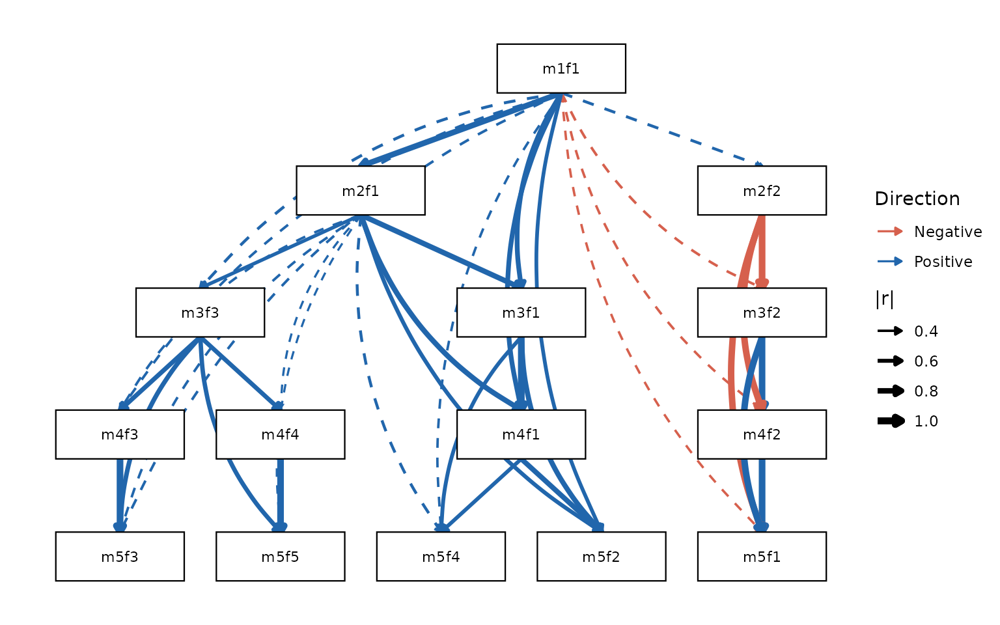
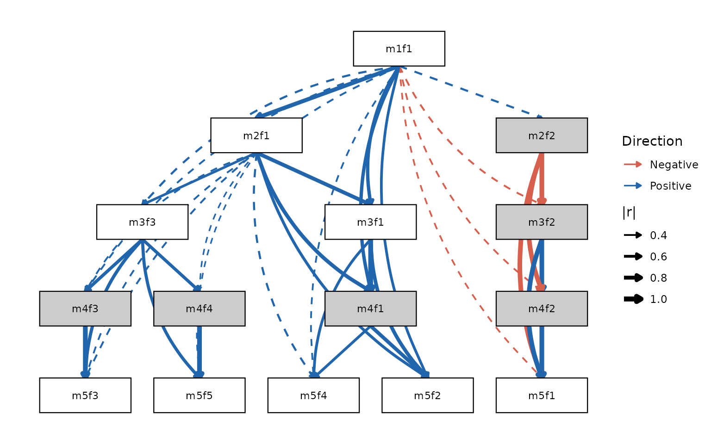

# The Forbes Extension: Skip-Level Connections and Pruning

The classic Goldberg (2006) method computes between-level factor-score
correlations only for *adjacent* levels: 1↔︎2, 2↔︎3, 3↔︎4, and so on.
Forbes (2023) extended this in two ways: computing correlations across
*all* level pairs (not just adjacent), and using those extra connections
to identify and flag **redundant** or **artefactual** factors in the
hierarchy.

This vignette covers both extensions: `pairs = "all"` and `prune`.

## The limitation of adjacent-only edges

An adjacent-only hierarchy shows you the immediate parent–child
relationships. What it cannot tell you is whether a factor at level k is
essentially the same construct as a factor several levels up — a sign
that the intermediate levels are adding noise rather than resolution.

Consider a factor that appears at k = 2, k = 3, and k = 4 and correlates
\> 0.97 with its counterpart at every adjacent level. The adjacent-only
diagram shows three consecutive arrows, each nearly perfect. But nothing
in the diagram directly flags that the k = 3 factor is redundant: you
could skip straight from k = 2 to k = 4 without losing any information.

**Skip-level correlations** make this visible by computing the
correlation between every pair of levels, not just neighbors.

## Setup

``` r

library(ackwards)
bfi <- na.omit(psych::bfi[, 1:25])
```

## `pairs = "all"`: computing every between-level correlation

Adding `pairs = "all"` extends the edge table from adjacent pairs only
to every combination of levels.

``` r

# Classic adjacent-only
x_adj <- ackwards(bfi, k = 5, cor = "polychoric")

# All pairs
x_all <- ackwards(bfi, k = 5, cor = "polychoric", pairs = "all")

# How many edges?
nrow(tidy(x_adj, what = "edges"))   # adjacent only
#> [1] 40
nrow(tidy(x_all, what = "edges"))   # all pairs
#> [1] 85
```

With k = 5, the adjacent-only model has 40 edges (1×2 + 2×3 + 3×4 +
4×5). The all-pairs model adds every non-adjacent pair — 1↔︎3, 1↔︎4, 1↔︎5,
2↔︎4, 2↔︎5, 3↔︎5 — for 85 edges total.

### Visualizing skip-level connections

[`autoplot()`](https://jmgirard.github.io/ackwards/reference/autoplot.md)
detects when `pairs = "all"` was used and renders skip-level edges as
curved arcs alongside the straight arrows for adjacent connections.

``` r

autoplot(x_all)
```



Curved arcs that nearly match the thickness of the straight arrows tell
you that a factor connects almost as strongly to a grandparent or
great-grandparent as it does to its immediate parent. That is the
signature of a stable, replicating dimension.

### Reading the skip-level edge table

``` r

edges <- tidy(x_all, what = "edges")

# Non-adjacent edges with |r| >= 0.5, sorted by strength
skip <- edges[abs(edges$level_to - edges$level_from) > 1 & abs(edges$r) >= 0.5, ]
skip <- skip[order(-abs(skip$r)), c("from", "to", "level_from", "level_to", "r")]
head(skip, 12)
#>    from   to level_from level_to          r
#> 56 m3f2 m5f1          3        5  0.9771525
#> 26 m2f2 m4f2          2        4 -0.9758967
#> 34 m2f2 m5f1          2        5 -0.9739184
#> 21 m2f1 m4f1          2        4  0.8084362
#> 52 m3f1 m5f2          3        5  0.7833802
#> 3  m1f1 m3f1          1        3  0.7452805
#> 6  m1f1 m4f1          1        4  0.7398477
#> 63 m3f3 m5f3          3        5  0.7196037
#> 65 m3f3 m5f5          3        5  0.6936223
#> 30 m2f1 m5f2          2        5  0.6433249
#> 54 m3f1 m5f4          3        5  0.6197564
#> 11 m1f1 m5f2          1        5  0.6063399
```

Several factors connect across two or more levels with correlations
above 0.90. `m3f2` (level 3, factor 2) correlates 0.98 with `m5f1`
(level 5, factor 1), jumping *two* levels. This tells you that m3f2 and
m5f1 are essentially the same construct — the intermediate levels are
just refinements within a stable dimension.

## Pruning: identifying redundant factors

The `prune` argument uses the skip-level correlations to automatically
flag factors that may not be adding genuine information to the
hierarchy.

### `prune = "redundant"`: chains of near-identical factors

A **redundant chain** is a sequence of factors connected by near-perfect
correlations (\|r\| ≥ 0.9 by default) across levels. If m2f2 → m3f2 →
m4f2 → m5f1 all share r \> 0.97, the intermediate nodes m3f2 and m4f2
are flagged as redundant: they repeat rather than refine the same
dimension.

``` r

x_prune <- ackwards(bfi, k = 5, cor = "polychoric",
                    pairs = "all", prune = "redundant")
#> ℹ Redundancy pruning (|r| ≥ 0.9) flagged 6 nodes.
#> ℹ Nodes are retained in the object; inspect with `x$prune$nodes` and
#>   `x$prune$chains`.
```

``` r

tidy(x_prune, what = "nodes")
#>      id level pruned prune_reason
#> 1  m1f1     1  FALSE         <NA>
#> 2  m2f1     2  FALSE         <NA>
#> 3  m2f2     2   TRUE    redundant
#> 4  m3f1     3  FALSE         <NA>
#> 5  m3f2     3   TRUE    redundant
#> 6  m3f3     3  FALSE         <NA>
#> 7  m4f1     4   TRUE    redundant
#> 8  m4f2     4   TRUE    redundant
#> 9  m4f3     4   TRUE    redundant
#> 10 m4f4     4   TRUE    redundant
#> 11 m5f1     5  FALSE         <NA>
#> 12 m5f2     5  FALSE         <NA>
#> 13 m5f3     5  FALSE         <NA>
#> 14 m5f4     5  FALSE         <NA>
#> 15 m5f5     5  FALSE         <NA>
```

Six factors are flagged as redundant. The entire k = 4 level (m4f1
through m4f4) is flagged, as are m2f2 and m3f2. This is a striking
finding: for this dataset and this k, the four-factor level adds little
beyond what you already know from k = 3 and k = 5.

The flagged factors are not removed from the object — `prune` is purely
a diagnostic annotation, not a deletion. You can still inspect their
loadings, use their scores, and include them in the diagram. Pruning
flags guide interpretation; they do not alter the model.

### Annotated diagram

The pruned autoplot shades flagged factors in a distinct color (default:
light grey) so you can read the hierarchy and the redundancy flags
simultaneously.

``` r

autoplot(x_prune)
```



The grey boxes at k = 4 and the two flagged boxes at k = 2 and k = 3
indicate “you can probably jump over these without losing information.”
The un-shaded factors at k = 1, the non-flagged factors at k = 2 and k =
3, and all five factors at k = 5 tell the main story of the hierarchy.

### `prune = "artefact"`: factors defined by structural similarity

An **artefact** factor is one whose loading pattern is more similar to a
factor at a *non-adjacent* level than to its own-level neighbors.
Similarity is measured by Tucker’s congruence coefficient (φ):

``` math
\phi(F_a, F_b) = \frac{\sum_i \lambda_{ia}\lambda_{ib}}
{\sqrt{\sum_i \lambda_{ia}^2 \cdot \sum_i \lambda_{ib}^2}}
```

φ ranges from −1 to +1, with values \> 0.95 indicating near-identical
loading patterns regardless of sign. A factor at k = 3 that has φ \>
0.95 with a factor at k = 1 is suspected to be an artefact of the
rotation rather than a genuine new dimension.

``` r

x_art <- ackwards(bfi, k = 5, cor = "polychoric",
                  pairs = "all", prune = "artefact")
#> ℹ Artefact mode: Tucker's computed for all cross-level factor pairs.
#> ℹ Inspect `x$prune$phi` to identify potential artefacts; removal is a
#>   researcher judgment (Forbes, 2023).
tidy(x_art, what = "nodes")
#>      id level pruned prune_reason
#> 1  m1f1     1  FALSE         <NA>
#> 2  m2f1     2  FALSE         <NA>
#> 3  m2f2     2  FALSE         <NA>
#> 4  m3f1     3  FALSE         <NA>
#> 5  m3f2     3  FALSE         <NA>
#> 6  m3f3     3  FALSE         <NA>
#> 7  m4f1     4  FALSE         <NA>
#> 8  m4f2     4  FALSE         <NA>
#> 9  m4f3     4  FALSE         <NA>
#> 10 m4f4     4  FALSE         <NA>
#> 11 m5f1     5  FALSE         <NA>
#> 12 m5f2     5  FALSE         <NA>
#> 13 m5f3     5  FALSE         <NA>
#> 14 m5f4     5  FALSE         <NA>
#> 15 m5f5     5  FALSE         <NA>
```

For the BFI, the artefact criterion flags nothing — no factor at any
level has a loading pattern more similar to a factor from a non-adjacent
level than to its own-level solution. This is a good result for a
well-validated instrument: it suggests the rotation is producing
genuinely distinct factors at each level, not recycling old ones.

On data with weaker or noisier factor structure, or with rotations that
struggle to separate highly correlated factors, the artefact criterion
will often flag some nodes. A node can be flagged by one criterion but
not the other; the two criteria capture different flavors of redundancy:

- `"redundant"`: this factor appears at multiple levels with
  near-identical *score correlations* — it persists unchanged as k
  increases.
- `"artefact"`: this factor’s *loading pattern* closely resembles a
  factor from a different, non-adjacent level — it looks like a copy
  rather than a refinement.

## Tuning the thresholds

Both pruning criteria have adjustable thresholds. The defaults
(`phi_redundant = 0.90`, `phi_artefact = 0.95`) are those used in Forbes
(2023).

For the BFI, the result is the same across a wide range of thresholds
because the redundant chains all have correlations \> 0.97 — the
flagging is unambiguous. With your own data you may find borderline
cases where the threshold matters:

``` r

# Check how many factors are flagged at different thresholds
thresholds <- c(0.80, 0.85, 0.90, 0.95)
counts <- sapply(thresholds, function(thr) {
  x <- suppressWarnings(
    ackwards(bfi, k = 5, cor = "polychoric",
             pairs = "all", prune = "redundant",
             phi_redundant = thr)
  )
  sum(tidy(x, what = "nodes")$pruned)
})
#> ℹ Redundancy pruning (|r| ≥ 0.9) flagged 6 nodes.
#> ℹ Nodes are retained in the object; inspect with `x$prune$nodes` and
#>   `x$prune$chains`.
#> ℹ Redundancy pruning (|r| ≥ 0.9) flagged 6 nodes.
#> ℹ Nodes are retained in the object; inspect with `x$prune$nodes` and
#>   `x$prune$chains`.
#> ℹ Redundancy pruning (|r| ≥ 0.9) flagged 6 nodes.
#> ℹ Nodes are retained in the object; inspect with `x$prune$nodes` and
#>   `x$prune$chains`.
#> ℹ Redundancy pruning (|r| ≥ 0.9) flagged 6 nodes.
#> ℹ Nodes are retained in the object; inspect with `x$prune$nodes` and
#>   `x$prune$chains`.
data.frame(phi_redundant = thresholds, n_flagged = counts)
#>   phi_redundant n_flagged
#> 1          0.80         6
#> 2          0.85         6
#> 3          0.90         6
#> 4          0.95         6
```

For the BFI all thresholds agree: the flagged factors are robustly
redundant, not borderline cases. In noisier datasets or smaller samples
you will typically see the count increase as you lower the threshold.

## Practical interpretation

The Forbes extension does not change the core bass-ackwards analysis. It
enriches it with two questions:

1.  **Do any factors persist unchanged across multiple levels?**
    (`pairs = "all"`) Skip-level correlations near 1.0 indicate stable
    dimensions that survive changes in k — exactly the kind of robust
    construct you want to report.

2.  **Are there levels where the factor structure is just reorganizing
    rather than genuinely differentiating?** (`prune = "redundant"`)
    Flagged levels can often be removed from the k range without losing
    interpretive content.

A common workflow: fit with `pairs = "all"` first to examine the full
picture, then apply `prune = "redundant"` to identify which levels add
the most new information, and use that to guide your focus in reporting.

## References

Goldberg, L. R. (2006). Doing it all bass-ackwards. *Journal of Research
in Personality*, *40*(4), 347–358.

Forbes, M. K. (2023). Improving hierarchical models of individual
differences: An extension of Goldberg’s bass-ackward method.
*Psychological Methods*. <https://doi.org/10.1037/met0000593>

Tucker, L. R. (1951). *A method for synthesis of factor analysis
studies* (Personnel Research Section Report No. 984). Department of the
Army.
