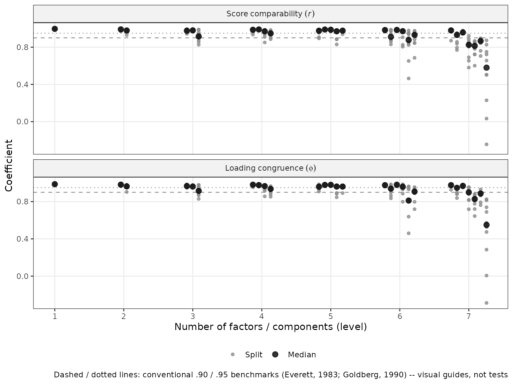
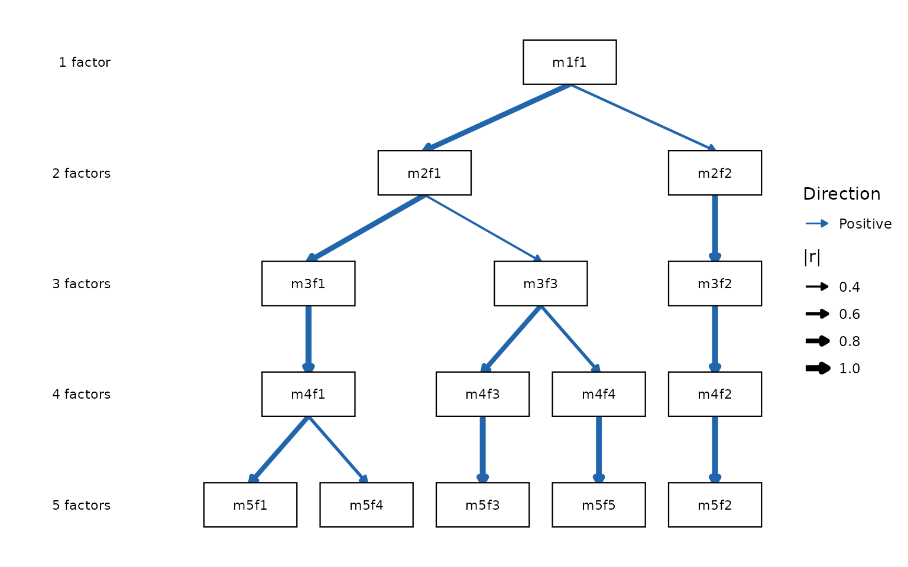

# Replicability-Gated Hierarchies: A Recommended Workflow

The other vignettes in this package document its individual verbs. This
one takes a position: it lays out the workflow we recommend for
answering the questions bass-ackwards analysis exists to answer, and
explains why each step is there. We refer to it as the
**replicability-gated** (or Girard) workflow, because its central move
is to let *replication*, not fit, decide how deep the hierarchy you
interpret goes.

## The problem: depth is where bass-ackwards analyses go wrong

A bass-ackwards analysis asks two questions: *how does the structure of
this domain organize hierarchically*, and *how deep is that hierarchy
meaningful?* The first question is what the method computes. The second
is where published applications most often stumble, and the failure mode
is consistent: **overextraction**, followed by substantive
interpretation of deep-level factors that would not re-emerge in a new
sample. Forbes (2023) documents this directly for the bass-ackwards
context — non-replicable structure concentrates in the deeper levels of
an overextracted hierarchy.

The standard tooling half-addresses this. Retention criteria like
parallel analysis
([`suggest_k()`](https://jmgirard.github.io/ackwards/reference/suggest_k.md))
estimate a *plausible range* for k from the eigenstructure, and they are
the right first screen. But they do not measure the thing the caution is
actually about: whether the specific factors in *your* solution would
show up again in another sample from the same population. A level can
sit comfortably inside the plausible range and still contain a factor
that is pure sample idiosyncrasy.

There was, historically, a direct instrument for exactly this. Everett
(1983) proposed **factor comparability coefficients**: split the sample
in half, fit the solution in each half independently, apply *both*
halves’ scoring weights to the full sample, and correlate the matched
factor scores. A factor that is real re-emerges in both halves and its
two score estimates correlate near 1; a factor that is noise does not.
Goldberg’s lab used this as a routine gate — Goldberg (1990) retained
factor solutions only when they held up across repeated random
split-halves — and the practice runs through the research program that
produced the bass-ackwards method itself (Goldberg, 2006). The modern
bass-ackwards literature largely dropped it.

[`comparability()`](https://jmgirard.github.io/ackwards/reference/comparability.md)
restores that gate as a first-class verb, extended to the bass-ackwards
setting: coefficients for every factor at every level, computed through
the same score-correlation algebra as the hierarchy’s own edges.

## Three verbs, three different questions

The workflow below leans on the fact that this package now separates
three questions that are easy to conflate:

| Question | Verb | What it measures |
|----|----|----|
| What depth range is *plausible*? | [`suggest_k()`](https://jmgirard.github.io/ackwards/reference/suggest_k.md) | Eigenstructure retention criteria (consensus range) |
| Which factors *replicate*? | [`comparability()`](https://jmgirard.github.io/ackwards/reference/comparability.md) | Split-half score comparability per factor per level |
| Which factors *differentiate*? | [`prune()`](https://jmgirard.github.io/ackwards/reference/prune.md) | Forbes (2023) redundancy: factors that persist without adding resolution |

These are genuinely different. A factor can replicate perfectly and
still be redundant (the same construct restated at every level); a level
can sit inside the plausible range and still fail to replicate. You need
all three answers, and no one of them substitutes for another.

## Setup

We use the `bfi25` Big Five data (25 items, n = 875 after removing
incomplete rows), analyzed with the default PCA engine throughout.

``` r

library(ackwards)
bfi <- na.omit(bfi25)
```

## Step 1: Screen the plausible depth range with `suggest_k()`

``` r

sk <- suggest_k(bfi, seed = 1)
#> ℹ Running parallel analysis (20 iterations, PC + FA)...
#> ✔ Running parallel analysis (20 iterations, PC + FA)... [194ms]
#> 
#> ℹ Running MAP and VSS...
#> ✔ Running MAP and VSS... [113ms]
#> 
#> ℹ Running Comparison Data (CD)...
#> ✔ Running Comparison Data (CD)... [6s]
#> 
print(sk)
#> 
#> ── Factor / Component Count Suggestion (ackwards) ──────────────────────────────
#> Variables: 25
#> n: 875
#> Basis: pearson
#> Tested k: 1-8
#> 
#> ── Criteria (k = 1-8) ──
#> 
#> k = 1: PA-PC ✔ PA-FA ✔ MAP 0.0254 VSS-1 0.5178 VSS-2 0.0000 CD ✔
#> k = 2: PA-PC ✔ PA-FA ✔ MAP 0.0194 VSS-1 0.5839 VSS-2 0.6719 CD ✔
#> k = 3: PA-PC ✔ PA-FA ✔ MAP 0.0175 VSS-1 0.5913 VSS-2 0.7354 CD ✔
#> k = 4: PA-PC ✔ PA-FA ✔ MAP 0.0164 VSS-1 0.6215* VSS-2 0.7837 CD ✔
#> k = 5: PA-PC ✔ PA-FA ✔ MAP 0.0160* VSS-1 0.5738 VSS-2 0.7950* CD ✔
#> k = 6: PA-PC - PA-FA ✔ MAP 0.0172 VSS-1 0.5594 VSS-2 0.7629 CD ✔*
#> k = 7: PA-PC - PA-FA - MAP 0.0205 VSS-1 0.5613 VSS-2 0.7616 CD -
#> k = 8: PA-PC - PA-FA - MAP 0.0236 VSS-1 0.5600 VSS-2 0.7215 CD -
#> 
#> ── Recommendations ──
#> 
#> • PA-PC: k <= 5
#> • PA-FA: k <= 6
#> • MAP: k = 5
#> • VSS-1: k = 4
#> • VSS-2: k = 5
#> • CD: k = 6
#> Consensus range: k = 4-6
#> ────────────────────────────────────────────────────────────────────────────────
#> Note: k_max in ackwards() is a maximum depth. Setting k_max one or two levels
#> above the consensus to observe factor fragmentation is intentional.
#> Caution: PA-PC tends to overextract; structures may not replicate (Forbes,
#> 2023). PA-FA and CD are more conservative. Use the range.
```

The criteria disagree — they always do — but they bracket a range (here
k = 4–6). Treat the top of that range as a ceiling worth *probing*, not
a depth worth *asserting*: parallel analysis on the PC basis in
particular tends to overextract, and
[`vignette("ackwards-suggest-k")`](https://jmgirard.github.io/ackwards/articles/ackwards-suggest-k.md)
explains each criterion’s bias direction in detail. Deliberately looking
one or two levels past the consensus is a normal part of the method —
the point of the next step is that you can now do so safely.

## Step 2: Gate the depth on replicability with `comparability()`

This is the step the workflow is named for. We evaluate every level up
to one past the ceiling, across ten random split-halves:

``` r

cmp <- comparability(bfi, k_max = sk_hi + 1, n_splits = 10, seed = 2026)
#> Warning: ! 25 columns look like ordinal/Likert items (<= 7 distinct integer values):
#>   "A1", "A2", "A3", "A4", "A5", "C1", …, "O4", and "O5".
#> ℹ Results use a "pearson" basis. Consider `cor = "polychoric"` for ordinal
#>   data.
#> This warning is displayed once per session.
#> ℹ Fitting 10 split-half replicates (PCA, k = 1-7)...
#> ✔ Fitting 10 split-half replicates (PCA, k = 1-7)... [1.5s]
#> 
print(cmp)
#> 
#> ── Split-Half Factor Comparability (ackwards) ──────────────────────────────────
#> Engine: PCA
#> Basis: pearson
#> n: 875 (437 per half)
#> Splits: 10
#> Levels: 1-7
#> 
#> ── Comparability by level (median across splits) ──
#> 
#> k = 1: median r 1.00, min r 1.00 (m1f1)
#> k = 2: median r .99, min r .98 (m2f2)
#> k = 3: median r .98, min r .92 (m3f3)
#> k = 4: median r .98, min r .95 (m4f4)
#> k = 5: median r .98, min r .97 (m5f4)
#> k = 6: median r .95, min r .88 (m6f5)
#> k = 7: median r .87, min r .58 (m7f7)
#> ────────────────────────────────────────────────────────────────────────────────
#> Per-factor detail (incl. Tucker's φ) in `$summary`; per-split values in
#> `$coefficients`.
#> Conventional benchmarks: ≥ .95 comfortable, ≥ .90 floor (Everett, 1983;
#> Goldberg, 1990) -- conventions, not tests. Interpret levels whose factors all
#> replicate.
```

Read the per-level minima, not the medians: a level is only as
interpretable as its least replicable factor. Here every factor through
k = 5 clears the conventional floor (the weakest median comparability at
any of those levels is .92), and the structure degrades past it — at k =
7, m7f7 reaches a median of only .58 and dips to -.24 on its worst
split. Those deep factors are not stable dimensions of the data; they
are different factors in every half-sample that happen to occupy the
same slot.

``` r

autoplot(cmp)
```



Two honesty notes. First, the conventional benchmarks marked on the plot
(.90 and .95, following Everett’s and Goldberg’s practice) are
conventions, not tests —
[`comparability()`](https://jmgirard.github.io/ackwards/reference/comparability.md)
reports every coefficient and flags nothing, so borderline cases stay
visible and the judgment stays yours. Second, comparability is
*internal* replication: it asks whether the structure re-emerges in
halves of the *same* sample. That is the right gate for “is this factor
real here,” and a necessary condition for — but not a demonstration of —
replication in a new population.

The result is a **hierarchy floor**: the deepest level at which every
factor replicates. For these data that is k = 5 — the Big Five, as it
should be.

## Step 3: Fit the hierarchy to the gated depth

``` r

x <- ackwards(bfi, k_max = 5)
print(x)
#> 
#> ── Bass-Ackwards Analysis (ackwards) ───────────────────────────────────────────
#> Engine: pca
#> Rotation: varimax
#> Basis: pearson
#> n: 875
#> k (max): 5
#> 
#> ── Levels ──
#> 
#> ✔ k = 1: 1 factor, 20.9% variance
#> ✔ k = 2: 2 factors, 32.3% variance
#> ✔ k = 3: 3 factors, 40.7% variance
#> ✔ k = 4: 4 factors, 47.8% variance
#> ✔ k = 5: 5 factors, 53.8% variance
#> 
#> ── Edges ──
#> 
#> 14 of 40 edges have |r| ≥ 0.3
#> ────────────────────────────────────────────────────────────────────────────────
#> Note: This is a series of linked solutions, not a fitted hierarchical model.
#> Cross-level edges are descriptive score correlations. Per-level fit indices
#> (EFA/ESEM) describe how well a k-factor model fits the items at that level --
#> they do not validate the edges or the hierarchy itself.
```

``` r

autoplot(x)
```



If you prefer to *display* the fragmentation beyond the floor (it can be
substantively interesting to show a factor dissolving), fit one level
deeper and say explicitly in your report which levels passed the
replicability gate. What the gate rules out is interpreting the deeper
factors as constructs.

## Step 4: Find what perpetuates without differentiating — `prune()`

Replicability is necessary but not sufficient: a factor can re-emerge in
every half-sample and still add nothing, because it is the same
construct restated level after level. That is Forbes’s (2023) redundancy
question, and it is
[`prune()`](https://jmgirard.github.io/ackwards/reference/prune.md)’s
job, not
[`comparability()`](https://jmgirard.github.io/ackwards/reference/comparability.md)’s:

``` r

pr <- prune(x, "redundant")
#> ℹ Redundancy pruning (|r| ≥ 0.9) flagged 6 nodes.
#> ℹ Nodes are retained in the object; inspect with `x$prune$nodes` and
#>   `x$prune$chains`.
pr$prune$chains
#>    chain_id   id level r_to_prev phi_to_prev retain endpoint_r
#> 1         1 m2f2     2        NA          NA  FALSE  0.9648941
#> 2         1 m3f2     3 0.9703055   0.9780829  FALSE  0.9648941
#> 3         1 m4f2     4 0.9853622   0.9916584  FALSE  0.9648941
#> 4         1 m5f2     5 0.9990140   0.9995122   TRUE  0.9648941
#> 5         2 m3f1     3        NA          NA   TRUE  0.9978857
#> 6         2 m4f1     4 0.9978857   0.9988054  FALSE  0.9978857
#> 7         3 m4f3     4        NA          NA  FALSE  0.9773027
#> 8         3 m5f3     5 0.9773027   0.9872943   TRUE  0.9773027
#> 9         4 m4f4     4        NA          NA  FALSE  0.9570776
#> 10        4 m5f5     5 0.9570776   0.9671856   TRUE  0.9570776
#>    endpoint_r_agrees
#> 1               TRUE
#> 2               TRUE
#> 3               TRUE
#> 4               TRUE
#> 5               TRUE
#> 6               TRUE
#> 7               TRUE
#> 8               TRUE
#> 9               TRUE
#> 10              TRUE
```

Here the chains tell us that several of the Big Five arrive early and
simply persist — for example one factor emerges at k = 2 and travels
essentially unchanged (r ≥ .97 at every link) down to k = 5. Every node
on that chain *replicates* beautifully; the chain flags that the
intermediate appearances add no resolution. The two verbs answer
different questions, and reporting both gives the honest picture: which
levels are real, and which levels are new. See
[`vignette("ackwards-forbes")`](https://jmgirard.github.io/ackwards/articles/ackwards-forbes.md)
for chain mechanics, thresholds, and the retention rule.

## Step 5: Interpret with the built-in guardrails

``` r

top_items(x, level = 5, cut = 0.5)
#> 
#> ── Salient items by factor (ackwards) ──────────────────────────────────────────
#> Engine: pca
#> Cut: |loading| >= 0.5
#> Top-n: all
#> 
#> ── Level 5 (5 factors) ──
#> 
#> m5f1
#> E2 [-0.720]
#> E4 [0.704]
#> E1 [-0.685]
#> E3 [0.659]
#> E5 [0.584]
#> m5f2
#> N3 [-0.799]
#> N1 [-0.787]
#> N2 [-0.782]
#> N5 [-0.656]
#> N4 [-0.626]
#> m5f3
#> C2 [0.702]
#> C4 [-0.692]
#> C1 [0.671]
#> C3 [0.653]
#> C5 [-0.627]
#> m5f4
#> A3 [0.698]
#> A2 [0.672]
#> A1 [-0.672]
#> A5 [0.569]
#> A4 [0.513]
#> m5f5
#> O5 [-0.676]
#> O3 [0.617]
#> O2 [-0.586]
#> O1 [0.554]
#> ────────────────────────────────────────────────────────────────────────────────
#> Loadings reflect primary-parent sign alignment. Use tidy(x, what = "loadings")
#> for the full matrix.
```

Three interpretation habits keep the analysis honest (all covered in
depth in
[`vignette("ackwards-interpret")`](https://jmgirard.github.io/ackwards/articles/ackwards-interpret.md)):

- **Negative loadings do not mean “low”** — sign is anchored to the
  primary parent, and a negative secondary edge is information, not
  error.
- **Name factors within levels, borrowing names down the lineage**
  rather than treating each level as a fresh exploratory result.
- **Say what the hierarchy is.** A bass-ackwards result is a series of
  linked solutions whose edges are score correlations — it is
  descriptive, not a fitted hierarchical model (no Schmid–Leiman, no
  higher-order SEM), and should be reported as such.

## Step 6: Validate downstream, out of sample

The final step closes the loop the same way it opened: with data the
model has not seen. Scores for new observations use the fit-time metric,
so training and test scores are directly comparable:

``` r

train <- bfi[1:600, ]
test <- bfi[601:875, ]

x_train <- ackwards(train, k_max = 5)
test_scores <- predict(x_train, newdata = test)
round(head(test_scores[, grep("^\\.m5", names(test_scores))], 3), 2)
#>   .m5f1 .m5f2 .m5f3 .m5f4 .m5f5
#> 1  0.21 -2.77 -1.21 -1.45 -0.27
#> 2  0.19 -1.20  0.28 -1.21 -1.41
#> 3 -0.91 -1.46  1.34  0.06 -0.98
```

If a downstream claim (a correlation with an outcome, a group
difference) holds for training-sample scores but not test-sample scores,
the hierarchy was fine and the claim was overfit — a different failure
than anything in Steps 1–5, and one only held-out data can catch. The
train/test mechanics are covered in
[`vignette("ackwards-intro")`](https://jmgirard.github.io/ackwards/articles/ackwards-intro.md).

## Common mistakes this workflow prevents

**Interpreting non-replicable deep factors.** The classic failure.
Without a replicability instrument the deep levels are just *there*,
printed with the same authority as the robust ones. Step 2 makes their
status measurable and visible.

**Trusting a single split.** One split-half can flatter or slander a
factor by luck of the draw.
[`comparability()`](https://jmgirard.github.io/ackwards/reference/comparability.md)
defaults to ten random splits and reports the spread; the minima across
splits are as informative as the medians.

**Cherry-picking the strongest edge.** With `pairs = "all"`, the number
of between-level correlations grows fast, and reporting the most
dramatic one capitalizes on chance. Report full edge tables (or the
complete diagram), and treat any “strongest link” claim as descriptive
rather than inferential.

**Mistaking persistence for structure.** A chain of near-1.0
correlations down the hierarchy looks impressive but means the levels
are restating one construct. That is a
[`prune()`](https://jmgirard.github.io/ackwards/reference/prune.md)
finding, and it should shorten your reported k range, not lengthen your
list of constructs.

**Mistaking replicability for validity.** A comparability of .99 means
the factor is a stable feature of these items in this population — not
that it is a good construct, and not that it generalizes beyond the
population sampled. Cross-population replication and external validation
remain separate, subsequent steps.

## Summary: the workflow in six calls

1.  **`suggest_k(data)`** — screen the plausible depth range; treat its
    top as a ceiling to probe.
2.  **`comparability(data, k_max = ceiling + 1)`** — find the hierarchy
    floor: the deepest level at which every factor replicates across
    split-halves.
3.  **`ackwards(data, k_max = floor)`** — fit the hierarchy to the gated
    depth.
4.  **`prune(x, "redundant")`** — identify factors that perpetuate
    without differentiating; report which levels add resolution.
5.  **`top_items(x)` + `autoplot(x)`** — interpret with the sign,
    naming, and descriptive-hierarchy guardrails.
6.  **`predict(x_train, newdata = test)`** — validate downstream claims
    on held-out data in the fit-time metric.

Steps 1, 3, 4, and 5 are the established method. Step 2 restores the
gate the method’s own inventor applied to it, and Step 6 extends the
same logic — *show me it holds in data you did not fit* — to whatever
you do with the scores.

## References

Everett, J. E. (1983). Factor comparability as a means of determining
the number of factors and their rotation. *Multivariate Behavioral
Research*, *18*(2), 197–218.
<https://doi.org/10.1207/s15327906mbr1802_5>

Forbes, M. K. (2023). Improving hierarchical models of individual
differences: An extension of Goldberg’s bass-ackward method.
*Psychological Methods*. <https://doi.org/10.1037/met0000546>

Goldberg, L. R. (1990). An alternative “description of personality”: The
Big-Five factor structure. *Journal of Personality and Social
Psychology*, *59*(6), 1216–1229.
<https://doi.org/10.1037/0022-3514.59.6.1216>

Goldberg, L. R. (2006). Doing it all bass-ackwards: The development of
hierarchical factor structures from the top down. *Journal of Research
in Personality*, *40*(4), 347–358.
<https://doi.org/10.1016/j.jrp.2006.01.001>

Lorenzo-Seva, U., & ten Berge, J. M. F. (2006). Tucker’s congruence
coefficient as a meaningful index of factor similarity. *Methodology*,
*2*(2), 57–64. <https://doi.org/10.1027/1614-2241.2.2.57>
