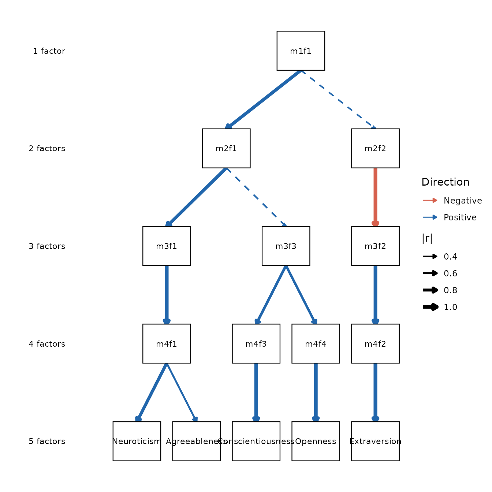
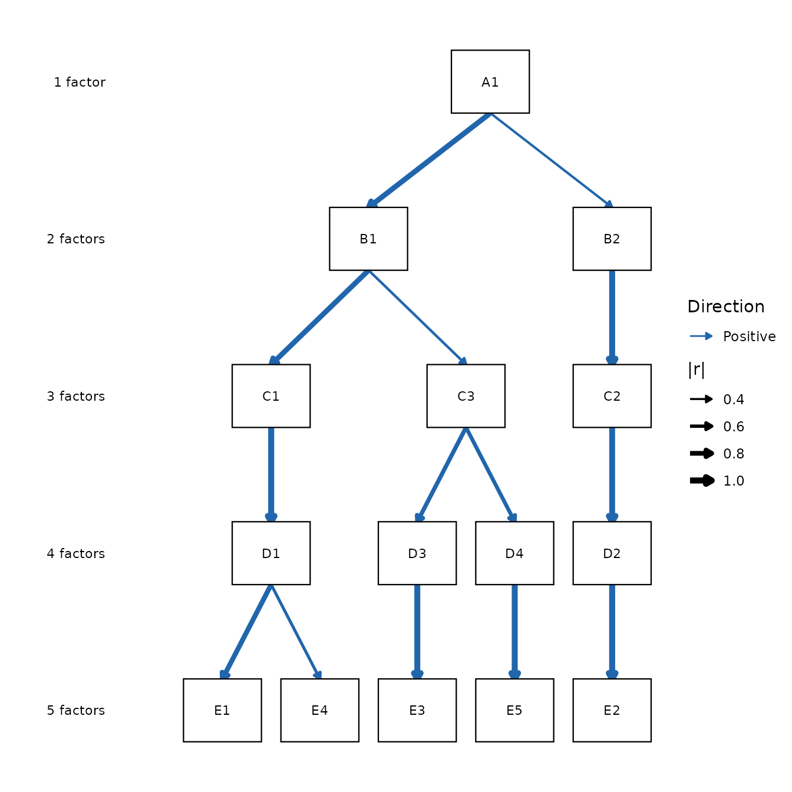

# Interpreting and Labeling Factors

``` r

library(ackwards)
# Fit the raw dataset (not na.omit()) so bfi25's built-in IPIP item labels are
# captured and shown by top_items(); missing = "listwise" drops incomplete rows.
x <- ackwards(bfi25, k_max = 5, cor = "polychoric", missing = "listwise")
```

Fitting an `ackwards` model gives you a hierarchy of factors with stable
but opaque IDs — `m1f1`, `m2f1`, `m2f2`, and so on. Turning those IDs
into something you can reason about is *interpretive* work: you read
each factor’s loadings, decide what construct it represents, and give it
a name. This is the part of the analysis that requires judgment, and it
is harder in a bass-ackwards hierarchy than in a single flat factor
solution, because the same construct can appear, split, and merge across
levels.

This article covers the full workflow:

1.  **Read** each factor with
    [`top_items()`](https://jmgirard.github.io/ackwards/reference/top_items.md).
2.  **Understand** the sign convention so you don’t misread a factor.
3.  **Name** factors in a way that respects the hierarchy.
4.  **Apply** your names — to a single diagram with
    [`label_template()`](https://jmgirard.github.io/ackwards/reference/label_template.md)
    and `autoplot(node_labels = ...)`, or persistently to the whole
    object with
    [`set_factor_labels()`](https://jmgirard.github.io/ackwards/reference/set_factor_labels.md).

## Reading a factor with `top_items()`

A factor is defined by the items that load strongly on it.
[`top_items()`](https://jmgirard.github.io/ackwards/reference/top_items.md)
lists, for each factor, the items whose absolute loading meets a
threshold, sorted from strongest to weakest. This is far easier to read
than a full item-by-factor matrix, especially at deeper levels.

``` r

top_items(x, level = 5, cut = 0.5)
#> 
#> ── Salient items by factor (ackwards) ──────────────────────────────────────────
#> Engine: pca
#> Cut: |loading| >= 0.5
#> Top-n: all
#> 
#> ── Level 5 (5 factors) ──
#> 
#> m5f1
#> E2: Find it difficult to approach others [-0.752]
#> E4: Make friends easily [0.747]
#> E1: Don't talk a lot [-0.701]
#> E3: Know how to captivate people [0.677]
#> E5: Take charge [0.597]
#> 
#> m5f2
#> N3: Have frequent mood swings [-0.825]
#> N1: Get angry easily [-0.810]
#> N2: Get irritated easily [-0.805]
#> N5: Panic easily [-0.688]
#> N4: Often feel blue [-0.646]
#> 
#> m5f3
#> C2: Continue until everything is perfect [0.735]
#> C4: Do things in a half-way manner [-0.716]
#> C1: Am exacting in my work [0.690]
#> C3: Do things according to a plan [0.679]
#> C5: Waste my time [-0.652]
#> 
#> m5f4
#> A1: Am indifferent to the feelings of others [-0.704]
#> A3: Know how to comfort others [0.703]
#> A2: Inquire about others' well-being [0.692]
#> A5: Make people feel at ease [0.580]
#> A4: Love children [0.522]
#> 
#> m5f5
#> O5: Will not probe deeply into a subject [-0.705]
#> O3: Carry the conversation to a higher level [0.655]
#> O1: Am full of ideas [0.604]
#> O2: Avoid difficult reading material [-0.595]
#> O4: Spend time reflecting on things [0.551]
#> ────────────────────────────────────────────────────────────────────────────────
#> Loadings reflect primary-parent sign alignment. Use tidy(x, what = "loadings")
#> for the full matrix.
```

The `cut` threshold controls how inclusive the listing is. Here we raise
it to `0.5` to keep each factor to its defining items; the default is
`0.3`. Raise it further to isolate only the strongest markers, or lower
it to surface weaker cross-loadings (see below). When a factor has many
salient items, `n` caps the list at the strongest few, and
`sort = FALSE` keeps items in their original order instead of sorting by
`|loading|` — useful when your items follow a meaningful sequence.

``` r

top_items(x, level = 5, cut = 0.3, n = 4)
#> 
#> ── Salient items by factor (ackwards) ──────────────────────────────────────────
#> Engine: pca
#> Cut: |loading| >= 0.3
#> Top-n: 4
#> 
#> ── Level 5 (5 factors) ──
#> 
#> m5f1
#> E2: Find it difficult to approach others [-0.752]
#> E4: Make friends easily [0.747]
#> E1: Don't talk a lot [-0.701]
#> E3: Know how to captivate people [0.677]
#> 
#> m5f2
#> N3: Have frequent mood swings [-0.825]
#> N1: Get angry easily [-0.810]
#> N2: Get irritated easily [-0.805]
#> N5: Panic easily [-0.688]
#> 
#> m5f3
#> C2: Continue until everything is perfect [0.735]
#> C4: Do things in a half-way manner [-0.716]
#> C1: Am exacting in my work [0.690]
#> C3: Do things according to a plan [0.679]
#> 
#> m5f4
#> A1: Am indifferent to the feelings of others [-0.704]
#> A3: Know how to comfort others [0.703]
#> A2: Inquire about others' well-being [0.692]
#> A5: Make people feel at ease [0.580]
#> 
#> m5f5
#> O5: Will not probe deeply into a subject [-0.705]
#> O3: Carry the conversation to a higher level [0.655]
#> O1: Am full of ideas [0.604]
#> O2: Avoid difficult reading material [-0.595]
#> ────────────────────────────────────────────────────────────────────────────────
#> Loadings reflect primary-parent sign alignment. Use tidy(x, what = "loadings")
#> for the full matrix.
```

### Cross-loadings are signal

Items that load on more than one factor are not noise to be suppressed —
they often tell you how two factors relate. The `by = "item"` mode
inverts the grouping: instead of listing the items under each factor, it
lists, for each item, the factors it loads on. Lowering the cut then
makes cross-loadings easy to read item by item:

``` r

top_items(x, level = 3, cut = 0.25, by = "item")
#> 
#> ── Salient factors by item (ackwards) ──────────────────────────────────────────
#> Engine: pca
#> Cut: |loading| >= 0.25
#> Top-n: all
#> 
#> ── Level 3 (3 factors) ──
#> 
#> A1: Am indifferent to the feelings of others
#> m3f1 [-0.354]
#> 
#> A2: Inquire about others' well-being
#> m3f1 [0.650]
#> 
#> A3: Know how to comfort others
#> m3f1 [0.750]
#> 
#> A4: Love children
#> m3f1 [0.490]
#> 
#> A5: Make people feel at ease
#> m3f1 [0.735]
#> 
#> C1: Am exacting in my work
#> m3f3 [0.658]
#> 
#> C2: Continue until everything is perfect
#> m3f3 [0.642]
#> 
#> C3: Do things according to a plan
#> m3f3 [0.476]
#> 
#> C4: Do things in a half-way manner
#> m3f3 [-0.609]
#> m3f2 [-0.348]
#> 
#> C5: Waste my time
#> m3f3 [-0.453]
#> m3f2 [-0.428]
#> m3f1 [-0.252]
#> 
#> E1: Don't talk a lot
#> m3f1 [-0.611]
#> 
#> E2: Find it difficult to approach others
#> m3f1 [-0.698]
#> 
#> E3: Know how to captivate people
#> m3f1 [0.664]
#> 
#> E4: Make friends easily
#> m3f1 [0.784]
#> 
#> E5: Take charge
#> m3f1 [0.507]
#> m3f3 [0.392]
#> 
#> N1: Get angry easily
#> m3f2 [-0.777]
#> 
#> N2: Get irritated easily
#> m3f2 [-0.791]
#> 
#> N3: Have frequent mood swings
#> m3f2 [-0.812]
#> 
#> N4: Often feel blue
#> m3f2 [-0.680]
#> 
#> N5: Panic easily
#> m3f2 [-0.650]
#> 
#> O1: Am full of ideas
#> m3f3 [0.493]
#> m3f1 [0.253]
#> 
#> O2: Avoid difficult reading material
#> m3f3 [-0.520]
#> 
#> O3: Carry the conversation to a higher level
#> m3f3 [0.504]
#> m3f1 [0.355]
#> 
#> O4: Spend time reflecting on things
#> m3f2 [-0.414]
#> m3f3 [0.319]
#> 
#> O5: Will not probe deeply into a subject
#> m3f3 [-0.553]
#> ────────────────────────────────────────────────────────────────────────────────
#> Loadings reflect primary-parent sign alignment. Use tidy(x, what = "loadings")
#> for the full matrix.
```

An item that appears under two factors at the same level marks a point
where the constructs overlap. Whether that overlap is substantively
meaningful or a sign of overextraction is a judgment call — see
[`vignette("ackwards-suggest-k")`](https://jmgirard.github.io/ackwards/articles/ackwards-suggest-k.md)
for the overextraction discussion.

### Showing item wording instead of codes

Item codes like `A1` or `N3` are compact but opaque. The wording you
have been seeing above — `E4: Make friends easily` — comes for free:
`bfi25` ships each item’s IPIP stem as a **variable label** (a `"label"`
column attribute),
[`ackwards()`](https://jmgirard.github.io/ackwards/reference/ackwards.md)
captures those labels at fit time, and
[`top_items()`](https://jmgirard.github.io/ackwards/reference/top_items.md)
prints them as `code: label`.

Your own data often carries the same attribute (packages like
**labelled** and **haven** set it, and survey exports frequently include
it). If it does *not*, attach the wording yourself — with
`labelled::var_label()` or base
[`attr()`](https://rdrr.io/r/base/attr.html) — on the data you actually
fit (base row-subsetting such as
[`na.omit()`](https://rdrr.io/r/stats/na.fail.html) drops plain
attributes, which is why we fit the raw `bfi25` above):

``` r

# tidyverse idiom:
labelled::var_label(my_data$item1) <- "Full wording of item 1"

# or base R, no extra package:
attr(my_data$item1, "label") <- "Full wording of item 1"
```

Labelled items show their wording; unlabelled ones fall back to the bare
code, so a partially labelled data set still prints cleanly. Pass
`show_labels = FALSE` to force the bare codes even when labels are
present.

These *variable* labels (item wording) are distinct from the *factor*
labels (the names you give `m1f1`, `m2f1`, … below): one describes your
measured items, the other names the latent factors the hierarchy
discovers. Keep the two ideas — and the word “label” — separate.

## The sign convention: negative does not mean “low”

Before naming anything, understand how `ackwards` orients factors.
Loadings are **sign-aligned to the primary parent** (see
[`?ackwards`](https://jmgirard.github.io/ackwards/reference/ackwards.md)):
the level-1 factor is anchored so its loadings sum positive, and every
deeper factor is flipped so its correlation with its primary parent is
positive. This makes the diagram readable, but it has a consequence for
interpretation.

A factor’s *sign* is arbitrary in the sense that flipping every loading
and the factor’s orientation describes the same dimension. So a column
of negative loadings does **not** mean “low” on that construct — it
means the construct’s positive pole was oriented the other way by the
alignment step. Read the *pattern* of items, not the bare sign:

``` r

top_items(x, level = 2)
#> 
#> ── Salient items by factor (ackwards) ──────────────────────────────────────────
#> Engine: pca
#> Cut: |loading| >= 0.3
#> Top-n: all
#> 
#> ── Level 2 (2 factors) ──
#> 
#> m2f1
#> A3: Know how to comfort others [0.730]
#> A5: Make people feel at ease [0.694]
#> E3: Know how to captivate people [0.684]
#> A2: Inquire about others' well-being [0.661]
#> E4: Make friends easily [0.638]
#> E5: Take charge [0.630]
#> E2: Find it difficult to approach others [-0.614]
#> O3: Carry the conversation to a higher level [0.565]
#> E1: Don't talk a lot [-0.525]
#> A4: Love children [0.471]
#> C2: Continue until everything is perfect [0.468]
#> O1: Am full of ideas [0.467]
#> C1: Am exacting in my work [0.421]
#> C5: Waste my time [-0.411]
#> C4: Do things in a half-way manner [-0.389]
#> C3: Do things according to a plan [0.365]
#> A1: Am indifferent to the feelings of others [-0.335]
#> 
#> m2f2
#> N3: Have frequent mood swings [-0.806]
#> N1: Get angry easily [-0.790]
#> N2: Get irritated easily [-0.789]
#> N4: Often feel blue [-0.677]
#> N5: Panic easily [-0.659]
#> C5: Waste my time [-0.491]
#> C4: Do things in a half-way manner [-0.438]
#> O4: Spend time reflecting on things [-0.358]
#> ────────────────────────────────────────────────────────────────────────────────
#> Loadings reflect primary-parent sign alignment. Use tidy(x, what = "loadings")
#> for the full matrix.
```

If a Neuroticism factor shows up with negative loadings on the anxiety
items, that is an orientation artifact of the alignment, not a “low
anxiety” factor. Name it for the construct (Neuroticism), and if the
sign matters for your downstream use, flip the scores yourself. The
values shown by
[`top_items()`](https://jmgirard.github.io/ackwards/reference/top_items.md)
and `tidy(what = "loadings")` are the aligned values, so they are
consistent with the diagram and the edge table.

## Naming in a hierarchy

In a flat factor solution you name each factor once. In a bass-ackwards
hierarchy you are naming factors at *every* level, and the levels are
related — so the names should be related too. The lineage tells you how.

``` r

summary(x)
#> 
#> ── Summary: Bass-Ackwards Analysis (ackwards) ──────────────────────────────────
#> Engine: pca
#> Rotation: varimax
#> Basis: polychoric
#> n: 875
#> k (max): 5
#> 
#> ── Levels ──
#> 
#> k = 1: 1 factor (23.2% cumulative variance)
#> m1f1 23.2% eigenvalue 5.80
#> 
#> k = 2: 2 factors (35.5% cumulative variance)
#> m2f1 20.9% eigenvalue 5.80
#> m2f2 14.5% eigenvalue 3.07
#> 
#> k = 3: 3 factors (44.6% cumulative variance)
#> m3f1 18.0% eigenvalue 5.80
#> m3f2 13.9% eigenvalue 3.07
#> m3f3 12.7% eigenvalue 2.28
#> 
#> k = 4: 4 factors (52.2% cumulative variance)
#> m4f1 17.5% eigenvalue 5.80
#> m4f2 13.6% eigenvalue 3.07
#> m4f3 11.8% eigenvalue 2.28
#> m4f4 9.2% eigenvalue 1.90
#> 
#> k = 5: 5 factors (58.4% cumulative variance)
#> m5f1 13.8% eigenvalue 5.80
#> m5f2 13.6% eigenvalue 3.07
#> m5f3 11.9% eigenvalue 2.28
#> m5f4 10.1% eigenvalue 1.90
#> m5f5 9.1% eigenvalue 1.56
#> 
#> ── Lineage (primary parents) ──
#> 
#> m1f1 → m2f1, m2f2
#> m2f1 → m3f1, m3f3
#> m2f2 → m3f2
#> m3f1 → m4f1
#> m3f2 → m4f2
#> m3f3 → m4f3, m4f4
#> m4f1 → m5f1, m5f4
#> m4f2 → m5f2
#> m4f3 → m5f3
#> m4f4 → m5f5
#> ────────────────────────────────────────────────────────────────────────────────
#> Note: This is a series of linked solutions, not a fitted hierarchical model.
#> Cross-level edges are descriptive score correlations. Per-level fit indices
#> (EFA/ESEM) describe how well a k-factor model fits the items at that level --
#> they do not validate the edges or the hierarchy itself.
```

The lineage list (`m1f1 → m2f1, m2f2 → ...`) shows each factor’s primary
children. Use it to name **top-down**:

- **Upper-level factors are broader.** A level-2 factor that is the
  primary parent of two level-3 factors is the construct they share.
  Name it for the blend, not for one child. In the `bfi25` data above,
  the level-1 factor is a single broad dimension; at level 2 it
  separates into a Neuroticism factor (`m2f2`, defined by the N items)
  and a broad factor blending the remaining four trait families
  (`m2f1`). The Big Five themselves do not appear cleanly until level 5
  — so a substantive name for `m2f1` (“broad well-adjustment”, say) is
  necessarily coarser than the names you give its descendants.

- **A split is a refinement, not a contradiction.** When a parent factor
  splits into two children, the children carve up the parent’s content.
  Their names should read as specializations of the parent’s name, so
  that reading down a branch tells a coherent story.

- **Watch for factors that reorganize.** A child whose strongest parent
  is at the *other* side of the level above (a crossing edge), or a
  factor whose primary edge is weak (`|r|` well below the near-1.0
  values of stable dimensions), is a place where the structure is
  genuinely rearranging. The edge table makes these visible:

``` r

# Primary-parent edges, weakest last: the bottom rows are where structure shifts
tidy(x, what = "edges", primary_only = TRUE, sort = "strength") |> tail()
#>    from   to level_from level_to         r is_primary above_cut
#> 9  m4f1 m5f1          4        5 0.8377659       TRUE      TRUE
#> 10 m3f3 m4f3          3        4 0.7316162       TRUE      TRUE
#> 11 m3f3 m4f4          3        4 0.6802343       TRUE      TRUE
#> 12 m4f1 m5f4          4        5 0.5458269       TRUE      TRUE
#> 13 m2f1 m3f3          2        3 0.4814452       TRUE      TRUE
#> 14 m1f1 m2f2          1        2 0.4558587       TRUE      TRUE
```

Edges with `|r|` near 1.0 are factors that pass through nearly unchanged
— name the child the same as the parent. The smaller `|r|` values at the
bottom flag where a new, distinct construct is emerging and deserves its
own name.

### Borrowing names for the upper levels

The hardest factors to name are usually the broad ones near the top,
precisely because they blend several familiar constructs. Rather than
inventing an ad-hoc label, it often helps to borrow a name from a theory
that has already charted the level *above* your usual constructs. Two
are especially handy for personality and psychopathology data:

- **Big Five metatraits.** Above the five factors sit two higher-order
  dimensions — **Stability** (the shared variance of Agreeableness,
  Conscientiousness, and low Neuroticism) and **Plasticity**
  (Extraversion and Openness) — from DeYoung’s work on the metatraits.
  In a `bfi25` hierarchy these are frequently what a two- or
  three-factor level *is*, so “Stability” / “Plasticity” are ready-made
  names for factors that would otherwise be an awkward “broad
  well-adjustment”.
- **HiTOP spectra.** In clinical data, the Hierarchical Taxonomy of
  Psychopathology names the broad bands directly — *internalizing*,
  *externalizing (disinhibited and antagonistic)*, *thought disorder*,
  *detachment*, and *somatoform* — with a general **p-factor** at the
  apex. A level whose items span several disorders is usually one of
  these spectra, and naming it as such keeps your hierarchy legible to
  readers who already think in HiTOP terms.

The point is not to force your data onto either scheme, but to recognise
that an upper-level factor is often a *known* superordinate construct —
and that reusing its established name communicates far more than a
bespoke one.

## Applying your names

Once you have decided on names, attach them to the diagram.
[`autoplot()`](https://jmgirard.github.io/ackwards/reference/autoplot.md)
takes a `node_labels` argument: a named character vector mapping factor
IDs to display strings.

Typing that vector out by hand is tedious and error-prone, so
[`label_template()`](https://jmgirard.github.io/ackwards/reference/label_template.md)
generates it for you, in the same order the diagram uses, and prints an
editable `c(...)` literal you can paste straight into your script:

``` r

label_template(x)
#> `label_template()` scaffold (id style):
#> c(
#>   "m1f1" = "m1f1",
#>   "m2f1" = "m2f1",
#>   "m2f2" = "m2f2",
#>   "m3f1" = "m3f1",
#>   "m3f2" = "m3f2",
#>   "m3f3" = "m3f3",
#>   "m4f1" = "m4f1",
#>   "m4f2" = "m4f2",
#>   "m4f3" = "m4f3",
#>   "m4f4" = "m4f4",
#>   "m5f1" = "m5f1",
#>   "m5f2" = "m5f2",
#>   "m5f3" = "m5f3",
#>   "m5f4" = "m5f4",
#>   "m5f5" = "m5f5"
#> )
```

Copy that literal, fill in your names, and pass it to
[`autoplot()`](https://jmgirard.github.io/ackwards/reference/autoplot.md).
Unspecified IDs keep their default `m{k}f{j}` label, so you can label
just the level you care about:

``` r

autoplot(x, node_labels = c(
  m5f1 = "Neuroticism",
  m5f2 = "Extraversion",
  m5f3 = "Conscientiousness",
  m5f4 = "Agreeableness",
  m5f5 = "Openness"
))
```



### Making the names stick with `set_factor_labels()`

`node_labels` styles a single plot. When you want the same names to
follow the object everywhere — in
[`print()`](https://rdrr.io/r/base/print.html),
[`summary()`](https://rdrr.io/r/base/summary.html),
[`tidy()`](https://generics.r-lib.org/reference/tidy.html), and
[`top_items()`](https://jmgirard.github.io/ackwards/reference/top_items.md),
not just one diagram — attach them once with
[`set_factor_labels()`](https://jmgirard.github.io/ackwards/reference/set_factor_labels.md).
It takes the same named vector
[`label_template()`](https://jmgirard.github.io/ackwards/reference/label_template.md)
scaffolds, and returns the object so it pipes:

``` r

x <- set_factor_labels(x, c(
  m5f1 = "Neuroticism",
  m5f2 = "Extraversion",
  m5f3 = "Conscientiousness",
  m5f4 = "Agreeableness",
  m5f5 = "Openness"
))
```

Now the labels appear wherever factors are listed.
[`summary()`](https://rdrr.io/r/base/summary.html) shows them as
`label (id)`, keeping the stable ID visible so you can still
cross-reference the edge and loading tables:

``` r

summary(x)
#> 
#> ── Summary: Bass-Ackwards Analysis (ackwards) ──────────────────────────────────
#> Engine: pca
#> Rotation: varimax
#> Basis: polychoric
#> n: 875
#> k (max): 5
#> 
#> ── Levels ──
#> 
#> k = 1: 1 factor (23.2% cumulative variance)
#> m1f1 23.2% eigenvalue 5.80
#> 
#> k = 2: 2 factors (35.5% cumulative variance)
#> m2f1 20.9% eigenvalue 5.80
#> m2f2 14.5% eigenvalue 3.07
#> 
#> k = 3: 3 factors (44.6% cumulative variance)
#> m3f1 18.0% eigenvalue 5.80
#> m3f2 13.9% eigenvalue 3.07
#> m3f3 12.7% eigenvalue 2.28
#> 
#> k = 4: 4 factors (52.2% cumulative variance)
#> m4f1 17.5% eigenvalue 5.80
#> m4f2 13.6% eigenvalue 3.07
#> m4f3 11.8% eigenvalue 2.28
#> m4f4 9.2% eigenvalue 1.90
#> 
#> k = 5: 5 factors (58.4% cumulative variance)
#> Neuroticism (m5f1) 13.8% eigenvalue 5.80
#> Extraversion (m5f2) 13.6% eigenvalue 3.07
#> Conscientiousness (m5f3) 11.9% eigenvalue 2.28
#> Agreeableness (m5f4) 10.1% eigenvalue 1.90
#> Openness (m5f5) 9.1% eigenvalue 1.56
#> 
#> ── Lineage (primary parents) ──
#> 
#> m1f1 → m2f1, m2f2
#> m2f1 → m3f1, m3f3
#> m2f2 → m3f2
#> m3f1 → m4f1
#> m3f2 → m4f2
#> m3f3 → m4f3, m4f4
#> m4f1 → Neuroticism (m5f1), Agreeableness (m5f4)
#> m4f2 → Extraversion (m5f2)
#> m4f3 → Conscientiousness (m5f3)
#> m4f4 → Openness (m5f5)
#> ────────────────────────────────────────────────────────────────────────────────
#> Note: This is a series of linked solutions, not a fitted hierarchical model.
#> Cross-level edges are descriptive score correlations. Per-level fit indices
#> (EFA/ESEM) describe how well a k-factor model fits the items at that level --
#> they do not validate the edges or the hierarchy itself.
```

`top_items(by = "factor")` uses them on its group headers, and
[`tidy()`](https://generics.r-lib.org/reference/tidy.html) adds a
`factor_label` column (and `from_label`/`to_label` for edges) — but
*only* when labels are set, so unlabelled objects keep their exact
previous output:

``` r

head(tidy(x, what = "loadings"))
#>   level factor item    loading se ci_lower ci_upper factor_label
#> 1     1   m1f1   A1 -0.3440908 NA       NA       NA         <NA>
#> 2     1   m1f1   A2  0.5977210 NA       NA       NA         <NA>
#> 3     1   m1f1   A3  0.6511387 NA       NA       NA         <NA>
#> 4     1   m1f1   A4  0.4837850 NA       NA       NA         <NA>
#> 5     1   m1f1   A5  0.6848262 NA       NA       NA         <NA>
#> 6     1   m1f1   C1  0.4502778 NA       NA       NA         <NA>
```

[`autoplot()`](https://jmgirard.github.io/ackwards/reference/autoplot.md)
uses stored labels as the node text automatically, so you no longer need
to pass `node_labels` for a labelled object; a call-time `node_labels`
entry still overrides a stored label for that one node. Labels are
display only — factor IDs never change — and they ride along through
[`prune()`](https://jmgirard.github.io/ackwards/reference/prune.md),
[`boot_edges()`](https://jmgirard.github.io/ackwards/reference/boot_edges.md),
[`augment()`](https://generics.r-lib.org/reference/augment.html), and
[`predict()`](https://rdrr.io/r/stats/predict.html). Read them back with
`factor_labels(x)`; clear one by setting it to `NA`, or all of them by
passing `NULL`.

### The Forbes letter convention

Forbes (2023) labels nodes by level-letter and within-level index — `A1`
for the single level-1 factor, `B1`/`B2` at level 2, and so on.
[`label_template()`](https://jmgirard.github.io/ackwards/reference/label_template.md)
produces this convention directly with `style = "forbes"`:

``` r

autoplot(x, node_labels = label_template(x, style = "forbes"))
#> `label_template()` scaffold (forbes style):
#> c(
#>   "m1f1" = "A1",
#>   "m2f1" = "B1",
#>   "m2f2" = "B2",
#>   "m3f1" = "C1",
#>   "m3f2" = "C2",
#>   "m3f3" = "C3",
#>   "m4f1" = "D1",
#>   "m4f2" = "D2",
#>   "m4f3" = "D3",
#>   "m4f4" = "D4",
#>   "m5f1" = "E1",
#>   "m5f2" = "E2",
#>   "m5f3" = "E3",
#>   "m5f4" = "E4",
#>   "m5f5" = "E5"
#> )
```



This is useful when you want to refer to nodes by position rather than
by substantive name — for example, in a methods section that walks
through the hierarchy before interpreting it.

### Starting from a blank slate

If you would rather supply every label yourself with no defaults showing
through, `style = "blank"` gives you an all-empty scaffold to fill in:

``` r

labs <- label_template(x, style = "blank")
#> `label_template()` scaffold (blank style):
#> c(
#>   "m1f1" = "",
#>   "m2f1" = "",
#>   "m2f2" = "",
#>   "m3f1" = "",
#>   "m3f2" = "",
#>   "m3f3" = "",
#>   "m4f1" = "",
#>   "m4f2" = "",
#>   "m4f3" = "",
#>   "m4f4" = "",
#>   "m5f1" = "",
#>   "m5f2" = "",
#>   "m5f3" = "",
#>   "m5f4" = "",
#>   "m5f5" = ""
#> )
labs["m5f1"] <- "N"
labs["m5f2"] <- "E"
labs["m5f3"] <- "C"
labs["m5f4"] <- "A"
labs["m5f5"] <- "O"
autoplot(x, node_labels = labs)
```


This article is about *what* to put on the diagram.

> **Note:** For *how* the diagram looks — colours, edge thresholds,
> monochrome and publication styling, level labels, and the Forbes
> pruned-diagram mode — see
> [`vignette("ackwards-visualization")`](https://jmgirard.github.io/ackwards/articles/ackwards-visualization.md).

## References

DeYoung, C. G. (2006). Higher-order factors of the Big Five in a
multi-informant sample. *Journal of Personality and Social Psychology,
91*(6), 1138–1151. <https://doi.org/10.1037/0022-3514.91.6.1138>

Forbes, M. K. (2023). Improving hierarchical models of individual
differences: An extension of Goldberg’s bass-ackward method.
*Psychological Methods*. <https://doi.org/10.1037/met0000546>

Kotov, R., Krueger, R. F., Watson, D., et al. (2017). The Hierarchical
Taxonomy of Psychopathology (HiTOP): A dimensional alternative to
traditional nosologies. *Journal of Abnormal Psychology, 126*(4),
454–477. <https://doi.org/10.1037/abn0000258>
