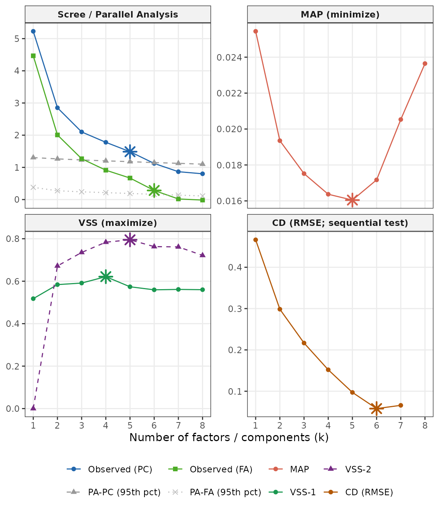
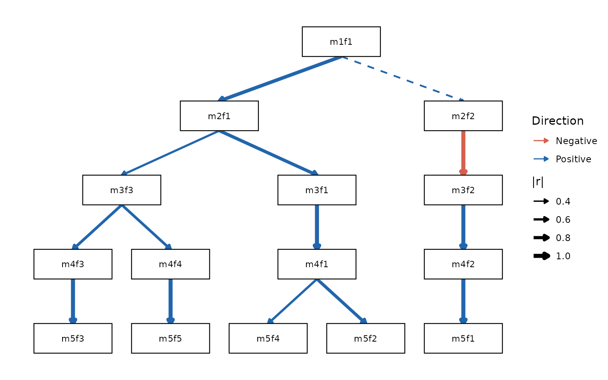

# Introduction to Bass-Ackwards Analysis

## The problem: which factor solution is right?

Anyone who has applied factor analysis faces the same dilemma: how many
factors should you extract? Parallel analysis might say 5; the scree
plot might suggest 3; a reviewer might insist on 1. Each solution seems
to describe the data differently, and it is tempting to treat them as
competing answers to the same question.

Goldberg (2006) reframed this problem: the different solutions are not
competing — they are complementary. A 1-factor solution captures the
broadest shared variance in the data, the dimension along which all
variables correlate. A 5-factor solution captures narrower, more
specific dimensions. These two levels of resolution describe the same
underlying structure from different vantage points, just as a satellite
image and a street map describe the same city.

The **bass-ackwards method** makes this relationship explicit. It fits
factor models at every level from 1 up to k, and then computes the
correlations between factor *scores* across adjacent levels. Those
correlations show you:

- **Which narrow factor inherits from which broad factor** — the lineage
  of each dimension as you move from coarse to fine resolution.
- **Where a factor splits** — a single broad factor that correlates
  strongly with two narrower factors is fragmenting into sub-dimensions.
- **Where a factor is stable** — a factor that correlates ~1.0 with its
  counterpart at the adjacent level is essentially the same construct
  appearing at two resolutions.

The result is a **hierarchy map** — a visual and numerical account of
how the factor structure of your data builds from broad to narrow.

> *Note: This is a descriptive, data-driven hierarchy, not a
> confirmatory hierarchical model like Schmid–Leiman or higher-order
> SEM. The between-level correlations are score correlations (or their
> algebraic equivalents), not model parameters. See
> `vignette("engines")` for when to use EFA or ESEM instead of PCA.*

## Data

We use `bfi25`, the built-in 25-item Big Five example dataset. The items
measure five personality traits — Agreeableness (A1–A5),
Conscientiousness (C1–C5), Extraversion (E1–E5), Neuroticism (N1–N5),
and Openness (O1–O5) — each on a 6-point Likert scale. See
[`?bfi25`](https://jmgirard.github.io/ackwards/reference/bfi25.md) for
full provenance; the data derive from the SAPA project using
public-domain IPIP items.

``` r

library(ackwards)

bfi <- na.omit(bfi25)
dim(bfi)
#> [1] 875  25
```

We drop cases with any missing item. In a real analysis you might use
pairwise deletion or multiple imputation;
[`na.omit()`](https://rdrr.io/r/stats/na.fail.html) is sufficient for
this illustration.

## Step 1: How many factors? `suggest_k()`

Before fitting the hierarchy, get a sense of the plausible range of k.
[`suggest_k()`](https://jmgirard.github.io/ackwards/reference/suggest_k.md)
runs five complementary selection criteria and reports a consensus
range:

``` r

sk <- suggest_k(bfi, seed = 42)
#> ℹ Running parallel analysis (20 iterations, PC + FA)...
#> ✔ Running parallel analysis (20 iterations, PC + FA)... [317ms]
#> 
#> ℹ Running MAP and VSS...
#> ✔ Running MAP and VSS... [182ms]
#> 
#> ℹ Running Comparison Data (CD)...
#> ✔ Running Comparison Data (CD)... [9.9s]
#> 
sk
#> 
#> ── Factor / Component Count Suggestion (ackwards) ──────────────────────────────
#> Variables: 25
#> n: 875
#> Basis: pearson
#> Tested k: 1-8
#> 
#> ── Criteria (k = 1-8) ──
#> 
#> k = 1: PA-PC ✔ PA-FA ✔ MAP 0.0254 VSS-1 0.5178 VSS-2 0.0000 CD ✔
#> k = 2: PA-PC ✔ PA-FA ✔ MAP 0.0194 VSS-1 0.5839 VSS-2 0.6719 CD ✔
#> k = 3: PA-PC ✔ PA-FA ✔ MAP 0.0175 VSS-1 0.5913 VSS-2 0.7354 CD ✔
#> k = 4: PA-PC ✔ PA-FA ✔ MAP 0.0164 VSS-1 0.6215* VSS-2 0.7837 CD ✔
#> k = 5: PA-PC ✔ PA-FA ✔ MAP 0.0160* VSS-1 0.5738 VSS-2 0.7950* CD ✔
#> k = 6: PA-PC - PA-FA ✔ MAP 0.0172 VSS-1 0.5594 VSS-2 0.7629 CD ✔*
#> k = 7: PA-PC - PA-FA - MAP 0.0205 VSS-1 0.5613 VSS-2 0.7616 CD -
#> k = 8: PA-PC - PA-FA - MAP 0.0236 VSS-1 0.5600 VSS-2 0.7215 CD -
#> 
#> ── Recommendations ──
#> 
#> • PA-PC: k <= 5
#> • PA-FA: k <= 6
#> • MAP: k = 5
#> • VSS-1: k = 4
#> • VSS-2: k = 5
#> • CD: k = 6
#> Consensus range: k = 4-6
#> ────────────────────────────────────────────────────────────────────────────────
#> Note: k_max in ackwards() is a maximum depth. Setting k_max one or two levels
#> above the consensus to observe factor fragmentation is intentional.
#> Caution: PA-PC tends to overextract; structures may not replicate (Forbes,
#> 2023). PA-FA and CD are more conservative. Use the range.
```

``` r

autoplot(sk)
```



No single criterion is decisive — look at where they converge. `k_max`
in
[`ackwards()`](https://jmgirard.github.io/ackwards/reference/ackwards.md)
is an *upper bound*; setting `k_max` one or two levels above the
consensus to watch factors fragment is intentional and informative. For
a full explanation of each criterion, its bias direction, and how to
match it to your engine, see
[`vignette("ackwards-suggest-k")`](https://jmgirard.github.io/ackwards/articles/ackwards-suggest-k.md).

## Step 2: Fit the hierarchy `ackwards()`

Now fit the bass-ackwards hierarchy. The most important arguments are:

| Argument | What it controls | Default |
|----|----|----|
| `k_max` | Maximum depth of the hierarchy | *(required)* |
| `engine` | Extraction engine: `"pca"`, `"efa"`, or `"esem"` | `"pca"` |
| `cor` | Correlation type: `"pearson"`, `"spearman"`, `"polychoric"` | `"pearson"` |

Because BFI items are ordinal, we use `cor = "polychoric"`. This
computes polychoric correlations between items before factor extraction,
giving a more accurate representation of the latent structure.

``` r

x <- ackwards(bfi, k_max = 5, cor = "polychoric")
```

No warning this time — specifying `cor = "polychoric"` tells
[`ackwards()`](https://jmgirard.github.io/ackwards/reference/ackwards.md)
that you have already thought about the measurement scale.

## Step 3: Summarize the result

### High-level summary

[`print()`](https://rdrr.io/r/base/print.html) gives a quick overview:

``` r

x
#> 
#> ── Bass-Ackwards Analysis (ackwards) ───────────────────────────────────────────
#> Engine: pca
#> Rotation: varimax
#> Basis: polychoric
#> n: 875
#> k (max): 5
#> 
#> ── Levels ──
#> 
#> ✔ k = 1: 1 factor, 23.2% variance
#> ✔ k = 2: 2 factors, 35.5% variance
#> ✔ k = 3: 3 factors, 44.6% variance
#> ✔ k = 4: 4 factors, 52.2% variance
#> ✔ k = 5: 5 factors, 58.4% variance
#> 
#> ── Edges ──
#> 
#> 14 of 40 edges have |r| ≥ 0.3
#> ────────────────────────────────────────────────────────────────────────────────
#> Note: This is a series of linked solutions, not a fitted hierarchical model.
#> Cross-level edges are descriptive score correlations. Per-level fit indices
#> (EFA/ESEM) describe how well a k-factor model fits the items at that level --
#> they do not validate the edges or the hierarchy itself.
```

The “Levels” section confirms that all five models converged, and
reports the cumulative variance explained at each level. Notice that the
jump from k = 1 to k = 2 is large (23.2% → 35.5%), while later jumps are
smaller — characteristic of data with a strong general factor and
several specific dimensions.

The “Edges” section reports how many of the 40 possible between-level
connections exceed the display threshold of \|r\| ≥ 0.3. The 40 comes
from summing across all adjacent pairs: 1×2 + 2×3 + 3×4 + 4×5 = 2 + 6 +
12 + 20 = 40.

[`summary()`](https://rdrr.io/r/base/summary.html) gives a more detailed
view — per-factor variance and fit indices at each level, plus a lineage
list showing which factors at each level descend from which parents:

``` r

summary(x)
#> 
#> ── Summary: Bass-Ackwards Analysis (ackwards) ──────────────────────────────────
#> Engine: pca
#> Rotation: varimax
#> Basis: polychoric
#> n: 875
#> k (max): 5
#> 
#> ── Levels ──
#> 
#> k = 1: 1 factor (23.2% cumulative variance)
#> m1f1 23.21% eigenvalue 5.8
#> k = 2: 2 factors (35.5% cumulative variance)
#> m2f1 20.94% eigenvalue 5.8
#> m2f2 14.54% eigenvalue 3.07
#> k = 3: 3 factors (44.6% cumulative variance)
#> m3f1 18.04% eigenvalue 5.8
#> m3f2 13.89% eigenvalue 3.07
#> m3f3 12.66% eigenvalue 2.28
#> k = 4: 4 factors (52.2% cumulative variance)
#> m4f1 17.5% eigenvalue 5.8
#> m4f2 13.63% eigenvalue 3.07
#> m4f3 11.83% eigenvalue 2.28
#> m4f4 9.21% eigenvalue 1.9
#> k = 5: 5 factors (58.4% cumulative variance)
#> m5f1 13.75% eigenvalue 5.8
#> m5f2 13.56% eigenvalue 3.07
#> m5f3 11.9% eigenvalue 2.28
#> m5f4 10.09% eigenvalue 1.9
#> m5f5 9.12% eigenvalue 1.56
#> 
#> ── Lineage (primary parents) ──
#> 
#> m1f1 → m2f1, m2f2
#> m2f1 → m3f1, m3f3
#> m2f2 → m3f2
#> m3f1 → m4f1
#> m3f2 → m4f2
#> m3f3 → m4f3, m4f4
#> m4f1 → m5f1, m5f4
#> m4f2 → m5f2
#> m4f3 → m5f3
#> m4f4 → m5f5
#> ────────────────────────────────────────────────────────────────────────────────
#> Note: This is a series of linked solutions, not a fitted hierarchical model.
#> Cross-level edges are descriptive score correlations. Per-level fit indices
#> (EFA/ESEM) describe how well a k-factor model fits the items at that level --
#> they do not validate the edges or the hierarchy itself.
```

[`glance()`](https://generics.r-lib.org/reference/glance.html) returns
the same top-level information as a one-row data frame, convenient for
comparisons across models:

``` r

glance(x)
#>   engine rotation        cor k_max n_obs deepest_converged n_edges CFI TLI
#> 1    pca  varimax polychoric     5   875                 5      40  NA  NA
#>   RMSEA SRMR BIC
#> 1    NA   NA  NA
```

## Step 4: Visualize the hierarchy `autoplot()`

The hierarchy diagram is the centerpiece of the method. Each row
represents one level (k = 1 at the top, k = 5 at the bottom). Arrows
connect each factor to its **primary parent** — the factor at the level
above with which it has the strongest correlation (\|r\|). Arrow
thickness is proportional to \|r\|, and color shows direction (blue =
positive, red = negative by default); both aesthetics come with a
legend. Primary-parent edges are always positive after sign alignment,
so a red arrow marks a genuine secondary relationship. For a
left-to-right layout (handy for wide slides), pass
`direction = "horizontal"`.

``` r

autoplot(x)
```



Reading this diagram from broad (top) to narrow (bottom) tells the story
of the Big Five:

- **k = 1**: One broad factor. Given the polychoric basis, this captures
  shared variance across all 25 items.
- **k = 2**: The broad factor splits into two: Neuroticism separates
  from a mixed cluster of Extraversion, Agreeableness,
  Conscientiousness, and Openness items (Extraversion items load most
  strongly within that cluster).
- **k = 3**: The non-Neuroticism cluster splits again, separating
  Extraversion/Agreeableness from Conscientiousness/Openness;
  Neuroticism stays intact and sheds its residual cross-loadings.
- **k = 4**: Conscientiousness and Openness differentiate into their own
  factors.
- **k = 5**: Extraversion and Agreeableness finally differentiate,
  completing the canonical Big Five.

The factors are labeled `m{k}f{j}` (level k, factor j). These stable IDs
are used throughout the object, so `m5f1` at k = 5 refers to the same
factor in the loadings, the edge table, the factor scores, and the
diagram.

### Adjusting the diagram

[`autoplot()`](https://jmgirard.github.io/ackwards/reference/autoplot.md)
accepts arguments to control edge thresholds, colours, line styles,
arrowheads, node labels, and more. See
[`vignette("ackwards-visualization")`](https://jmgirard.github.io/ackwards/articles/ackwards-visualization.md)
for a guided tour of all options with rendered examples, or
[`?autoplot.ackwards`](https://jmgirard.github.io/ackwards/reference/autoplot.ackwards.md)
for the full argument list.

## Step 5: Dig into the factors `tidy()`

[`tidy()`](https://generics.r-lib.org/reference/tidy.html) extracts any
component of the result as a tidy data frame. The `what` argument
controls what is returned.

### Reading each factor — `top_items()`

To understand what each factor represents,
[`top_items()`](https://jmgirard.github.io/ackwards/reference/top_items.md)
lists the salient items (those with `|loading| >= cut`) for every
factor, grouped by level. This is more readable than a full
item-by-factor matrix, especially for deep hierarchies.

``` r

top_items(x, level = 5, cut = 0.3)
#> 
#> ── Salient items by factor (ackwards) ──────────────────────────────────────────
#> Engine: pca
#> Cut: |loading| >= 0.3
#> Top-n: all
#> 
#> ── Level 5 (5 factors) ──
#> 
#> m5f1
#> E2 [-0.752]
#> E4 [0.747]
#> E1 [-0.701]
#> E3 [0.677]
#> E5 [0.597]
#> A5 [0.487]
#> A3 [0.415]
#> O3 [0.394]
#> N4 [-0.314]
#> O1 [0.302]
#> m5f2
#> N3 [-0.825]
#> N1 [-0.810]
#> N2 [-0.805]
#> N5 [-0.688]
#> N4 [-0.646]
#> C5 [-0.344]
#> O4 [-0.317]
#> m5f3
#> C2 [0.735]
#> C4 [-0.716]
#> C1 [0.690]
#> C3 [0.679]
#> C5 [-0.652]
#> E5 [0.448]
#> A4 [0.345]
#> m5f4
#> A1 [-0.704]
#> A3 [0.703]
#> A2 [0.692]
#> A5 [0.580]
#> A4 [0.522]
#> m5f5
#> O5 [-0.705]
#> O3 [0.655]
#> O1 [0.604]
#> O2 [-0.595]
#> O4 [0.551]
#> ────────────────────────────────────────────────────────────────────────────────
#> Loadings reflect primary-parent sign alignment. Use tidy(x, what = "loadings")
#> for the full matrix.
```

Reading a hierarchy of factors and giving them names is its own topic —
including the sign convention, naming across levels, and applying labels
to the diagram. See
[`vignette("ackwards-interpret")`](https://jmgirard.github.io/ackwards/articles/ackwards-interpret.md)
for the full workflow.

### Factor loadings (tidy)

For programmatic access, `tidy(what = "loadings")` returns the full
loading matrix in long format — one row per item × factor × level:

``` r

loadings_df <- tidy(x, what = "loadings")
head(loadings_df)
#>   level factor item    loading se ci_lower ci_upper
#> 1     1   m1f1   A1 -0.3440908 NA       NA       NA
#> 2     1   m1f1   A2  0.5977210 NA       NA       NA
#> 3     1   m1f1   A3  0.6511387 NA       NA       NA
#> 4     1   m1f1   A4  0.4837850 NA       NA       NA
#> 5     1   m1f1   A5  0.6848262 NA       NA       NA
#> 6     1   m1f1   C1  0.4502778 NA       NA       NA
```

### Between-level edges

Each edge is the between-level factor-score correlation computed via
Waller’s (2007) closed-form W′RW algebra — an exact result that requires
no score materialization, just the weight matrices and the input
correlation matrix.

``` r

# Each factor's primary-parent edge, strongest first
tidy(x, what = "edges", primary_only = TRUE, sort = "strength")
#>    from   to level_from level_to         r is_primary above_cut
#> 1  m4f2 m5f2          4        5 0.9984791       TRUE      TRUE
#> 2  m3f1 m4f1          3        4 0.9938371       TRUE      TRUE
#> 3  m4f4 m5f5          4        5 0.9894063       TRUE      TRUE
#> 4  m2f2 m3f2          2        3 0.9873651       TRUE      TRUE
#> 5  m4f3 m5f3          4        5 0.9824895       TRUE      TRUE
#> 6  m3f2 m4f2          3        4 0.9761484       TRUE      TRUE
#> 7  m1f1 m2f1          1        2 0.8900522       TRUE      TRUE
#> 8  m2f1 m3f1          2        3 0.8740850       TRUE      TRUE
#> 9  m4f1 m5f1          4        5 0.8377659       TRUE      TRUE
#> 10 m3f3 m4f3          3        4 0.7316162       TRUE      TRUE
#> 11 m3f3 m4f4          3        4 0.6802343       TRUE      TRUE
#> 12 m4f1 m5f4          4        5 0.5458269       TRUE      TRUE
#> 13 m2f1 m3f3          2        3 0.4814452       TRUE      TRUE
#> 14 m1f1 m2f2          1        2 0.4558587       TRUE      TRUE
```

`primary_only = TRUE` keeps just the strongest-connecting edge for each
factor — its primary parent — and `sort = "strength"` orders them by
`|r|`. The r values close to 1.0 indicate factors that are nearly
identical across adjacent levels — a sign of a stable, replicable
dimension. Smaller values indicate where the structure is reorganizing.

### Variance explained

``` r

tidy(x, what = "variance")
#>    level factor proportion cumulative
#> 1      1   m1f1 0.23211212  0.2321121
#> 2      2   m2f1 0.20937655  0.2093766
#> 3      2   m2f2 0.14544064  0.3548172
#> 4      3   m3f1 0.18038118  0.1803812
#> 5      3   m3f2 0.13889810  0.3192793
#> 6      3   m3f3 0.12655466  0.4458339
#> 7      4   m4f1 0.17500851  0.1750085
#> 8      4   m4f2 0.13632849  0.3113370
#> 9      4   m4f3 0.11825358  0.4295906
#> 10     4   m4f4 0.09208697  0.5216775
#> 11     5   m5f1 0.13753091  0.1375309
#> 12     5   m5f2 0.13556865  0.2730996
#> 13     5   m5f3 0.11899787  0.3920974
#> 14     5   m5f4 0.10086586  0.4929633
#> 15     5   m5f5 0.09121399  0.5841773
```

Each row is one factor at one level. `proportion` is the fraction (0-1)
of total item variance explained by that factor; `cumulative`
accumulates within a level. Multiply by 100 for a percentage.

## Step 6: Score observations `augment()`

Factor scores place every observation on each factor at every level.
They are useful for regression, clustering, or any downstream analysis
where you want a continuous summary of a latent dimension.

`augment(x, data = bfi)` computes scores on the fly from the stored
weight matrices and appends them to your data frame. The score columns
are named `.m{k}f{j}` to distinguish them from the original variables.

``` r

scored <- augment(x, data = bfi)
#> Warning: ! Factor scores are standardized using model-implied SDs from a "polychoric"
#>   correlation matrix.
#> ℹ The raw projection uses `.standardize(data)` (Pearson z-scores), but
#>   `score_var` comes from the "polychoric" R.
#> ℹ Empirical score SDs will differ from 1.0. For non-Pearson analyses,
#>   between-level edges from `tidy()` are the authoritative associations.
#> This warning is displayed once per session.
dim(scored) # 25 original items + 15 score columns (1+2+3+4+5)
#> [1] 875  40
names(scored)[26:40]
#>  [1] ".m1f1" ".m2f1" ".m2f2" ".m3f1" ".m3f2" ".m3f3" ".m4f1" ".m4f2" ".m4f3"
#> [10] ".m4f4" ".m5f1" ".m5f2" ".m5f3" ".m5f4" ".m5f5"
```

Scores are standardized so that the **model-implied** variance is 1 —
meaning the scaling comes from the polychoric correlation matrix, not
from the raw data. In practice the empirical standard deviations will be
close to but not exactly 1 when a non-Pearson basis is used; see
[`?augment.ackwards`](https://jmgirard.github.io/ackwards/reference/augment.ackwards.md)
for details. For pure PCA on Pearson correlations the model-implied and
empirical variances agree exactly.

If you need scores repeatedly (e.g., in a cross-validation loop), store
them at fit time with `keep_scores = TRUE` to avoid re-applying the
weight matrices on every call:

``` r

x2 <- ackwards(bfi, k_max = 5, cor = "polychoric", keep_scores = TRUE)
scored2 <- augment(x2) # uses stored matrices — no recomputation
all.equal(scored2$.m5f1, scored$.m5f1)
#> [1] TRUE
```

### Using scores for downstream analysis

Because [`augment()`](https://generics.r-lib.org/reference/augment.html)
returns a plain data frame, the scores slot directly into any standard R
workflow. As a quick illustration, the k = 5 factor scores should be
nearly uncorrelated with each other — a consequence of orthogonal
rotation — while scores across levels should be highly correlated along
the primary-parent lineage:

``` r

# Within-level correlations at k = 5: should be near zero (orthogonal rotation)
k5 <- scored[, c(".m5f1", ".m5f2", ".m5f3", ".m5f4", ".m5f5")]
round(cor(k5), 2)
#>       .m5f1 .m5f2 .m5f3 .m5f4 .m5f5
#> .m5f1  1.00 -0.01 -0.01 -0.02  0.00
#> .m5f2 -0.01  1.00 -0.01  0.01  0.01
#> .m5f3 -0.01 -0.01  1.00 -0.02 -0.02
#> .m5f4 -0.02  0.01 -0.02  1.00 -0.03
#> .m5f5  0.00  0.01 -0.02 -0.03  1.00
```

``` r

# Cross-level: m4f1 is the primary parent of m5f1 and m5f4 (from the edge table)
lineage <- scored[, c(".m4f1", ".m5f1", ".m5f2", ".m5f4")]
round(cor(lineage), 2)
#>       .m4f1 .m5f1 .m5f2 .m5f4
#> .m4f1  1.00  0.84  0.00  0.53
#> .m5f1  0.84  1.00 -0.01 -0.02
#> .m5f2  0.00 -0.01  1.00  0.01
#> .m5f4  0.53 -0.02  0.01  1.00
```

The cross-level block confirms lineage: `.m4f1` correlates strongly with
`.m5f1` and `.m5f4` (the k = 5 factors it spawned) and near-zero with
`.m5f2` (which descends from a different k = 4 factor). This is a sanity
check you can run on any result — strong parent–child correlations
should appear exactly where the `tidy(what = "edges")` table says they
should.

## Summary

The bass-ackwards workflow in **ackwards** has six steps:

1.  **`suggest_k(data)`** — identify a plausible range for the hierarchy
    depth.
2.  **`ackwards(data, k_max, cor = ...)`** — fit the full hierarchy of
    factor models.
3.  **`print(x)` / `summary(x)` / `glance(x)`** — check convergence,
    read the per-level variance and fit indices, and inspect the lineage
    list.
4.  **`autoplot(x)`** — visualize the hierarchy as a lineage diagram.
5.  **`tidy(x, what = ...)`** — extract loadings, edges, or variance in
    a form ready for tables or further analysis.
6.  **`augment(x, data = ...)`** — generate factor scores for downstream
    use.

## Next steps

| Topic | Vignette |
|----|----|
| Choosing k: the five criteria in depth, pros/cons, and best practices | [`vignette("ackwards-suggest-k")`](https://jmgirard.github.io/ackwards/articles/ackwards-suggest-k.md) |
| When PCA is not enough: comparing EFA and ESEM engines | [`vignette("ackwards-engines")`](https://jmgirard.github.io/ackwards/articles/ackwards-engines.md) |
| Ordinal data: polychoric correlations and WLSMV estimation | [`vignette("ackwards-ordinal")`](https://jmgirard.github.io/ackwards/articles/ackwards-ordinal.md) |
| Skip-level connections and pruning with the Forbes extension | [`vignette("ackwards-forbes")`](https://jmgirard.github.io/ackwards/articles/ackwards-forbes.md) |
| Customizing the hierarchy diagram | [`vignette("ackwards-visualization")`](https://jmgirard.github.io/ackwards/articles/ackwards-visualization.md) |

## References

Goldberg, L. R. (2006). Doing it all bass-ackwards: The development of
hierarchical factor structures from the top down. *Journal of Research
in Personality*, *40*(4), 347–358.
<https://doi.org/10.1016/j.jrp.2006.01.001>

Waller, N. G. (2007). A general method for computing hierarchical
component structures by *Bass-Ackward* factor analysis. *Journal of
Research in Personality*, *41*(4), 745–752.
<https://doi.org/10.1016/j.jrp.2006.08.005>

Horn, J. L. (1965). A rationale and test for the number of factors in
factor analysis. *Psychometrika*, *30*(2), 179–185.

Velicer, W. F. (1976). Determining the number of components from the
matrix of partial correlations. *Psychometrika*, *41*(3), 321–327.
