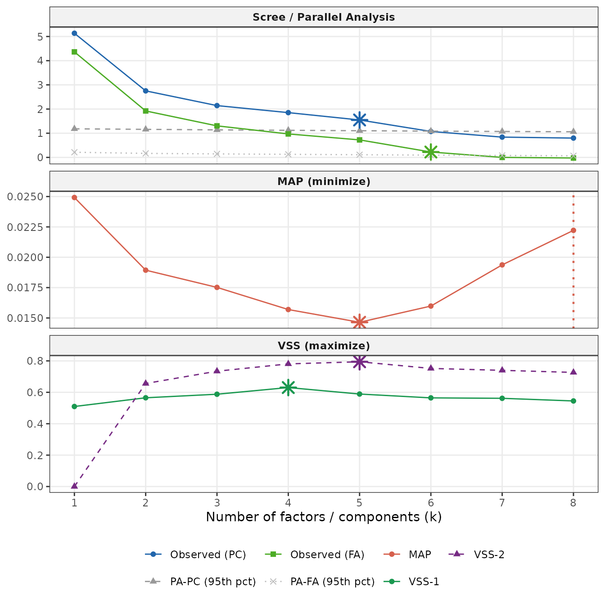

# Choosing k: How Many Factors?

``` r

library(ackwards)
bfi <- na.omit(psych::bfi[, 1:25])
```

## k is a decision, not an output

Before you can run
[`ackwards()`](https://jmgirard.github.io/ackwards/reference/ackwards.md),
you need a value for `k_max` — the *maximum depth* of the hierarchy.
This is not the same question as “how many factors does my data really
have?” There is no single true k hidden in the data, and different
selection criteria will give different answers depending on their
assumptions and what they are optimized for.

The practical question is: **what range of k is defensible, and where
should I look?**
[`suggest_k()`](https://jmgirard.github.io/ackwards/reference/suggest_k.md)
is designed to help you answer that. It runs five complementary criteria
and reports their recommendations together, so you can see where they
agree and where they diverge.

A few things to keep in mind before you start:

**k_max is a maximum depth, not a claim about the true structure.**
Setting `k_max = 5` tells
[`ackwards()`](https://jmgirard.github.io/ackwards/reference/ackwards.md)
to fit models at every level from 1 to 5 and examine how the structure
evolves across those levels. It does not assert that exactly five
factors exist. In fact, deliberately setting k_max one or two levels
past the consensus — to watch factors fragment at the deeper levels — is
a normal and informative part of the analysis.

**Overextraction is the dominant error mode.** Simulation studies
consistently find that the most common mistake is retaining too many
factors, not too few. An overextracted level introduces factors with
only 1–2 strong loadings and between-level correlations near 1.0 (a sign
that the parent factor simply split in two without adding interpretive
content). Forbes (2023) documents this explicitly for the bass-ackwards
context: non-replicable structure tends to appear at the deeper levels
of an overextracted hierarchy. Use the criteria below to identify the
upper end of the plausible range, and treat levels near that ceiling
with appropriate skepticism.

**No criterion is decisive on its own.** Each of the five criteria below
captures a different aspect of the data, tends to err in a different
direction, and can fail in different circumstances. A consensus across
multiple criteria is more trustworthy than any single recommendation.

## The five criteria

[`suggest_k()`](https://jmgirard.github.io/ackwards/reference/suggest_k.md)
computes five criteria from the same data. Here they are with their
logic, typical behavior, and practical limitations.

### PA-PC — Parallel Analysis (PC basis)

**What it does.** Computes PC eigenvalues for the observed correlation
matrix, then simulates a large number of random correlation matrices of
the same dimensions. Retains components whose observed eigenvalues
exceed the 95th percentile of the simulated distribution.

**Typical behavior.** Tends to *overextract* — it often recommends more
components than replicate in independent samples, particularly when
items are moderately correlated (which they usually are in personality
and clinical research). Treat its recommendation as an *upper bound*.

**When it is useful.** Best paired with `engine = "pca"` in
[`ackwards()`](https://jmgirard.github.io/ackwards/reference/ackwards.md),
since both operate on the same PC eigenvalue basis. It also provides a
fast, stable baseline across a wide range of data types.

**Limitation.** The 95th-percentile threshold is a convention, not a
formal test. With large samples, even trivial components can exceed the
threshold.

------------------------------------------------------------------------

### PA-FA — Parallel Analysis (FA basis)

**What it does.** The same logic as PA-PC, but applied to common-factor
eigenvalues rather than PC eigenvalues. The observed FA eigenvalues are
compared against the 95th percentile of simulated FA eigenvalues.

**Typical behavior.** More conservative than PA-PC. FA eigenvalues are
smaller (they exclude unique variance), so fewer of them exceed the
random-data threshold. PA-FA recommendations typically equal or fall
below PA-PC.

**When it is useful.** The model-consistent criterion for
`engine = "efa"` or `engine = "esem"` in
[`ackwards()`](https://jmgirard.github.io/ackwards/reference/ackwards.md):
if your analysis assumes a common-factor model, comparing FA eigenvalues
to a FA baseline is the better-matched test.

**Limitation.** Like PA-PC, it can be underpowered with small samples
and returns `NA` when no observed FA eigenvalue exceeds the random
threshold (a sign that the data may not support a factor model at all).

------------------------------------------------------------------------

### MAP — Minimum Average Partial

**What it does.** After extracting k components, computes the partial
correlations among items (the correlations that remain after removing
the k components). Reports the average squared partial correlation at
each k. Recommends the k that *minimizes* this average — the point at
which the components have removed as much shared variance as possible.

**Typical behavior.** Usually conservative — often recommends fewer
factors than PA. Simulation studies find it performs well across a range
of sample sizes and factor structures, particularly when the true number
of factors is small to moderate.

**When it is useful.** A reliable secondary check that catches cases
where PA overextracts. If MAP and PA-FA agree, you can be fairly
confident in that range.

**Limitation.** MAP operates on PC components internally (it uses
[`psych::vss()`](https://rdrr.io/pkg/psych/man/VSS.html) with
`fm = "pc"`), so its recommendation reflects a component-extraction
framework even when you plan to use an EFA or ESEM engine in
[`ackwards()`](https://jmgirard.github.io/ackwards/reference/ackwards.md).

------------------------------------------------------------------------

### VSS-1 and VSS-2 — Very Simple Structure

**What it does.** Fits a “very simple structure” model at each k: a
loading matrix where each item loads on only one factor (VSS-1) or at
most two factors (VSS-2). Reports the fit of that simplified model at
each k. Recommends the k that *maximizes* this fit.

**Typical behavior.** VSS-1 often peaks early (small k), making it
conservative. VSS-2 tends to peak at a higher k. Both are sensitive to
whether the true structure actually has a simple-structure form.

**When it is useful.** As a cross-check on the other criteria. When
VSS-1 and VSS-2 agree with MAP, the simple-structure interpretation is
robust. When they disagree, the data may have a more complex loading
structure.

**Limitation.** VSS criteria work poorly when items have meaningful
cross- loadings (a common situation with personality scales). In those
cases, VSS-1 in particular may underestimate k.

------------------------------------------------------------------------

### CD — Comparison Data

**What it does.** Generates comparison datasets by drawing from the
marginal distributions of the observed items (preserving each item’s
shape without assuming multivariate normality). Computes eigenvalues for
each comparison dataset and retains the factor whose addition most
consistently improves RMSE across the real and comparison data.

**Typical behavior.** Among the most accurate criteria in simulation
studies (Ruscio & Roche, 2012), particularly when items have non-normal
distributions — a common feature of Likert-scale data. More conservative
than PA-PC.

**When it is useful.** Ordinal or skewed data where the normality
assumptions underlying PA are questionable. CD samples from the actual
marginal distributions, so it implicitly captures item skewness and
discreteness.

**Limitation.** Requires the `EFAtools` package (install separately).
Needs the raw data matrix — it cannot run from a correlation matrix
alone. The resampling step is stochastic, so results can vary slightly
across runs (use `seed` for reproducibility).
[`suggest_k()`](https://jmgirard.github.io/ackwards/reference/suggest_k.md)
reports `cd_available = FALSE` when `EFAtools` is absent and skips CD
gracefully.

A note on `cor = "spearman"`: the other four criteria respect the `cor`
argument and compute their eigenvalues from the requested correlation
matrix. CD always uses Pearson correlations internally (an `EFAtools`
constraint). When `cor = "spearman"` is requested,
[`suggest_k()`](https://jmgirard.github.io/ackwards/reference/suggest_k.md)
warns that CD and the other criteria may diverge.

------------------------------------------------------------------------

### Summary table

| Criterion | Tends to | Best for | Requires |
|----|----|----|----|
| PA-PC | Overextract (upper bound) | `engine = "pca"` | `psych` |
| PA-FA | Conservative | `engine = "efa"` / `"esem"` | `psych` |
| MAP | Conservative | General secondary check | `psych` |
| VSS-1/2 | Variable | Simple-structure check | `psych` |
| CD | Accurate in simulation; can over-retain on large, correlated samples | Ordinal/non-normal data | `EFAtools` |

For a complete reference — argument definitions, return value structure,
and citations — see
[`?suggest_k`](https://jmgirard.github.io/ackwards/reference/suggest_k.md).

## Running suggest_k()

``` r

sk <- suggest_k(bfi, seed = 42)
#> ℹ Running parallel analysis (20 iterations, PC + FA)...
#> ✔ Running parallel analysis (20 iterations, PC + FA)... [281ms]
#> 
#> ℹ Running MAP and VSS...
#> ✔ Running MAP and VSS... [179ms]
#> 
#> ℹ Running Comparison Data (CD)...
#> ✔ Running Comparison Data (CD)... [18.1s]
#> 
sk
#> 
#> ── Factor / Component Count Suggestion (ackwards) ──────────────────────────────
#> Variables: 25
#> n: 2,436
#> Basis: pearson
#> Tested k: 1-8
#> 
#> ── Criteria (k = 1-8) ──
#> 
#> k = 1: PA-PC ✔ PA-FA ✔ MAP 0.0249 VSS-1 0.5096 VSS-2 0.0000 CD ✔
#> k = 2: PA-PC ✔ PA-FA ✔ MAP 0.0189 VSS-1 0.5651 VSS-2 0.6560 CD ✔
#> k = 3: PA-PC ✔ PA-FA ✔ MAP 0.0175 VSS-1 0.5878 VSS-2 0.7343 CD ✔
#> k = 4: PA-PC ✔ PA-FA ✔ MAP 0.0157 VSS-1 0.6303* VSS-2 0.7809 CD ✔
#> k = 5: PA-PC ✔ PA-FA ✔ MAP 0.0146* VSS-1 0.5890 VSS-2 0.7944* CD ✔
#> k = 6: PA-PC - PA-FA ✔ MAP 0.0160 VSS-1 0.5646 VSS-2 0.7520 CD ✔
#> k = 7: PA-PC - PA-FA - MAP 0.0194 VSS-1 0.5617 VSS-2 0.7399 CD ✔
#> k = 8: PA-PC - PA-FA - MAP 0.0222 VSS-1 0.5449 VSS-2 0.7266 CD ✔*
#> 
#> ── Recommendations ──
#> 
#> • PA-PC: k <= 5
#> • PA-FA: k <= 6
#> • MAP: k = 5
#> • VSS-1: k = 4
#> • VSS-2: k = 5
#> • CD: k = 8
#> Consensus range: k = 4-8
#> ────────────────────────────────────────────────────────────────────────────────
#> Note: k_max in ackwards() is a maximum depth. Setting k_max one or two levels
#> above the consensus to observe factor fragmentation is intentional.
#> Caution: PA-PC tends to overextract; structures may not replicate (Forbes,
#> 2023). PA-FA and CD are more conservative. Use the range.
```

The output prints in two sections. The **criteria table** shows the raw
evidence at each k:

- PA-PC and PA-FA mark a checkmark at each k they would retain (up to
  their recommended ceiling) and a dash above it.
- MAP, VSS-1, and VSS-2 show the numeric value at each k; the optimal k
  is starred (`*`).
- CD (if available) marks a checkmark up to its recommendation and stars
  the optimal k.

The **recommendations block** summarizes each criterion’s single
suggested k (or range for PA), and the **consensus range** spans the
minimum to maximum across all available recommendations.

### The diagnostic plot

``` r

autoplot(sk)
```



The three panels show the full evidence curve at a glance:

**Scree / Parallel Analysis (top).** The solid blue line is the observed
PC eigenvalue profile; the grey dashed line is the PA-PC 95th-percentile
threshold. Retain PC-based components where the blue line is above the
grey dashed line (left of the PA-PC star). The solid teal line and grey
dotted line show the same for the FA basis (PA-FA). The two comparisons
are independent — you read each pair against its own threshold.

**MAP (middle).** Lower is better. The criterion minimizes at the
starred k.

**VSS (bottom).** Higher is better. VSS-1 (solid green) and VSS-2
(dashed purple) each peak at their starred k.

Look for visual convergence across panels. When the scree elbow, the MAP
minimum, and a VSS peak all occur at roughly the same k, the evidence is
unusually consistent. When they scatter, you have genuine ambiguity, and
exploring a range of k values in
[`ackwards()`](https://jmgirard.github.io/ackwards/reference/ackwards.md)
is the right response.

## Matching the criterion to your engine

| If you plan to use… | Prefer… | Rationale |
|----|----|----|
| `engine = "pca"` | PA-PC, MAP | PA-PC uses the same PC basis as the engine |
| `engine = "efa"` | PA-FA, MAP, CD | PA-FA is basis-consistent; MAP and CD are robust across models |
| `engine = "esem"` | PA-FA, MAP, CD | Same rationale as EFA |

This is a best-practice recommendation, not a hard rule. Running all
five criteria regardless of your engine is cheap and informative — you
will see where the criteria agree and where they pull in different
directions.

## The arguments

### `cor` — correlation basis

`cor` controls the correlation matrix used to compute eigenvalues for
PA, MAP, and VSS. It should match (or approximate) the `cor` argument
you plan to use in
[`ackwards()`](https://jmgirard.github.io/ackwards/reference/ackwards.md).

**Ordinal data caveat.** If your items are ordinal (e.g., Likert
scales), you may plan to use `cor = "polychoric"` in
[`ackwards()`](https://jmgirard.github.io/ackwards/reference/ackwards.md).
But
[`suggest_k()`](https://jmgirard.github.io/ackwards/reference/suggest_k.md)
does not support `cor = "polychoric"` — parallel analysis and MAP do not
have a polychoric eigen-decomposition path. The standard practice is to
run
[`suggest_k()`](https://jmgirard.github.io/ackwards/reference/suggest_k.md)
with the default `cor = "pearson"` and then switch to
`cor = "polychoric"` in
[`ackwards()`](https://jmgirard.github.io/ackwards/reference/ackwards.md).
The PA-PC and PA-FA recommendations on the Pearson matrix serve as a
reasonable upper and lower bound for the polychoric analysis; see
[`vignette("ackwards-ordinal")`](https://jmgirard.github.io/ackwards/articles/ackwards-ordinal.md)
for more.

### `n_iter` — Monte Carlo iterations

`n_iter` controls how many random matrices are simulated for parallel
analysis. The default is 20, which is fast but noisy. For a
publication-ready result, increase to 100 or more:

``` r

sk_hi <- suggest_k(bfi, n_iter = 100, seed = 42)
```

For a quick initial exploration, `n_iter = 5` is often sufficient:

``` r

sk_fast <- suggest_k(bfi, n_iter = 5)
```

### `seed` — reproducibility

The `seed` argument is passed to
[`set.seed()`](https://rdrr.io/r/base/Random.html) before the Comparison
Data (CD) step, making CD results reproducible across runs.

**Honest caveat.** Parallel analysis uses
[`psych::fa.parallel()`](https://rdrr.io/pkg/psych/man/fa.parallel.html)
internally, which does not respond reliably to
[`set.seed()`](https://rdrr.io/r/base/Random.html). PA simulation
results will vary slightly from run to run regardless of the `seed`
argument — this is a known limitation of the underlying function. CD,
which uses [`EFAtools::CD()`](https://rdrr.io/pkg/EFAtools/man/CD.html),
does respond to [`set.seed()`](https://rdrr.io/r/base/Random.html) and
is reproducible when `seed` is set.

### `k_max` — ceiling for the search

`k_max` is the maximum number of factors tested. The default is
`min(ncol(data) - 1, 8)`. Increase it if you expect a deeper hierarchy;
reduce it to speed up computation when you already have a strong prior.
Note that `k_max` here is a search ceiling for
[`suggest_k()`](https://jmgirard.github.io/ackwards/reference/suggest_k.md)
and need not equal the `k_max` you ultimately pass to
[`ackwards()`](https://jmgirard.github.io/ackwards/reference/ackwards.md).

## A worked recommendation for the BFI

The BFI has 25 items measuring five personality traits. The criteria do
not all converge here, which is itself informative:

``` r

sk # reproduced from earlier
#> 
#> ── Factor / Component Count Suggestion (ackwards) ──────────────────────────────
#> Variables: 25
#> n: 2,436
#> Basis: pearson
#> Tested k: 1-8
#> 
#> ── Criteria (k = 1-8) ──
#> 
#> k = 1: PA-PC ✔ PA-FA ✔ MAP 0.0249 VSS-1 0.5096 VSS-2 0.0000 CD ✔
#> k = 2: PA-PC ✔ PA-FA ✔ MAP 0.0189 VSS-1 0.5651 VSS-2 0.6560 CD ✔
#> k = 3: PA-PC ✔ PA-FA ✔ MAP 0.0175 VSS-1 0.5878 VSS-2 0.7343 CD ✔
#> k = 4: PA-PC ✔ PA-FA ✔ MAP 0.0157 VSS-1 0.6303* VSS-2 0.7809 CD ✔
#> k = 5: PA-PC ✔ PA-FA ✔ MAP 0.0146* VSS-1 0.5890 VSS-2 0.7944* CD ✔
#> k = 6: PA-PC - PA-FA ✔ MAP 0.0160 VSS-1 0.5646 VSS-2 0.7520 CD ✔
#> k = 7: PA-PC - PA-FA - MAP 0.0194 VSS-1 0.5617 VSS-2 0.7399 CD ✔
#> k = 8: PA-PC - PA-FA - MAP 0.0222 VSS-1 0.5449 VSS-2 0.7266 CD ✔*
#> 
#> ── Recommendations ──
#> 
#> • PA-PC: k <= 5
#> • PA-FA: k <= 6
#> • MAP: k = 5
#> • VSS-1: k = 4
#> • VSS-2: k = 5
#> • CD: k = 8
#> Consensus range: k = 4-8
#> ────────────────────────────────────────────────────────────────────────────────
#> Note: k_max in ackwards() is a maximum depth. Setting k_max one or two levels
#> above the consensus to observe factor fragmentation is intentional.
#> Caution: PA-PC tends to overextract; structures may not replicate (Forbes,
#> 2023). PA-FA and CD are more conservative. Use the range.
```

Reading the rendered table:

**MAP and VSS-2 agree on k = 5**, with VSS-1 slightly more conservative
at k = 4. Two conservative criteria converging is a meaningful signal;
the modal answer from the non-PA criteria is 5.

**PA-FA exceeds PA-PC in this run** (6 vs. 5). Normally PA-PC
over-extracts relative to PA-FA, making PA-PC the liberal upper bound.
Here the relationship inverts — a nuance in this dataset’s eigenvalue
geometry, not a contradiction. Read both, but trust PA-FA as the
model-consistent criterion for EFA and ESEM engines.

**CD is a high outlier** (k = 8, when `EFAtools` is available). CD is
among the most accurate criteria in simulation studies, but it resamples
from the marginal distributions of each item independently, without
preserving inter-item correlations. On a large, moderately correlated
sample like the BFI (n = 2,436, 25 correlated items), the comparison
data underestimates how much structure the real correlation matrix
contains, so CD over-retains factors. Treat a large gap between CD and
the other criteria as an invitation to look carefully at the deeper
levels — not a directive to extract that many factors unconditionally.

**Defensible choice: `k_max = 6`.** This matches the PA-FA
recommendation and sits one level above the MAP/VSS-2 consensus of 5.
Setting `k_max = 6` lets
[`ackwards()`](https://jmgirard.github.io/ackwards/reference/ackwards.md)
show whether a sixth level reveals interpretable sub-facets or merely
splits the Big Five into arbitrary micro-factors.

``` r

x <- ackwards(bfi, k_max = 6, cor = "polychoric")
autoplot(x)
```

If the k = 6 level looks like overextraction (very thin arrows, factors
that split and immediately re-merge, between-level r ≈ 1), you can
interpret down to k = 5 with confidence that you have not missed
structure. If k = 6 reveals interpretable sub-facets, you have found
something worth reporting.

This “set k slightly high, then interpret down” approach is the standard
bass-ackwards workflow. The method is specifically designed for this
kind of structured exploration.

## References

Forbes, M. K. (2023). Improving hierarchical models of individual
differences: An extension of Goldberg’s bass-ackward method.
*Psychological Methods*. <https://doi.org/10.1037/met0000546>

Horn, J. L. (1965). A rationale and test for the number of factors in
factor analysis. *Psychometrika*, *30*(2), 179–185.
<https://doi.org/10.1007/BF02289447>

Revelle, W., & Rocklin, T. (1979). Very simple structure: An alternative
procedure for estimating the optimal number of interpretable factors.
*Multivariate Behavioral Research*, *14*(4), 403–414.
<https://doi.org/10.1207/s15327906mbr1404_2>

Ruscio, J., & Roche, B. (2012). Determining the number of factors to
retain in an exploratory factor analysis using comparison data of a
known factorial structure. *Psychological Assessment*, *24*(2), 282–292.
<https://doi.org/10.1037/a0025697>

Velicer, W. F. (1976). Determining the number of components from the
matrix of partial correlations. *Psychometrika*, *41*(3), 321–327.
<https://doi.org/10.1007/BF02293557>
