# Customizing the Hierarchy Diagram

[`autoplot.ackwards()`](https://jmgirard.github.io/ackwards/reference/autoplot.ackwards.md)
exposes a large number of arguments for controlling the appearance of
the hierarchy diagram. This vignette is a visual reference: each section
demonstrates one group of arguments with rendered figures so you can see
the effect before writing any code.

All options shown here are **presentation-only** — they do not change
which factors were extracted or how the between-level correlations were
computed. Options that change *which nodes appear* (`drop_pruned`,
`compress_levels`) are specific to the Forbes pruning extension and are
covered in
[`vignette("ackwards-forbes")`](https://jmgirard.github.io/ackwards/articles/ackwards-forbes.md).

## Setup

``` r

library(ackwards)

bfi <- na.omit(bfi25)
x <- ackwards(bfi, k_max = 5, cor = "polychoric")
```

The default diagram for reference:

``` r

autoplot(x)
```


Factors are labeled `m{k}f{j}` (level k, factor j). Arrow **thickness**
encodes \|r\|; **colour** encodes direction (blue = positive, red–orange
= negative); **linetype** encodes strength (solid: \|r\| ≥ `cut_strong`;
dashed: `cut_show` ≤ \|r\| \< `cut_strong`). Level labels on the left
count factors per level.

## Filtering edges

### `cut_show` — minimum \|r\| to display

Edges below `cut_show` are hidden entirely. Raising it produces a
sparser diagram that emphasises only the strongest connections.

``` r

# Default cut_show = 0.3 (already shown above)
autoplot(x, cut_show = 0.5)
```

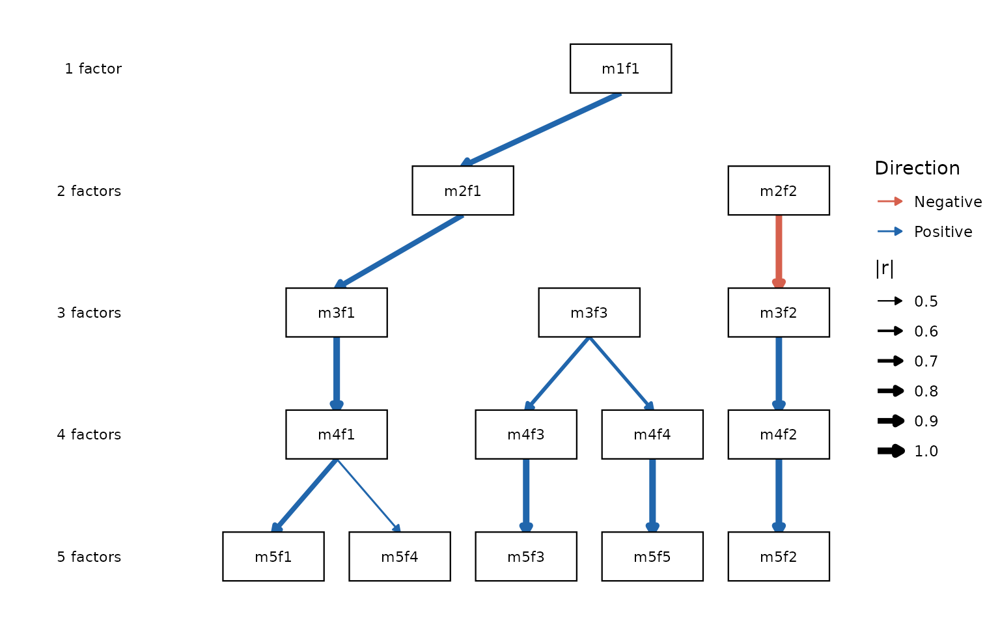

### `cut_strong` — solid vs dashed threshold

Edges at or above `cut_strong` are drawn solid; edges below it (but
above `cut_show`) are dashed. Raising `cut_strong` makes only the very
strongest connections solid.

``` r

autoplot(x, cut_show = 0.3, cut_strong = 0.8)
```

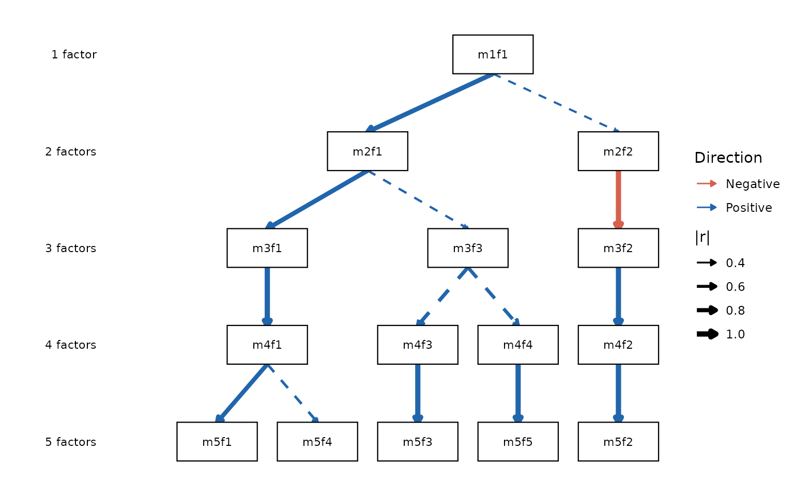

## Edge colours

### `color_pos` / `color_neg` — custom direction colours

The default blue/red palette can be replaced with any colours recognised
by R.

``` r

autoplot(x, color_pos = "darkorchid", color_neg = "darkorange")
```

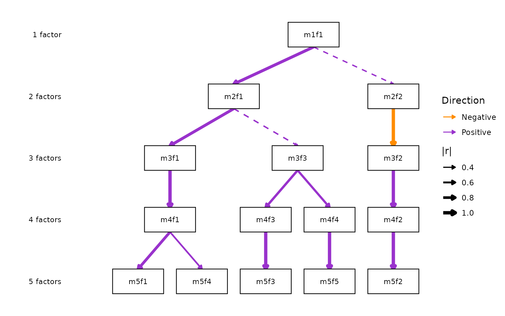

Setting both to the same colour produces uniformly coloured edges while
retaining the linetype-based strength distinction from `cut_strong`.
This is the basis for the Forbes (2023) publication style (see the
worked example at the end of this vignette).

## Monochrome mode

### `mono = TRUE` — encode direction on linetype

`mono = TRUE` switches the direction encoding from colour to linetype:
solid lines are positive correlations and dashed lines are negative
correlations. `linewidth` still encodes \|r\|. The `cut_strong` strength
distinction is dropped in this mode because linewidth already conveys
magnitude.

``` r

autoplot(x, mono = TRUE)
```

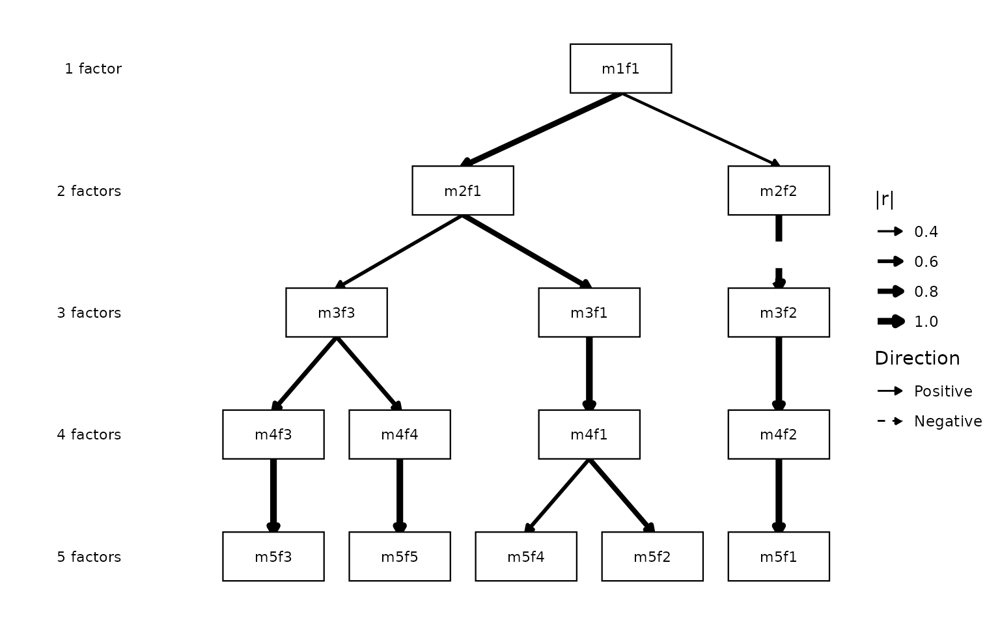

`mono` is suited for black-and-white figures where the reader must
distinguish positive from negative edges. Note that the linetype
semantics differ from the colour-mode dashing: here dashed = *negative
sign*, not *weak connection*. For the Forbes-style uniform-line look
(dashed = weak, regardless of sign), use
`color_pos = color_neg = "black"` in colour mode instead — see the
worked example below.

Combining `mono` with `show_r` labels the edges with their exact values,
removing any ambiguity about magnitude:

``` r

autoplot(x, mono = TRUE, show_r = TRUE)
```

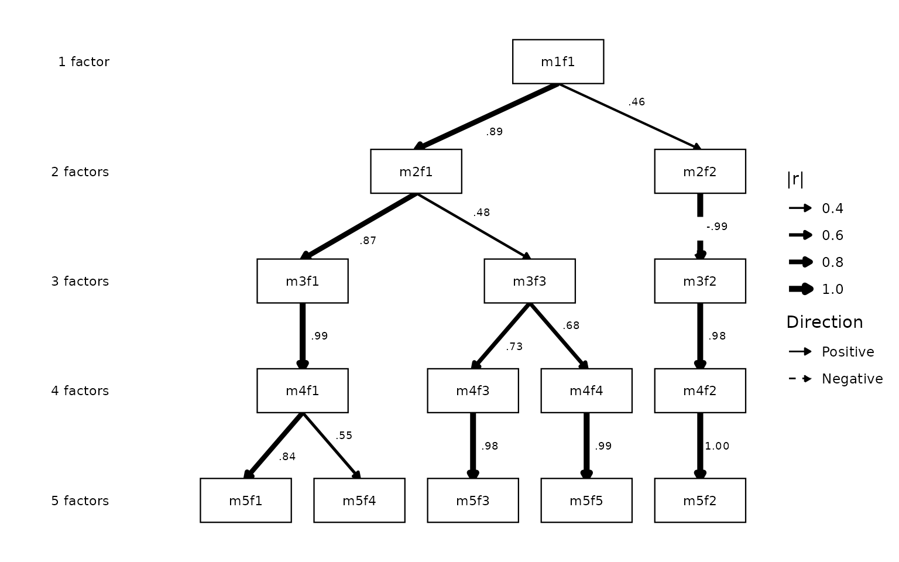

## Correlation labels

### `show_r` / `r_digits` — annotate edges with \|r\| values

`show_r = TRUE` draws the rounded correlation at each edge midpoint.
`r_digits` controls the number of decimal places (default 2).

``` r

autoplot(x, show_r = TRUE)
```


``` r

autoplot(x, show_r = TRUE, r_digits = 1L)
```

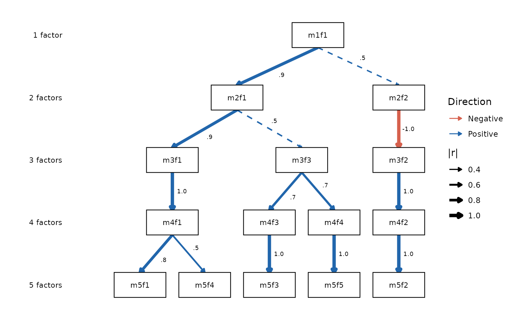

## Node labels

### `node_labels` — rename individual factors

`node_labels` is a named character vector mapping factor IDs to display
strings. Unspecified factors keep their `m{k}f{j}` labels.

``` r

autoplot(x, node_labels = c(
  m5f1 = "Neuro.",
  m5f2 = "Extra.",
  m5f3 = "Consc.",
  m5f4 = "Agree.",
  m5f5 = "Open."
))
```

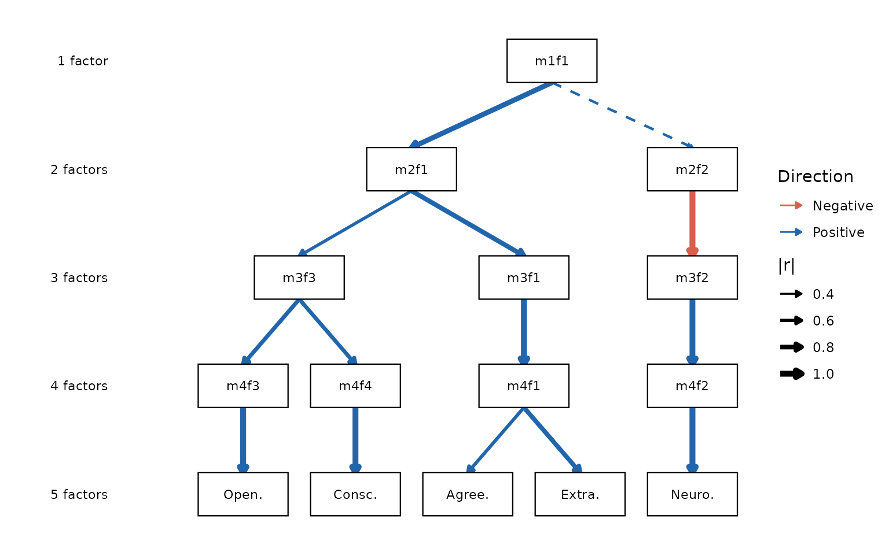

Multi-line labels are supported via `\n`:

``` r

autoplot(x, node_labels = c(
  m5f1 = "Neuro-\nticism",
  m5f2 = "Extra-\nversion"
))
```

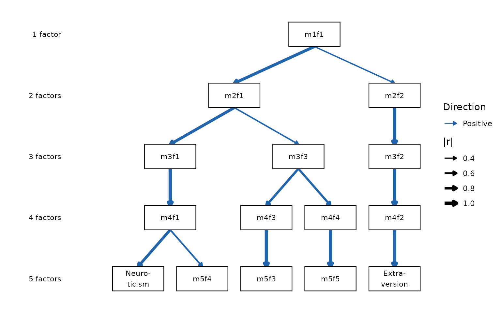

### `label_template()` — generate the scaffold

Typing out every factor ID is tedious for large objects.
[`label_template()`](https://jmgirard.github.io/ackwards/reference/label_template.md)
generates the full named vector in canonical diagram order and prints a
copy-pasteable `c(...)` literal you can edit and pass back to
`node_labels`. It also offers the Forbes (2023) letter convention
(`"A1"`, `"B1"`, `"B2"`, …) as a built-in style:

``` r

autoplot(x, node_labels = label_template(x, style = "forbes"))
#> `label_template()` scaffold (forbes style):
#> c(
#>   "m1f1" = "A1",
#>   "m2f1" = "B1",
#>   "m2f2" = "B2",
#>   "m3f1" = "C1",
#>   "m3f2" = "C2",
#>   "m3f3" = "C3",
#>   "m4f1" = "D1",
#>   "m4f2" = "D2",
#>   "m4f3" = "D3",
#>   "m4f4" = "D4",
#>   "m5f1" = "E1",
#>   "m5f2" = "E2",
#>   "m5f3" = "E3",
#>   "m5f4" = "E4",
#>   "m5f5" = "E5"
#> )
```


For the full naming workflow — reading factors, the sign convention, and
choosing labels across the hierarchy — see
[`vignette("ackwards-interpret")`](https://jmgirard.github.io/ackwards/articles/ackwards-interpret.md).

## Structural simplifications

### `primary_only = TRUE` — show only primary-parent edges

Setting `primary_only = TRUE` keeps only the single strongest edge per
factor (its primary parent), producing a clean tree. Because skip-level
edges are never primary, this also suppresses curved arcs when
`pairs = "all"` was used.

``` r

autoplot(x, primary_only = TRUE)
```


## Level labels

### `show_level_labels` / `level_label_size`

Level labels (“1 factor”, “2 factors”, …) are shown by default on the
left margin. They can be hidden or resized.

``` r

autoplot(x, show_level_labels = FALSE)
```


``` r

autoplot(x, show_level_labels = TRUE, level_label_size = 4)
```


## Arrowheads

### `show_arrows = FALSE` — plain line ends

By default, edges end with closed arrowheads. Setting
`show_arrows = FALSE` draws plain line ends. This applies to both
straight edges and curved skip-level arcs.

``` r

autoplot(x, show_arrows = FALSE)
```


## Edge width

### `edge_linewidth` — uniform vs. \|r\|-scaled width

By default, edge width is proportional to \|r\|. A numeric
`edge_linewidth` draws every edge at that constant width and removes the
linewidth legend.

``` r

autoplot(x, edge_linewidth = 0.7)
```

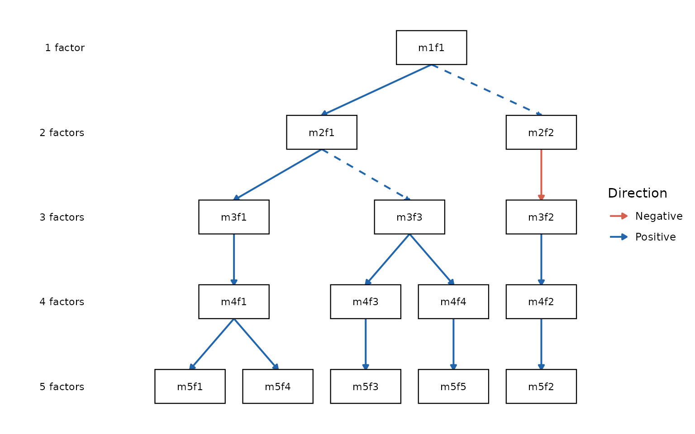

## Legend

### `legend = FALSE` — suppress all guides

`legend = FALSE` removes all legends from the plot. Most useful when the
diagram is self-explanatory or the legend duplicates information
conveyed by labels.

``` r

autoplot(x, legend = FALSE)
```

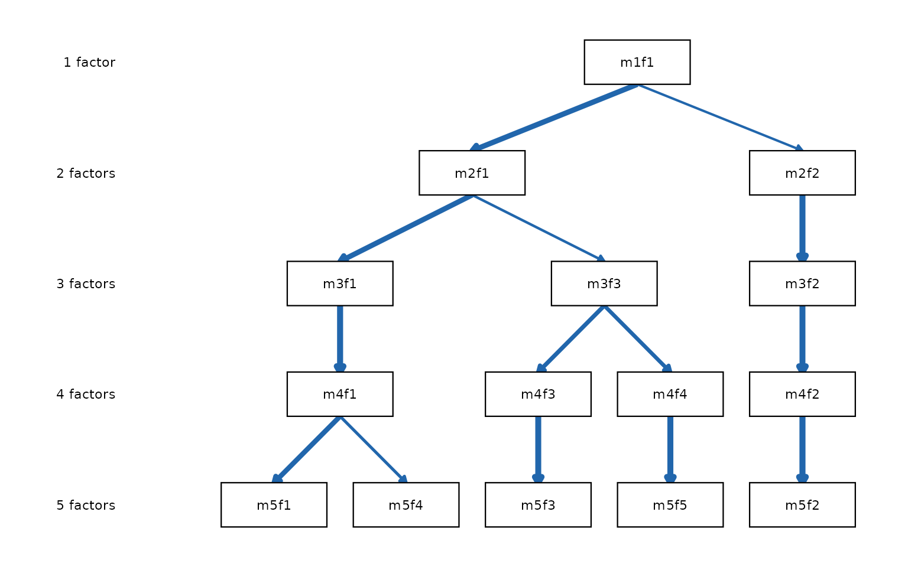

## Worked example: publication-ready figure

The following call reproduces the visual style of Forbes (2023): black
lines of uniform weight, plain line ends, correlation labels, and no
legend. It uses colour mode (not `mono`) so that the dashing retains its
`cut_strong` weak/secondary-connection semantics.

``` r

autoplot(x,
  color_pos      = "black",
  color_neg      = "black",
  edge_linewidth = 0.6,
  show_arrows    = FALSE,
  show_r         = TRUE,
  legend         = FALSE
)
```

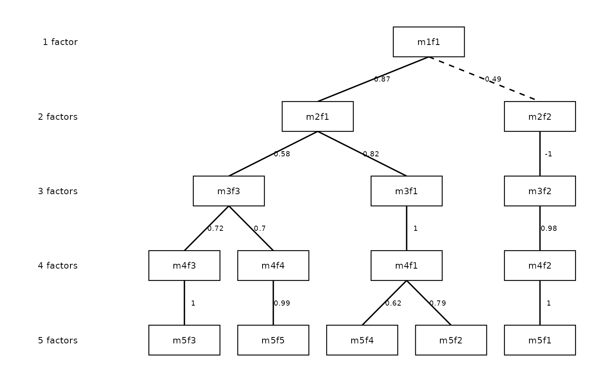

Combining with `node_labels` names the factors for the final figure:

``` r

autoplot(x,
  color_pos = "black",
  color_neg = "black",
  edge_linewidth = 0.6,
  show_arrows = FALSE,
  show_r = TRUE,
  legend = FALSE,
  node_labels = c(
    m5f1 = "Neuro.",
    m5f2 = "Extra.",
    m5f3 = "Consc.",
    m5f4 = "Agree.",
    m5f5 = "Open."
  )
)
```


For the pruned-factor variant of this figure (nodes omitted, spanning
arrows) see
[`vignette("ackwards-forbes")`](https://jmgirard.github.io/ackwards/articles/ackwards-forbes.md).

------------------------------------------------------------------------

## Diagnostic scree / criteria plot: `autoplot.suggest_k()`

[`suggest_k()`](https://jmgirard.github.io/ackwards/reference/suggest_k.md)
returns a multi-criterion object that has its own
[`autoplot()`](https://jmgirard.github.io/ackwards/reference/autoplot.md)
method. It produces a three-panel ggplot2 diagnostic:

- **Scree / Parallel Analysis** — observed PC eigenvalues vs. the PA-PC
  and PA-FA simulated thresholds (95th percentile from random data).
- **MAP (minimize)** — Velicer’s MAP criterion; a star marks the optimal
  k.
- **VSS (maximize)** — VSS-1 and VSS-2 fit curves; stars mark each
  optimum.

If `EFAtools` is installed and
[`EFAtools::CD()`](https://rdrr.io/pkg/EFAtools/man/CD.html) ran
successfully, a dotted vertical line in the MAP panel indicates the
CD-suggested k.

``` r

sk <- suggest_k(bfi, seed = 42)
#> ℹ Running parallel analysis (20 iterations, PC + FA)...
#> ✔ Running parallel analysis (20 iterations, PC + FA)... [260ms]
#> 
#> ℹ Running MAP and VSS...
#> ✔ Running MAP and VSS... [170ms]
#> 
#> ℹ Running Comparison Data (CD)...
#> ✔ Running Comparison Data (CD)... [10.7s]
#> 
autoplot(sk)
```

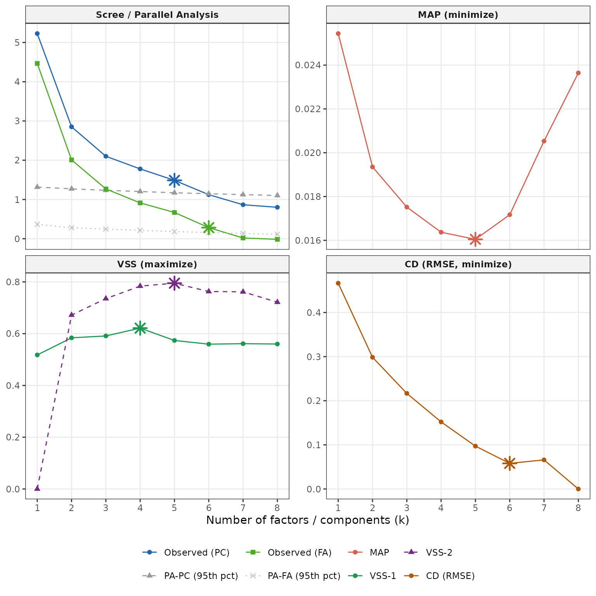

Star-shaped markers (shape 8) identify the recommended k for each
criterion. Use the consensus range across all panels — if they converge
on the same k, that is strong evidence; if they spread over 2–3 values,
fit the hierarchy at a few depths and compare interpretability.
