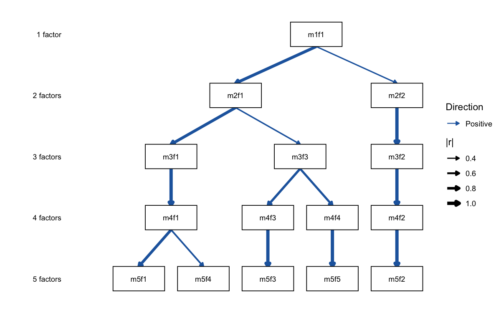

# ackwards

[](https://github.com/jmgirard/ackwards/actions/workflows/R-CMD-check.yaml)
[](https://app.codecov.io/gh/jmgirard/ackwards?branch=master)
[](https://lifecycle.r-lib.org/articles/stages.html#experimental)
[](https://opensource.org/licenses/MIT)

> Bass-ackwards hierarchical structural analysis in R

**ackwards** implements Goldberg’s (2006) bass-ackwards method and its
modern extensions for mapping the hierarchical structure of multivariate
data.

The core insight is simple: instead of asking *how many* factors best
describe your data, ask *how the solutions at different levels of
resolution are related to one another*. A 1-factor solution captures the
broadest shared variance; a 5-factor solution captures narrower, more
specific dimensions. Bass-ackwards analysis traces how broad factors
split into narrow ones — and which narrow factors are redundant
re-combinations of broader ones.

The package supports three extraction engines (PCA, EFA, ESEM),
polychoric correlations for ordinal data, and Forbes’s (2023) extension
that reveals skip-level connections and flags redundant or artifactual
factors.

## Installation

``` r

# install.packages("pak")
pak::pak("jmgirard/ackwards")
```

## Quick start

We use `bfi25`, the built-in 25-item Big Five example dataset (see
[`?bfi25`](https://jmgirard.github.io/ackwards/reference/bfi25.md) for
provenance). Because BFI items are recorded on a 6-point ordinal scale,
we set `cor = "polychoric"`.

### Step 1 — Suggest a range of k

[`suggest_k()`](https://jmgirard.github.io/ackwards/reference/suggest_k.md)
runs five complementary criteria — two forms of parallel analysis (PC
and FA basis), MAP, VSS, and optionally Comparison Data — to help you
choose an upper bound for the hierarchy depth.

``` r

library(ackwards)

bfi <- na.omit(bfi25)
sk <- suggest_k(bfi)
#> ℹ Running parallel analysis (20 iterations, PC + FA)...
#> ✔ Running parallel analysis (20 iterations, PC + FA)... [200ms]
#> 
#> ℹ Running MAP and VSS...
#> ✔ Running MAP and VSS... [178ms]
#> 
#> ℹ Running Comparison Data (CD)...
#> ✔ Running Comparison Data (CD)... [4s]
#> 
sk
#> 
#> ── Factor / Component Count Suggestion (ackwards) ──────────────────────────────
#> Variables: 25
#> n: 875
#> Basis: pearson
#> Tested k: 1-8
#> 
#> ── Criteria (k = 1-8) ──
#> 
#> k = 1: PA-PC ✔ PA-FA ✔ MAP 0.0254 VSS-1 0.5178 VSS-2 0.0000 CD ✔
#> k = 2: PA-PC ✔ PA-FA ✔ MAP 0.0194 VSS-1 0.5839 VSS-2 0.6719 CD ✔
#> k = 3: PA-PC ✔ PA-FA ✔ MAP 0.0175 VSS-1 0.5913 VSS-2 0.7354 CD ✔
#> k = 4: PA-PC ✔ PA-FA ✔ MAP 0.0164 VSS-1 0.6215* VSS-2 0.7837 CD ✔
#> k = 5: PA-PC ✔ PA-FA ✔ MAP 0.0160* VSS-1 0.5738 VSS-2 0.7950* CD ✔
#> k = 6: PA-PC - PA-FA ✔ MAP 0.0172 VSS-1 0.5594 VSS-2 0.7629 CD ✔*
#> k = 7: PA-PC - PA-FA - MAP 0.0205 VSS-1 0.5613 VSS-2 0.7616 CD -
#> k = 8: PA-PC - PA-FA - MAP 0.0236 VSS-1 0.5600 VSS-2 0.7215 CD -
#> 
#> ── Recommendations ──
#> 
#> • PA-PC: k <= 5
#> • PA-FA: k <= 6
#> • MAP: k = 5
#> • VSS-1: k = 4
#> • VSS-2: k = 5
#> • CD: k = 6
#> Consensus range: k = 4-6
#> ────────────────────────────────────────────────────────────────────────────────
#> Note: k_max in ackwards() is a maximum depth. Setting k_max one or two levels
#> above the consensus to observe factor fragmentation is intentional.
#> Caution: PA-PC tends to overextract; structures may not replicate (Forbes,
#> 2023). PA-FA and CD are more conservative. Use the range.
```

The criteria converge on a consensus range that covers k = 5, consistent
with the known Big Five structure of this instrument.

### Step 2 — Fit the hierarchy

[`ackwards()`](https://jmgirard.github.io/ackwards/reference/ackwards.md)
fits factor models at every level from 1 to `k_max` and computes the
between-level factor-score correlations that define the hierarchy.

``` r

x <- ackwards(bfi, k_max = 5, cor = "polychoric")
x
#> 
#> ── Bass-Ackwards Analysis (ackwards) ───────────────────────────────────────────
#> Engine: pca
#> Rotation: varimax
#> Basis: polychoric
#> n: 875
#> k (max): 5
#> 
#> ── Levels ──
#> 
#> ✔ k = 1: 1 factor, 23.2% variance
#> ✔ k = 2: 2 factors, 35.5% variance
#> ✔ k = 3: 3 factors, 44.6% variance
#> ✔ k = 4: 4 factors, 52.2% variance
#> ✔ k = 5: 5 factors, 58.4% variance
#> 
#> ── Edges ──
#> 
#> 14 of 40 edges have |r| ≥ 0.3
#> ────────────────────────────────────────────────────────────────────────────────
#> Note: This is a series of linked solutions, not a fitted hierarchical model.
#> Cross-level edges are descriptive score correlations. Per-level fit indices
#> (EFA/ESEM) describe how well a k-factor model fits the items at that level --
#> they do not validate the edges or the hierarchy itself.
```

### Step 3 — Visualize

[`autoplot()`](https://jmgirard.github.io/ackwards/reference/autoplot.md)
draws the hierarchical diagram. Each row is a level (k = 1 at top, k = 5
at bottom); arrows show which narrow factors inherit from which broad
factor. Arrow **thickness** encodes \|r\| and arrow **color** encodes
direction (blue = positive, red = negative), each with its own legend.
Primary-parent edges are always positive after sign alignment, so a red
arrow marks a genuine secondary (cross-branch) relationship. Pass
`direction = "horizontal"` for a left-to-right layout.

``` r

autoplot(x)
```



The five-factor level cleanly splits into the Big Five. The single broad
factor at k = 1 (roughly *general positive character*) differentiates
first into positive vs. negative affect (k = 2), then into successively
narrower traits.

### Step 4 — Inspect and score

[`tidy()`](https://generics.r-lib.org/reference/tidy.html) extracts any
part of the object into a tidy data frame;
[`augment()`](https://generics.r-lib.org/reference/augment.html) appends
factor scores to your data for downstream analysis.

``` r

# Eight strongest adjacent-level primary edges
edges <- tidy(x, what = "edges", sort = "strength")
head(edges[edges$is_primary, c("from", "to", "r")], 8)
#>   from   to         r
#> 1 m4f2 m5f2 0.9984791
#> 2 m3f1 m4f1 0.9938371
#> 3 m4f4 m5f5 0.9894063
#> 4 m2f2 m3f2 0.9873651
#> 5 m4f3 m5f3 0.9824895
#> 6 m3f2 m4f2 0.9761484
#> 7 m1f1 m2f1 0.8900522
#> 8 m2f1 m3f1 0.8740850
```

``` r

# Append scores for all 5 levels to the original data frame
scored <- augment(x, data = bfi)
#> Warning: ! Factor scores are standardized using model-implied SDs from a "polychoric"
#>   correlation matrix.
#> ℹ The raw projection uses `.standardize(data)` (Pearson z-scores), but
#>   `score_var` comes from the "polychoric" R.
#> ℹ Empirical score SDs will differ from 1.0. For non-Pearson analyses,
#>   between-level edges from `tidy()` are the authoritative associations.
#> This warning is displayed once per session.
dim(scored) # original 25 items + 1+2+3+4+5 = 15 score columns
#> [1] 875  40
names(scored)[26:40]
#>  [1] ".m1f1" ".m2f1" ".m2f2" ".m3f1" ".m3f2" ".m3f3" ".m4f1" ".m4f2" ".m4f3"
#> [10] ".m4f4" ".m5f1" ".m5f2" ".m5f3" ".m5f4" ".m5f5"
```

## Learn more

| Vignette | Topic |
|----|----|
| [Introduction](https://jmgirard.github.io/ackwards/articles/ackwards-intro.html) | Full PCA walkthrough: `suggest_k` → `ackwards` → inspect → plot → score |
| [Choosing k](https://jmgirard.github.io/ackwards/articles/ackwards-suggest-k.html) | Five criteria explained: pros/cons, bias direction, engine pairing |
| [Engines & rotation](https://jmgirard.github.io/ackwards/articles/ackwards-engines.html) | When to choose EFA or ESEM over PCA; convergence and loading comparison |
| [Ordinal data](https://jmgirard.github.io/ackwards/articles/ackwards-ordinal.html) | Polychoric correlations, attenuation bias, and WLSMV estimation |
| [Forbes extension](https://jmgirard.github.io/ackwards/articles/ackwards-forbes.html) | Skip-level edges, redundancy pruning, `pairs = "all"` |
| [Visualization](https://jmgirard.github.io/ackwards/articles/ackwards-visualization.html) | Styling [`autoplot()`](https://jmgirard.github.io/ackwards/reference/autoplot.md): sign/magnitude encoding, layout orientation, labels, publication figures |
| [Interpreting & labeling](https://jmgirard.github.io/ackwards/articles/ackwards-interpret.html) | [`top_items()`](https://jmgirard.github.io/ackwards/reference/top_items.md), hierarchy-aware naming, [`label_template()`](https://jmgirard.github.io/ackwards/reference/label_template.md) round-trip |

## Citation

If you use **ackwards** in your research, please cite the package:

``` r

citation("ackwards")
#> To cite package 'ackwards' in publications use:
#> 
#>   Girard J (2026). _ackwards: Bass-Ackwards Hierarchical Structural
#>   Analysis_. R package version 0.1.0,
#>   <https://github.com/jmgirard/ackwards>.
#> 
#> A BibTeX entry for LaTeX users is
#> 
#>   @Manual{,
#>     title = {ackwards: Bass-Ackwards Hierarchical Structural Analysis},
#>     author = {Jeffrey M. Girard},
#>     year = {2026},
#>     note = {R package version 0.1.0},
#>     url = {https://github.com/jmgirard/ackwards},
#>   }
```

Please also cite the relevant method paper(s): Goldberg (2006)
<https://doi.org/10.1016/j.jrp.2006.01.001> for the bass-ackwards method
itself; Waller (2007) <https://doi.org/10.1016/j.jrp.2006.08.005> if you
rely on the exact `W'RW` edge algebra; and Forbes (2023)
<https://doi.org/10.1037/met0000546> if you use the extended method
(`pairs = "all"`, redundancy/artifact pruning).
