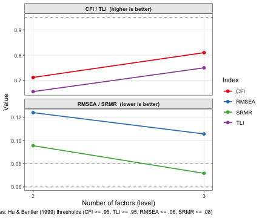

**ackwards** supports three factor extraction engines. They share the same
downstream machinery — the same rotation, the same tenBerge scoring weights, the
same between-level correlation algebra — but differ in their statistical model
and what they report. This vignette explains when each one is appropriate and
what the differences look like in practice.

## The three engines at a glance

| | `"pca"` | `"efa"` | `"esem"` |
|-|---------|---------|----------|
| **What it models** | Total item variance | Common (latent) variance | Common (latent) variance |
| **Engine substrate** | `psych::principal()` | `psych::fa()` | `lavaan` |
| **Communalities** | All 1.0 (by definition) | Estimated from data | Estimated from data |
| **Correlations** | Pearson or polychoric | Pearson or polychoric | Pearson or polychoric |
| **Estimators** | Eigen-decomposition | `minres` (OLS), `ml`, or `pa` — via `psych`'s `fm=` | ML, MLR — continuous (+ FIML for missing data); WLSMV, ULSMV — ordinal |
| **Fit indices** | Eigenvalues only | χ², RMSEA, TLI, BIC | CFI, TLI, RMSEA, SRMR, χ² |
| **Loading SEs** | No | No | Yes |
| **Speed** | Fast | Moderate | Slowest |
| **Best for** | Exploration, large k | Latent-factor inference | Model evaluation, loading SEs, ordinal *or* continuous |

All three produce the same labels (`m{k}f{j}`), the same `tidy()` / `glance()`
/ `augment()` interface, and comparable between-level edges for well-structured
data. The hierarchy they reveal is usually the same; the statistical guarantees
differ.

## Setup


``` r
library(ackwards)
bfi <- na.omit(bfi25)
```

We use the BFI-25 with polychoric correlations throughout so that differences in
output reflect the engine, not the correlation basis.

## PCA: components from total variance

PCA extracts **principal components** — linear combinations of the observed
variables that capture maximum variance, including measurement error. Every item
is modeled with communality 1.0: the components account for 100% of each item's
variance. This is not a true latent variable model; it is a data reduction
method.

In the bass-ackwards context, PCA is the natural default. It is fast, always
converges, and produces eigenvalues that can guide the choice of k. Waller
(2007) showed that the between-level algebra (`W'RW`) holds exactly for
components, making the edges algebraically exact rather than approximated from
materialized scores.


``` r
x_pca <- ackwards(bfi, k_max = 3, cor = "polychoric")
x_pca
#> 
#> ── Bass-Ackwards Analysis (ackwards) ───────────────────────────────────────────
#> Engine: pca
#> Rotation: varimax
#> Basis: polychoric
#> n: 875
#> k (max): 3
#> 
#> ── Levels ──
#> 
#> ✔ k = 1: 1 factor, 23.2% variance
#> ✔ k = 2: 2 factors, 35.5% variance
#> ✔ k = 3: 3 factors, 44.6% variance
#> 
#> ── Edges ──
#> 
#> 5 of 8 edges have |r| ≥ 0.3
#> ────────────────────────────────────────────────────────────────────────────────
#> Note: This is a series of linked solutions, not a fitted hierarchical model.
#> Cross-level edges are descriptive score correlations. Per-level fit indices
#> (EFA/ESEM) describe how well a k-factor model fits the items at that level --
#> they do not validate the edges or the hierarchy itself.
```

The "fit" for PCA is just the eigenvalue of each component — the amount of
variance it captures. There are no chi-square tests, no RMSEA, no model
rejection.


``` r
tidy(x_pca, what = "fit")
#>   level       statistic    value
#> 1     1 eigenvalue.m1f1 5.802803
#> 2     2 eigenvalue.m2f1 5.802803
#> 3     2 eigenvalue.m2f2 3.067627
#> 4     3 eigenvalue.m3f1 5.802803
#> 5     3 eigenvalue.m3f2 3.067627
#> 6     3 eigenvalue.m3f3 2.275419
```

## EFA: factors from common variance

EFA extracts **latent factors** that model only the variance shared among items.
Each item retains a unique variance (communality < 1.0) that the factors do not
explain. This is the classical common-factor model, and it is more appropriate
than PCA when you believe the items are fallible indicators of latent constructs
rather than the constructs themselves.


``` r
x_efa <- ackwards(bfi, k_max = 3, engine = "efa", cor = "polychoric")
x_efa
#> 
#> ── Bass-Ackwards Analysis (ackwards) ───────────────────────────────────────────
#> Engine: efa
#> Rotation: varimax
#> Basis: polychoric
#> n: 875
#> k (max): 3
#> 
#> ── Levels ──
#> 
#> ✔ k = 1: 1 factor, 20.3% variance
#> ✔ k = 2: 2 factors, 30.8% variance
#> ✔ k = 3: 3 factors, 37.7% variance
#> 
#> ── Edges ──
#> 
#> 5 of 8 edges have |r| ≥ 0.3
#> ────────────────────────────────────────────────────────────────────────────────
#> Note: This is a series of linked solutions, not a fitted hierarchical model.
#> Cross-level edges are descriptive score correlations. Per-level fit indices
#> (EFA/ESEM) describe how well a k-factor model fits the items at that level --
#> they do not validate the edges or the hierarchy itself.
```

EFA produces genuine goodness-of-fit indices. These tell you whether the k
factors are sufficient to reproduce the observed correlation matrix within
sampling error.


``` r
tidy(x_efa, what = "fit")
#>    level statistic        value
#> 1      1       chi 5327.2295200
#> 2      1       dof  275.0000000
#> 3      1   p_value    0.0000000
#> 4      1     RMSEA    0.1448964
#> 5      1       TLI    0.3429279
#> 6      1       BIC 3464.3179512
#> 7      2       chi 3520.3788570
#> 8      2       dof  251.0000000
#> 9      2   p_value    0.0000000
#> 10     2     RMSEA    0.1220036
#> 11     2       TLI    0.5337688
#> 12     2       BIC 1820.0486615
#> 13     3       chi 2545.6948352
#> 14     3       dof  228.0000000
#> 15     3   p_value    0.0000000
#> 16     3     RMSEA    0.1077785
#> 17     3       TLI    0.6358514
#> 18     3       BIC 1001.1717891
```

The RMSEA values here are large (> 0.10), indicating that 1–3 factors do not
fully account for the BFI item correlations — unsurprising, because the true
structure is 5 factors. Fit improves steadily from k = 1 to k = 3, which is
exactly the kind of evidence bass-ackwards analysis is designed to make visible.

### How close are EFA and PCA loadings?

For clean, continuous data with moderate-to-strong factor structure, EFA and
PCA loadings are highly correlated but not identical. EFA loadings are
systematically somewhat smaller because they model only the common variance;
PCA inflates loadings by fitting noise alongside signal.

The table below compares primary loadings — the loading of each item on its
dominant factor — for six representative items (two each from the Neuroticism,
Extraversion, and Conscientiousness families) at k = 3. The Δ column is the
teaching point: how much smaller EFA loadings are in absolute value once
measurement error is partitioned into uniqueness. Using |EFA| − |PCA| keeps
the attenuation consistently negative regardless of loading sign.

<!--html_preserve--><div id="buhkjvooni" style="padding-left:0px;padding-right:0px;padding-top:10px;padding-bottom:10px;overflow-x:auto;overflow-y:auto;width:auto;height:auto;">
<style>#buhkjvooni table {
  font-family: system-ui, 'Segoe UI', Roboto, Helvetica, Arial, sans-serif, 'Apple Color Emoji', 'Segoe UI Emoji', 'Segoe UI Symbol', 'Noto Color Emoji';
  -webkit-font-smoothing: antialiased;
  -moz-osx-font-smoothing: grayscale;
}

#buhkjvooni thead, #buhkjvooni tbody, #buhkjvooni tfoot, #buhkjvooni tr, #buhkjvooni td, #buhkjvooni th {
  border-style: none;
}

#buhkjvooni p {
  margin: 0;
  padding: 0;
}

#buhkjvooni .gt_table {
  display: table;
  border-collapse: collapse;
  line-height: normal;
  margin-left: auto;
  margin-right: auto;
  color: #333333;
  font-size: 16px;
  font-weight: normal;
  font-style: normal;
  background-color: #FFFFFF;
  width: auto;
  border-top-style: solid;
  border-top-width: 2px;
  border-top-color: #A8A8A8;
  border-right-style: none;
  border-right-width: 2px;
  border-right-color: #D3D3D3;
  border-bottom-style: solid;
  border-bottom-width: 2px;
  border-bottom-color: #A8A8A8;
  border-left-style: none;
  border-left-width: 2px;
  border-left-color: #D3D3D3;
}

#buhkjvooni .gt_caption {
  padding-top: 4px;
  padding-bottom: 4px;
}

#buhkjvooni .gt_title {
  color: #333333;
  font-size: 125%;
  font-weight: initial;
  padding-top: 4px;
  padding-bottom: 4px;
  padding-left: 5px;
  padding-right: 5px;
  border-bottom-color: #FFFFFF;
  border-bottom-width: 0;
}

#buhkjvooni .gt_subtitle {
  color: #333333;
  font-size: 85%;
  font-weight: initial;
  padding-top: 3px;
  padding-bottom: 5px;
  padding-left: 5px;
  padding-right: 5px;
  border-top-color: #FFFFFF;
  border-top-width: 0;
}

#buhkjvooni .gt_heading {
  background-color: #FFFFFF;
  text-align: center;
  border-bottom-color: #FFFFFF;
  border-left-style: none;
  border-left-width: 1px;
  border-left-color: #D3D3D3;
  border-right-style: none;
  border-right-width: 1px;
  border-right-color: #D3D3D3;
}

#buhkjvooni .gt_bottom_border {
  border-bottom-style: solid;
  border-bottom-width: 2px;
  border-bottom-color: #D3D3D3;
}

#buhkjvooni .gt_col_headings {
  border-top-style: solid;
  border-top-width: 2px;
  border-top-color: #D3D3D3;
  border-bottom-style: solid;
  border-bottom-width: 2px;
  border-bottom-color: #D3D3D3;
  border-left-style: none;
  border-left-width: 1px;
  border-left-color: #D3D3D3;
  border-right-style: none;
  border-right-width: 1px;
  border-right-color: #D3D3D3;
}

#buhkjvooni .gt_col_heading {
  color: #333333;
  background-color: #FFFFFF;
  font-size: 100%;
  font-weight: normal;
  text-transform: inherit;
  border-left-style: none;
  border-left-width: 1px;
  border-left-color: #D3D3D3;
  border-right-style: none;
  border-right-width: 1px;
  border-right-color: #D3D3D3;
  vertical-align: bottom;
  padding-top: 5px;
  padding-bottom: 6px;
  padding-left: 5px;
  padding-right: 5px;
  overflow-x: hidden;
}

#buhkjvooni .gt_column_spanner_outer {
  color: #333333;
  background-color: #FFFFFF;
  font-size: 100%;
  font-weight: normal;
  text-transform: inherit;
  padding-top: 0;
  padding-bottom: 0;
  padding-left: 4px;
  padding-right: 4px;
}

#buhkjvooni .gt_column_spanner_outer:first-child {
  padding-left: 0;
}

#buhkjvooni .gt_column_spanner_outer:last-child {
  padding-right: 0;
}

#buhkjvooni .gt_column_spanner {
  border-bottom-style: solid;
  border-bottom-width: 2px;
  border-bottom-color: #D3D3D3;
  vertical-align: bottom;
  padding-top: 5px;
  padding-bottom: 5px;
  overflow-x: hidden;
  display: inline-block;
  width: 100%;
}

#buhkjvooni .gt_spanner_row {
  border-bottom-style: hidden;
}

#buhkjvooni .gt_group_heading {
  padding-top: 8px;
  padding-bottom: 8px;
  padding-left: 5px;
  padding-right: 5px;
  color: #333333;
  background-color: #FFFFFF;
  font-size: 100%;
  font-weight: initial;
  text-transform: inherit;
  border-top-style: solid;
  border-top-width: 2px;
  border-top-color: #D3D3D3;
  border-bottom-style: solid;
  border-bottom-width: 2px;
  border-bottom-color: #D3D3D3;
  border-left-style: none;
  border-left-width: 1px;
  border-left-color: #D3D3D3;
  border-right-style: none;
  border-right-width: 1px;
  border-right-color: #D3D3D3;
  vertical-align: middle;
  text-align: left;
}

#buhkjvooni .gt_empty_group_heading {
  padding: 0.5px;
  color: #333333;
  background-color: #FFFFFF;
  font-size: 100%;
  font-weight: initial;
  border-top-style: solid;
  border-top-width: 2px;
  border-top-color: #D3D3D3;
  border-bottom-style: solid;
  border-bottom-width: 2px;
  border-bottom-color: #D3D3D3;
  vertical-align: middle;
}

#buhkjvooni .gt_from_md > :first-child {
  margin-top: 0;
}

#buhkjvooni .gt_from_md > :last-child {
  margin-bottom: 0;
}

#buhkjvooni .gt_row {
  padding-top: 8px;
  padding-bottom: 8px;
  padding-left: 5px;
  padding-right: 5px;
  margin: 10px;
  border-top-style: solid;
  border-top-width: 1px;
  border-top-color: #D3D3D3;
  border-left-style: none;
  border-left-width: 1px;
  border-left-color: #D3D3D3;
  border-right-style: none;
  border-right-width: 1px;
  border-right-color: #D3D3D3;
  vertical-align: middle;
  overflow-x: hidden;
}

#buhkjvooni .gt_stub {
  color: #333333;
  background-color: #FFFFFF;
  font-size: 100%;
  font-weight: initial;
  text-transform: inherit;
  border-right-style: solid;
  border-right-width: 2px;
  border-right-color: #D3D3D3;
  padding-left: 5px;
  padding-right: 5px;
}

#buhkjvooni .gt_stub_row_group {
  color: #333333;
  background-color: #FFFFFF;
  font-size: 100%;
  font-weight: initial;
  text-transform: inherit;
  border-right-style: solid;
  border-right-width: 2px;
  border-right-color: #D3D3D3;
  padding-left: 5px;
  padding-right: 5px;
  vertical-align: top;
}

#buhkjvooni .gt_row_group_first td {
  border-top-width: 2px;
}

#buhkjvooni .gt_row_group_first th {
  border-top-width: 2px;
}

#buhkjvooni .gt_summary_row {
  color: #333333;
  background-color: #FFFFFF;
  text-transform: inherit;
  padding-top: 8px;
  padding-bottom: 8px;
  padding-left: 5px;
  padding-right: 5px;
}

#buhkjvooni .gt_first_summary_row {
  border-top-style: solid;
  border-top-color: #D3D3D3;
}

#buhkjvooni .gt_first_summary_row.thick {
  border-top-width: 2px;
}

#buhkjvooni .gt_last_summary_row {
  padding-top: 8px;
  padding-bottom: 8px;
  padding-left: 5px;
  padding-right: 5px;
  border-bottom-style: solid;
  border-bottom-width: 2px;
  border-bottom-color: #D3D3D3;
}

#buhkjvooni .gt_grand_summary_row {
  color: #333333;
  background-color: #FFFFFF;
  text-transform: inherit;
  padding-top: 8px;
  padding-bottom: 8px;
  padding-left: 5px;
  padding-right: 5px;
}

#buhkjvooni .gt_first_grand_summary_row {
  padding-top: 8px;
  padding-bottom: 8px;
  padding-left: 5px;
  padding-right: 5px;
  border-top-style: double;
  border-top-width: 6px;
  border-top-color: #D3D3D3;
}

#buhkjvooni .gt_last_grand_summary_row_top {
  padding-top: 8px;
  padding-bottom: 8px;
  padding-left: 5px;
  padding-right: 5px;
  border-bottom-style: double;
  border-bottom-width: 6px;
  border-bottom-color: #D3D3D3;
}

#buhkjvooni .gt_striped {
  background-color: rgba(128, 128, 128, 0.05);
}

#buhkjvooni .gt_table_body {
  border-top-style: solid;
  border-top-width: 2px;
  border-top-color: #D3D3D3;
  border-bottom-style: solid;
  border-bottom-width: 2px;
  border-bottom-color: #D3D3D3;
}

#buhkjvooni .gt_footnotes {
  color: #333333;
  background-color: #FFFFFF;
  border-bottom-style: none;
  border-bottom-width: 2px;
  border-bottom-color: #D3D3D3;
  border-left-style: none;
  border-left-width: 2px;
  border-left-color: #D3D3D3;
  border-right-style: none;
  border-right-width: 2px;
  border-right-color: #D3D3D3;
}

#buhkjvooni .gt_footnote {
  margin: 0px;
  font-size: 90%;
  padding-top: 4px;
  padding-bottom: 4px;
  padding-left: 5px;
  padding-right: 5px;
}

#buhkjvooni .gt_sourcenotes {
  color: #333333;
  background-color: #FFFFFF;
  border-bottom-style: none;
  border-bottom-width: 2px;
  border-bottom-color: #D3D3D3;
  border-left-style: none;
  border-left-width: 2px;
  border-left-color: #D3D3D3;
  border-right-style: none;
  border-right-width: 2px;
  border-right-color: #D3D3D3;
}

#buhkjvooni .gt_sourcenote {
  font-size: 90%;
  padding-top: 4px;
  padding-bottom: 4px;
  padding-left: 5px;
  padding-right: 5px;
}

#buhkjvooni .gt_left {
  text-align: left;
}

#buhkjvooni .gt_center {
  text-align: center;
}

#buhkjvooni .gt_right {
  text-align: right;
  font-variant-numeric: tabular-nums;
}

#buhkjvooni .gt_font_normal {
  font-weight: normal;
}

#buhkjvooni .gt_font_bold {
  font-weight: bold;
}

#buhkjvooni .gt_font_italic {
  font-style: italic;
}

#buhkjvooni .gt_super {
  font-size: 65%;
}

#buhkjvooni .gt_footnote_marks {
  font-size: 75%;
  vertical-align: 0.4em;
  position: initial;
}

#buhkjvooni .gt_asterisk {
  font-size: 100%;
  vertical-align: 0;
}

#buhkjvooni .gt_indent_1 {
  text-indent: 5px;
}

#buhkjvooni .gt_indent_2 {
  text-indent: 10px;
}

#buhkjvooni .gt_indent_3 {
  text-indent: 15px;
}

#buhkjvooni .gt_indent_4 {
  text-indent: 20px;
}

#buhkjvooni .gt_indent_5 {
  text-indent: 25px;
}

#buhkjvooni .katex-display {
  display: inline-flex !important;
  margin-bottom: 0.75em !important;
}

#buhkjvooni div.Reactable > div.rt-table > div.rt-thead > div.rt-tr.rt-tr-group-header > div.rt-th-group:after {
  height: 0px !important;
}
</style>
<table class="gt_table" data-quarto-disable-processing="false" data-quarto-bootstrap="false">
  <thead>
    <tr class="gt_heading">
      <td colspan="5" class="gt_heading gt_title gt_font_normal gt_bottom_border" style>PCA vs EFA: primary loadings for anchor items (k = 3)</td>
    </tr>
    
    <tr class="gt_col_headings gt_spanner_row">
      <th class="gt_col_heading gt_columns_bottom_border gt_left" rowspan="2" colspan="1" scope="col" id="item">Item</th>
      <th class="gt_col_heading gt_columns_bottom_border gt_left" rowspan="2" colspan="1" scope="col" id="factor">Factor</th>
      <th class="gt_center gt_columns_top_border gt_column_spanner_outer" rowspan="1" colspan="3" scope="colgroup" id="Loading">
        <div class="gt_column_spanner">Loading</div>
      </th>
    </tr>
    <tr class="gt_col_headings">
      <th class="gt_col_heading gt_columns_bottom_border gt_right" rowspan="1" colspan="1" scope="col" id="loading_pca">PCA</th>
      <th class="gt_col_heading gt_columns_bottom_border gt_right" rowspan="1" colspan="1" scope="col" id="loading_efa">EFA</th>
      <th class="gt_col_heading gt_columns_bottom_border gt_right" rowspan="1" colspan="1" style="font-weight: bold;" scope="col" id="delta">Δ (|EFA| − |PCA|)<span class="gt_footnote_marks" style="white-space:nowrap;font-style:italic;font-weight:normal;line-height:0;"><sup>1</sup></span></th>
    </tr>
  </thead>
  <tbody class="gt_table_body">
    <tr><td headers="item" class="gt_row gt_left">E1</td>
<td headers="factor" class="gt_row gt_left">m3f1</td>
<td headers="loading_pca" class="gt_row gt_right">−0.61</td>
<td headers="loading_efa" class="gt_row gt_right">−0.55</td>
<td headers="delta" class="gt_row gt_right">−0.06</td></tr>
    <tr><td headers="item" class="gt_row gt_left">E2</td>
<td headers="factor" class="gt_row gt_left">m3f1</td>
<td headers="loading_pca" class="gt_row gt_right">−0.70</td>
<td headers="loading_efa" class="gt_row gt_right">−0.67</td>
<td headers="delta" class="gt_row gt_right">−0.03</td></tr>
    <tr><td headers="item" class="gt_row gt_left">N1</td>
<td headers="factor" class="gt_row gt_left">m3f2</td>
<td headers="loading_pca" class="gt_row gt_right">−0.78</td>
<td headers="loading_efa" class="gt_row gt_right">−0.75</td>
<td headers="delta" class="gt_row gt_right">−0.03</td></tr>
    <tr><td headers="item" class="gt_row gt_left">N2</td>
<td headers="factor" class="gt_row gt_left">m3f2</td>
<td headers="loading_pca" class="gt_row gt_right">−0.79</td>
<td headers="loading_efa" class="gt_row gt_right">−0.76</td>
<td headers="delta" class="gt_row gt_right">−0.03</td></tr>
    <tr><td headers="item" class="gt_row gt_left">C1</td>
<td headers="factor" class="gt_row gt_left">m3f3</td>
<td headers="loading_pca" class="gt_row gt_right">0.66</td>
<td headers="loading_efa" class="gt_row gt_right">0.62</td>
<td headers="delta" class="gt_row gt_right">−0.04</td></tr>
    <tr><td headers="item" class="gt_row gt_left">C2</td>
<td headers="factor" class="gt_row gt_left">m3f3</td>
<td headers="loading_pca" class="gt_row gt_right">0.64</td>
<td headers="loading_efa" class="gt_row gt_right">0.61</td>
<td headers="delta" class="gt_row gt_right">−0.03</td></tr>
  </tbody>
  <tfoot>
    <tr class="gt_footnotes">
      <td class="gt_footnote" colspan="5"><span class="gt_footnote_marks" style="white-space:nowrap;font-style:italic;font-weight:normal;line-height:0;"><sup>1</sup></span> Factor assignment and sign verified to match between engines. Delta uses |EFA| - |PCA| so attenuation is always negative regardless of loading sign.</td>
    </tr>
  </tfoot>
</table>
</div><!--/html_preserve-->

EFA loadings for the same items are consistently a few points lower — the PCA
loadings include some noise variance that EFA partitions into uniqueness. The
factor structure (which items define which factor) is unchanged.

## ESEM: EFA with full model diagnostics

ESEM (exploratory structural equation modeling, Asparouhov & Muthén, 2009) fits
the same common-factor model as EFA but uses **lavaan** as the engine. ESEM is
not an ordinal-only tool: it handles **continuous** items with maximum-likelihood
estimators (ML, MLR — the default for continuous data) and **ordinal** items with
WLSMV, and it unlocks three capabilities that EFA cannot provide:

1. **Standard errors for every loading**, enabling confidence intervals and
   significance tests — for continuous *and* ordinal data.
2. **Full maximum-likelihood estimation** for continuous data (ML/MLR), including
   **FIML** for missing data (`missing = "fiml"`), which uses all partially
   observed rows rather than deleting them.
3. **The WLSMV estimator** for ordinal data, the appropriate
   maximum-likelihood-adjacent estimator for categorical indicators. When
   `cor = "polychoric"` is set with `engine = "esem"`, WLSMV is used
   automatically.

Those three are the *only* reasons to pay ESEM's cost (a lavaan fit per level,
occasional convergence trouble). EFA is otherwise a first-class reporting
engine: it returns the same loadings, variance, and between-level edges *plus*
per-level RMSEA and TLI — enough to report a hierarchy. Reach for ESEM when you
specifically need loading standard errors (especially at smaller *n*), the
field-standard WLSMV estimator for ordinal indicators, or true FIML for missing
data; otherwise EFA is the simpler, faster choice.


``` r
x_esem <- ackwards(bfi, k_max = 3, engine = "esem", cor = "polychoric")
x_esem
#> 
#> ── Bass-Ackwards Analysis (ackwards) ───────────────────────────────────────────
#> Engine: esem
#> Rotation: varimax
#> Basis: polychoric
#> n: 875
#> k (max): 3
#> 
#> ── Levels ──
#> 
#> ✔ k = 1: 1 factor, 23.5% variance
#> ✔ k = 2: 2 factors, 32.9% variance
#> ✔ k = 3: 3 factors, 39.5% variance
#> 
#> ── Edges ──
#> 
#> 5 of 8 edges have |r| ≥ 0.3
#> ────────────────────────────────────────────────────────────────────────────────
#> Note: This is a series of linked solutions, not a fitted hierarchical model.
#> Cross-level edges are descriptive score correlations. Per-level fit indices
#> (EFA/ESEM) describe how well a k-factor model fits the items at that level --
#> they do not validate the edges or the hierarchy itself.
```

ESEM fit indices include CFI and SRMR in addition to RMSEA and TLI, giving a
richer picture of model adequacy. See the "Per-level fit" section below for how
to report and interpret these indices.

### Loading standard errors and confidence intervals

The unique output from ESEM is the rotation-aware **standard error** of every
loading. These SEs are now returned as part of `tidy(what = "loadings")`,
alongside `ci_lower` and `ci_upper` columns:


``` r
ld <- tidy(x_esem, what = "loadings")
head(ld)
#>   level factor item    loading         se   ci_lower   ci_upper
#> 1     1   m1f1   A1 -0.3155807 0.02831633 -0.3710797 -0.2600817
#> 2     1   m1f1   A2  0.5584169 0.02316777  0.5130089  0.6038249
#> 3     1   m1f1   A3  0.6424786 0.01971862  0.6038308  0.6811264
#> 4     1   m1f1   A4  0.4261675 0.02777029  0.3717387  0.4805962
#> 5     1   m1f1   A5  0.6588505 0.01870826  0.6221830  0.6955180
#> 6     1   m1f1   C1  0.4138252 0.02754885  0.3598304  0.4678200
```

The intervals are computed as loading ± *z* × SE (default 95%; set
`conf_level = 0.99` for wider intervals). With the 875 complete cases
used here the SEs are fairly small; with smaller samples they become important
for judging which loadings are meaningfully non-zero. For PCA and EFA objects the `se`,
`ci_lower`, and `ci_upper` columns are present but `NA` — those engines carry no
loading SEs.

## Per-level fit: what it tells you (and what it doesn't)

### The key distinction

Bass-ackwards produces a **series of independent factor solutions**, not a
fitted hierarchical model. The between-level edges are descriptive correlations
between factor scores — they have no sampling distribution of their own. Per-level
fit indices therefore describe something narrower: **does a k-factor model
adequately reproduce the items at this level?**

That is a real, bounded question. A level that fits terribly is one you
shouldn't over-interpret — the k factors are not cleanly separating the items.
A level that fits well tells you the factor structure at that depth is stable. But
good fit at k = 3 does **not** validate the edges connecting k = 3 to k = 2; it
only says the k = 3 solution itself is trustworthy. Keep that boundary in mind
whenever you report or interpret fit.

The converse question comes up often: *if the k = 3 solution fits badly, should I
distrust the edges connecting k = 2 to k = 3?* The honest answer is nuanced. The
edge correlation is still a **faithful description** of the relationship between
the k = 2 and k = 3 factor scores as extracted — the arithmetic is not wrong. What
poor fit undermines is the **interpretation** of the k = 3 factors themselves: if
three factors don't cleanly reproduce the items, then "factor `m3f2`" is a shakier
construct, and any edge *incident to it* inherits that shakiness. So a badly-fitting
level does weaken the edges touching it — not because the correlation is
miscomputed, but because one of the things it connects is poorly defined. The edges
between two *well*-fitting levels are on firmer ground than edges touching a
poorly-fitting one.

### Reporting fit with `tidy()` and `autoplot()`

`tidy(what = "fit")` returns the raw long table. For reporting, `format = "wide"`
gives one row per level:


``` r
tidy(x_esem, what = "fit", format = "wide")
#>   level      chi dof p_value       CFI       TLI     RMSEA       SRMR BIC
#> 1     2 3616.834 251       0 0.7117569 0.6554864 0.1238665 0.09547997  NA
#> 2     3 2448.356 228       0 0.8098533 0.7498069 0.1055573 0.07172502  NA
```

`tidy()` does not flag rows against a threshold — the Hu & Bentler (1999)
conventional cutoffs (CFI/TLI ≥ .95, RMSEA ≤ .06, SRMR ≤ .08) are conventional
and contested, so a pass/fail column would overstate their authority. Instead
they appear only as visual/inline reference points in `autoplot()` and
`summary()`:

> **Thresholds are conventional and contested.** They were derived from specific
> simulation conditions (continuous, well-distributed items; balanced designs).
> WLSMV fit for ordinal data tends to produce lower CFI and higher RMSEA than ML
> on the same underlying structure; do not interpret WLSMV cutoffs as strictly as
> ML-based rules. Use them as a rough orientation, not a gatekeeping criterion.

`autoplot(x, what = "fit")` visualises the trajectory across levels, with cutoff
reference lines:


``` r
autoplot(x_esem, what = "fit")
```



The shape of the trajectory matters as much as the absolute values: a sharp
improvement from k = 2 to k = 3 suggests the third factor is capturing genuine
signal; flat or worsening indices suggest adding another level is splitting noise.

The examples in this vignette deliberately stop at `k_max = 3` so the ESEM chunks
build quickly and the tables stay legible — not because the BFI hierarchy ends
there. For these data `suggest_k()` points to roughly **k = 5** (see the
`vignette("ackwards-suggest-k")`), so a real analysis would extend the trajectory
further and read the fit curve across all five levels. The truncated plot here
shows the *mechanics* of reading a fit trajectory, not the recommended depth for
the BFI.

`glance()` now also carries the deepest-level fit for quick inspection:


``` r
glance(x_esem)
#>   engine rotation        cor k_max n_obs deepest_converged n_edges       CFI
#> 1   esem  varimax polychoric     3   875                 3       8 0.8098533
#>         TLI     RMSEA       SRMR BIC
#> 1 0.7498069 0.1055573 0.07172502  NA
```

### Should you care about fit in a bass-ackwards workflow?

It depends on your goal:

- **Exploratory** (finding the hierarchical structure): fit is a secondary check.
  Start with PCA for speed, confirm with EFA or ESEM. If a level's fit is poor,
  consider whether you have too many factors at that depth, or whether the items
  at that level are genuinely multidimensional.
- **Confirmatory / publication**: fit is table-stakes for ESEM or EFA. Report
  per-level CFI, TLI, RMSEA (and SRMR for ESEM) alongside the hierarchy. The
  wide table and `autoplot(what = "fit")` are designed for this.
- **Ordinal data**: WLSMV (ESEM) gives fit indices appropriate for categorical
  items; EFA's RMSEA/TLI under Pearson correlation is a rougher diagnostic.

The bottom line: **per-level fit qualifies each level of the hierarchy; it does
not bless the hierarchy as a whole.** Use it to decide how deep the structure is
credibly resolved, not to claim the overall model is "good".

## How much do the edges differ?

The primary output of bass-ackwards analysis is the between-level edges. For
well-structured, continuous data, all three engines should agree closely on the
hierarchy.

The table below compares the primary-parent edge strength for every adjacent
level transition. The Δ column is the shift in connection strength
(|EFA| − |PCA|) — a direct, sign-robust measure of how much the latent-variable
model changes your inference about the hierarchy.

<!--html_preserve--><div id="hlbvbvpjxh" style="padding-left:0px;padding-right:0px;padding-top:10px;padding-bottom:10px;overflow-x:auto;overflow-y:auto;width:auto;height:auto;">
<style>#hlbvbvpjxh table {
  font-family: system-ui, 'Segoe UI', Roboto, Helvetica, Arial, sans-serif, 'Apple Color Emoji', 'Segoe UI Emoji', 'Segoe UI Symbol', 'Noto Color Emoji';
  -webkit-font-smoothing: antialiased;
  -moz-osx-font-smoothing: grayscale;
}

#hlbvbvpjxh thead, #hlbvbvpjxh tbody, #hlbvbvpjxh tfoot, #hlbvbvpjxh tr, #hlbvbvpjxh td, #hlbvbvpjxh th {
  border-style: none;
}

#hlbvbvpjxh p {
  margin: 0;
  padding: 0;
}

#hlbvbvpjxh .gt_table {
  display: table;
  border-collapse: collapse;
  line-height: normal;
  margin-left: auto;
  margin-right: auto;
  color: #333333;
  font-size: 16px;
  font-weight: normal;
  font-style: normal;
  background-color: #FFFFFF;
  width: auto;
  border-top-style: solid;
  border-top-width: 2px;
  border-top-color: #A8A8A8;
  border-right-style: none;
  border-right-width: 2px;
  border-right-color: #D3D3D3;
  border-bottom-style: solid;
  border-bottom-width: 2px;
  border-bottom-color: #A8A8A8;
  border-left-style: none;
  border-left-width: 2px;
  border-left-color: #D3D3D3;
}

#hlbvbvpjxh .gt_caption {
  padding-top: 4px;
  padding-bottom: 4px;
}

#hlbvbvpjxh .gt_title {
  color: #333333;
  font-size: 125%;
  font-weight: initial;
  padding-top: 4px;
  padding-bottom: 4px;
  padding-left: 5px;
  padding-right: 5px;
  border-bottom-color: #FFFFFF;
  border-bottom-width: 0;
}

#hlbvbvpjxh .gt_subtitle {
  color: #333333;
  font-size: 85%;
  font-weight: initial;
  padding-top: 3px;
  padding-bottom: 5px;
  padding-left: 5px;
  padding-right: 5px;
  border-top-color: #FFFFFF;
  border-top-width: 0;
}

#hlbvbvpjxh .gt_heading {
  background-color: #FFFFFF;
  text-align: center;
  border-bottom-color: #FFFFFF;
  border-left-style: none;
  border-left-width: 1px;
  border-left-color: #D3D3D3;
  border-right-style: none;
  border-right-width: 1px;
  border-right-color: #D3D3D3;
}

#hlbvbvpjxh .gt_bottom_border {
  border-bottom-style: solid;
  border-bottom-width: 2px;
  border-bottom-color: #D3D3D3;
}

#hlbvbvpjxh .gt_col_headings {
  border-top-style: solid;
  border-top-width: 2px;
  border-top-color: #D3D3D3;
  border-bottom-style: solid;
  border-bottom-width: 2px;
  border-bottom-color: #D3D3D3;
  border-left-style: none;
  border-left-width: 1px;
  border-left-color: #D3D3D3;
  border-right-style: none;
  border-right-width: 1px;
  border-right-color: #D3D3D3;
}

#hlbvbvpjxh .gt_col_heading {
  color: #333333;
  background-color: #FFFFFF;
  font-size: 100%;
  font-weight: normal;
  text-transform: inherit;
  border-left-style: none;
  border-left-width: 1px;
  border-left-color: #D3D3D3;
  border-right-style: none;
  border-right-width: 1px;
  border-right-color: #D3D3D3;
  vertical-align: bottom;
  padding-top: 5px;
  padding-bottom: 6px;
  padding-left: 5px;
  padding-right: 5px;
  overflow-x: hidden;
}

#hlbvbvpjxh .gt_column_spanner_outer {
  color: #333333;
  background-color: #FFFFFF;
  font-size: 100%;
  font-weight: normal;
  text-transform: inherit;
  padding-top: 0;
  padding-bottom: 0;
  padding-left: 4px;
  padding-right: 4px;
}

#hlbvbvpjxh .gt_column_spanner_outer:first-child {
  padding-left: 0;
}

#hlbvbvpjxh .gt_column_spanner_outer:last-child {
  padding-right: 0;
}

#hlbvbvpjxh .gt_column_spanner {
  border-bottom-style: solid;
  border-bottom-width: 2px;
  border-bottom-color: #D3D3D3;
  vertical-align: bottom;
  padding-top: 5px;
  padding-bottom: 5px;
  overflow-x: hidden;
  display: inline-block;
  width: 100%;
}

#hlbvbvpjxh .gt_spanner_row {
  border-bottom-style: hidden;
}

#hlbvbvpjxh .gt_group_heading {
  padding-top: 8px;
  padding-bottom: 8px;
  padding-left: 5px;
  padding-right: 5px;
  color: #333333;
  background-color: #FFFFFF;
  font-size: 100%;
  font-weight: initial;
  text-transform: inherit;
  border-top-style: solid;
  border-top-width: 2px;
  border-top-color: #D3D3D3;
  border-bottom-style: solid;
  border-bottom-width: 2px;
  border-bottom-color: #D3D3D3;
  border-left-style: none;
  border-left-width: 1px;
  border-left-color: #D3D3D3;
  border-right-style: none;
  border-right-width: 1px;
  border-right-color: #D3D3D3;
  vertical-align: middle;
  text-align: left;
}

#hlbvbvpjxh .gt_empty_group_heading {
  padding: 0.5px;
  color: #333333;
  background-color: #FFFFFF;
  font-size: 100%;
  font-weight: initial;
  border-top-style: solid;
  border-top-width: 2px;
  border-top-color: #D3D3D3;
  border-bottom-style: solid;
  border-bottom-width: 2px;
  border-bottom-color: #D3D3D3;
  vertical-align: middle;
}

#hlbvbvpjxh .gt_from_md > :first-child {
  margin-top: 0;
}

#hlbvbvpjxh .gt_from_md > :last-child {
  margin-bottom: 0;
}

#hlbvbvpjxh .gt_row {
  padding-top: 8px;
  padding-bottom: 8px;
  padding-left: 5px;
  padding-right: 5px;
  margin: 10px;
  border-top-style: solid;
  border-top-width: 1px;
  border-top-color: #D3D3D3;
  border-left-style: none;
  border-left-width: 1px;
  border-left-color: #D3D3D3;
  border-right-style: none;
  border-right-width: 1px;
  border-right-color: #D3D3D3;
  vertical-align: middle;
  overflow-x: hidden;
}

#hlbvbvpjxh .gt_stub {
  color: #333333;
  background-color: #FFFFFF;
  font-size: 100%;
  font-weight: initial;
  text-transform: inherit;
  border-right-style: solid;
  border-right-width: 2px;
  border-right-color: #D3D3D3;
  padding-left: 5px;
  padding-right: 5px;
}

#hlbvbvpjxh .gt_stub_row_group {
  color: #333333;
  background-color: #FFFFFF;
  font-size: 100%;
  font-weight: initial;
  text-transform: inherit;
  border-right-style: solid;
  border-right-width: 2px;
  border-right-color: #D3D3D3;
  padding-left: 5px;
  padding-right: 5px;
  vertical-align: top;
}

#hlbvbvpjxh .gt_row_group_first td {
  border-top-width: 2px;
}

#hlbvbvpjxh .gt_row_group_first th {
  border-top-width: 2px;
}

#hlbvbvpjxh .gt_summary_row {
  color: #333333;
  background-color: #FFFFFF;
  text-transform: inherit;
  padding-top: 8px;
  padding-bottom: 8px;
  padding-left: 5px;
  padding-right: 5px;
}

#hlbvbvpjxh .gt_first_summary_row {
  border-top-style: solid;
  border-top-color: #D3D3D3;
}

#hlbvbvpjxh .gt_first_summary_row.thick {
  border-top-width: 2px;
}

#hlbvbvpjxh .gt_last_summary_row {
  padding-top: 8px;
  padding-bottom: 8px;
  padding-left: 5px;
  padding-right: 5px;
  border-bottom-style: solid;
  border-bottom-width: 2px;
  border-bottom-color: #D3D3D3;
}

#hlbvbvpjxh .gt_grand_summary_row {
  color: #333333;
  background-color: #FFFFFF;
  text-transform: inherit;
  padding-top: 8px;
  padding-bottom: 8px;
  padding-left: 5px;
  padding-right: 5px;
}

#hlbvbvpjxh .gt_first_grand_summary_row {
  padding-top: 8px;
  padding-bottom: 8px;
  padding-left: 5px;
  padding-right: 5px;
  border-top-style: double;
  border-top-width: 6px;
  border-top-color: #D3D3D3;
}

#hlbvbvpjxh .gt_last_grand_summary_row_top {
  padding-top: 8px;
  padding-bottom: 8px;
  padding-left: 5px;
  padding-right: 5px;
  border-bottom-style: double;
  border-bottom-width: 6px;
  border-bottom-color: #D3D3D3;
}

#hlbvbvpjxh .gt_striped {
  background-color: rgba(128, 128, 128, 0.05);
}

#hlbvbvpjxh .gt_table_body {
  border-top-style: solid;
  border-top-width: 2px;
  border-top-color: #D3D3D3;
  border-bottom-style: solid;
  border-bottom-width: 2px;
  border-bottom-color: #D3D3D3;
}

#hlbvbvpjxh .gt_footnotes {
  color: #333333;
  background-color: #FFFFFF;
  border-bottom-style: none;
  border-bottom-width: 2px;
  border-bottom-color: #D3D3D3;
  border-left-style: none;
  border-left-width: 2px;
  border-left-color: #D3D3D3;
  border-right-style: none;
  border-right-width: 2px;
  border-right-color: #D3D3D3;
}

#hlbvbvpjxh .gt_footnote {
  margin: 0px;
  font-size: 90%;
  padding-top: 4px;
  padding-bottom: 4px;
  padding-left: 5px;
  padding-right: 5px;
}

#hlbvbvpjxh .gt_sourcenotes {
  color: #333333;
  background-color: #FFFFFF;
  border-bottom-style: none;
  border-bottom-width: 2px;
  border-bottom-color: #D3D3D3;
  border-left-style: none;
  border-left-width: 2px;
  border-left-color: #D3D3D3;
  border-right-style: none;
  border-right-width: 2px;
  border-right-color: #D3D3D3;
}

#hlbvbvpjxh .gt_sourcenote {
  font-size: 90%;
  padding-top: 4px;
  padding-bottom: 4px;
  padding-left: 5px;
  padding-right: 5px;
}

#hlbvbvpjxh .gt_left {
  text-align: left;
}

#hlbvbvpjxh .gt_center {
  text-align: center;
}

#hlbvbvpjxh .gt_right {
  text-align: right;
  font-variant-numeric: tabular-nums;
}

#hlbvbvpjxh .gt_font_normal {
  font-weight: normal;
}

#hlbvbvpjxh .gt_font_bold {
  font-weight: bold;
}

#hlbvbvpjxh .gt_font_italic {
  font-style: italic;
}

#hlbvbvpjxh .gt_super {
  font-size: 65%;
}

#hlbvbvpjxh .gt_footnote_marks {
  font-size: 75%;
  vertical-align: 0.4em;
  position: initial;
}

#hlbvbvpjxh .gt_asterisk {
  font-size: 100%;
  vertical-align: 0;
}

#hlbvbvpjxh .gt_indent_1 {
  text-indent: 5px;
}

#hlbvbvpjxh .gt_indent_2 {
  text-indent: 10px;
}

#hlbvbvpjxh .gt_indent_3 {
  text-indent: 15px;
}

#hlbvbvpjxh .gt_indent_4 {
  text-indent: 20px;
}

#hlbvbvpjxh .gt_indent_5 {
  text-indent: 25px;
}

#hlbvbvpjxh .katex-display {
  display: inline-flex !important;
  margin-bottom: 0.75em !important;
}

#hlbvbvpjxh div.Reactable > div.rt-table > div.rt-thead > div.rt-tr.rt-tr-group-header > div.rt-th-group:after {
  height: 0px !important;
}
</style>
<table class="gt_table" data-quarto-disable-processing="false" data-quarto-bootstrap="false">
  <thead>
    <tr class="gt_heading">
      <td colspan="5" class="gt_heading gt_title gt_font_normal gt_bottom_border" style>Primary-parent edges: PCA vs EFA</td>
    </tr>
    
    <tr class="gt_col_headings gt_spanner_row">
      <th class="gt_col_heading gt_columns_bottom_border gt_left" rowspan="2" colspan="1" scope="col" id="from">From</th>
      <th class="gt_col_heading gt_columns_bottom_border gt_left" rowspan="2" colspan="1" scope="col" id="to">To</th>
      <th class="gt_center gt_columns_top_border gt_column_spanner_outer" rowspan="1" colspan="3" scope="colgroup" id="Edge strength (r)">
        <div class="gt_column_spanner">Edge strength (r)</div>
      </th>
    </tr>
    <tr class="gt_col_headings">
      <th class="gt_col_heading gt_columns_bottom_border gt_right" rowspan="1" colspan="1" scope="col" id="r_pca">PCA</th>
      <th class="gt_col_heading gt_columns_bottom_border gt_right" rowspan="1" colspan="1" scope="col" id="r_efa">EFA</th>
      <th class="gt_col_heading gt_columns_bottom_border gt_right" rowspan="1" colspan="1" style="font-weight: bold;" scope="col" id="delta">Δ (EFA − PCA)<span class="gt_footnote_marks" style="white-space:nowrap;font-style:italic;font-weight:normal;line-height:0;"><sup>1</sup></span></th>
    </tr>
  </thead>
  <tbody class="gt_table_body">
    <tr><td headers="from" class="gt_row gt_left">m1f1</td>
<td headers="to" class="gt_row gt_left">m2f1</td>
<td headers="r_pca" class="gt_row gt_right">0.89</td>
<td headers="r_efa" class="gt_row gt_right">0.91</td>
<td headers="delta" class="gt_row gt_right">0.02</td></tr>
    <tr><td headers="from" class="gt_row gt_left">m1f1</td>
<td headers="to" class="gt_row gt_left">m2f2</td>
<td headers="r_pca" class="gt_row gt_right">0.46</td>
<td headers="r_efa" class="gt_row gt_right">0.42</td>
<td headers="delta" class="gt_row gt_right">−0.04</td></tr>
    <tr><td headers="from" class="gt_row gt_left">m2f1</td>
<td headers="to" class="gt_row gt_left">m3f1</td>
<td headers="r_pca" class="gt_row gt_right">0.87</td>
<td headers="r_efa" class="gt_row gt_right">0.89</td>
<td headers="delta" class="gt_row gt_right">0.02</td></tr>
    <tr><td headers="from" class="gt_row gt_left">m2f2</td>
<td headers="to" class="gt_row gt_left">m3f2</td>
<td headers="r_pca" class="gt_row gt_right">0.99</td>
<td headers="r_efa" class="gt_row gt_right">0.98</td>
<td headers="delta" class="gt_row gt_right">−0.01</td></tr>
    <tr><td headers="from" class="gt_row gt_left">m2f1</td>
<td headers="to" class="gt_row gt_left">m3f3</td>
<td headers="r_pca" class="gt_row gt_right">0.48</td>
<td headers="r_efa" class="gt_row gt_right">0.44</td>
<td headers="delta" class="gt_row gt_right">−0.04</td></tr>
  </tbody>
  <tfoot>
    <tr class="gt_footnotes">
      <td class="gt_footnote" colspan="5"><span class="gt_footnote_marks" style="white-space:nowrap;font-style:italic;font-weight:normal;line-height:0;"><sup>1</sup></span> NA in either column means the engines disagree on the primary parent for that factor.</td>
    </tr>
  </tfoot>
</table>
</div><!--/html_preserve-->

The r values are very close between engines: the hierarchy that PCA reveals is
essentially the same hierarchy that EFA reveals. This convergence across methods
is reassuring — it suggests the structure is real and not an artifact of the
extraction method.

How clean this convergence looks depends on how strong the underlying structure
is. The simulated `sim16` dataset (`?sim16`) is an *idealized* case — its planted
1 → 2 → 4 hierarchy is strong enough that engines and `suggest_k()` criteria agree
almost perfectly. Real data is messier: for `bfi25` the `suggest_k()` criteria
span k = 4–6 even though the engines agree on the edges. Treat clean cross-method
consensus as the best case, not the norm; the `vignette("ackwards-suggest-k")`
develops this idealized-vs-realistic contrast in full.

When the engines disagree on edges, that is itself informative: it usually
indicates factors whose definition depends on whether you account for
measurement error (EFA/ESEM) or not (PCA).

## Choosing an engine

| Situation | Recommendation |
|-----------|---------------|
| Exploratory, large k, unknown structure | Start with `"pca"` |
| Report a hierarchy with per-level fit (RMSEA/TLI) | `"efa"` — a complete reporting engine |
| You specifically need loading SEs / CIs (especially smaller *n*) | `"esem"` |
| Ordinal items and you want the field-standard WLSMV estimator | `"esem"` with `cor = "polychoric"` |
| Missing data you want handled by true FIML | `"esem"` (ML/MLR) or PCA/EFA with `missing = "fiml"` |
| Replicating Goldberg (2006) or `psych::bassAckward()` | `"pca"` (the default engine; `fm` applies only to `"efa"`) |

A practical workflow: start with PCA to get a feel for the hierarchy and choose
k. EFA is enough to *confirm and report* — it returns loadings, variance,
edges, and per-level RMSEA/TLI. Reach for ESEM only when you need one of the
three things it adds (loading SEs, WLSMV, or FIML); it is not a required
"publication" upgrade. If PCA and EFA/ESEM edges agree, you have robust evidence
for the hierarchy; if they disagree, investigate why.

## Missing data

`ackwards()` accepts a `missing` argument controlling how incomplete rows are
handled before the correlation matrix, engine fit, and edges are computed. The
full per-engine semantics — including the minor ESEM ML/MLR pairwise
fit-vs-edges inconsistency and the `$meta` fields that record it — are documented
in `?ackwards`. In brief:

- **`"pairwise"` (default)** — all available observations, pairwise. MCAR-valid,
  full N; warns when NAs are present.
- **`"listwise"`** — complete cases only, applied before *all* steps, so the
  correlation matrix, fit, and edges are fully consistent. Valid for all engines.
- **`"fiml"`** — Full Information ML, on two routes. For **`engine = "esem"`**
  (with `estimator = "ML"` or `"MLR"`), lavaan estimates under FIML and the
  edges derive from its FIML saturated model. For **`engine = "pca"` or
  `"efa"`** on the Pearson basis, the correlation matrix is estimated by
  `psych::corFiml()` — full-information ML under multivariate normality,
  MAR-valid — and fed to the usual between-level algebra; the route announces
  itself via a message. Errors for WLSMV/ULSMV (limited-information estimators
  have no FIML extension) and for a non-Pearson PCA/EFA basis (`corFiml()`
  estimates a multivariate-normal matrix). FIML improves estimation but does
  not impute items, so `keep_scores = TRUE` still yields `NA` for incomplete
  rows.

### FIML for continuous PCA/EFA

For continuous data with MAR missingness, pass `missing = "fiml"` directly —
more principled than pairwise deletion, which is only MCAR-valid:


``` r
# sim16 is continuous, so FIML's normality assumption is appropriate here.
set.seed(1)
sim_na <- sim16
for (j in seq_len(ncol(sim_na))) sim_na[sample(nrow(sim_na), 60L), j] <- NA

x_fiml <- ackwards(sim_na, k_max = 4, engine = "efa", missing = "fiml")
#> ℹ `missing = "fiml"`: correlation matrix estimated via `psych::corFiml()`
#>   (full-information ML).
#> ℹ Fit indices use N = 1000 (`n_obs = "total"`); point estimates (loadings,
#>   edges) are unaffected by this choice.
#> ! Fit indices are approximate: a FIML correlation matrix is fed into a
#>   normal-theory EFA (a two-step procedure). See `?ackwards` (`n_obs`).
x_fiml
#> 
#> ── Bass-Ackwards Analysis (ackwards) ───────────────────────────────────────────
#> Engine: efa
#> Rotation: varimax
#> Basis: pearson
#> n: 1,000
#> k (max): 4
#> 
#> ── Levels ──
#> 
#> ✔ k = 1: 1 factor, 23.3% variance
#> ✔ k = 2: 2 factors, 38.7% variance
#> ✔ k = 3: 3 factors, 48.2% variance
#> ✔ k = 4: 4 factors, 56.8% variance
#> 
#> ── Edges ──
#> 
#> 9 of 20 edges have |r| ≥ 0.3
#> ────────────────────────────────────────────────────────────────────────────────
#> Note: This is a series of linked solutions, not a fitted hierarchical model.
#> Cross-level edges are descriptive score correlations. Per-level fit indices
#> (EFA/ESEM) describe how well a k-factor model fits the items at that level --
#> they do not validate the edges or the hierarchy itself.
```

Under the hood this estimates the correlation matrix with `psych::corFiml()`
and runs the normal `W'RW` algebra on it, so the loadings and edges are exactly
what the manual `ackwards(psych::corFiml(sim_na), …)` correlation-matrix call
would give (that [seam](#correlation-matrix-input) remains available for
non-standard cases, e.g. a FIML matrix you have already computed elsewhere).

Two caveats matter. First, **the fit-index N is your call.** FIML draws
information from every partially observed row, so there is no single "correct"
N for the EFA fit indices, and the `n_obs` argument selects it on this route:
`"total"` (the default — every row contributing to the FIML likelihood, the
convention a FIML analysis reports) is mildly *anti-conservative* — χ² and
RMSEA then treat partial rows as if complete — while `"complete"` (the
complete-case count) is conservative. Crucially, the loading and edge **point
estimates are unaffected by this choice** — only the fit indices depend on it,
and those are approximate under this two-step (FIML matrix into normal-theory
EFA) route regardless of N. Second, the route assumes **multivariate
normality**, so it is for **continuous** data only; for ordinal items use
`engine = "esem"` with `cor = "polychoric"` instead.

### Which option to use?

| Situation | Recommendation |
|-----------|----------------|
| Continuous data, little missingness | `"pairwise"` (default) |
| Ordinal data + WLSMV, any missingness | `"pairwise"` (uses `available.cases` — MCAR-valid, full N) |
| Want consistent fit statistics and edges (continuous ML/MLR) | `"listwise"` |
| ESEM ML/MLR, meaningful missingness, want all rows used in estimation | `"fiml"` |
| **Continuous PCA/EFA, MAR missingness** | **`"fiml"`** (via `psych::corFiml()`; see above) |
| MAR-valid with ordinal (not yet built-in) | MI via `lavaan.mi` or `mirt` |

## Correlation-matrix input

When you have a pre-computed correlation matrix — a published table, a
polychoric matrix computed externally, a [FIML estimate for missing
data](#fiml-for-continuous-pcaefa-via-a-fiml-correlation-matrix), or a subset you
want to analyse without refitting — you can pass it directly to `ackwards()` or
`suggest_k()`. The matrix is auto-detected from its shape (square, symmetric, unit
diagonal).


``` r
R <- cor(bfi25, use = "pairwise.complete.obs")

# PCA from a correlation matrix (n_obs optional for PCA; required for EFA)
x_R <- ackwards(R, k_max = 5)
# EFA requires n_obs for fit indices:
x_efa_R <- ackwards(R, k_max = 5, engine = "efa", n_obs = 875L)

# Edges are identical to the raw-data run (same W'RW algebra):
x_d <- ackwards(bfi25, k_max = 5)
all.equal(tidy(x_R)$r, tidy(x_d)$r) # TRUE within floating-point tolerance
```

### Constraints

| Constraint | Detail |
|---|---|
| **Engine** | `"pca"` and `"efa"` only — `"esem"` errors (lavaan needs raw data) |
| **`n_obs`** | Required for `"efa"`; optional for `"pca"` (stored as `NA`) |
| **`cor` argument** | Ignored (basis is fixed); warns if set explicitly |
| **`missing` argument** | Ignored; warns if set explicitly |
| **Factor scores** | `keep_scores = TRUE`, `augment()`, `tidy(what = "scores")` all error |
| **`$cor` field** | Stored as `NA`; shown as `"(user-supplied matrix)"` in print |

### suggest_k() with a correlation matrix


``` r
sk_R <- suggest_k(R, n_obs = 875L)
# CD is skipped (resampling requires raw item distributions)
# PA, MAP, and VSS run normally
```

## Performance with many items (ESEM)

Bass-ackwards analyses often involve large item pools, and ESEM is the most
expensive engine because it fits a separate `lavaan` model at every level. Two
automatic optimisations keep this manageable:

- **Sample statistics are computed once.** For ordinal data (`cor = "polychoric"`,
  WLSMV), lavaan's thresholds, polychoric matrix, and asymptotic weight matrix
  depend only on the data — not on the number of factors — so `ackwards()`
  computes them at the first level and reuses them for every deeper level. This is
  the single biggest saving at large item counts.
- **Levels can be fit in parallel.** The per-level fits are independent. Install
  `future.apply` and set a [future](https://future.futureverse.org) plan before
  your call; the default plan is sequential (no change in behaviour).


``` r
library(future)
plan(multisession, workers = 4) # parallel across background R sessions

x <- ackwards(items, k_max = 8, engine = "esem", cor = "polychoric", seed = 1)

plan(sequential) # restore when done
```

`plan()` comes from **future** (it is *not* re-exported by `future.apply`), so
load `future` directly rather than reaching for `future.apply::plan()`.
Parallelism pays off only when the per-level fits are genuinely heavy; for small
problems the worker startup cost can outweigh the gain. Results are reproducible
across plans when you pass `seed`. PCA and EFA compute their correlation matrix
once and do not need this.

If you only need the hierarchy (loadings and edges) and not ESEM's rotation-aware
standard errors and per-level fit indices, `engine = "efa"` with `cor =
"polychoric"` computes the polychoric matrix once and runs `psych::fa()` at each
level — substantially cheaper than k WLSMV fits — and recovers the same
structure.

## References

Asparouhov, T., & Muthén, B. (2009). Exploratory structural equation modeling.
*Structural Equation Modeling*, *16*(3), 397–438.

Goldberg, L. R. (2006). Doing it all bass-ackwards. *Journal of Research in
Personality*, *40*(4), 347–358.

Hu, L., & Bentler, P. M. (1999). Cutoff criteria for fit indexes in covariance
structure analysis: Conventional criteria versus new alternatives. *Structural
Equation Modeling*, *6*(1), 1–55.

Waller, N. G. (2007). A general method for computing hierarchical component
structures by Bass-Ackward factor analysis. *Journal of Research in
Personality*, *41*(4), 745–752.
