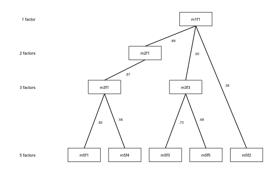
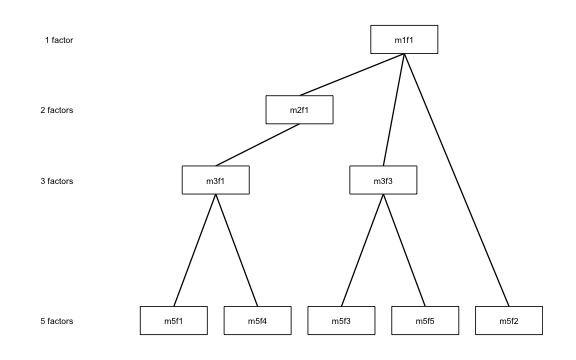
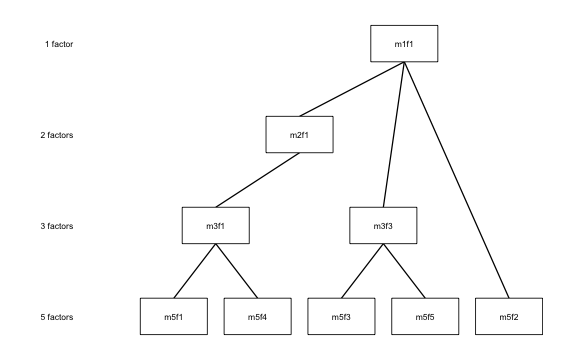

The classic Goldberg (2006) method computes between-level factor-score
correlations only for *adjacent* levels: 1↔2, 2↔3, 3↔4, and so on. Forbes
(2023) extended this in two ways: computing correlations across *all* level
pairs (not just adjacent), and using those extra connections to identify and
flag **redundant** or **artifactual** factors in the hierarchy.

This vignette covers both extensions: `pairs = "all"` and `prune`.

## The limitation of adjacent-only edges

An adjacent-only hierarchy shows you the immediate parent–child relationships.
What it cannot tell you is whether a factor at level k is essentially the same
construct as a factor several levels up — a sign that the intermediate levels
are adding noise rather than resolution.

Consider a factor that appears at k = 2, k = 3, and k = 4 and correlates
> 0.97 with its counterpart at every adjacent level. The adjacent-only diagram
shows three consecutive arrows, each nearly perfect. But nothing in the diagram
directly flags that the k = 3 factor is redundant: you could skip straight from
k = 2 to k = 4 without losing any information.

**Skip-level correlations** make this visible by computing the correlation
between every pair of levels, not just neighbors.

## Setup


``` r
library(ackwards)
bfi <- na.omit(bfi25)
```

## Computing every between-level correlation with `pairs = "all"`

Adding `pairs = "all"` extends the edge table from adjacent pairs only to every
combination of levels.


``` r
# Classic adjacent-only
x_adj <- ackwards(bfi, k_max = 5, cor = "polychoric")

# All pairs
x_all <- ackwards(bfi, k_max = 5, cor = "polychoric", pairs = "all")

# How many edges?
nrow(tidy(x_adj, what = "edges")) # adjacent only
#> [1] 40
nrow(tidy(x_all, what = "edges")) # all pairs
#> [1] 85
```


With k = 5, the adjacent-only model has 40 edges (1×2 + 2×3 + 3×4 +
4×5). The all-pairs model adds every non-adjacent pair — 1↔3, 1↔4, 1↔5, 2↔4,
2↔5, 3↔5 — for 85 edges total.

### Reading the skip-level edge table

The table below keeps the non-adjacent edges (levels more than one apart) with
`|r| >= 0.5`, strongest first — drawn from `tidy(x_all, what = "edges")`:

<!--html_preserve--><div id="wpszfiryqs" style="padding-left:0px;padding-right:0px;padding-top:10px;padding-bottom:10px;overflow-x:auto;overflow-y:auto;width:auto;height:auto;">
<style>#wpszfiryqs table {
  font-family: system-ui, 'Segoe UI', Roboto, Helvetica, Arial, sans-serif, 'Apple Color Emoji', 'Segoe UI Emoji', 'Segoe UI Symbol', 'Noto Color Emoji';
  -webkit-font-smoothing: antialiased;
  -moz-osx-font-smoothing: grayscale;
}

#wpszfiryqs thead, #wpszfiryqs tbody, #wpszfiryqs tfoot, #wpszfiryqs tr, #wpszfiryqs td, #wpszfiryqs th {
  border-style: none;
}

#wpszfiryqs p {
  margin: 0;
  padding: 0;
}

#wpszfiryqs .gt_table {
  display: table;
  border-collapse: collapse;
  line-height: normal;
  margin-left: auto;
  margin-right: auto;
  color: #333333;
  font-size: 16px;
  font-weight: normal;
  font-style: normal;
  background-color: #FFFFFF;
  width: auto;
  border-top-style: solid;
  border-top-width: 2px;
  border-top-color: #A8A8A8;
  border-right-style: none;
  border-right-width: 2px;
  border-right-color: #D3D3D3;
  border-bottom-style: solid;
  border-bottom-width: 2px;
  border-bottom-color: #A8A8A8;
  border-left-style: none;
  border-left-width: 2px;
  border-left-color: #D3D3D3;
}

#wpszfiryqs .gt_caption {
  padding-top: 4px;
  padding-bottom: 4px;
}

#wpszfiryqs .gt_title {
  color: #333333;
  font-size: 125%;
  font-weight: initial;
  padding-top: 4px;
  padding-bottom: 4px;
  padding-left: 5px;
  padding-right: 5px;
  border-bottom-color: #FFFFFF;
  border-bottom-width: 0;
}

#wpszfiryqs .gt_subtitle {
  color: #333333;
  font-size: 85%;
  font-weight: initial;
  padding-top: 3px;
  padding-bottom: 5px;
  padding-left: 5px;
  padding-right: 5px;
  border-top-color: #FFFFFF;
  border-top-width: 0;
}

#wpszfiryqs .gt_heading {
  background-color: #FFFFFF;
  text-align: center;
  border-bottom-color: #FFFFFF;
  border-left-style: none;
  border-left-width: 1px;
  border-left-color: #D3D3D3;
  border-right-style: none;
  border-right-width: 1px;
  border-right-color: #D3D3D3;
}

#wpszfiryqs .gt_bottom_border {
  border-bottom-style: solid;
  border-bottom-width: 2px;
  border-bottom-color: #D3D3D3;
}

#wpszfiryqs .gt_col_headings {
  border-top-style: solid;
  border-top-width: 2px;
  border-top-color: #D3D3D3;
  border-bottom-style: solid;
  border-bottom-width: 2px;
  border-bottom-color: #D3D3D3;
  border-left-style: none;
  border-left-width: 1px;
  border-left-color: #D3D3D3;
  border-right-style: none;
  border-right-width: 1px;
  border-right-color: #D3D3D3;
}

#wpszfiryqs .gt_col_heading {
  color: #333333;
  background-color: #FFFFFF;
  font-size: 100%;
  font-weight: normal;
  text-transform: inherit;
  border-left-style: none;
  border-left-width: 1px;
  border-left-color: #D3D3D3;
  border-right-style: none;
  border-right-width: 1px;
  border-right-color: #D3D3D3;
  vertical-align: bottom;
  padding-top: 5px;
  padding-bottom: 6px;
  padding-left: 5px;
  padding-right: 5px;
  overflow-x: hidden;
}

#wpszfiryqs .gt_column_spanner_outer {
  color: #333333;
  background-color: #FFFFFF;
  font-size: 100%;
  font-weight: normal;
  text-transform: inherit;
  padding-top: 0;
  padding-bottom: 0;
  padding-left: 4px;
  padding-right: 4px;
}

#wpszfiryqs .gt_column_spanner_outer:first-child {
  padding-left: 0;
}

#wpszfiryqs .gt_column_spanner_outer:last-child {
  padding-right: 0;
}

#wpszfiryqs .gt_column_spanner {
  border-bottom-style: solid;
  border-bottom-width: 2px;
  border-bottom-color: #D3D3D3;
  vertical-align: bottom;
  padding-top: 5px;
  padding-bottom: 5px;
  overflow-x: hidden;
  display: inline-block;
  width: 100%;
}

#wpszfiryqs .gt_spanner_row {
  border-bottom-style: hidden;
}

#wpszfiryqs .gt_group_heading {
  padding-top: 8px;
  padding-bottom: 8px;
  padding-left: 5px;
  padding-right: 5px;
  color: #333333;
  background-color: #FFFFFF;
  font-size: 100%;
  font-weight: initial;
  text-transform: inherit;
  border-top-style: solid;
  border-top-width: 2px;
  border-top-color: #D3D3D3;
  border-bottom-style: solid;
  border-bottom-width: 2px;
  border-bottom-color: #D3D3D3;
  border-left-style: none;
  border-left-width: 1px;
  border-left-color: #D3D3D3;
  border-right-style: none;
  border-right-width: 1px;
  border-right-color: #D3D3D3;
  vertical-align: middle;
  text-align: left;
}

#wpszfiryqs .gt_empty_group_heading {
  padding: 0.5px;
  color: #333333;
  background-color: #FFFFFF;
  font-size: 100%;
  font-weight: initial;
  border-top-style: solid;
  border-top-width: 2px;
  border-top-color: #D3D3D3;
  border-bottom-style: solid;
  border-bottom-width: 2px;
  border-bottom-color: #D3D3D3;
  vertical-align: middle;
}

#wpszfiryqs .gt_from_md > :first-child {
  margin-top: 0;
}

#wpszfiryqs .gt_from_md > :last-child {
  margin-bottom: 0;
}

#wpszfiryqs .gt_row {
  padding-top: 8px;
  padding-bottom: 8px;
  padding-left: 5px;
  padding-right: 5px;
  margin: 10px;
  border-top-style: solid;
  border-top-width: 1px;
  border-top-color: #D3D3D3;
  border-left-style: none;
  border-left-width: 1px;
  border-left-color: #D3D3D3;
  border-right-style: none;
  border-right-width: 1px;
  border-right-color: #D3D3D3;
  vertical-align: middle;
  overflow-x: hidden;
}

#wpszfiryqs .gt_stub {
  color: #333333;
  background-color: #FFFFFF;
  font-size: 100%;
  font-weight: initial;
  text-transform: inherit;
  border-right-style: solid;
  border-right-width: 2px;
  border-right-color: #D3D3D3;
  padding-left: 5px;
  padding-right: 5px;
}

#wpszfiryqs .gt_stub_row_group {
  color: #333333;
  background-color: #FFFFFF;
  font-size: 100%;
  font-weight: initial;
  text-transform: inherit;
  border-right-style: solid;
  border-right-width: 2px;
  border-right-color: #D3D3D3;
  padding-left: 5px;
  padding-right: 5px;
  vertical-align: top;
}

#wpszfiryqs .gt_row_group_first td {
  border-top-width: 2px;
}

#wpszfiryqs .gt_row_group_first th {
  border-top-width: 2px;
}

#wpszfiryqs .gt_summary_row {
  color: #333333;
  background-color: #FFFFFF;
  text-transform: inherit;
  padding-top: 8px;
  padding-bottom: 8px;
  padding-left: 5px;
  padding-right: 5px;
}

#wpszfiryqs .gt_first_summary_row {
  border-top-style: solid;
  border-top-color: #D3D3D3;
}

#wpszfiryqs .gt_first_summary_row.thick {
  border-top-width: 2px;
}

#wpszfiryqs .gt_last_summary_row {
  padding-top: 8px;
  padding-bottom: 8px;
  padding-left: 5px;
  padding-right: 5px;
  border-bottom-style: solid;
  border-bottom-width: 2px;
  border-bottom-color: #D3D3D3;
}

#wpszfiryqs .gt_grand_summary_row {
  color: #333333;
  background-color: #FFFFFF;
  text-transform: inherit;
  padding-top: 8px;
  padding-bottom: 8px;
  padding-left: 5px;
  padding-right: 5px;
}

#wpszfiryqs .gt_first_grand_summary_row {
  padding-top: 8px;
  padding-bottom: 8px;
  padding-left: 5px;
  padding-right: 5px;
  border-top-style: double;
  border-top-width: 6px;
  border-top-color: #D3D3D3;
}

#wpszfiryqs .gt_last_grand_summary_row_top {
  padding-top: 8px;
  padding-bottom: 8px;
  padding-left: 5px;
  padding-right: 5px;
  border-bottom-style: double;
  border-bottom-width: 6px;
  border-bottom-color: #D3D3D3;
}

#wpszfiryqs .gt_striped {
  background-color: rgba(128, 128, 128, 0.05);
}

#wpszfiryqs .gt_table_body {
  border-top-style: solid;
  border-top-width: 2px;
  border-top-color: #D3D3D3;
  border-bottom-style: solid;
  border-bottom-width: 2px;
  border-bottom-color: #D3D3D3;
}

#wpszfiryqs .gt_footnotes {
  color: #333333;
  background-color: #FFFFFF;
  border-bottom-style: none;
  border-bottom-width: 2px;
  border-bottom-color: #D3D3D3;
  border-left-style: none;
  border-left-width: 2px;
  border-left-color: #D3D3D3;
  border-right-style: none;
  border-right-width: 2px;
  border-right-color: #D3D3D3;
}

#wpszfiryqs .gt_footnote {
  margin: 0px;
  font-size: 90%;
  padding-top: 4px;
  padding-bottom: 4px;
  padding-left: 5px;
  padding-right: 5px;
}

#wpszfiryqs .gt_sourcenotes {
  color: #333333;
  background-color: #FFFFFF;
  border-bottom-style: none;
  border-bottom-width: 2px;
  border-bottom-color: #D3D3D3;
  border-left-style: none;
  border-left-width: 2px;
  border-left-color: #D3D3D3;
  border-right-style: none;
  border-right-width: 2px;
  border-right-color: #D3D3D3;
}

#wpszfiryqs .gt_sourcenote {
  font-size: 90%;
  padding-top: 4px;
  padding-bottom: 4px;
  padding-left: 5px;
  padding-right: 5px;
}

#wpszfiryqs .gt_left {
  text-align: left;
}

#wpszfiryqs .gt_center {
  text-align: center;
}

#wpszfiryqs .gt_right {
  text-align: right;
  font-variant-numeric: tabular-nums;
}

#wpszfiryqs .gt_font_normal {
  font-weight: normal;
}

#wpszfiryqs .gt_font_bold {
  font-weight: bold;
}

#wpszfiryqs .gt_font_italic {
  font-style: italic;
}

#wpszfiryqs .gt_super {
  font-size: 65%;
}

#wpszfiryqs .gt_footnote_marks {
  font-size: 75%;
  vertical-align: 0.4em;
  position: initial;
}

#wpszfiryqs .gt_asterisk {
  font-size: 100%;
  vertical-align: 0;
}

#wpszfiryqs .gt_indent_1 {
  text-indent: 5px;
}

#wpszfiryqs .gt_indent_2 {
  text-indent: 10px;
}

#wpszfiryqs .gt_indent_3 {
  text-indent: 15px;
}

#wpszfiryqs .gt_indent_4 {
  text-indent: 20px;
}

#wpszfiryqs .gt_indent_5 {
  text-indent: 25px;
}

#wpszfiryqs .katex-display {
  display: inline-flex !important;
  margin-bottom: 0.75em !important;
}

#wpszfiryqs div.Reactable > div.rt-table > div.rt-thead > div.rt-tr.rt-tr-group-header > div.rt-th-group:after {
  height: 0px !important;
}
</style>
<table class="gt_table" data-quarto-disable-processing="false" data-quarto-bootstrap="false">
  <thead>
    <tr class="gt_heading">
      <td colspan="5" class="gt_heading gt_title gt_font_normal" style>Strongest skip-level edges (|r| ≥ 0.5, non-adjacent levels)</td>
    </tr>
    <tr class="gt_heading">
      <td colspan="5" class="gt_heading gt_subtitle gt_font_normal gt_bottom_border" style>Sorted by |r|; shows at most 12 rows</td>
    </tr>
    <tr class="gt_col_headings">
      <th class="gt_col_heading gt_columns_bottom_border gt_left" rowspan="1" colspan="1" scope="col" id="from">From</th>
      <th class="gt_col_heading gt_columns_bottom_border gt_left" rowspan="1" colspan="1" scope="col" id="to">To</th>
      <th class="gt_col_heading gt_columns_bottom_border gt_right" rowspan="1" colspan="1" scope="col" id="level_from">Level (from)</th>
      <th class="gt_col_heading gt_columns_bottom_border gt_right" rowspan="1" colspan="1" scope="col" id="level_to">Level (to)</th>
      <th class="gt_col_heading gt_columns_bottom_border gt_right" rowspan="1" colspan="1" scope="col" id="r">r</th>
    </tr>
  </thead>
  <tbody class="gt_table_body">
    <tr><td headers="from" class="gt_row gt_left">m3f2</td>
<td headers="to" class="gt_row gt_left">m5f2</td>
<td headers="level_from" class="gt_row gt_right">3</td>
<td headers="level_to" class="gt_row gt_right">5</td>
<td headers="r" class="gt_row gt_right">0.98</td></tr>
    <tr><td headers="from" class="gt_row gt_left">m2f2</td>
<td headers="to" class="gt_row gt_left">m4f2</td>
<td headers="level_from" class="gt_row gt_right">2</td>
<td headers="level_to" class="gt_row gt_right">4</td>
<td headers="r" class="gt_row gt_right">0.97</td></tr>
    <tr><td headers="from" class="gt_row gt_left">m2f2</td>
<td headers="to" class="gt_row gt_left">m5f2</td>
<td headers="level_from" class="gt_row gt_right">2</td>
<td headers="level_to" class="gt_row gt_right">5</td>
<td headers="r" class="gt_row gt_right">0.97</td></tr>
    <tr><td headers="from" class="gt_row gt_left">m2f1</td>
<td headers="to" class="gt_row gt_left">m4f1</td>
<td headers="level_from" class="gt_row gt_right">2</td>
<td headers="level_to" class="gt_row gt_right">4</td>
<td headers="r" class="gt_row gt_right">0.85</td></tr>
    <tr><td headers="from" class="gt_row gt_left">m3f1</td>
<td headers="to" class="gt_row gt_left">m5f1</td>
<td headers="level_from" class="gt_row gt_right">3</td>
<td headers="level_to" class="gt_row gt_right">5</td>
<td headers="r" class="gt_row gt_right">0.82</td></tr>
    <tr><td headers="from" class="gt_row gt_left">m1f1</td>
<td headers="to" class="gt_row gt_left">m3f1</td>
<td headers="level_from" class="gt_row gt_right">1</td>
<td headers="level_to" class="gt_row gt_right">3</td>
<td headers="r" class="gt_row gt_right">0.77</td></tr>
    <tr><td headers="from" class="gt_row gt_left">m1f1</td>
<td headers="to" class="gt_row gt_left">m4f1</td>
<td headers="level_from" class="gt_row gt_right">1</td>
<td headers="level_to" class="gt_row gt_right">4</td>
<td headers="r" class="gt_row gt_right">0.75</td></tr>
    <tr><td headers="from" class="gt_row gt_left">m3f3</td>
<td headers="to" class="gt_row gt_left">m5f3</td>
<td headers="level_from" class="gt_row gt_right">3</td>
<td headers="level_to" class="gt_row gt_right">5</td>
<td headers="r" class="gt_row gt_right">0.73</td></tr>
    <tr><td headers="from" class="gt_row gt_left">m2f1</td>
<td headers="to" class="gt_row gt_left">m5f1</td>
<td headers="level_from" class="gt_row gt_right">2</td>
<td headers="level_to" class="gt_row gt_right">5</td>
<td headers="r" class="gt_row gt_right">0.69</td></tr>
    <tr><td headers="from" class="gt_row gt_left">m3f3</td>
<td headers="to" class="gt_row gt_left">m5f5</td>
<td headers="level_from" class="gt_row gt_right">3</td>
<td headers="level_to" class="gt_row gt_right">5</td>
<td headers="r" class="gt_row gt_right">0.68</td></tr>
    <tr><td headers="from" class="gt_row gt_left">m1f1</td>
<td headers="to" class="gt_row gt_left">m5f1</td>
<td headers="level_from" class="gt_row gt_right">1</td>
<td headers="level_to" class="gt_row gt_right">5</td>
<td headers="r" class="gt_row gt_right">0.61</td></tr>
    <tr><td headers="from" class="gt_row gt_left">m3f1</td>
<td headers="to" class="gt_row gt_left">m5f4</td>
<td headers="level_from" class="gt_row gt_right">3</td>
<td headers="level_to" class="gt_row gt_right">5</td>
<td headers="r" class="gt_row gt_right">0.56</td></tr>
  </tbody>
  
</table>
</div><!--/html_preserve-->

Several factors connect across two or more levels with correlations above 0.90.
m3f2 (level 3, factor 2) correlates
0.98 with m5f2 (level 5, factor 2),
jumping *two* levels. This tells you that m3f2 and m5f2 are
essentially the same construct — the intermediate levels are just refinements
within a stable dimension.

### Reading the strongest edge with care

Reading the *strongest* edge off a table of many correlations is itself a form
of selection. With k = 5 the all-pairs table holds 85 edges, and the
maximum of that many correlations is biased upward even when every individual
estimate is honest. Treat a "strongest link" claim as descriptive rather than
inferential: if it is load-bearing, pre-specify which pair of factors you care
about rather than reporting whichever correlation came out largest.

## Pruning: identifying redundant factors

The `prune()` verb uses the skip-level correlations to automatically flag
factors that may not be adding genuine information to the hierarchy.

### Chains of near-identical factors with `prune(x, "redundant")`

A **redundant chain** is a sequence of factors connected by near-perfect
correlations (|r| ≥ 0.9 by default) across levels. If m2f2 → m3f2 → m4f2 →
m5f1 all share r > 0.97, the chain reaches the deepest level, so its bottom
node m5f1 — the most specific, best-defined manifestation — is retained and
the others (m2f2, m3f2, m4f2) are flagged as redundant: they repeat rather
than refine the same dimension. A chain that stops *short* of the deepest
level instead keeps its **top** node, the broadest manifestation (Forbes,
2023).

By default (`redundancy_criterion = "direct"`) a factor is joined to an
ancestor when their score correlation is high **directly** — the rule Forbes's
own code uses, and the honest reading of "the same construct" (the two factors
share ≥ 81% of their variance directly). Because correlation is non-transitive,
this can differ from following one high-correlation hop at a time in deep
hierarchies; `redundancy_criterion = "adjacent"` selects that older, adjacent-hop
behavior. On a shallow hierarchy like this one the two agree.


``` r
x_prune <- ackwards(bfi, k_max = 5, cor = "polychoric", pairs = "all") |>
  prune("redundant")
#> ℹ Redundancy pruning (direct criterion, |r| ≥ 0.9) flagged 6 nodes.
#> ℹ Nodes are retained in the object; inspect with `x$prune$nodes` and
#>   `x$prune$chains`.
```

<!--html_preserve--><div id="ooekqwxsij" style="padding-left:0px;padding-right:0px;padding-top:10px;padding-bottom:10px;overflow-x:auto;overflow-y:auto;width:auto;height:auto;">
<style>#ooekqwxsij table {
  font-family: system-ui, 'Segoe UI', Roboto, Helvetica, Arial, sans-serif, 'Apple Color Emoji', 'Segoe UI Emoji', 'Segoe UI Symbol', 'Noto Color Emoji';
  -webkit-font-smoothing: antialiased;
  -moz-osx-font-smoothing: grayscale;
}

#ooekqwxsij thead, #ooekqwxsij tbody, #ooekqwxsij tfoot, #ooekqwxsij tr, #ooekqwxsij td, #ooekqwxsij th {
  border-style: none;
}

#ooekqwxsij p {
  margin: 0;
  padding: 0;
}

#ooekqwxsij .gt_table {
  display: table;
  border-collapse: collapse;
  line-height: normal;
  margin-left: auto;
  margin-right: auto;
  color: #333333;
  font-size: 16px;
  font-weight: normal;
  font-style: normal;
  background-color: #FFFFFF;
  width: auto;
  border-top-style: solid;
  border-top-width: 2px;
  border-top-color: #A8A8A8;
  border-right-style: none;
  border-right-width: 2px;
  border-right-color: #D3D3D3;
  border-bottom-style: solid;
  border-bottom-width: 2px;
  border-bottom-color: #A8A8A8;
  border-left-style: none;
  border-left-width: 2px;
  border-left-color: #D3D3D3;
}

#ooekqwxsij .gt_caption {
  padding-top: 4px;
  padding-bottom: 4px;
}

#ooekqwxsij .gt_title {
  color: #333333;
  font-size: 125%;
  font-weight: initial;
  padding-top: 4px;
  padding-bottom: 4px;
  padding-left: 5px;
  padding-right: 5px;
  border-bottom-color: #FFFFFF;
  border-bottom-width: 0;
}

#ooekqwxsij .gt_subtitle {
  color: #333333;
  font-size: 85%;
  font-weight: initial;
  padding-top: 3px;
  padding-bottom: 5px;
  padding-left: 5px;
  padding-right: 5px;
  border-top-color: #FFFFFF;
  border-top-width: 0;
}

#ooekqwxsij .gt_heading {
  background-color: #FFFFFF;
  text-align: center;
  border-bottom-color: #FFFFFF;
  border-left-style: none;
  border-left-width: 1px;
  border-left-color: #D3D3D3;
  border-right-style: none;
  border-right-width: 1px;
  border-right-color: #D3D3D3;
}

#ooekqwxsij .gt_bottom_border {
  border-bottom-style: solid;
  border-bottom-width: 2px;
  border-bottom-color: #D3D3D3;
}

#ooekqwxsij .gt_col_headings {
  border-top-style: solid;
  border-top-width: 2px;
  border-top-color: #D3D3D3;
  border-bottom-style: solid;
  border-bottom-width: 2px;
  border-bottom-color: #D3D3D3;
  border-left-style: none;
  border-left-width: 1px;
  border-left-color: #D3D3D3;
  border-right-style: none;
  border-right-width: 1px;
  border-right-color: #D3D3D3;
}

#ooekqwxsij .gt_col_heading {
  color: #333333;
  background-color: #FFFFFF;
  font-size: 100%;
  font-weight: normal;
  text-transform: inherit;
  border-left-style: none;
  border-left-width: 1px;
  border-left-color: #D3D3D3;
  border-right-style: none;
  border-right-width: 1px;
  border-right-color: #D3D3D3;
  vertical-align: bottom;
  padding-top: 5px;
  padding-bottom: 6px;
  padding-left: 5px;
  padding-right: 5px;
  overflow-x: hidden;
}

#ooekqwxsij .gt_column_spanner_outer {
  color: #333333;
  background-color: #FFFFFF;
  font-size: 100%;
  font-weight: normal;
  text-transform: inherit;
  padding-top: 0;
  padding-bottom: 0;
  padding-left: 4px;
  padding-right: 4px;
}

#ooekqwxsij .gt_column_spanner_outer:first-child {
  padding-left: 0;
}

#ooekqwxsij .gt_column_spanner_outer:last-child {
  padding-right: 0;
}

#ooekqwxsij .gt_column_spanner {
  border-bottom-style: solid;
  border-bottom-width: 2px;
  border-bottom-color: #D3D3D3;
  vertical-align: bottom;
  padding-top: 5px;
  padding-bottom: 5px;
  overflow-x: hidden;
  display: inline-block;
  width: 100%;
}

#ooekqwxsij .gt_spanner_row {
  border-bottom-style: hidden;
}

#ooekqwxsij .gt_group_heading {
  padding-top: 8px;
  padding-bottom: 8px;
  padding-left: 5px;
  padding-right: 5px;
  color: #333333;
  background-color: #FFFFFF;
  font-size: 100%;
  font-weight: initial;
  text-transform: inherit;
  border-top-style: solid;
  border-top-width: 2px;
  border-top-color: #D3D3D3;
  border-bottom-style: solid;
  border-bottom-width: 2px;
  border-bottom-color: #D3D3D3;
  border-left-style: none;
  border-left-width: 1px;
  border-left-color: #D3D3D3;
  border-right-style: none;
  border-right-width: 1px;
  border-right-color: #D3D3D3;
  vertical-align: middle;
  text-align: left;
}

#ooekqwxsij .gt_empty_group_heading {
  padding: 0.5px;
  color: #333333;
  background-color: #FFFFFF;
  font-size: 100%;
  font-weight: initial;
  border-top-style: solid;
  border-top-width: 2px;
  border-top-color: #D3D3D3;
  border-bottom-style: solid;
  border-bottom-width: 2px;
  border-bottom-color: #D3D3D3;
  vertical-align: middle;
}

#ooekqwxsij .gt_from_md > :first-child {
  margin-top: 0;
}

#ooekqwxsij .gt_from_md > :last-child {
  margin-bottom: 0;
}

#ooekqwxsij .gt_row {
  padding-top: 8px;
  padding-bottom: 8px;
  padding-left: 5px;
  padding-right: 5px;
  margin: 10px;
  border-top-style: solid;
  border-top-width: 1px;
  border-top-color: #D3D3D3;
  border-left-style: none;
  border-left-width: 1px;
  border-left-color: #D3D3D3;
  border-right-style: none;
  border-right-width: 1px;
  border-right-color: #D3D3D3;
  vertical-align: middle;
  overflow-x: hidden;
}

#ooekqwxsij .gt_stub {
  color: #333333;
  background-color: #FFFFFF;
  font-size: 100%;
  font-weight: initial;
  text-transform: inherit;
  border-right-style: solid;
  border-right-width: 2px;
  border-right-color: #D3D3D3;
  padding-left: 5px;
  padding-right: 5px;
}

#ooekqwxsij .gt_stub_row_group {
  color: #333333;
  background-color: #FFFFFF;
  font-size: 100%;
  font-weight: initial;
  text-transform: inherit;
  border-right-style: solid;
  border-right-width: 2px;
  border-right-color: #D3D3D3;
  padding-left: 5px;
  padding-right: 5px;
  vertical-align: top;
}

#ooekqwxsij .gt_row_group_first td {
  border-top-width: 2px;
}

#ooekqwxsij .gt_row_group_first th {
  border-top-width: 2px;
}

#ooekqwxsij .gt_summary_row {
  color: #333333;
  background-color: #FFFFFF;
  text-transform: inherit;
  padding-top: 8px;
  padding-bottom: 8px;
  padding-left: 5px;
  padding-right: 5px;
}

#ooekqwxsij .gt_first_summary_row {
  border-top-style: solid;
  border-top-color: #D3D3D3;
}

#ooekqwxsij .gt_first_summary_row.thick {
  border-top-width: 2px;
}

#ooekqwxsij .gt_last_summary_row {
  padding-top: 8px;
  padding-bottom: 8px;
  padding-left: 5px;
  padding-right: 5px;
  border-bottom-style: solid;
  border-bottom-width: 2px;
  border-bottom-color: #D3D3D3;
}

#ooekqwxsij .gt_grand_summary_row {
  color: #333333;
  background-color: #FFFFFF;
  text-transform: inherit;
  padding-top: 8px;
  padding-bottom: 8px;
  padding-left: 5px;
  padding-right: 5px;
}

#ooekqwxsij .gt_first_grand_summary_row {
  padding-top: 8px;
  padding-bottom: 8px;
  padding-left: 5px;
  padding-right: 5px;
  border-top-style: double;
  border-top-width: 6px;
  border-top-color: #D3D3D3;
}

#ooekqwxsij .gt_last_grand_summary_row_top {
  padding-top: 8px;
  padding-bottom: 8px;
  padding-left: 5px;
  padding-right: 5px;
  border-bottom-style: double;
  border-bottom-width: 6px;
  border-bottom-color: #D3D3D3;
}

#ooekqwxsij .gt_striped {
  background-color: rgba(128, 128, 128, 0.05);
}

#ooekqwxsij .gt_table_body {
  border-top-style: solid;
  border-top-width: 2px;
  border-top-color: #D3D3D3;
  border-bottom-style: solid;
  border-bottom-width: 2px;
  border-bottom-color: #D3D3D3;
}

#ooekqwxsij .gt_footnotes {
  color: #333333;
  background-color: #FFFFFF;
  border-bottom-style: none;
  border-bottom-width: 2px;
  border-bottom-color: #D3D3D3;
  border-left-style: none;
  border-left-width: 2px;
  border-left-color: #D3D3D3;
  border-right-style: none;
  border-right-width: 2px;
  border-right-color: #D3D3D3;
}

#ooekqwxsij .gt_footnote {
  margin: 0px;
  font-size: 90%;
  padding-top: 4px;
  padding-bottom: 4px;
  padding-left: 5px;
  padding-right: 5px;
}

#ooekqwxsij .gt_sourcenotes {
  color: #333333;
  background-color: #FFFFFF;
  border-bottom-style: none;
  border-bottom-width: 2px;
  border-bottom-color: #D3D3D3;
  border-left-style: none;
  border-left-width: 2px;
  border-left-color: #D3D3D3;
  border-right-style: none;
  border-right-width: 2px;
  border-right-color: #D3D3D3;
}

#ooekqwxsij .gt_sourcenote {
  font-size: 90%;
  padding-top: 4px;
  padding-bottom: 4px;
  padding-left: 5px;
  padding-right: 5px;
}

#ooekqwxsij .gt_left {
  text-align: left;
}

#ooekqwxsij .gt_center {
  text-align: center;
}

#ooekqwxsij .gt_right {
  text-align: right;
  font-variant-numeric: tabular-nums;
}

#ooekqwxsij .gt_font_normal {
  font-weight: normal;
}

#ooekqwxsij .gt_font_bold {
  font-weight: bold;
}

#ooekqwxsij .gt_font_italic {
  font-style: italic;
}

#ooekqwxsij .gt_super {
  font-size: 65%;
}

#ooekqwxsij .gt_footnote_marks {
  font-size: 75%;
  vertical-align: 0.4em;
  position: initial;
}

#ooekqwxsij .gt_asterisk {
  font-size: 100%;
  vertical-align: 0;
}

#ooekqwxsij .gt_indent_1 {
  text-indent: 5px;
}

#ooekqwxsij .gt_indent_2 {
  text-indent: 10px;
}

#ooekqwxsij .gt_indent_3 {
  text-indent: 15px;
}

#ooekqwxsij .gt_indent_4 {
  text-indent: 20px;
}

#ooekqwxsij .gt_indent_5 {
  text-indent: 25px;
}

#ooekqwxsij .katex-display {
  display: inline-flex !important;
  margin-bottom: 0.75em !important;
}

#ooekqwxsij div.Reactable > div.rt-table > div.rt-thead > div.rt-tr.rt-tr-group-header > div.rt-th-group:after {
  height: 0px !important;
}
</style>
<table class="gt_table" data-quarto-disable-processing="false" data-quarto-bootstrap="false">
  <thead>
    <tr class="gt_heading">
      <td colspan="4" class="gt_heading gt_title gt_font_normal" style>Node-level pruning annotation</td>
    </tr>
    <tr class="gt_heading">
      <td colspan="4" class="gt_heading gt_subtitle gt_font_normal gt_bottom_border" style>6 of 15 factors flagged as redundant</td>
    </tr>
    <tr class="gt_col_headings">
      <th class="gt_col_heading gt_columns_bottom_border gt_left" rowspan="1" colspan="1" scope="col" id="id">Factor</th>
      <th class="gt_col_heading gt_columns_bottom_border gt_right" rowspan="1" colspan="1" scope="col" id="level">Level</th>
      <th class="gt_col_heading gt_columns_bottom_border gt_center" rowspan="1" colspan="1" scope="col" id="pruned">Flagged?</th>
      <th class="gt_col_heading gt_columns_bottom_border gt_left" rowspan="1" colspan="1" scope="col" id="prune_reason">Reason</th>
    </tr>
  </thead>
  <tbody class="gt_table_body">
    <tr><td headers="id" class="gt_row gt_left">m1f1</td>
<td headers="level" class="gt_row gt_right">1</td>
<td headers="pruned" class="gt_row gt_center">FALSE</td>
<td headers="prune_reason" class="gt_row gt_left">—</td></tr>
    <tr><td headers="id" class="gt_row gt_left">m2f1</td>
<td headers="level" class="gt_row gt_right">2</td>
<td headers="pruned" class="gt_row gt_center">FALSE</td>
<td headers="prune_reason" class="gt_row gt_left">—</td></tr>
    <tr><td headers="id" class="gt_row gt_left" style="background-color: #FFF3CD; font-weight: bold;">m2f2</td>
<td headers="level" class="gt_row gt_right" style="background-color: #FFF3CD;">2</td>
<td headers="pruned" class="gt_row gt_center" style="background-color: #FFF3CD;">TRUE</td>
<td headers="prune_reason" class="gt_row gt_left" style="background-color: #FFF3CD;">redundant</td></tr>
    <tr><td headers="id" class="gt_row gt_left">m3f1</td>
<td headers="level" class="gt_row gt_right">3</td>
<td headers="pruned" class="gt_row gt_center">FALSE</td>
<td headers="prune_reason" class="gt_row gt_left">—</td></tr>
    <tr><td headers="id" class="gt_row gt_left" style="background-color: #FFF3CD; font-weight: bold;">m3f2</td>
<td headers="level" class="gt_row gt_right" style="background-color: #FFF3CD;">3</td>
<td headers="pruned" class="gt_row gt_center" style="background-color: #FFF3CD;">TRUE</td>
<td headers="prune_reason" class="gt_row gt_left" style="background-color: #FFF3CD;">redundant</td></tr>
    <tr><td headers="id" class="gt_row gt_left">m3f3</td>
<td headers="level" class="gt_row gt_right">3</td>
<td headers="pruned" class="gt_row gt_center">FALSE</td>
<td headers="prune_reason" class="gt_row gt_left">—</td></tr>
    <tr><td headers="id" class="gt_row gt_left" style="background-color: #FFF3CD; font-weight: bold;">m4f1</td>
<td headers="level" class="gt_row gt_right" style="background-color: #FFF3CD;">4</td>
<td headers="pruned" class="gt_row gt_center" style="background-color: #FFF3CD;">TRUE</td>
<td headers="prune_reason" class="gt_row gt_left" style="background-color: #FFF3CD;">redundant</td></tr>
    <tr><td headers="id" class="gt_row gt_left" style="background-color: #FFF3CD; font-weight: bold;">m4f2</td>
<td headers="level" class="gt_row gt_right" style="background-color: #FFF3CD;">4</td>
<td headers="pruned" class="gt_row gt_center" style="background-color: #FFF3CD;">TRUE</td>
<td headers="prune_reason" class="gt_row gt_left" style="background-color: #FFF3CD;">redundant</td></tr>
    <tr><td headers="id" class="gt_row gt_left" style="background-color: #FFF3CD; font-weight: bold;">m4f3</td>
<td headers="level" class="gt_row gt_right" style="background-color: #FFF3CD;">4</td>
<td headers="pruned" class="gt_row gt_center" style="background-color: #FFF3CD;">TRUE</td>
<td headers="prune_reason" class="gt_row gt_left" style="background-color: #FFF3CD;">redundant</td></tr>
    <tr><td headers="id" class="gt_row gt_left" style="background-color: #FFF3CD; font-weight: bold;">m4f4</td>
<td headers="level" class="gt_row gt_right" style="background-color: #FFF3CD;">4</td>
<td headers="pruned" class="gt_row gt_center" style="background-color: #FFF3CD;">TRUE</td>
<td headers="prune_reason" class="gt_row gt_left" style="background-color: #FFF3CD;">redundant</td></tr>
    <tr><td headers="id" class="gt_row gt_left">m5f1</td>
<td headers="level" class="gt_row gt_right">5</td>
<td headers="pruned" class="gt_row gt_center">FALSE</td>
<td headers="prune_reason" class="gt_row gt_left">—</td></tr>
    <tr><td headers="id" class="gt_row gt_left">m5f2</td>
<td headers="level" class="gt_row gt_right">5</td>
<td headers="pruned" class="gt_row gt_center">FALSE</td>
<td headers="prune_reason" class="gt_row gt_left">—</td></tr>
    <tr><td headers="id" class="gt_row gt_left">m5f3</td>
<td headers="level" class="gt_row gt_right">5</td>
<td headers="pruned" class="gt_row gt_center">FALSE</td>
<td headers="prune_reason" class="gt_row gt_left">—</td></tr>
    <tr><td headers="id" class="gt_row gt_left">m5f4</td>
<td headers="level" class="gt_row gt_right">5</td>
<td headers="pruned" class="gt_row gt_center">FALSE</td>
<td headers="prune_reason" class="gt_row gt_left">—</td></tr>
    <tr><td headers="id" class="gt_row gt_left">m5f5</td>
<td headers="level" class="gt_row gt_right">5</td>
<td headers="pruned" class="gt_row gt_center">FALSE</td>
<td headers="prune_reason" class="gt_row gt_left">—</td></tr>
  </tbody>
  
</table>
</div><!--/html_preserve-->

6 factors are flagged as redundant (m2f2, m3f2, m4f1, m4f2, m4f3, m4f4):
1 factor at k = 2, 1 factor at k = 3, the entire k = 4 level. This is a striking finding: for this dataset and this k, the
four-factor level adds little beyond what you already know from k = 3 and k = 5.

The flagged factors are not removed from the object — `prune()` is purely a
diagnostic annotation, not a deletion. You can still inspect their loadings, use
their scores, and include them in the diagram. Pruning flags guide interpretation;
they do not alter the model.

### The pruned-factor diagram

For presentations and publications it is cleaner to omit the flagged factors
entirely and draw direct connections from each retained factor to its single
strongest kept ancestor — even when that ancestor is several levels away. This
is the Forbes (2023) pruned-factor diagram, activated by `drop_pruned = TRUE`.

Forbes (2023) presents two variants: one with correlation labels on each arrow
and one without. The first is useful when the strength of each spanning
connection matters to the interpretation; the second is cleaner for
presentations. Both are reproduced below using the same publication style —
black lines, uniform width, plain line ends, and no legend.

**With correlation labels** (`show_r = TRUE`):


``` r
autoplot(x_prune,
  drop_pruned = TRUE, show_r = TRUE,
  color_pos = "black", color_neg = "black",
  edge_linewidth = 0.6, show_arrows = FALSE, legend = FALSE
)
```



**Without labels** (cleaner for slides or when the exact values are not the focus):


``` r
autoplot(x_prune,
  drop_pruned = TRUE,
  color_pos = "black", color_neg = "black",
  edge_linewidth = 0.6, show_arrows = FALSE, legend = FALSE
)
```



Level 4 is entirely pruned, leaving a visible gap in the y-axis. The gap is
intentional: it shows *which* level was removed. Spanning arrows bridge
directly from level 3 factors to level 5 factors (and from level 2 to level 5
where intermediate levels were flagged). In this publication style every drawn
line has the same uniform weight (`edge_linewidth = 0.6`); only connections
with |r| at or above the display threshold (`cut_show`, default 0.3) are drawn
at all.

To close the gaps and compact the layout while retaining the original level
numbers on the axis:


``` r
autoplot(x_prune,
  drop_pruned = TRUE, compress_levels = TRUE,
  color_pos = "black", color_neg = "black",
  edge_linewidth = 0.6, show_arrows = FALSE, legend = FALSE
)
```



The level labels still read "1 factor", "2 factors", "3 factors", "5 factors"
so readers know which levels were retained; the uniform vertical spacing makes
the diagram easier to read in constrained page layouts.

For further cosmetic customization — colours, node labels, arrowheads, and
more — see `vignette("ackwards-visualization")`.

### Inspecting structural similarity with `prune(x, "artifact")`

An **artifact** factor is one that looks like a *copy* of a factor from
another level rather than a genuine refinement — its loading pattern closely
resembles a factor elsewhere in the hierarchy. Similarity is measured by
Tucker's congruence coefficient (φ):

$$\phi(F_a, F_b) = \frac{\sum_i \lambda_{ia}\lambda_{ib}}
{\sqrt{\sum_i \lambda_{ia}^2 \cdot \sum_i \lambda_{ib}^2}}$$

φ ranges from −1 to +1, with values above 0.95 conventionally read as
near-identical loading patterns regardless of sign (Lorenzo-Seva & ten Berge,
2006).

Unlike `"redundant"`, the artifact mode **never flags anything
automatically**. Forbes (2023) is explicit that identifying an artifact
requires researcher judgment — automating it would manufacture investigator
degrees of freedom — so `prune(x, "artifact")` computes and stores the
evidence for *you* to weigh: Tucker's φ for **every** cross-level factor pair
in `x$prune$phi`, plus the structural signals of the next section in
`x$prune$structural`.


``` r
x_art <- ackwards(bfi, k_max = 5, cor = "polychoric", pairs = "all") |>
  prune("artifact")
#> ℹ Artifact mode: Tucker's φ computed for all cross-level factor pairs.
#> ℹ Structural signals computed: 2 factors flagged (few_items / orphan /
#>   split_merge).
#> ℹ Inspect `x$prune$phi` and `x$prune$structural`; removal is a researcher
#>   judgment (Forbes, 2023).
```

The table to read is `x$prune$phi`. The natural first cut is the
**non-adjacent** pairs with the highest |φ| — a deep factor whose loading
pattern nearly duplicates a factor two or more levels up is the classic
candidate:

<!--html_preserve--><div id="gwuetldqfz" style="padding-left:0px;padding-right:0px;padding-top:10px;padding-bottom:10px;overflow-x:auto;overflow-y:auto;width:auto;height:auto;">
<style>#gwuetldqfz table {
  font-family: system-ui, 'Segoe UI', Roboto, Helvetica, Arial, sans-serif, 'Apple Color Emoji', 'Segoe UI Emoji', 'Segoe UI Symbol', 'Noto Color Emoji';
  -webkit-font-smoothing: antialiased;
  -moz-osx-font-smoothing: grayscale;
}

#gwuetldqfz thead, #gwuetldqfz tbody, #gwuetldqfz tfoot, #gwuetldqfz tr, #gwuetldqfz td, #gwuetldqfz th {
  border-style: none;
}

#gwuetldqfz p {
  margin: 0;
  padding: 0;
}

#gwuetldqfz .gt_table {
  display: table;
  border-collapse: collapse;
  line-height: normal;
  margin-left: auto;
  margin-right: auto;
  color: #333333;
  font-size: 16px;
  font-weight: normal;
  font-style: normal;
  background-color: #FFFFFF;
  width: auto;
  border-top-style: solid;
  border-top-width: 2px;
  border-top-color: #A8A8A8;
  border-right-style: none;
  border-right-width: 2px;
  border-right-color: #D3D3D3;
  border-bottom-style: solid;
  border-bottom-width: 2px;
  border-bottom-color: #A8A8A8;
  border-left-style: none;
  border-left-width: 2px;
  border-left-color: #D3D3D3;
}

#gwuetldqfz .gt_caption {
  padding-top: 4px;
  padding-bottom: 4px;
}

#gwuetldqfz .gt_title {
  color: #333333;
  font-size: 125%;
  font-weight: initial;
  padding-top: 4px;
  padding-bottom: 4px;
  padding-left: 5px;
  padding-right: 5px;
  border-bottom-color: #FFFFFF;
  border-bottom-width: 0;
}

#gwuetldqfz .gt_subtitle {
  color: #333333;
  font-size: 85%;
  font-weight: initial;
  padding-top: 3px;
  padding-bottom: 5px;
  padding-left: 5px;
  padding-right: 5px;
  border-top-color: #FFFFFF;
  border-top-width: 0;
}

#gwuetldqfz .gt_heading {
  background-color: #FFFFFF;
  text-align: center;
  border-bottom-color: #FFFFFF;
  border-left-style: none;
  border-left-width: 1px;
  border-left-color: #D3D3D3;
  border-right-style: none;
  border-right-width: 1px;
  border-right-color: #D3D3D3;
}

#gwuetldqfz .gt_bottom_border {
  border-bottom-style: solid;
  border-bottom-width: 2px;
  border-bottom-color: #D3D3D3;
}

#gwuetldqfz .gt_col_headings {
  border-top-style: solid;
  border-top-width: 2px;
  border-top-color: #D3D3D3;
  border-bottom-style: solid;
  border-bottom-width: 2px;
  border-bottom-color: #D3D3D3;
  border-left-style: none;
  border-left-width: 1px;
  border-left-color: #D3D3D3;
  border-right-style: none;
  border-right-width: 1px;
  border-right-color: #D3D3D3;
}

#gwuetldqfz .gt_col_heading {
  color: #333333;
  background-color: #FFFFFF;
  font-size: 100%;
  font-weight: normal;
  text-transform: inherit;
  border-left-style: none;
  border-left-width: 1px;
  border-left-color: #D3D3D3;
  border-right-style: none;
  border-right-width: 1px;
  border-right-color: #D3D3D3;
  vertical-align: bottom;
  padding-top: 5px;
  padding-bottom: 6px;
  padding-left: 5px;
  padding-right: 5px;
  overflow-x: hidden;
}

#gwuetldqfz .gt_column_spanner_outer {
  color: #333333;
  background-color: #FFFFFF;
  font-size: 100%;
  font-weight: normal;
  text-transform: inherit;
  padding-top: 0;
  padding-bottom: 0;
  padding-left: 4px;
  padding-right: 4px;
}

#gwuetldqfz .gt_column_spanner_outer:first-child {
  padding-left: 0;
}

#gwuetldqfz .gt_column_spanner_outer:last-child {
  padding-right: 0;
}

#gwuetldqfz .gt_column_spanner {
  border-bottom-style: solid;
  border-bottom-width: 2px;
  border-bottom-color: #D3D3D3;
  vertical-align: bottom;
  padding-top: 5px;
  padding-bottom: 5px;
  overflow-x: hidden;
  display: inline-block;
  width: 100%;
}

#gwuetldqfz .gt_spanner_row {
  border-bottom-style: hidden;
}

#gwuetldqfz .gt_group_heading {
  padding-top: 8px;
  padding-bottom: 8px;
  padding-left: 5px;
  padding-right: 5px;
  color: #333333;
  background-color: #FFFFFF;
  font-size: 100%;
  font-weight: initial;
  text-transform: inherit;
  border-top-style: solid;
  border-top-width: 2px;
  border-top-color: #D3D3D3;
  border-bottom-style: solid;
  border-bottom-width: 2px;
  border-bottom-color: #D3D3D3;
  border-left-style: none;
  border-left-width: 1px;
  border-left-color: #D3D3D3;
  border-right-style: none;
  border-right-width: 1px;
  border-right-color: #D3D3D3;
  vertical-align: middle;
  text-align: left;
}

#gwuetldqfz .gt_empty_group_heading {
  padding: 0.5px;
  color: #333333;
  background-color: #FFFFFF;
  font-size: 100%;
  font-weight: initial;
  border-top-style: solid;
  border-top-width: 2px;
  border-top-color: #D3D3D3;
  border-bottom-style: solid;
  border-bottom-width: 2px;
  border-bottom-color: #D3D3D3;
  vertical-align: middle;
}

#gwuetldqfz .gt_from_md > :first-child {
  margin-top: 0;
}

#gwuetldqfz .gt_from_md > :last-child {
  margin-bottom: 0;
}

#gwuetldqfz .gt_row {
  padding-top: 8px;
  padding-bottom: 8px;
  padding-left: 5px;
  padding-right: 5px;
  margin: 10px;
  border-top-style: solid;
  border-top-width: 1px;
  border-top-color: #D3D3D3;
  border-left-style: none;
  border-left-width: 1px;
  border-left-color: #D3D3D3;
  border-right-style: none;
  border-right-width: 1px;
  border-right-color: #D3D3D3;
  vertical-align: middle;
  overflow-x: hidden;
}

#gwuetldqfz .gt_stub {
  color: #333333;
  background-color: #FFFFFF;
  font-size: 100%;
  font-weight: initial;
  text-transform: inherit;
  border-right-style: solid;
  border-right-width: 2px;
  border-right-color: #D3D3D3;
  padding-left: 5px;
  padding-right: 5px;
}

#gwuetldqfz .gt_stub_row_group {
  color: #333333;
  background-color: #FFFFFF;
  font-size: 100%;
  font-weight: initial;
  text-transform: inherit;
  border-right-style: solid;
  border-right-width: 2px;
  border-right-color: #D3D3D3;
  padding-left: 5px;
  padding-right: 5px;
  vertical-align: top;
}

#gwuetldqfz .gt_row_group_first td {
  border-top-width: 2px;
}

#gwuetldqfz .gt_row_group_first th {
  border-top-width: 2px;
}

#gwuetldqfz .gt_summary_row {
  color: #333333;
  background-color: #FFFFFF;
  text-transform: inherit;
  padding-top: 8px;
  padding-bottom: 8px;
  padding-left: 5px;
  padding-right: 5px;
}

#gwuetldqfz .gt_first_summary_row {
  border-top-style: solid;
  border-top-color: #D3D3D3;
}

#gwuetldqfz .gt_first_summary_row.thick {
  border-top-width: 2px;
}

#gwuetldqfz .gt_last_summary_row {
  padding-top: 8px;
  padding-bottom: 8px;
  padding-left: 5px;
  padding-right: 5px;
  border-bottom-style: solid;
  border-bottom-width: 2px;
  border-bottom-color: #D3D3D3;
}

#gwuetldqfz .gt_grand_summary_row {
  color: #333333;
  background-color: #FFFFFF;
  text-transform: inherit;
  padding-top: 8px;
  padding-bottom: 8px;
  padding-left: 5px;
  padding-right: 5px;
}

#gwuetldqfz .gt_first_grand_summary_row {
  padding-top: 8px;
  padding-bottom: 8px;
  padding-left: 5px;
  padding-right: 5px;
  border-top-style: double;
  border-top-width: 6px;
  border-top-color: #D3D3D3;
}

#gwuetldqfz .gt_last_grand_summary_row_top {
  padding-top: 8px;
  padding-bottom: 8px;
  padding-left: 5px;
  padding-right: 5px;
  border-bottom-style: double;
  border-bottom-width: 6px;
  border-bottom-color: #D3D3D3;
}

#gwuetldqfz .gt_striped {
  background-color: rgba(128, 128, 128, 0.05);
}

#gwuetldqfz .gt_table_body {
  border-top-style: solid;
  border-top-width: 2px;
  border-top-color: #D3D3D3;
  border-bottom-style: solid;
  border-bottom-width: 2px;
  border-bottom-color: #D3D3D3;
}

#gwuetldqfz .gt_footnotes {
  color: #333333;
  background-color: #FFFFFF;
  border-bottom-style: none;
  border-bottom-width: 2px;
  border-bottom-color: #D3D3D3;
  border-left-style: none;
  border-left-width: 2px;
  border-left-color: #D3D3D3;
  border-right-style: none;
  border-right-width: 2px;
  border-right-color: #D3D3D3;
}

#gwuetldqfz .gt_footnote {
  margin: 0px;
  font-size: 90%;
  padding-top: 4px;
  padding-bottom: 4px;
  padding-left: 5px;
  padding-right: 5px;
}

#gwuetldqfz .gt_sourcenotes {
  color: #333333;
  background-color: #FFFFFF;
  border-bottom-style: none;
  border-bottom-width: 2px;
  border-bottom-color: #D3D3D3;
  border-left-style: none;
  border-left-width: 2px;
  border-left-color: #D3D3D3;
  border-right-style: none;
  border-right-width: 2px;
  border-right-color: #D3D3D3;
}

#gwuetldqfz .gt_sourcenote {
  font-size: 90%;
  padding-top: 4px;
  padding-bottom: 4px;
  padding-left: 5px;
  padding-right: 5px;
}

#gwuetldqfz .gt_left {
  text-align: left;
}

#gwuetldqfz .gt_center {
  text-align: center;
}

#gwuetldqfz .gt_right {
  text-align: right;
  font-variant-numeric: tabular-nums;
}

#gwuetldqfz .gt_font_normal {
  font-weight: normal;
}

#gwuetldqfz .gt_font_bold {
  font-weight: bold;
}

#gwuetldqfz .gt_font_italic {
  font-style: italic;
}

#gwuetldqfz .gt_super {
  font-size: 65%;
}

#gwuetldqfz .gt_footnote_marks {
  font-size: 75%;
  vertical-align: 0.4em;
  position: initial;
}

#gwuetldqfz .gt_asterisk {
  font-size: 100%;
  vertical-align: 0;
}

#gwuetldqfz .gt_indent_1 {
  text-indent: 5px;
}

#gwuetldqfz .gt_indent_2 {
  text-indent: 10px;
}

#gwuetldqfz .gt_indent_3 {
  text-indent: 15px;
}

#gwuetldqfz .gt_indent_4 {
  text-indent: 20px;
}

#gwuetldqfz .gt_indent_5 {
  text-indent: 25px;
}

#gwuetldqfz .katex-display {
  display: inline-flex !important;
  margin-bottom: 0.75em !important;
}

#gwuetldqfz div.Reactable > div.rt-table > div.rt-thead > div.rt-tr.rt-tr-group-header > div.rt-th-group:after {
  height: 0px !important;
}
</style>
<table class="gt_table" data-quarto-disable-processing="false" data-quarto-bootstrap="false">
  <thead>
    <tr class="gt_heading">
      <td colspan="5" class="gt_heading gt_title gt_font_normal" style>Strongest non-adjacent loading congruences</td>
    </tr>
    <tr class="gt_heading">
      <td colspan="5" class="gt_heading gt_subtitle gt_font_normal gt_bottom_border" style>Top 8 pairs by |φ|, from x$prune$phi — evidence, not flags</td>
    </tr>
    <tr class="gt_col_headings">
      <th class="gt_col_heading gt_columns_bottom_border gt_left" rowspan="1" colspan="1" scope="col" id="from">From</th>
      <th class="gt_col_heading gt_columns_bottom_border gt_left" rowspan="1" colspan="1" scope="col" id="to">To</th>
      <th class="gt_col_heading gt_columns_bottom_border gt_right" rowspan="1" colspan="1" scope="col" id="level_from">Level (from)</th>
      <th class="gt_col_heading gt_columns_bottom_border gt_right" rowspan="1" colspan="1" scope="col" id="level_to">Level (to)</th>
      <th class="gt_col_heading gt_columns_bottom_border gt_right" rowspan="1" colspan="1" scope="col" id="phi">φ</th>
    </tr>
  </thead>
  <tbody class="gt_table_body">
    <tr><td headers="from" class="gt_row gt_left">m3f2</td>
<td headers="to" class="gt_row gt_left">m5f2</td>
<td headers="level_from" class="gt_row gt_right">3</td>
<td headers="level_to" class="gt_row gt_right">5</td>
<td headers="phi" class="gt_row gt_right">0.99</td></tr>
    <tr><td headers="from" class="gt_row gt_left">m2f2</td>
<td headers="to" class="gt_row gt_left">m4f2</td>
<td headers="level_from" class="gt_row gt_right">2</td>
<td headers="level_to" class="gt_row gt_right">4</td>
<td headers="phi" class="gt_row gt_right">0.98</td></tr>
    <tr><td headers="from" class="gt_row gt_left">m2f2</td>
<td headers="to" class="gt_row gt_left">m5f2</td>
<td headers="level_from" class="gt_row gt_right">2</td>
<td headers="level_to" class="gt_row gt_right">5</td>
<td headers="phi" class="gt_row gt_right">0.98</td></tr>
    <tr><td headers="from" class="gt_row gt_left">m2f1</td>
<td headers="to" class="gt_row gt_left">m4f1</td>
<td headers="level_from" class="gt_row gt_right">2</td>
<td headers="level_to" class="gt_row gt_right">4</td>
<td headers="phi" class="gt_row gt_right">0.93</td></tr>
    <tr><td headers="from" class="gt_row gt_left">m3f1</td>
<td headers="to" class="gt_row gt_left">m5f1</td>
<td headers="level_from" class="gt_row gt_right">3</td>
<td headers="level_to" class="gt_row gt_right">5</td>
<td headers="phi" class="gt_row gt_right">0.92</td></tr>
    <tr><td headers="from" class="gt_row gt_left">m1f1</td>
<td headers="to" class="gt_row gt_left">m3f1</td>
<td headers="level_from" class="gt_row gt_right">1</td>
<td headers="level_to" class="gt_row gt_right">3</td>
<td headers="phi" class="gt_row gt_right">0.88</td></tr>
    <tr><td headers="from" class="gt_row gt_left">m1f1</td>
<td headers="to" class="gt_row gt_left">m4f1</td>
<td headers="level_from" class="gt_row gt_right">1</td>
<td headers="level_to" class="gt_row gt_right">4</td>
<td headers="phi" class="gt_row gt_right">0.86</td></tr>
    <tr><td headers="from" class="gt_row gt_left">m2f1</td>
<td headers="to" class="gt_row gt_left">m5f1</td>
<td headers="level_from" class="gt_row gt_right">2</td>
<td headers="level_to" class="gt_row gt_right">5</td>
<td headers="phi" class="gt_row gt_right">0.85</td></tr>
  </tbody>
  
</table>
</div><!--/html_preserve-->

For these data the strongest non-adjacent congruence is |φ| = 0.99.
Values near 1 mean the deeper factor recycles an earlier loading pattern;
whether that makes it a rotation artifact — or a faithfully *persisting*
construct, which is the redundancy view of the same fact — is a judgment made
with the substantive content of the items in view, not a threshold the
package applies for you.

The two modes surface different fingerprints of the same underlying question:

- `"redundant"`: this factor appears at multiple levels with near-identical
  *score correlations* — it persists unchanged as k increases. Auto-flagged
  (with Forbes's retention rule), because the score-correlation chain is a
  sharp, replicable criterion.
- `"artifact"`: this factor's *loading pattern* closely resembles a factor
  elsewhere in the hierarchy, or its structure looks under-identified (next
  section). Reported only — the call is yours.

### Structural artifact signals

Congruence (φ) is not the only fingerprint of an artifactual factor. Forbes
(2023, Fig. 2) describes several *structural* signatures, and
`prune(x, "artifact")` reports three of them per factor in `x$prune$structural`:

- **`few_items`** — the factor is the primary (highest-loading) home for fewer
  than `min_items` items (default `3`). A factor anchored by one or two items is
  under-identified and often an extraction artifact rather than a replicable
  construct.
- **`orphan`** — the factor's strongest correlation to the immediately
  neighbouring levels is below `orphan_r` (default `0.5`). It does not connect to
  the solutions on either side, so it does not replicate across the hierarchy.
- **`split_merge`** — the factor's primary items were spread across *two or more
  different* parent factors at the level above. Items that were separated at the
  coarser solution have been merged under one factor at the finer solution — the
  split-then-merge anomaly of Forbes Fig. 2.

<!--html_preserve--><div id="saawxmhvtf" style="padding-left:0px;padding-right:0px;padding-top:10px;padding-bottom:10px;overflow-x:auto;overflow-y:auto;width:auto;height:auto;">
<style>#saawxmhvtf table {
  font-family: system-ui, 'Segoe UI', Roboto, Helvetica, Arial, sans-serif, 'Apple Color Emoji', 'Segoe UI Emoji', 'Segoe UI Symbol', 'Noto Color Emoji';
  -webkit-font-smoothing: antialiased;
  -moz-osx-font-smoothing: grayscale;
}

#saawxmhvtf thead, #saawxmhvtf tbody, #saawxmhvtf tfoot, #saawxmhvtf tr, #saawxmhvtf td, #saawxmhvtf th {
  border-style: none;
}

#saawxmhvtf p {
  margin: 0;
  padding: 0;
}

#saawxmhvtf .gt_table {
  display: table;
  border-collapse: collapse;
  line-height: normal;
  margin-left: auto;
  margin-right: auto;
  color: #333333;
  font-size: 16px;
  font-weight: normal;
  font-style: normal;
  background-color: #FFFFFF;
  width: auto;
  border-top-style: solid;
  border-top-width: 2px;
  border-top-color: #A8A8A8;
  border-right-style: none;
  border-right-width: 2px;
  border-right-color: #D3D3D3;
  border-bottom-style: solid;
  border-bottom-width: 2px;
  border-bottom-color: #A8A8A8;
  border-left-style: none;
  border-left-width: 2px;
  border-left-color: #D3D3D3;
}

#saawxmhvtf .gt_caption {
  padding-top: 4px;
  padding-bottom: 4px;
}

#saawxmhvtf .gt_title {
  color: #333333;
  font-size: 125%;
  font-weight: initial;
  padding-top: 4px;
  padding-bottom: 4px;
  padding-left: 5px;
  padding-right: 5px;
  border-bottom-color: #FFFFFF;
  border-bottom-width: 0;
}

#saawxmhvtf .gt_subtitle {
  color: #333333;
  font-size: 85%;
  font-weight: initial;
  padding-top: 3px;
  padding-bottom: 5px;
  padding-left: 5px;
  padding-right: 5px;
  border-top-color: #FFFFFF;
  border-top-width: 0;
}

#saawxmhvtf .gt_heading {
  background-color: #FFFFFF;
  text-align: center;
  border-bottom-color: #FFFFFF;
  border-left-style: none;
  border-left-width: 1px;
  border-left-color: #D3D3D3;
  border-right-style: none;
  border-right-width: 1px;
  border-right-color: #D3D3D3;
}

#saawxmhvtf .gt_bottom_border {
  border-bottom-style: solid;
  border-bottom-width: 2px;
  border-bottom-color: #D3D3D3;
}

#saawxmhvtf .gt_col_headings {
  border-top-style: solid;
  border-top-width: 2px;
  border-top-color: #D3D3D3;
  border-bottom-style: solid;
  border-bottom-width: 2px;
  border-bottom-color: #D3D3D3;
  border-left-style: none;
  border-left-width: 1px;
  border-left-color: #D3D3D3;
  border-right-style: none;
  border-right-width: 1px;
  border-right-color: #D3D3D3;
}

#saawxmhvtf .gt_col_heading {
  color: #333333;
  background-color: #FFFFFF;
  font-size: 100%;
  font-weight: normal;
  text-transform: inherit;
  border-left-style: none;
  border-left-width: 1px;
  border-left-color: #D3D3D3;
  border-right-style: none;
  border-right-width: 1px;
  border-right-color: #D3D3D3;
  vertical-align: bottom;
  padding-top: 5px;
  padding-bottom: 6px;
  padding-left: 5px;
  padding-right: 5px;
  overflow-x: hidden;
}

#saawxmhvtf .gt_column_spanner_outer {
  color: #333333;
  background-color: #FFFFFF;
  font-size: 100%;
  font-weight: normal;
  text-transform: inherit;
  padding-top: 0;
  padding-bottom: 0;
  padding-left: 4px;
  padding-right: 4px;
}

#saawxmhvtf .gt_column_spanner_outer:first-child {
  padding-left: 0;
}

#saawxmhvtf .gt_column_spanner_outer:last-child {
  padding-right: 0;
}

#saawxmhvtf .gt_column_spanner {
  border-bottom-style: solid;
  border-bottom-width: 2px;
  border-bottom-color: #D3D3D3;
  vertical-align: bottom;
  padding-top: 5px;
  padding-bottom: 5px;
  overflow-x: hidden;
  display: inline-block;
  width: 100%;
}

#saawxmhvtf .gt_spanner_row {
  border-bottom-style: hidden;
}

#saawxmhvtf .gt_group_heading {
  padding-top: 8px;
  padding-bottom: 8px;
  padding-left: 5px;
  padding-right: 5px;
  color: #333333;
  background-color: #FFFFFF;
  font-size: 100%;
  font-weight: initial;
  text-transform: inherit;
  border-top-style: solid;
  border-top-width: 2px;
  border-top-color: #D3D3D3;
  border-bottom-style: solid;
  border-bottom-width: 2px;
  border-bottom-color: #D3D3D3;
  border-left-style: none;
  border-left-width: 1px;
  border-left-color: #D3D3D3;
  border-right-style: none;
  border-right-width: 1px;
  border-right-color: #D3D3D3;
  vertical-align: middle;
  text-align: left;
}

#saawxmhvtf .gt_empty_group_heading {
  padding: 0.5px;
  color: #333333;
  background-color: #FFFFFF;
  font-size: 100%;
  font-weight: initial;
  border-top-style: solid;
  border-top-width: 2px;
  border-top-color: #D3D3D3;
  border-bottom-style: solid;
  border-bottom-width: 2px;
  border-bottom-color: #D3D3D3;
  vertical-align: middle;
}

#saawxmhvtf .gt_from_md > :first-child {
  margin-top: 0;
}

#saawxmhvtf .gt_from_md > :last-child {
  margin-bottom: 0;
}

#saawxmhvtf .gt_row {
  padding-top: 8px;
  padding-bottom: 8px;
  padding-left: 5px;
  padding-right: 5px;
  margin: 10px;
  border-top-style: solid;
  border-top-width: 1px;
  border-top-color: #D3D3D3;
  border-left-style: none;
  border-left-width: 1px;
  border-left-color: #D3D3D3;
  border-right-style: none;
  border-right-width: 1px;
  border-right-color: #D3D3D3;
  vertical-align: middle;
  overflow-x: hidden;
}

#saawxmhvtf .gt_stub {
  color: #333333;
  background-color: #FFFFFF;
  font-size: 100%;
  font-weight: initial;
  text-transform: inherit;
  border-right-style: solid;
  border-right-width: 2px;
  border-right-color: #D3D3D3;
  padding-left: 5px;
  padding-right: 5px;
}

#saawxmhvtf .gt_stub_row_group {
  color: #333333;
  background-color: #FFFFFF;
  font-size: 100%;
  font-weight: initial;
  text-transform: inherit;
  border-right-style: solid;
  border-right-width: 2px;
  border-right-color: #D3D3D3;
  padding-left: 5px;
  padding-right: 5px;
  vertical-align: top;
}

#saawxmhvtf .gt_row_group_first td {
  border-top-width: 2px;
}

#saawxmhvtf .gt_row_group_first th {
  border-top-width: 2px;
}

#saawxmhvtf .gt_summary_row {
  color: #333333;
  background-color: #FFFFFF;
  text-transform: inherit;
  padding-top: 8px;
  padding-bottom: 8px;
  padding-left: 5px;
  padding-right: 5px;
}

#saawxmhvtf .gt_first_summary_row {
  border-top-style: solid;
  border-top-color: #D3D3D3;
}

#saawxmhvtf .gt_first_summary_row.thick {
  border-top-width: 2px;
}

#saawxmhvtf .gt_last_summary_row {
  padding-top: 8px;
  padding-bottom: 8px;
  padding-left: 5px;
  padding-right: 5px;
  border-bottom-style: solid;
  border-bottom-width: 2px;
  border-bottom-color: #D3D3D3;
}

#saawxmhvtf .gt_grand_summary_row {
  color: #333333;
  background-color: #FFFFFF;
  text-transform: inherit;
  padding-top: 8px;
  padding-bottom: 8px;
  padding-left: 5px;
  padding-right: 5px;
}

#saawxmhvtf .gt_first_grand_summary_row {
  padding-top: 8px;
  padding-bottom: 8px;
  padding-left: 5px;
  padding-right: 5px;
  border-top-style: double;
  border-top-width: 6px;
  border-top-color: #D3D3D3;
}

#saawxmhvtf .gt_last_grand_summary_row_top {
  padding-top: 8px;
  padding-bottom: 8px;
  padding-left: 5px;
  padding-right: 5px;
  border-bottom-style: double;
  border-bottom-width: 6px;
  border-bottom-color: #D3D3D3;
}

#saawxmhvtf .gt_striped {
  background-color: rgba(128, 128, 128, 0.05);
}

#saawxmhvtf .gt_table_body {
  border-top-style: solid;
  border-top-width: 2px;
  border-top-color: #D3D3D3;
  border-bottom-style: solid;
  border-bottom-width: 2px;
  border-bottom-color: #D3D3D3;
}

#saawxmhvtf .gt_footnotes {
  color: #333333;
  background-color: #FFFFFF;
  border-bottom-style: none;
  border-bottom-width: 2px;
  border-bottom-color: #D3D3D3;
  border-left-style: none;
  border-left-width: 2px;
  border-left-color: #D3D3D3;
  border-right-style: none;
  border-right-width: 2px;
  border-right-color: #D3D3D3;
}

#saawxmhvtf .gt_footnote {
  margin: 0px;
  font-size: 90%;
  padding-top: 4px;
  padding-bottom: 4px;
  padding-left: 5px;
  padding-right: 5px;
}

#saawxmhvtf .gt_sourcenotes {
  color: #333333;
  background-color: #FFFFFF;
  border-bottom-style: none;
  border-bottom-width: 2px;
  border-bottom-color: #D3D3D3;
  border-left-style: none;
  border-left-width: 2px;
  border-left-color: #D3D3D3;
  border-right-style: none;
  border-right-width: 2px;
  border-right-color: #D3D3D3;
}

#saawxmhvtf .gt_sourcenote {
  font-size: 90%;
  padding-top: 4px;
  padding-bottom: 4px;
  padding-left: 5px;
  padding-right: 5px;
}

#saawxmhvtf .gt_left {
  text-align: left;
}

#saawxmhvtf .gt_center {
  text-align: center;
}

#saawxmhvtf .gt_right {
  text-align: right;
  font-variant-numeric: tabular-nums;
}

#saawxmhvtf .gt_font_normal {
  font-weight: normal;
}

#saawxmhvtf .gt_font_bold {
  font-weight: bold;
}

#saawxmhvtf .gt_font_italic {
  font-style: italic;
}

#saawxmhvtf .gt_super {
  font-size: 65%;
}

#saawxmhvtf .gt_footnote_marks {
  font-size: 75%;
  vertical-align: 0.4em;
  position: initial;
}

#saawxmhvtf .gt_asterisk {
  font-size: 100%;
  vertical-align: 0;
}

#saawxmhvtf .gt_indent_1 {
  text-indent: 5px;
}

#saawxmhvtf .gt_indent_2 {
  text-indent: 10px;
}

#saawxmhvtf .gt_indent_3 {
  text-indent: 15px;
}

#saawxmhvtf .gt_indent_4 {
  text-indent: 20px;
}

#saawxmhvtf .gt_indent_5 {
  text-indent: 25px;
}

#saawxmhvtf .katex-display {
  display: inline-flex !important;
  margin-bottom: 0.75em !important;
}

#saawxmhvtf div.Reactable > div.rt-table > div.rt-thead > div.rt-tr.rt-tr-group-header > div.rt-th-group:after {
  height: 0px !important;
}
</style>
<table class="gt_table" data-quarto-disable-processing="false" data-quarto-bootstrap="false">
  <thead>
    <tr class="gt_heading">
      <td colspan="5" class="gt_heading gt_title gt_font_normal" style>Structural artifact signals</td>
    </tr>
    <tr class="gt_heading">
      <td colspan="5" class="gt_heading gt_subtitle gt_font_normal gt_bottom_border" style>2 of 15 factors raise a structural signal</td>
    </tr>
    <tr class="gt_col_headings">
      <th class="gt_col_heading gt_columns_bottom_border gt_left" rowspan="1" colspan="1" scope="col" id="id">Factor</th>
      <th class="gt_col_heading gt_columns_bottom_border gt_right" rowspan="1" colspan="1" scope="col" id="level">Level</th>
      <th class="gt_col_heading gt_columns_bottom_border gt_center" rowspan="1" colspan="1" scope="col" id="few_items">Few items</th>
      <th class="gt_col_heading gt_columns_bottom_border gt_center" rowspan="1" colspan="1" scope="col" id="orphan">Orphan</th>
      <th class="gt_col_heading gt_columns_bottom_border gt_center" rowspan="1" colspan="1" scope="col" id="split_merge">Split/merge</th>
    </tr>
  </thead>
  <tbody class="gt_table_body">
    <tr><td headers="id" class="gt_row gt_left">m1f1</td>
<td headers="level" class="gt_row gt_right">1</td>
<td headers="few_items" class="gt_row gt_center">FALSE</td>
<td headers="orphan" class="gt_row gt_center">FALSE</td>
<td headers="split_merge" class="gt_row gt_center">FALSE</td></tr>
    <tr><td headers="id" class="gt_row gt_left">m2f1</td>
<td headers="level" class="gt_row gt_right">2</td>
<td headers="few_items" class="gt_row gt_center">FALSE</td>
<td headers="orphan" class="gt_row gt_center">FALSE</td>
<td headers="split_merge" class="gt_row gt_center">FALSE</td></tr>
    <tr><td headers="id" class="gt_row gt_left">m2f2</td>
<td headers="level" class="gt_row gt_right">2</td>
<td headers="few_items" class="gt_row gt_center">FALSE</td>
<td headers="orphan" class="gt_row gt_center">FALSE</td>
<td headers="split_merge" class="gt_row gt_center">FALSE</td></tr>
    <tr><td headers="id" class="gt_row gt_left">m3f1</td>
<td headers="level" class="gt_row gt_right">3</td>
<td headers="few_items" class="gt_row gt_center">FALSE</td>
<td headers="orphan" class="gt_row gt_center">FALSE</td>
<td headers="split_merge" class="gt_row gt_center">FALSE</td></tr>
    <tr><td headers="id" class="gt_row gt_left">m3f2</td>
<td headers="level" class="gt_row gt_right">3</td>
<td headers="few_items" class="gt_row gt_center">FALSE</td>
<td headers="orphan" class="gt_row gt_center">FALSE</td>
<td headers="split_merge" class="gt_row gt_center">FALSE</td></tr>
    <tr><td headers="id" class="gt_row gt_left">m3f3</td>
<td headers="level" class="gt_row gt_right">3</td>
<td headers="few_items" class="gt_row gt_center">FALSE</td>
<td headers="orphan" class="gt_row gt_center">FALSE</td>
<td headers="split_merge" class="gt_row gt_center" style="background-color: #FFF3CD;">TRUE</td></tr>
    <tr><td headers="id" class="gt_row gt_left">m4f1</td>
<td headers="level" class="gt_row gt_right">4</td>
<td headers="few_items" class="gt_row gt_center">FALSE</td>
<td headers="orphan" class="gt_row gt_center">FALSE</td>
<td headers="split_merge" class="gt_row gt_center">FALSE</td></tr>
    <tr><td headers="id" class="gt_row gt_left">m4f2</td>
<td headers="level" class="gt_row gt_right">4</td>
<td headers="few_items" class="gt_row gt_center">FALSE</td>
<td headers="orphan" class="gt_row gt_center">FALSE</td>
<td headers="split_merge" class="gt_row gt_center">FALSE</td></tr>
    <tr><td headers="id" class="gt_row gt_left">m4f3</td>
<td headers="level" class="gt_row gt_right">4</td>
<td headers="few_items" class="gt_row gt_center">FALSE</td>
<td headers="orphan" class="gt_row gt_center">FALSE</td>
<td headers="split_merge" class="gt_row gt_center">FALSE</td></tr>
    <tr><td headers="id" class="gt_row gt_left">m4f4</td>
<td headers="level" class="gt_row gt_right">4</td>
<td headers="few_items" class="gt_row gt_center">FALSE</td>
<td headers="orphan" class="gt_row gt_center">FALSE</td>
<td headers="split_merge" class="gt_row gt_center" style="background-color: #FFF3CD;">TRUE</td></tr>
    <tr><td headers="id" class="gt_row gt_left">m5f1</td>
<td headers="level" class="gt_row gt_right">5</td>
<td headers="few_items" class="gt_row gt_center">FALSE</td>
<td headers="orphan" class="gt_row gt_center">FALSE</td>
<td headers="split_merge" class="gt_row gt_center">FALSE</td></tr>
    <tr><td headers="id" class="gt_row gt_left">m5f2</td>
<td headers="level" class="gt_row gt_right">5</td>
<td headers="few_items" class="gt_row gt_center">FALSE</td>
<td headers="orphan" class="gt_row gt_center">FALSE</td>
<td headers="split_merge" class="gt_row gt_center">FALSE</td></tr>
    <tr><td headers="id" class="gt_row gt_left">m5f3</td>
<td headers="level" class="gt_row gt_right">5</td>
<td headers="few_items" class="gt_row gt_center">FALSE</td>
<td headers="orphan" class="gt_row gt_center">FALSE</td>
<td headers="split_merge" class="gt_row gt_center">FALSE</td></tr>
    <tr><td headers="id" class="gt_row gt_left">m5f4</td>
<td headers="level" class="gt_row gt_right">5</td>
<td headers="few_items" class="gt_row gt_center">FALSE</td>
<td headers="orphan" class="gt_row gt_center">FALSE</td>
<td headers="split_merge" class="gt_row gt_center">FALSE</td></tr>
    <tr><td headers="id" class="gt_row gt_left">m5f5</td>
<td headers="level" class="gt_row gt_right">5</td>
<td headers="few_items" class="gt_row gt_center">FALSE</td>
<td headers="orphan" class="gt_row gt_center">FALSE</td>
<td headers="split_merge" class="gt_row gt_center">FALSE</td></tr>
  </tbody>
  
</table>
</div><!--/html_preserve-->

Like Tucker's φ, these signals are **flag-and-report only** — `prune()` never
removes a factor on their basis. Identifying an artifact requires researcher
judgment (Forbes is explicit that this step introduces investigator degrees of
freedom); the signals simply point you to the factors worth a closer look. The
two thresholds, `min_items` and `orphan_r`, are arguments to `prune()`.

## Tuning the thresholds

The redundancy criterion has an adjustable `redundancy_r` threshold (default
`0.90`) matching Forbes (2023). The artifact criterion has no auto-flag
threshold — `prune(x, "artifact")` computes Tucker's φ for researcher
inspection; no factors are auto-flagged.

**The `redundancy_phi` companion criterion.** Redundancy can optionally require
that linked factors also share a loading pattern (Tucker's φ above a threshold),
not just a high score correlation. The `redundancy_phi` argument controls this,
and its default (`NULL`) *auto-resolves based on the engine*:

- **PCA** — no φ filter. Component scores are **determinate**: unlike factor
  scores they are exact linear functions of the observed data, so the score
  correlation `|r|` *is* the correlation between the components themselves and
  suffices as the redundancy signal.
- **EFA / ESEM** — φ is required to exceed `0.95` (Lorenzo-Seva & ten Berge,
  2006). Factor scores are **indeterminate** — any factor admits infinitely
  many score series consistent with the model — which makes an `|r|`-only rule
  too liberal; the loading-congruence guard makes the criterion conservative.
  `prune()` announces this auto-resolution in the console.

The examples here use the default PCA engine, so no φ filter is applied. To
disable the φ guard on an EFA/ESEM run, pass `redundancy_phi = NA`; to set your
own threshold, pass a number in `(0, 1]`.

For the BFI, the result is the same across a wide range of thresholds because
the redundant chains all have correlations > 0.97 — the flagging is unambiguous.
With your own data you may find borderline cases where the threshold matters:

Because `prune()` is a cheap, standalone step, checking a few `redundancy_r`
thresholds does not require refitting `ackwards()` each time — the already-fit
`x_all` object is re-pruned directly:


``` r
thresholds <- c(0.80, 0.85, 0.90, 0.95)
counts <- sapply(thresholds, function(thr) {
  x <- prune(x_all, "redundant", redundancy_r = thr)
  sum(tidy(x, what = "nodes")$pruned)
})
#> ℹ Redundancy pruning (direct criterion, |r| ≥ 0.8) flagged 9 nodes.
#> ℹ Nodes are retained in the object; inspect with `x$prune$nodes` and
#>   `x$prune$chains`.
#> ℹ Redundancy pruning (direct criterion, |r| ≥ 0.85) flagged 8 nodes.
#> ℹ Nodes are retained in the object; inspect with `x$prune$nodes` and
#>   `x$prune$chains`.
#> ℹ Redundancy pruning (direct criterion, |r| ≥ 0.9) flagged 6 nodes.
#> ℹ Nodes are retained in the object; inspect with `x$prune$nodes` and
#>   `x$prune$chains`.
#> ℹ Redundancy pruning (direct criterion, |r| ≥ 0.95) flagged 6 nodes.
#> ℹ Nodes are retained in the object; inspect with `x$prune$nodes` and
#>   `x$prune$chains`.
thr_df <- data.frame(redundancy_r = thresholds, n_flagged = counts)
```

<!--html_preserve--><div id="moxbnludvh" style="padding-left:0px;padding-right:0px;padding-top:10px;padding-bottom:10px;overflow-x:auto;overflow-y:auto;width:auto;height:auto;">
<style>#moxbnludvh table {
  font-family: system-ui, 'Segoe UI', Roboto, Helvetica, Arial, sans-serif, 'Apple Color Emoji', 'Segoe UI Emoji', 'Segoe UI Symbol', 'Noto Color Emoji';
  -webkit-font-smoothing: antialiased;
  -moz-osx-font-smoothing: grayscale;
}

#moxbnludvh thead, #moxbnludvh tbody, #moxbnludvh tfoot, #moxbnludvh tr, #moxbnludvh td, #moxbnludvh th {
  border-style: none;
}

#moxbnludvh p {
  margin: 0;
  padding: 0;
}

#moxbnludvh .gt_table {
  display: table;
  border-collapse: collapse;
  line-height: normal;
  margin-left: auto;
  margin-right: auto;
  color: #333333;
  font-size: 16px;
  font-weight: normal;
  font-style: normal;
  background-color: #FFFFFF;
  width: auto;
  border-top-style: solid;
  border-top-width: 2px;
  border-top-color: #A8A8A8;
  border-right-style: none;
  border-right-width: 2px;
  border-right-color: #D3D3D3;
  border-bottom-style: solid;
  border-bottom-width: 2px;
  border-bottom-color: #A8A8A8;
  border-left-style: none;
  border-left-width: 2px;
  border-left-color: #D3D3D3;
}

#moxbnludvh .gt_caption {
  padding-top: 4px;
  padding-bottom: 4px;
}

#moxbnludvh .gt_title {
  color: #333333;
  font-size: 125%;
  font-weight: initial;
  padding-top: 4px;
  padding-bottom: 4px;
  padding-left: 5px;
  padding-right: 5px;
  border-bottom-color: #FFFFFF;
  border-bottom-width: 0;
}

#moxbnludvh .gt_subtitle {
  color: #333333;
  font-size: 85%;
  font-weight: initial;
  padding-top: 3px;
  padding-bottom: 5px;
  padding-left: 5px;
  padding-right: 5px;
  border-top-color: #FFFFFF;
  border-top-width: 0;
}

#moxbnludvh .gt_heading {
  background-color: #FFFFFF;
  text-align: center;
  border-bottom-color: #FFFFFF;
  border-left-style: none;
  border-left-width: 1px;
  border-left-color: #D3D3D3;
  border-right-style: none;
  border-right-width: 1px;
  border-right-color: #D3D3D3;
}

#moxbnludvh .gt_bottom_border {
  border-bottom-style: solid;
  border-bottom-width: 2px;
  border-bottom-color: #D3D3D3;
}

#moxbnludvh .gt_col_headings {
  border-top-style: solid;
  border-top-width: 2px;
  border-top-color: #D3D3D3;
  border-bottom-style: solid;
  border-bottom-width: 2px;
  border-bottom-color: #D3D3D3;
  border-left-style: none;
  border-left-width: 1px;
  border-left-color: #D3D3D3;
  border-right-style: none;
  border-right-width: 1px;
  border-right-color: #D3D3D3;
}

#moxbnludvh .gt_col_heading {
  color: #333333;
  background-color: #FFFFFF;
  font-size: 100%;
  font-weight: normal;
  text-transform: inherit;
  border-left-style: none;
  border-left-width: 1px;
  border-left-color: #D3D3D3;
  border-right-style: none;
  border-right-width: 1px;
  border-right-color: #D3D3D3;
  vertical-align: bottom;
  padding-top: 5px;
  padding-bottom: 6px;
  padding-left: 5px;
  padding-right: 5px;
  overflow-x: hidden;
}

#moxbnludvh .gt_column_spanner_outer {
  color: #333333;
  background-color: #FFFFFF;
  font-size: 100%;
  font-weight: normal;
  text-transform: inherit;
  padding-top: 0;
  padding-bottom: 0;
  padding-left: 4px;
  padding-right: 4px;
}

#moxbnludvh .gt_column_spanner_outer:first-child {
  padding-left: 0;
}

#moxbnludvh .gt_column_spanner_outer:last-child {
  padding-right: 0;
}

#moxbnludvh .gt_column_spanner {
  border-bottom-style: solid;
  border-bottom-width: 2px;
  border-bottom-color: #D3D3D3;
  vertical-align: bottom;
  padding-top: 5px;
  padding-bottom: 5px;
  overflow-x: hidden;
  display: inline-block;
  width: 100%;
}

#moxbnludvh .gt_spanner_row {
  border-bottom-style: hidden;
}

#moxbnludvh .gt_group_heading {
  padding-top: 8px;
  padding-bottom: 8px;
  padding-left: 5px;
  padding-right: 5px;
  color: #333333;
  background-color: #FFFFFF;
  font-size: 100%;
  font-weight: initial;
  text-transform: inherit;
  border-top-style: solid;
  border-top-width: 2px;
  border-top-color: #D3D3D3;
  border-bottom-style: solid;
  border-bottom-width: 2px;
  border-bottom-color: #D3D3D3;
  border-left-style: none;
  border-left-width: 1px;
  border-left-color: #D3D3D3;
  border-right-style: none;
  border-right-width: 1px;
  border-right-color: #D3D3D3;
  vertical-align: middle;
  text-align: left;
}

#moxbnludvh .gt_empty_group_heading {
  padding: 0.5px;
  color: #333333;
  background-color: #FFFFFF;
  font-size: 100%;
  font-weight: initial;
  border-top-style: solid;
  border-top-width: 2px;
  border-top-color: #D3D3D3;
  border-bottom-style: solid;
  border-bottom-width: 2px;
  border-bottom-color: #D3D3D3;
  vertical-align: middle;
}

#moxbnludvh .gt_from_md > :first-child {
  margin-top: 0;
}

#moxbnludvh .gt_from_md > :last-child {
  margin-bottom: 0;
}

#moxbnludvh .gt_row {
  padding-top: 8px;
  padding-bottom: 8px;
  padding-left: 5px;
  padding-right: 5px;
  margin: 10px;
  border-top-style: solid;
  border-top-width: 1px;
  border-top-color: #D3D3D3;
  border-left-style: none;
  border-left-width: 1px;
  border-left-color: #D3D3D3;
  border-right-style: none;
  border-right-width: 1px;
  border-right-color: #D3D3D3;
  vertical-align: middle;
  overflow-x: hidden;
}

#moxbnludvh .gt_stub {
  color: #333333;
  background-color: #FFFFFF;
  font-size: 100%;
  font-weight: initial;
  text-transform: inherit;
  border-right-style: solid;
  border-right-width: 2px;
  border-right-color: #D3D3D3;
  padding-left: 5px;
  padding-right: 5px;
}

#moxbnludvh .gt_stub_row_group {
  color: #333333;
  background-color: #FFFFFF;
  font-size: 100%;
  font-weight: initial;
  text-transform: inherit;
  border-right-style: solid;
  border-right-width: 2px;
  border-right-color: #D3D3D3;
  padding-left: 5px;
  padding-right: 5px;
  vertical-align: top;
}

#moxbnludvh .gt_row_group_first td {
  border-top-width: 2px;
}

#moxbnludvh .gt_row_group_first th {
  border-top-width: 2px;
}

#moxbnludvh .gt_summary_row {
  color: #333333;
  background-color: #FFFFFF;
  text-transform: inherit;
  padding-top: 8px;
  padding-bottom: 8px;
  padding-left: 5px;
  padding-right: 5px;
}

#moxbnludvh .gt_first_summary_row {
  border-top-style: solid;
  border-top-color: #D3D3D3;
}

#moxbnludvh .gt_first_summary_row.thick {
  border-top-width: 2px;
}

#moxbnludvh .gt_last_summary_row {
  padding-top: 8px;
  padding-bottom: 8px;
  padding-left: 5px;
  padding-right: 5px;
  border-bottom-style: solid;
  border-bottom-width: 2px;
  border-bottom-color: #D3D3D3;
}

#moxbnludvh .gt_grand_summary_row {
  color: #333333;
  background-color: #FFFFFF;
  text-transform: inherit;
  padding-top: 8px;
  padding-bottom: 8px;
  padding-left: 5px;
  padding-right: 5px;
}

#moxbnludvh .gt_first_grand_summary_row {
  padding-top: 8px;
  padding-bottom: 8px;
  padding-left: 5px;
  padding-right: 5px;
  border-top-style: double;
  border-top-width: 6px;
  border-top-color: #D3D3D3;
}

#moxbnludvh .gt_last_grand_summary_row_top {
  padding-top: 8px;
  padding-bottom: 8px;
  padding-left: 5px;
  padding-right: 5px;
  border-bottom-style: double;
  border-bottom-width: 6px;
  border-bottom-color: #D3D3D3;
}

#moxbnludvh .gt_striped {
  background-color: rgba(128, 128, 128, 0.05);
}

#moxbnludvh .gt_table_body {
  border-top-style: solid;
  border-top-width: 2px;
  border-top-color: #D3D3D3;
  border-bottom-style: solid;
  border-bottom-width: 2px;
  border-bottom-color: #D3D3D3;
}

#moxbnludvh .gt_footnotes {
  color: #333333;
  background-color: #FFFFFF;
  border-bottom-style: none;
  border-bottom-width: 2px;
  border-bottom-color: #D3D3D3;
  border-left-style: none;
  border-left-width: 2px;
  border-left-color: #D3D3D3;
  border-right-style: none;
  border-right-width: 2px;
  border-right-color: #D3D3D3;
}

#moxbnludvh .gt_footnote {
  margin: 0px;
  font-size: 90%;
  padding-top: 4px;
  padding-bottom: 4px;
  padding-left: 5px;
  padding-right: 5px;
}

#moxbnludvh .gt_sourcenotes {
  color: #333333;
  background-color: #FFFFFF;
  border-bottom-style: none;
  border-bottom-width: 2px;
  border-bottom-color: #D3D3D3;
  border-left-style: none;
  border-left-width: 2px;
  border-left-color: #D3D3D3;
  border-right-style: none;
  border-right-width: 2px;
  border-right-color: #D3D3D3;
}

#moxbnludvh .gt_sourcenote {
  font-size: 90%;
  padding-top: 4px;
  padding-bottom: 4px;
  padding-left: 5px;
  padding-right: 5px;
}

#moxbnludvh .gt_left {
  text-align: left;
}

#moxbnludvh .gt_center {
  text-align: center;
}

#moxbnludvh .gt_right {
  text-align: right;
  font-variant-numeric: tabular-nums;
}

#moxbnludvh .gt_font_normal {
  font-weight: normal;
}

#moxbnludvh .gt_font_bold {
  font-weight: bold;
}

#moxbnludvh .gt_font_italic {
  font-style: italic;
}

#moxbnludvh .gt_super {
  font-size: 65%;
}

#moxbnludvh .gt_footnote_marks {
  font-size: 75%;
  vertical-align: 0.4em;
  position: initial;
}

#moxbnludvh .gt_asterisk {
  font-size: 100%;
  vertical-align: 0;
}

#moxbnludvh .gt_indent_1 {
  text-indent: 5px;
}

#moxbnludvh .gt_indent_2 {
  text-indent: 10px;
}

#moxbnludvh .gt_indent_3 {
  text-indent: 15px;
}

#moxbnludvh .gt_indent_4 {
  text-indent: 20px;
}

#moxbnludvh .gt_indent_5 {
  text-indent: 25px;
}

#moxbnludvh .katex-display {
  display: inline-flex !important;
  margin-bottom: 0.75em !important;
}

#moxbnludvh div.Reactable > div.rt-table > div.rt-thead > div.rt-tr.rt-tr-group-header > div.rt-th-group:after {
  height: 0px !important;
}
</style>
<table class="gt_table" data-quarto-disable-processing="false" data-quarto-bootstrap="false">
  <thead>
    <tr class="gt_heading">
      <td colspan="2" class="gt_heading gt_title gt_font_normal gt_bottom_border" style>Factors flagged redundant at each redundancy_r threshold</td>
    </tr>
    
    <tr class="gt_col_headings">
      <th class="gt_col_heading gt_columns_bottom_border gt_right" rowspan="1" colspan="1" scope="col" id="redundancy_r">redundancy_r</th>
      <th class="gt_col_heading gt_columns_bottom_border gt_right" rowspan="1" colspan="1" scope="col" id="n_flagged">Factors flagged</th>
    </tr>
  </thead>
  <tbody class="gt_table_body">
    <tr><td headers="redundancy_r" class="gt_row gt_right">0.80</td>
<td headers="n_flagged" class="gt_row gt_right">9</td></tr>
    <tr><td headers="redundancy_r" class="gt_row gt_right">0.85</td>
<td headers="n_flagged" class="gt_row gt_right">8</td></tr>
    <tr><td headers="redundancy_r" class="gt_row gt_right">0.90</td>
<td headers="n_flagged" class="gt_row gt_right">6</td></tr>
    <tr><td headers="redundancy_r" class="gt_row gt_right">0.95</td>
<td headers="n_flagged" class="gt_row gt_right">6</td></tr>
  </tbody>
  
</table>
</div><!--/html_preserve-->

For the BFI all thresholds agree: the flagged factors are robustly redundant, not
borderline cases. In noisier datasets or smaller samples you will typically see
the count increase as you lower the threshold.

## Practical interpretation

The Forbes extension does not change the core bass-ackwards analysis. It
enriches it with two questions:

1. **Do any factors persist unchanged across multiple levels?** (`pairs = "all"`)
   Skip-level correlations near 1.0 indicate stable dimensions that survive
   changes in k — exactly the kind of robust construct you want to report.

2. **Are there levels where the factor structure is just reorganizing rather
   than genuinely differentiating?** (`prune(x, "redundant")`)
   Flagged levels can often be removed from the k range without losing
   interpretive content.

A common workflow: fit with `pairs = "all"` first to examine the full picture,
then pipe the result through `prune(x, "redundant")` to identify which levels
add the most new information, and use that to guide your focus in reporting.
For where redundancy pruning sits in the full recommended workflow — alongside
a split-half replicability gate on hierarchy depth (`comparability()`) — see
`vignette("ackwards-girard")`.

## References

Forbes, M. K. (2023). Improving hierarchical models of individual differences:
An extension of Goldberg's bass-ackward method. *Psychological Methods*.
https://doi.org/10.1037/met0000546

Goldberg, L. R. (2006). Doing it all bass-ackwards. *Journal of Research in
Personality*, *40*(4), 347–358.

Lorenzo-Seva, U., & ten Berge, J. M. F. (2006). Tucker's congruence coefficient
as a meaningful index of factor similarity. *Methodology*, *2*(2), 57–64.
https://doi.org/10.1027/1614-2241.2.2.57

Tucker, L. R. (1951). *A method for synthesis of factor analysis studies*
(Personnel Research Section Report No. 984). Department of the Army.
