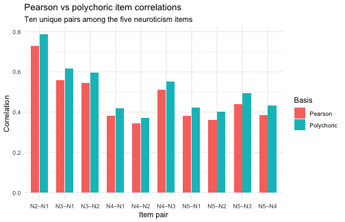

<!-- Generated by vignettes/precompute.R; DO NOT EDIT BY HAND.
     Edit ackwards-ordinal.Rmd.orig and re-run `Rscript vignettes/precompute.R`.
     Freshness is enforced by tools/check-vignette-freshness.R (M65). -->
<!-- precompute-stamp: source=ackwards-ordinal.Rmd.orig md5=00597c2d172951716f52ce7dfa9ac4b7 -->


Most psychological scales use ordinal response formats: Likert-type items with a
handful of ordered categories, binary (yes/no) items, and everything in between.
Treating these as continuous and computing Pearson correlations between them is
ubiquitous in practice, but it introduces systematic bias that can distort both
loadings and the between-level edges that bass-ackwards analysis depends on. This
vignette explains the problem and how `ackwards` addresses it.

## Why Pearson underestimates for ordinal items

When a continuous latent trait is sliced into a small number of ordered
categories, the observed correlation between two items is always lower than the
correlation between their underlying latent variables. The more coarse the
rating scale, the larger the attenuation. For a 5-point scale, Pearson
correlations can be 10–20% lower than the true latent correlations; for a
2-point (binary) scale, the underestimate can exceed 30%.

This matters for bass-ackwards analysis because:

1. **Loadings are attenuated.** Factors appear weaker than they are.
2. **Between-level edges are attenuated.** The hierarchy looks flatter —
   factors that should be nearly perfectly correlated across levels may appear
   only moderately correlated.
3. **The number of factors is underestimated.** Attenuation compresses the
   eigenvalue spectrum, so selection criteria (parallel analysis, MAP) may
   suggest fewer factors than truly exist.

## The polychoric solution

A **polychoric correlation** between two ordinal items estimates the Pearson
correlation that *would* exist between their underlying continuous latent
variables, if those variables had been measured without discretization. It does
this by fitting a bivariate normal model with thresholds at each category
boundary.

For binary (two-category) items this same estimate is traditionally called a
*tetrachoric* correlation, but it is not a separate method — tetrachoric is
simply the two-category special case of polychoric. `cor = "polychoric"` handles
binary items automatically: `psych::polychoric()` detects the two-level case and
returns the tetrachoric estimate, so you never request tetrachoric separately.

Setting `cor = "polychoric"` in `ackwards()` replaces step 1 of the pipeline —
computing the item correlation matrix `R` — with a polychoric matrix. All
downstream computation (factor extraction, rotation, tenBerge scoring,
between-level algebra) then operates on that polychoric `R`.

## Automatic detection

`ackwards()` checks for ordinal-looking data using a simple heuristic: if any
column is integer-valued with ≤ 7 distinct levels, the data is flagged and a
warning is issued when `cor = "pearson"` (the default).


``` r
library(ackwards)
bfi <- na.omit(bfi25)
```


``` r
# The warning fires with the default Pearson basis
x_pearson <- ackwards(bfi, k_max = 5)
```

The warning is ackwards reminding you to make an active choice. Specifying
`cor = "polychoric"` acknowledges the data type and suppresses it:


``` r
x_poly <- ackwards(bfi, k_max = 5, cor = "polychoric")
```

## Seeing the difference

### Correlation matrices

The most direct way to see the impact of the basis is to compare the item
correlations under each basis. Rather than read two 5×5 matrices side by side,
the chart below plots the ten unique item-pair correlations among the five
neuroticism items (`N1`–`N5`), Pearson against polychoric.


<div class="figure">

<p class="caption">plot of chunk r-compare</p>
</div>

Every polychoric bar sits above its Pearson counterpart — the correlations are
consistently higher. The `N1`–`N2` pair, for instance, goes from about 0.73
(Pearson) to 0.79 (polychoric); across the block the increase runs to roughly
0.05, enough to shift loadings and change eigenvalues.

### Loadings

The table below compares primary loadings — the loading of each Neuroticism item
on its dominant factor — under both correlation bases at k = 5. The Δ column is
the attenuation: how much larger each loading becomes (in absolute value) once
the polychoric basis removes the coarse-category suppression. Using
|Polychoric| − |Pearson| keeps the attenuation positive regardless of loading
sign.

<!--html_preserve--><div id="ddczhqbvif" style="padding-left:0px;padding-right:0px;padding-top:10px;padding-bottom:10px;overflow-x:auto;overflow-y:auto;width:auto;height:auto;">
<style>#ddczhqbvif table {
  font-family: system-ui, 'Segoe UI', Roboto, Helvetica, Arial, sans-serif, 'Apple Color Emoji', 'Segoe UI Emoji', 'Segoe UI Symbol', 'Noto Color Emoji';
  -webkit-font-smoothing: antialiased;
  -moz-osx-font-smoothing: grayscale;
}

#ddczhqbvif thead, #ddczhqbvif tbody, #ddczhqbvif tfoot, #ddczhqbvif tr, #ddczhqbvif td, #ddczhqbvif th {
  border-style: none;
}

#ddczhqbvif p {
  margin: 0;
  padding: 0;
}

#ddczhqbvif .gt_table {
  display: table;
  border-collapse: collapse;
  line-height: normal;
  margin-left: auto;
  margin-right: auto;
  color: #333333;
  font-size: 16px;
  font-weight: normal;
  font-style: normal;
  background-color: #FFFFFF;
  width: auto;
  border-top-style: solid;
  border-top-width: 2px;
  border-top-color: #A8A8A8;
  border-right-style: none;
  border-right-width: 2px;
  border-right-color: #D3D3D3;
  border-bottom-style: solid;
  border-bottom-width: 2px;
  border-bottom-color: #A8A8A8;
  border-left-style: none;
  border-left-width: 2px;
  border-left-color: #D3D3D3;
}

#ddczhqbvif .gt_caption {
  padding-top: 4px;
  padding-bottom: 4px;
}

#ddczhqbvif .gt_title {
  color: #333333;
  font-size: 125%;
  font-weight: initial;
  padding-top: 4px;
  padding-bottom: 4px;
  padding-left: 5px;
  padding-right: 5px;
  border-bottom-color: #FFFFFF;
  border-bottom-width: 0;
}

#ddczhqbvif .gt_subtitle {
  color: #333333;
  font-size: 85%;
  font-weight: initial;
  padding-top: 3px;
  padding-bottom: 5px;
  padding-left: 5px;
  padding-right: 5px;
  border-top-color: #FFFFFF;
  border-top-width: 0;
}

#ddczhqbvif .gt_heading {
  background-color: #FFFFFF;
  text-align: center;
  border-bottom-color: #FFFFFF;
  border-left-style: none;
  border-left-width: 1px;
  border-left-color: #D3D3D3;
  border-right-style: none;
  border-right-width: 1px;
  border-right-color: #D3D3D3;
}

#ddczhqbvif .gt_bottom_border {
  border-bottom-style: solid;
  border-bottom-width: 2px;
  border-bottom-color: #D3D3D3;
}

#ddczhqbvif .gt_col_headings {
  border-top-style: solid;
  border-top-width: 2px;
  border-top-color: #D3D3D3;
  border-bottom-style: solid;
  border-bottom-width: 2px;
  border-bottom-color: #D3D3D3;
  border-left-style: none;
  border-left-width: 1px;
  border-left-color: #D3D3D3;
  border-right-style: none;
  border-right-width: 1px;
  border-right-color: #D3D3D3;
}

#ddczhqbvif .gt_col_heading {
  color: #333333;
  background-color: #FFFFFF;
  font-size: 100%;
  font-weight: normal;
  text-transform: inherit;
  border-left-style: none;
  border-left-width: 1px;
  border-left-color: #D3D3D3;
  border-right-style: none;
  border-right-width: 1px;
  border-right-color: #D3D3D3;
  vertical-align: bottom;
  padding-top: 5px;
  padding-bottom: 6px;
  padding-left: 5px;
  padding-right: 5px;
  overflow-x: hidden;
}

#ddczhqbvif .gt_column_spanner_outer {
  color: #333333;
  background-color: #FFFFFF;
  font-size: 100%;
  font-weight: normal;
  text-transform: inherit;
  padding-top: 0;
  padding-bottom: 0;
  padding-left: 4px;
  padding-right: 4px;
}

#ddczhqbvif .gt_column_spanner_outer:first-child {
  padding-left: 0;
}

#ddczhqbvif .gt_column_spanner_outer:last-child {
  padding-right: 0;
}

#ddczhqbvif .gt_column_spanner {
  border-bottom-style: solid;
  border-bottom-width: 2px;
  border-bottom-color: #D3D3D3;
  vertical-align: bottom;
  padding-top: 5px;
  padding-bottom: 5px;
  overflow-x: hidden;
  display: inline-block;
  width: 100%;
}

#ddczhqbvif .gt_spanner_row {
  border-bottom-style: hidden;
}

#ddczhqbvif .gt_group_heading {
  padding-top: 8px;
  padding-bottom: 8px;
  padding-left: 5px;
  padding-right: 5px;
  color: #333333;
  background-color: #FFFFFF;
  font-size: 100%;
  font-weight: initial;
  text-transform: inherit;
  border-top-style: solid;
  border-top-width: 2px;
  border-top-color: #D3D3D3;
  border-bottom-style: solid;
  border-bottom-width: 2px;
  border-bottom-color: #D3D3D3;
  border-left-style: none;
  border-left-width: 1px;
  border-left-color: #D3D3D3;
  border-right-style: none;
  border-right-width: 1px;
  border-right-color: #D3D3D3;
  vertical-align: middle;
  text-align: left;
}

#ddczhqbvif .gt_empty_group_heading {
  padding: 0.5px;
  color: #333333;
  background-color: #FFFFFF;
  font-size: 100%;
  font-weight: initial;
  border-top-style: solid;
  border-top-width: 2px;
  border-top-color: #D3D3D3;
  border-bottom-style: solid;
  border-bottom-width: 2px;
  border-bottom-color: #D3D3D3;
  vertical-align: middle;
}

#ddczhqbvif .gt_from_md > :first-child {
  margin-top: 0;
}

#ddczhqbvif .gt_from_md > :last-child {
  margin-bottom: 0;
}

#ddczhqbvif .gt_row {
  padding-top: 8px;
  padding-bottom: 8px;
  padding-left: 5px;
  padding-right: 5px;
  margin: 10px;
  border-top-style: solid;
  border-top-width: 1px;
  border-top-color: #D3D3D3;
  border-left-style: none;
  border-left-width: 1px;
  border-left-color: #D3D3D3;
  border-right-style: none;
  border-right-width: 1px;
  border-right-color: #D3D3D3;
  vertical-align: middle;
  overflow-x: hidden;
}

#ddczhqbvif .gt_stub {
  color: #333333;
  background-color: #FFFFFF;
  font-size: 100%;
  font-weight: initial;
  text-transform: inherit;
  border-right-style: solid;
  border-right-width: 2px;
  border-right-color: #D3D3D3;
  padding-left: 5px;
  padding-right: 5px;
}

#ddczhqbvif .gt_stub_row_group {
  color: #333333;
  background-color: #FFFFFF;
  font-size: 100%;
  font-weight: initial;
  text-transform: inherit;
  border-right-style: solid;
  border-right-width: 2px;
  border-right-color: #D3D3D3;
  padding-left: 5px;
  padding-right: 5px;
  vertical-align: top;
}

#ddczhqbvif .gt_row_group_first td {
  border-top-width: 2px;
}

#ddczhqbvif .gt_row_group_first th {
  border-top-width: 2px;
}

#ddczhqbvif .gt_summary_row {
  color: #333333;
  background-color: #FFFFFF;
  text-transform: inherit;
  padding-top: 8px;
  padding-bottom: 8px;
  padding-left: 5px;
  padding-right: 5px;
}

#ddczhqbvif .gt_first_summary_row {
  border-top-style: solid;
  border-top-color: #D3D3D3;
}

#ddczhqbvif .gt_first_summary_row.thick {
  border-top-width: 2px;
}

#ddczhqbvif .gt_last_summary_row {
  padding-top: 8px;
  padding-bottom: 8px;
  padding-left: 5px;
  padding-right: 5px;
  border-bottom-style: solid;
  border-bottom-width: 2px;
  border-bottom-color: #D3D3D3;
}

#ddczhqbvif .gt_grand_summary_row {
  color: #333333;
  background-color: #FFFFFF;
  text-transform: inherit;
  padding-top: 8px;
  padding-bottom: 8px;
  padding-left: 5px;
  padding-right: 5px;
}

#ddczhqbvif .gt_first_grand_summary_row {
  padding-top: 8px;
  padding-bottom: 8px;
  padding-left: 5px;
  padding-right: 5px;
  border-top-style: double;
  border-top-width: 6px;
  border-top-color: #D3D3D3;
}

#ddczhqbvif .gt_last_grand_summary_row_top {
  padding-top: 8px;
  padding-bottom: 8px;
  padding-left: 5px;
  padding-right: 5px;
  border-bottom-style: double;
  border-bottom-width: 6px;
  border-bottom-color: #D3D3D3;
}

#ddczhqbvif .gt_striped {
  background-color: rgba(128, 128, 128, 0.05);
}

#ddczhqbvif .gt_table_body {
  border-top-style: solid;
  border-top-width: 2px;
  border-top-color: #D3D3D3;
  border-bottom-style: solid;
  border-bottom-width: 2px;
  border-bottom-color: #D3D3D3;
}

#ddczhqbvif .gt_footnotes {
  color: #333333;
  background-color: #FFFFFF;
  border-bottom-style: none;
  border-bottom-width: 2px;
  border-bottom-color: #D3D3D3;
  border-left-style: none;
  border-left-width: 2px;
  border-left-color: #D3D3D3;
  border-right-style: none;
  border-right-width: 2px;
  border-right-color: #D3D3D3;
}

#ddczhqbvif .gt_footnote {
  margin: 0px;
  font-size: 90%;
  padding-top: 4px;
  padding-bottom: 4px;
  padding-left: 5px;
  padding-right: 5px;
}

#ddczhqbvif .gt_sourcenotes {
  color: #333333;
  background-color: #FFFFFF;
  border-bottom-style: none;
  border-bottom-width: 2px;
  border-bottom-color: #D3D3D3;
  border-left-style: none;
  border-left-width: 2px;
  border-left-color: #D3D3D3;
  border-right-style: none;
  border-right-width: 2px;
  border-right-color: #D3D3D3;
}

#ddczhqbvif .gt_sourcenote {
  font-size: 90%;
  padding-top: 4px;
  padding-bottom: 4px;
  padding-left: 5px;
  padding-right: 5px;
}

#ddczhqbvif .gt_left {
  text-align: left;
}

#ddczhqbvif .gt_center {
  text-align: center;
}

#ddczhqbvif .gt_right {
  text-align: right;
  font-variant-numeric: tabular-nums;
}

#ddczhqbvif .gt_font_normal {
  font-weight: normal;
}

#ddczhqbvif .gt_font_bold {
  font-weight: bold;
}

#ddczhqbvif .gt_font_italic {
  font-style: italic;
}

#ddczhqbvif .gt_super {
  font-size: 65%;
}

#ddczhqbvif .gt_footnote_marks {
  font-size: 75%;
  vertical-align: 0.4em;
  position: initial;
}

#ddczhqbvif .gt_asterisk {
  font-size: 100%;
  vertical-align: 0;
}

#ddczhqbvif .gt_indent_1 {
  text-indent: 5px;
}

#ddczhqbvif .gt_indent_2 {
  text-indent: 10px;
}

#ddczhqbvif .gt_indent_3 {
  text-indent: 15px;
}

#ddczhqbvif .gt_indent_4 {
  text-indent: 20px;
}

#ddczhqbvif .gt_indent_5 {
  text-indent: 25px;
}

#ddczhqbvif .katex-display {
  display: inline-flex !important;
  margin-bottom: 0.75em !important;
}

#ddczhqbvif div.Reactable > div.rt-table > div.rt-thead > div.rt-tr.rt-tr-group-header > div.rt-th-group:after {
  height: 0px !important;
}
</style>
<table class="gt_table" data-quarto-disable-processing="false" data-quarto-bootstrap="false">
  <thead>
    <tr class="gt_heading">
      <td colspan="5" class="gt_heading gt_title gt_font_normal" style>Neuroticism-item loadings at k = 5: Pearson vs polychoric</td>
    </tr>
    <tr class="gt_heading">
      <td colspan="5" class="gt_heading gt_subtitle gt_font_normal gt_bottom_border" style>Positive Δ = attenuation removed by the polychoric basis</td>
    </tr>
    <tr class="gt_col_headings gt_spanner_row">
      <th class="gt_col_heading gt_columns_bottom_border gt_left" rowspan="2" colspan="1" scope="col" id="item">Item</th>
      <th class="gt_col_heading gt_columns_bottom_border gt_left" rowspan="2" colspan="1" scope="col" id="factor">Factor</th>
      <th class="gt_center gt_columns_top_border gt_column_spanner_outer" rowspan="1" colspan="3" scope="colgroup" id="Primary loading">
        <div class="gt_column_spanner">Primary loading</div>
      </th>
    </tr>
    <tr class="gt_col_headings">
      <th class="gt_col_heading gt_columns_bottom_border gt_right" rowspan="1" colspan="1" scope="col" id="loading_pearson">Pearson</th>
      <th class="gt_col_heading gt_columns_bottom_border gt_right" rowspan="1" colspan="1" scope="col" id="loading_poly">Polychoric</th>
      <th class="gt_col_heading gt_columns_bottom_border gt_right" rowspan="1" colspan="1" style="font-weight: bold;" scope="col" id="delta">Δ (|Poly| − |Pearson|)<span class="gt_footnote_marks" style="white-space:nowrap;font-style:italic;font-weight:normal;line-height:0;"><sup>1</sup></span></th>
    </tr>
  </thead>
  <tbody class="gt_table_body">
    <tr><td headers="item" class="gt_row gt_left">N1</td>
<td headers="factor" class="gt_row gt_left">m5f2</td>
<td headers="loading_pearson" class="gt_row gt_right">−0.79</td>
<td headers="loading_poly" class="gt_row gt_right">−0.81</td>
<td headers="delta" class="gt_row gt_right">0.02</td></tr>
    <tr><td headers="item" class="gt_row gt_left">N2</td>
<td headers="factor" class="gt_row gt_left">m5f2</td>
<td headers="loading_pearson" class="gt_row gt_right">−0.78</td>
<td headers="loading_poly" class="gt_row gt_right">−0.81</td>
<td headers="delta" class="gt_row gt_right">0.02</td></tr>
    <tr><td headers="item" class="gt_row gt_left">N3</td>
<td headers="factor" class="gt_row gt_left">m5f2</td>
<td headers="loading_pearson" class="gt_row gt_right">−0.80</td>
<td headers="loading_poly" class="gt_row gt_right">−0.82</td>
<td headers="delta" class="gt_row gt_right">0.03</td></tr>
    <tr><td headers="item" class="gt_row gt_left">N4</td>
<td headers="factor" class="gt_row gt_left">m5f2</td>
<td headers="loading_pearson" class="gt_row gt_right">−0.63</td>
<td headers="loading_poly" class="gt_row gt_right">−0.65</td>
<td headers="delta" class="gt_row gt_right">0.02</td></tr>
    <tr><td headers="item" class="gt_row gt_left">N5</td>
<td headers="factor" class="gt_row gt_left">m5f2</td>
<td headers="loading_pearson" class="gt_row gt_right">−0.66</td>
<td headers="loading_poly" class="gt_row gt_right">−0.69</td>
<td headers="delta" class="gt_row gt_right">0.03</td></tr>
  </tbody>
  <tfoot>
    <tr class="gt_footnotes">
      <td class="gt_footnote" colspan="5"><span class="gt_footnote_marks" style="white-space:nowrap;font-style:italic;font-weight:normal;line-height:0;"><sup>1</sup></span> Factor assignment and sign verified to match between bases. Delta uses |Poly| - |Pearson| so attenuation is positive regardless of loading sign.</td>
    </tr>
  </tfoot>
</table>
</div><!--/html_preserve-->

Polychoric loadings for the Neuroticism items are noticeably higher — the latent
structure is sharper when the attenuating effect of coarse categories is
removed.

### Between-level edges

The same comparison for the primary-parent edges. The Δ column is the change in
connection strength (|r|): positive where the polychoric basis recovers a
stronger connection by undoing attenuation, negative in the few cases where the
recovered structure is slightly looser. Using absolute values makes the
direction read correctly even for the negatively-signed edge.

<!--html_preserve--><div id="cmewmduzfu" style="padding-left:0px;padding-right:0px;padding-top:10px;padding-bottom:10px;overflow-x:auto;overflow-y:auto;width:auto;height:auto;">
<style>#cmewmduzfu table {
  font-family: system-ui, 'Segoe UI', Roboto, Helvetica, Arial, sans-serif, 'Apple Color Emoji', 'Segoe UI Emoji', 'Segoe UI Symbol', 'Noto Color Emoji';
  -webkit-font-smoothing: antialiased;
  -moz-osx-font-smoothing: grayscale;
}

#cmewmduzfu thead, #cmewmduzfu tbody, #cmewmduzfu tfoot, #cmewmduzfu tr, #cmewmduzfu td, #cmewmduzfu th {
  border-style: none;
}

#cmewmduzfu p {
  margin: 0;
  padding: 0;
}

#cmewmduzfu .gt_table {
  display: table;
  border-collapse: collapse;
  line-height: normal;
  margin-left: auto;
  margin-right: auto;
  color: #333333;
  font-size: 16px;
  font-weight: normal;
  font-style: normal;
  background-color: #FFFFFF;
  width: auto;
  border-top-style: solid;
  border-top-width: 2px;
  border-top-color: #A8A8A8;
  border-right-style: none;
  border-right-width: 2px;
  border-right-color: #D3D3D3;
  border-bottom-style: solid;
  border-bottom-width: 2px;
  border-bottom-color: #A8A8A8;
  border-left-style: none;
  border-left-width: 2px;
  border-left-color: #D3D3D3;
}

#cmewmduzfu .gt_caption {
  padding-top: 4px;
  padding-bottom: 4px;
}

#cmewmduzfu .gt_title {
  color: #333333;
  font-size: 125%;
  font-weight: initial;
  padding-top: 4px;
  padding-bottom: 4px;
  padding-left: 5px;
  padding-right: 5px;
  border-bottom-color: #FFFFFF;
  border-bottom-width: 0;
}

#cmewmduzfu .gt_subtitle {
  color: #333333;
  font-size: 85%;
  font-weight: initial;
  padding-top: 3px;
  padding-bottom: 5px;
  padding-left: 5px;
  padding-right: 5px;
  border-top-color: #FFFFFF;
  border-top-width: 0;
}

#cmewmduzfu .gt_heading {
  background-color: #FFFFFF;
  text-align: center;
  border-bottom-color: #FFFFFF;
  border-left-style: none;
  border-left-width: 1px;
  border-left-color: #D3D3D3;
  border-right-style: none;
  border-right-width: 1px;
  border-right-color: #D3D3D3;
}

#cmewmduzfu .gt_bottom_border {
  border-bottom-style: solid;
  border-bottom-width: 2px;
  border-bottom-color: #D3D3D3;
}

#cmewmduzfu .gt_col_headings {
  border-top-style: solid;
  border-top-width: 2px;
  border-top-color: #D3D3D3;
  border-bottom-style: solid;
  border-bottom-width: 2px;
  border-bottom-color: #D3D3D3;
  border-left-style: none;
  border-left-width: 1px;
  border-left-color: #D3D3D3;
  border-right-style: none;
  border-right-width: 1px;
  border-right-color: #D3D3D3;
}

#cmewmduzfu .gt_col_heading {
  color: #333333;
  background-color: #FFFFFF;
  font-size: 100%;
  font-weight: normal;
  text-transform: inherit;
  border-left-style: none;
  border-left-width: 1px;
  border-left-color: #D3D3D3;
  border-right-style: none;
  border-right-width: 1px;
  border-right-color: #D3D3D3;
  vertical-align: bottom;
  padding-top: 5px;
  padding-bottom: 6px;
  padding-left: 5px;
  padding-right: 5px;
  overflow-x: hidden;
}

#cmewmduzfu .gt_column_spanner_outer {
  color: #333333;
  background-color: #FFFFFF;
  font-size: 100%;
  font-weight: normal;
  text-transform: inherit;
  padding-top: 0;
  padding-bottom: 0;
  padding-left: 4px;
  padding-right: 4px;
}

#cmewmduzfu .gt_column_spanner_outer:first-child {
  padding-left: 0;
}

#cmewmduzfu .gt_column_spanner_outer:last-child {
  padding-right: 0;
}

#cmewmduzfu .gt_column_spanner {
  border-bottom-style: solid;
  border-bottom-width: 2px;
  border-bottom-color: #D3D3D3;
  vertical-align: bottom;
  padding-top: 5px;
  padding-bottom: 5px;
  overflow-x: hidden;
  display: inline-block;
  width: 100%;
}

#cmewmduzfu .gt_spanner_row {
  border-bottom-style: hidden;
}

#cmewmduzfu .gt_group_heading {
  padding-top: 8px;
  padding-bottom: 8px;
  padding-left: 5px;
  padding-right: 5px;
  color: #333333;
  background-color: #FFFFFF;
  font-size: 100%;
  font-weight: initial;
  text-transform: inherit;
  border-top-style: solid;
  border-top-width: 2px;
  border-top-color: #D3D3D3;
  border-bottom-style: solid;
  border-bottom-width: 2px;
  border-bottom-color: #D3D3D3;
  border-left-style: none;
  border-left-width: 1px;
  border-left-color: #D3D3D3;
  border-right-style: none;
  border-right-width: 1px;
  border-right-color: #D3D3D3;
  vertical-align: middle;
  text-align: left;
}

#cmewmduzfu .gt_empty_group_heading {
  padding: 0.5px;
  color: #333333;
  background-color: #FFFFFF;
  font-size: 100%;
  font-weight: initial;
  border-top-style: solid;
  border-top-width: 2px;
  border-top-color: #D3D3D3;
  border-bottom-style: solid;
  border-bottom-width: 2px;
  border-bottom-color: #D3D3D3;
  vertical-align: middle;
}

#cmewmduzfu .gt_from_md > :first-child {
  margin-top: 0;
}

#cmewmduzfu .gt_from_md > :last-child {
  margin-bottom: 0;
}

#cmewmduzfu .gt_row {
  padding-top: 8px;
  padding-bottom: 8px;
  padding-left: 5px;
  padding-right: 5px;
  margin: 10px;
  border-top-style: solid;
  border-top-width: 1px;
  border-top-color: #D3D3D3;
  border-left-style: none;
  border-left-width: 1px;
  border-left-color: #D3D3D3;
  border-right-style: none;
  border-right-width: 1px;
  border-right-color: #D3D3D3;
  vertical-align: middle;
  overflow-x: hidden;
}

#cmewmduzfu .gt_stub {
  color: #333333;
  background-color: #FFFFFF;
  font-size: 100%;
  font-weight: initial;
  text-transform: inherit;
  border-right-style: solid;
  border-right-width: 2px;
  border-right-color: #D3D3D3;
  padding-left: 5px;
  padding-right: 5px;
}

#cmewmduzfu .gt_stub_row_group {
  color: #333333;
  background-color: #FFFFFF;
  font-size: 100%;
  font-weight: initial;
  text-transform: inherit;
  border-right-style: solid;
  border-right-width: 2px;
  border-right-color: #D3D3D3;
  padding-left: 5px;
  padding-right: 5px;
  vertical-align: top;
}

#cmewmduzfu .gt_row_group_first td {
  border-top-width: 2px;
}

#cmewmduzfu .gt_row_group_first th {
  border-top-width: 2px;
}

#cmewmduzfu .gt_summary_row {
  color: #333333;
  background-color: #FFFFFF;
  text-transform: inherit;
  padding-top: 8px;
  padding-bottom: 8px;
  padding-left: 5px;
  padding-right: 5px;
}

#cmewmduzfu .gt_first_summary_row {
  border-top-style: solid;
  border-top-color: #D3D3D3;
}

#cmewmduzfu .gt_first_summary_row.thick {
  border-top-width: 2px;
}

#cmewmduzfu .gt_last_summary_row {
  padding-top: 8px;
  padding-bottom: 8px;
  padding-left: 5px;
  padding-right: 5px;
  border-bottom-style: solid;
  border-bottom-width: 2px;
  border-bottom-color: #D3D3D3;
}

#cmewmduzfu .gt_grand_summary_row {
  color: #333333;
  background-color: #FFFFFF;
  text-transform: inherit;
  padding-top: 8px;
  padding-bottom: 8px;
  padding-left: 5px;
  padding-right: 5px;
}

#cmewmduzfu .gt_first_grand_summary_row {
  padding-top: 8px;
  padding-bottom: 8px;
  padding-left: 5px;
  padding-right: 5px;
  border-top-style: double;
  border-top-width: 6px;
  border-top-color: #D3D3D3;
}

#cmewmduzfu .gt_last_grand_summary_row_top {
  padding-top: 8px;
  padding-bottom: 8px;
  padding-left: 5px;
  padding-right: 5px;
  border-bottom-style: double;
  border-bottom-width: 6px;
  border-bottom-color: #D3D3D3;
}

#cmewmduzfu .gt_striped {
  background-color: rgba(128, 128, 128, 0.05);
}

#cmewmduzfu .gt_table_body {
  border-top-style: solid;
  border-top-width: 2px;
  border-top-color: #D3D3D3;
  border-bottom-style: solid;
  border-bottom-width: 2px;
  border-bottom-color: #D3D3D3;
}

#cmewmduzfu .gt_footnotes {
  color: #333333;
  background-color: #FFFFFF;
  border-bottom-style: none;
  border-bottom-width: 2px;
  border-bottom-color: #D3D3D3;
  border-left-style: none;
  border-left-width: 2px;
  border-left-color: #D3D3D3;
  border-right-style: none;
  border-right-width: 2px;
  border-right-color: #D3D3D3;
}

#cmewmduzfu .gt_footnote {
  margin: 0px;
  font-size: 90%;
  padding-top: 4px;
  padding-bottom: 4px;
  padding-left: 5px;
  padding-right: 5px;
}

#cmewmduzfu .gt_sourcenotes {
  color: #333333;
  background-color: #FFFFFF;
  border-bottom-style: none;
  border-bottom-width: 2px;
  border-bottom-color: #D3D3D3;
  border-left-style: none;
  border-left-width: 2px;
  border-left-color: #D3D3D3;
  border-right-style: none;
  border-right-width: 2px;
  border-right-color: #D3D3D3;
}

#cmewmduzfu .gt_sourcenote {
  font-size: 90%;
  padding-top: 4px;
  padding-bottom: 4px;
  padding-left: 5px;
  padding-right: 5px;
}

#cmewmduzfu .gt_left {
  text-align: left;
}

#cmewmduzfu .gt_center {
  text-align: center;
}

#cmewmduzfu .gt_right {
  text-align: right;
  font-variant-numeric: tabular-nums;
}

#cmewmduzfu .gt_font_normal {
  font-weight: normal;
}

#cmewmduzfu .gt_font_bold {
  font-weight: bold;
}

#cmewmduzfu .gt_font_italic {
  font-style: italic;
}

#cmewmduzfu .gt_super {
  font-size: 65%;
}

#cmewmduzfu .gt_footnote_marks {
  font-size: 75%;
  vertical-align: 0.4em;
  position: initial;
}

#cmewmduzfu .gt_asterisk {
  font-size: 100%;
  vertical-align: 0;
}

#cmewmduzfu .gt_indent_1 {
  text-indent: 5px;
}

#cmewmduzfu .gt_indent_2 {
  text-indent: 10px;
}

#cmewmduzfu .gt_indent_3 {
  text-indent: 15px;
}

#cmewmduzfu .gt_indent_4 {
  text-indent: 20px;
}

#cmewmduzfu .gt_indent_5 {
  text-indent: 25px;
}

#cmewmduzfu .katex-display {
  display: inline-flex !important;
  margin-bottom: 0.75em !important;
}

#cmewmduzfu div.Reactable > div.rt-table > div.rt-thead > div.rt-tr.rt-tr-group-header > div.rt-th-group:after {
  height: 0px !important;
}
</style>
<table class="gt_table" data-quarto-disable-processing="false" data-quarto-bootstrap="false">
  <thead>
    <tr class="gt_heading">
      <td colspan="5" class="gt_heading gt_title gt_font_normal" style>Primary-parent edges: Pearson vs polychoric</td>
    </tr>
    <tr class="gt_heading">
      <td colspan="5" class="gt_heading gt_subtitle gt_font_normal gt_bottom_border" style>Δ = change in |r|; positive = stronger connection under polychoric basis</td>
    </tr>
    <tr class="gt_col_headings gt_spanner_row">
      <th class="gt_col_heading gt_columns_bottom_border gt_left" rowspan="2" colspan="1" scope="col" id="from">From</th>
      <th class="gt_col_heading gt_columns_bottom_border gt_left" rowspan="2" colspan="1" scope="col" id="to">To</th>
      <th class="gt_center gt_columns_top_border gt_column_spanner_outer" rowspan="1" colspan="3" scope="colgroup" id="Edge strength (r)">
        <div class="gt_column_spanner">Edge strength (r)</div>
      </th>
    </tr>
    <tr class="gt_col_headings">
      <th class="gt_col_heading gt_columns_bottom_border gt_right" rowspan="1" colspan="1" scope="col" id="r_pearson">Pearson</th>
      <th class="gt_col_heading gt_columns_bottom_border gt_right" rowspan="1" colspan="1" scope="col" id="r_poly">Polychoric</th>
      <th class="gt_col_heading gt_columns_bottom_border gt_right" rowspan="1" colspan="1" style="font-weight: bold;" scope="col" id="delta">Δ (|Poly| − |Pearson|)<span class="gt_footnote_marks" style="white-space:nowrap;font-style:italic;font-weight:normal;line-height:0;"><sup>1</sup></span></th>
    </tr>
  </thead>
  <tbody class="gt_table_body">
    <tr><td headers="from" class="gt_row gt_left">m1f1</td>
<td headers="to" class="gt_row gt_left">m2f1</td>
<td headers="r_pearson" class="gt_row gt_right">0.88</td>
<td headers="r_poly" class="gt_row gt_right">0.89</td>
<td headers="delta" class="gt_row gt_right">0.01</td></tr>
    <tr><td headers="from" class="gt_row gt_left">m1f1</td>
<td headers="to" class="gt_row gt_left">m2f2</td>
<td headers="r_pearson" class="gt_row gt_right">0.48</td>
<td headers="r_poly" class="gt_row gt_right">0.46</td>
<td headers="delta" class="gt_row gt_right">−0.02</td></tr>
    <tr><td headers="from" class="gt_row gt_left">m2f1</td>
<td headers="to" class="gt_row gt_left">m3f1</td>
<td headers="r_pearson" class="gt_row gt_right">0.90</td>
<td headers="r_poly" class="gt_row gt_right">0.87</td>
<td headers="delta" class="gt_row gt_right">−0.02</td></tr>
    <tr><td headers="from" class="gt_row gt_left">m2f2</td>
<td headers="to" class="gt_row gt_left">m3f2</td>
<td headers="r_pearson" class="gt_row gt_right">0.97</td>
<td headers="r_poly" class="gt_row gt_right">0.99</td>
<td headers="delta" class="gt_row gt_right">0.02</td></tr>
    <tr><td headers="from" class="gt_row gt_left">m2f1</td>
<td headers="to" class="gt_row gt_left">m3f3</td>
<td headers="r_pearson" class="gt_row gt_right">0.43</td>
<td headers="r_poly" class="gt_row gt_right">0.48</td>
<td headers="delta" class="gt_row gt_right">0.05</td></tr>
    <tr><td headers="from" class="gt_row gt_left">m3f1</td>
<td headers="to" class="gt_row gt_left">m4f1</td>
<td headers="r_pearson" class="gt_row gt_right">1.00</td>
<td headers="r_poly" class="gt_row gt_right">0.99</td>
<td headers="delta" class="gt_row gt_right">0.00</td></tr>
    <tr><td headers="from" class="gt_row gt_left">m3f2</td>
<td headers="to" class="gt_row gt_left">m4f2</td>
<td headers="r_pearson" class="gt_row gt_right">0.99</td>
<td headers="r_poly" class="gt_row gt_right">0.98</td>
<td headers="delta" class="gt_row gt_right">−0.01</td></tr>
    <tr><td headers="from" class="gt_row gt_left">m3f3</td>
<td headers="to" class="gt_row gt_left">m4f3</td>
<td headers="r_pearson" class="gt_row gt_right">0.80</td>
<td headers="r_poly" class="gt_row gt_right">0.73</td>
<td headers="delta" class="gt_row gt_right">−0.07</td></tr>
    <tr><td headers="from" class="gt_row gt_left">m3f3</td>
<td headers="to" class="gt_row gt_left">m4f4</td>
<td headers="r_pearson" class="gt_row gt_right">0.59</td>
<td headers="r_poly" class="gt_row gt_right">0.68</td>
<td headers="delta" class="gt_row gt_right">0.09</td></tr>
    <tr><td headers="from" class="gt_row gt_left">m4f1</td>
<td headers="to" class="gt_row gt_left">m5f1</td>
<td headers="r_pearson" class="gt_row gt_right">0.82</td>
<td headers="r_poly" class="gt_row gt_right">0.84</td>
<td headers="delta" class="gt_row gt_right">0.02</td></tr>
    <tr><td headers="from" class="gt_row gt_left">m4f2</td>
<td headers="to" class="gt_row gt_left">m5f2</td>
<td headers="r_pearson" class="gt_row gt_right">1.00</td>
<td headers="r_poly" class="gt_row gt_right">1.00</td>
<td headers="delta" class="gt_row gt_right">0.00</td></tr>
    <tr><td headers="from" class="gt_row gt_left">m4f3</td>
<td headers="to" class="gt_row gt_left">m5f3</td>
<td headers="r_pearson" class="gt_row gt_right">0.98</td>
<td headers="r_poly" class="gt_row gt_right">0.98</td>
<td headers="delta" class="gt_row gt_right">0.01</td></tr>
    <tr><td headers="from" class="gt_row gt_left">m4f1</td>
<td headers="to" class="gt_row gt_left">m5f4</td>
<td headers="r_pearson" class="gt_row gt_right">0.58</td>
<td headers="r_poly" class="gt_row gt_right">0.55</td>
<td headers="delta" class="gt_row gt_right">−0.03</td></tr>
    <tr><td headers="from" class="gt_row gt_left">m4f4</td>
<td headers="to" class="gt_row gt_left">m5f5</td>
<td headers="r_pearson" class="gt_row gt_right">0.96</td>
<td headers="r_poly" class="gt_row gt_right">0.99</td>
<td headers="delta" class="gt_row gt_right">0.03</td></tr>
  </tbody>
  <tfoot>
    <tr class="gt_footnotes">
      <td class="gt_footnote" colspan="5"><span class="gt_footnote_marks" style="white-space:nowrap;font-style:italic;font-weight:normal;line-height:0;"><sup>1</sup></span> NA in either column means the bases disagree on the primary parent for that factor.</td>
    </tr>
  </tfoot>
</table>
</div><!--/html_preserve-->

The edges are broadly similar in sign and rank order — the hierarchy is the
same — but polychoric edges are stronger. Factors that represent genuinely stable
dimensions show near-perfect correlations with their counterparts at adjacent
levels when the true latent structure is properly recovered.

## WLSMV for ESEM with ordinal items

When `engine = "esem"` and `cor = "polychoric"` are combined, `ackwards()`
automatically switches the lavaan estimator to **WLSMV** (diagonally weighted
least squares, mean- and variance-adjusted). This is the standard estimator for
structural equation models with categorical or ordinal indicators, and is the
same method used by Mplus by default.

WLSMV genuinely operates on the polychoric basis: lavaan estimates the item
thresholds and the polychoric correlations among the ordinal indicators, then
fits the factor model to *that* matrix using a diagonal weight matrix. So
combining `cor = "polychoric"` with the ESEM engine is not stacking two separate
corrections — the polychoric structure is precisely what WLSMV is built to model,
and the between-level edges are computed from lavaan's own latent correlation
matrix (not a separately estimated `psych` polychoric matrix).


``` r
x_esem <- ackwards(bfi, k_max = 3, engine = "esem", cor = "polychoric")
x_esem
#> 
#> ── Bass-Ackwards Analysis (ackwards) ───────────────────────────────────────────
#> Engine: esem
#> Rotation: varimax
#> Basis: polychoric
#> n: 875
#> k (max): 3
#> 
#> ── Levels ──
#> 
#> ✔ k = 1: 1 factor, 23.5% variance
#> ✔ k = 2: 2 factors, 32.9% variance
#> ✔ k = 3: 3 factors, 39.5% variance
#> 
#> ── Edges ──
#> 
#> 5 of 8 edges have |r| ≥ 0.3
#> ────────────────────────────────────────────────────────────────────────────────
#> Note: This is a series of linked solutions, not a fitted hierarchical model.
#> Cross-level edges are descriptive score correlations. Per-level fit indices
#> (EFA/ESEM) describe how well a k-factor model fits the items at that level --
#> they do not validate the edges or the hierarchy itself.
```

The WLSMV fit indices (CFI, RMSEA, SRMR) are now computed on a model that
respects the ordinal measurement level. They will typically look better than
Pearson-based fit indices on the same data, reflecting both the better model
specification and the different reference distribution WLSMV uses.


``` r
tidy(x_esem, what = "fit", format = "wide")
#>   level      chi dof p_value       CFI       TLI     RMSEA       SRMR BIC
#> 1     2 3616.834 251       0 0.7117569 0.6554864 0.1238665 0.09547997  NA
#> 2     3 2448.356 228       0 0.8098533 0.7498069 0.1055573 0.07172502  NA
```

See `vignette("ackwards-engines")`, section "Per-level fit: what it tells you
(and what it doesn't)", for how to interpret these indices in the bass-ackwards
context and how to produce the `autoplot(what = "fit")` trajectory chart.

## Practical guidance: when to use polychoric

| Scale characteristics | Recommendation |
|-----------------------|---------------|
| Continuous or many categories (> 7) | `cor = "pearson"` (default) |
| 5–7 ordered categories (typical Likert) | `cor = "polychoric"` — recommended |
| 3–4 categories | `cor = "polychoric"` — strongly recommended |
| Binary (2 categories) | `cor = "polychoric"` — essential (this is the tetrachoric case) |

Polychoric estimation requires fitting a bivariate normal model for every item
pair. With p items that is p(p−1)/2 pairs — about 300 for a 25-item scale.
Computation is usually fast (seconds), but scales as O(p²) and can be slow for
very large item pools.

**Screen skewed or sparse scales first.** Clinical symptom scales and other
right-skewed items often have a response category endorsed by only a handful of
people. That can make `psych::polychoric()` fail under its default continuity
correction (set `correct = 0`), and — with many such items — drive the
correlation matrix *near-singular*, in which case per-level fit indices
(especially CFI, which comes back `NA`) and factor scores become unreliable.
Run [`check_items()`][ackwards::check_items] before fitting to see which items
are degenerate or sparse, and read the **"When to trust the result"** section of
`?ackwards` for how each warning maps to whether you should report the solution.
When a matrix is near-singular, `ackwards()` says so once and records it on the
object, so `print()`/`summary()` keep reminding you.

[`factorability()`][ackwards::factorability] is the companion screen for the
correlation matrix as a whole: it reports the KMO measure of sampling adequacy
(overall and per item), Bartlett's test of sphericity, the `N:p` ratio, and the
Ledermann bound on how many factors `p` items can identify. Call it on the same
`cor` basis you plan to fit. Read its output as *conventions, not verdicts* —
the KMO bands and `N:p` rules of thumb are contested — but a very low KMO or a
handful of low-MSA items is a useful early signal. `ackwards()` runs a light
version of this screen internally and warns only at the consequential extreme
(KMO below .5, `N:p` below 5, or `k_max` past the Ledermann bound for EFA/ESEM).

> **A note on score computation.** The short answer: yes, you can use the factor
> scores from an ordinal analysis in downstream work — the caveat below is about
> *scaling*, not validity. When `cor = "polychoric"`, the weight matrices stored
> in the object are derived from the polychoric `R`, but `augment()` materializes
> scores by applying those weights to Pearson-standardized raw data
> (`.standardize(data)`). The resulting scores are calibrated to *model-implied*
> unit variance rather than exactly empirical unit variance, so their empirical
> standard deviations will be close to but not precisely 1. That scaling nuance is
> the only reason `augment()` warns when `cor != "pearson"`; the warning does not
> mean the scores are biased or unusable. The between-level edges from
> `tidy(what = "edges")` are unaffected either way — they come from the exact
> algebra, not from materialized scores.

## References

Flora, D. B., & Curran, P. J. (2004). An empirical evaluation of alternative
methods of estimation for confirmatory factor analysis with ordinal data.
*Psychological Methods*, *9*(4), 466–491.

Muthén, B. O. (1984). A general structural equation model with dichotomous,
ordered categorical, and continuous latent variable indicators.
*Psychometrika*, *49*(1), 115–132.

Olsson, U. (1979). Maximum likelihood estimation of the polychoric correlation
coefficient. *Psychometrika*, *44*(4), 443–460.

Pearson, K. (1900). Mathematical contributions to the theory of evolution. VII.
On the correlation of characters not quantitatively measurable. *Philosophical
Transactions of the Royal Society of London, Series A*, *195*, 1–47.
