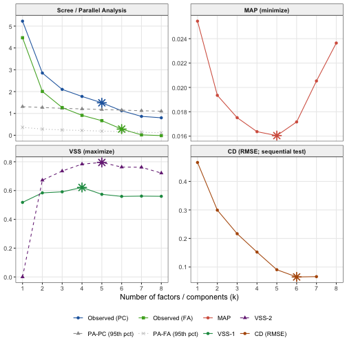

``` r
library(ackwards)
bfi <- na.omit(bfi25)
```

## k is a decision, not an output

Before you can run `ackwards()`, you need a value for `k_max` — the *maximum
depth* of the hierarchy. This is not the same question as "how many factors does
my data really have?" There is no single true k hidden in the data, and different
selection criteria will give different answers depending on their assumptions and
what they are optimized for.

The practical question is: **what range of k is defensible, and where should I
look?** `suggest_k()` is designed to help you answer that. It runs five
complementary criteria and reports their recommendations together, so you can
see where they agree and where they diverge.

A few things to keep in mind before you start:

**k_max is a maximum depth, not a claim about the true structure.** Setting
`k_max = 5` tells `ackwards()` to fit models at every level from 1 to 5 and
examine how the structure evolves across those levels. It does not assert that
exactly five factors exist. In fact, deliberately setting k_max one or two
levels past the
consensus — to watch factors fragment at the deeper levels — is a normal and
informative part of the analysis.

**Overextraction is the dominant error mode.** Simulation studies consistently
find that the most common mistake is retaining too many factors, not too few. An
overextracted level introduces factors with only 1–2 strong loadings and
between-level correlations near 1.0 (a sign that the parent factor simply split
in two without adding interpretive content). Forbes (2023) documents this
explicitly for the bass-ackwards context: non-replicable structure tends to
appear at the deeper levels of an overextracted hierarchy. Use the criteria below
to identify the upper end of the plausible range, and treat levels near that
ceiling with appropriate skepticism. Replicability near the ceiling can also be
measured directly, with split-half `comparability()` — see
`vignette("ackwards-girard")` for that workflow.

**No criterion is decisive on its own.** Each of the five criteria below
captures a different aspect of the data, tends to err in a different direction,
and can fail in different circumstances. A consensus across multiple criteria is
more trustworthy than any single recommendation. Even for parallel analysis,
Lim and Jahng (2019) recommend treating the estimate as a range of roughly ±1
factor resolved by interpretability — and Achim (2021) argues that even that
overstates its precision. That disagreement is why `suggest_k()` reports a
consensus range, never a single number.

## The five criteria

`suggest_k()` computes five criteria from the same data. Here they are with
their logic, typical behavior, and practical limitations.

### PA-PC — Parallel Analysis (PC basis)

**What it does.** Computes PC eigenvalues for the observed correlation matrix,
then simulates a large number of random correlation matrices of the same
dimensions. Retains components whose observed eigenvalues exceed the 95th
percentile of the simulated distribution.

**Typical behavior.** Tends to *overextract* — it often recommends more
components than replicate in independent samples, particularly when items are
moderately correlated (which they usually are in personality and clinical
research). Saucier (1997, footnote 14) reported parallel analysis suggesting as
many as 30 factors in wide lexical item sets. Treat its recommendation as an
*upper bound*.

**When it is useful.** Best paired with `engine = "pca"` in `ackwards()`, since
both operate on the same PC eigenvalue basis. It also provides a fast, stable
baseline across a wide range of data types.

**Limitation.** The 95th-percentile threshold is a convention, not a formal
test. With large samples, even trivial components can exceed the threshold.

---

### PA-FA — Parallel Analysis (FA basis)

**What it does.** The same logic as PA-PC, but applied to common-factor
eigenvalues rather than PC eigenvalues. The observed FA eigenvalues are compared
against the 95th percentile of simulated FA eigenvalues.

**Typical behavior.** More conservative than PA-PC. FA eigenvalues are smaller
(they exclude unique variance), so fewer of them exceed the random-data
threshold. PA-FA recommendations typically equal or fall below PA-PC.

**When it is useful.** The model-consistent criterion for `engine = "efa"` or
`engine = "esem"` in `ackwards()`: if your analysis assumes a common-factor
model, comparing FA eigenvalues to a FA baseline is the better-matched test.

**Limitation.** Like PA-PC, it can be underpowered with small samples and
returns `NA` when no observed FA eigenvalue exceeds the random threshold (a sign
that the data may not support a factor model at all).

---

### MAP — Minimum Average Partial

**What it does.** After extracting k components, computes the partial
correlations among items (the correlations that remain after removing the k
components). Reports the average squared partial correlation at each k.
Recommends the k that *minimizes* this average — the point at which the
components have removed as much shared variance as possible.

**Typical behavior.** Usually conservative — often recommends fewer factors than
PA. Simulation studies find it performs well across a range of sample sizes and
factor structures, particularly when the true number of factors is small to
moderate.

**When it is useful.** A reliable secondary check that catches cases where PA
overextracts. If MAP and PA-FA agree, you can be fairly confident in that range.

**Limitation.** MAP operates on PC components internally (it uses `psych::vss()`
with `fm = "pc"`), so its recommendation reflects a component-extraction
framework even when you plan to use an EFA or ESEM engine in `ackwards()`.

---

### VSS-1 and VSS-2 — Very Simple Structure

**What it does.** Fits a "very simple structure" model at each k: a loading
matrix where each item loads on only one factor (VSS-1) or at most two factors
(VSS-2). Reports the fit of that simplified model at each k. Recommends the k
that *maximizes* this fit.

**Typical behavior.** VSS-1 often peaks early (small k), making it conservative.
VSS-2 tends to peak at a higher k. Both are sensitive to whether the true
structure actually has a simple-structure form.

**When it is useful.** As a cross-check on the other criteria. When VSS-1 and
VSS-2 agree with MAP, the simple-structure interpretation is robust. When they
disagree, the data may have a more complex loading structure.

**Limitation.** VSS criteria work poorly when items have meaningful
cross-loadings (a common situation with personality scales). In those cases,
VSS-1 in particular may underestimate k.

---

### CD — Comparison Data

**What it does.** Generates comparison datasets by drawing from the marginal
distributions of the observed items (preserving each item's shape without
assuming multivariate normality). Computes eigenvalues for each comparison
dataset and applies a sequential one-sided Wilcoxon test (default α = 0.30):
a factor is retained while adding it significantly reduces RMSE relative to
the previous level; the procedure stops at the first non-significant
improvement. The recommended k is the last retained level — it is not
necessarily the minimum of the RMSE curve.

**Typical behavior.** Among the most accurate criteria in simulation studies
(Ruscio & Roche, 2012), particularly when items have non-normal distributions —
a common feature of Likert-scale data. More conservative than PA-PC.

**When it is useful.** Ordinal or skewed data where the normality assumptions
underlying PA are questionable. CD samples from the actual marginal
distributions, so it implicitly captures item skewness and discreteness.

**Limitation.** Requires the `EFAtools` package (install separately). Needs the
raw data matrix — it cannot run from a correlation matrix alone. The resampling
step is stochastic, so results can vary slightly across runs (use `seed` for
reproducibility). `suggest_k()` reports `cd_available = FALSE` when `EFAtools`
is absent and skips CD gracefully.

A note on `cor = "spearman"`: the other four criteria respect the `cor` argument
and compute their eigenvalues from the requested correlation matrix. CD always
uses Pearson correlations internally (an `EFAtools` constraint). When
`cor = "spearman"` is requested, `suggest_k()` warns that CD and the other
criteria may diverge.

---

### Summary table

| Criterion | Tends to | Best for | Requires |
|-----------|----------|----------|----------|
| PA-PC | Overextract (upper bound) | `engine = "pca"` | `psych` |
| PA-FA | Conservative | `engine = "efa"` / `"esem"` | `psych` |
| MAP | Conservative | General secondary check | `psych` |
| VSS-1/2 | Variable | Simple-structure check | `psych` |
| CD | Accurate in simulation; can over-retain on large, correlated samples | Ordinal/non-normal data | `EFAtools` |

For a complete reference — argument definitions, return value structure, and
citations — see `?suggest_k`.

## Running suggest_k()


``` r
sk <- suggest_k(bfi, seed = 42)
#> ℹ Running parallel analysis (20 iterations, PC + FA)...
#> ✔ Running parallel analysis (20 iterations, PC + FA)... [262ms]
#> 
#> ℹ Running MAP and VSS...
#> ✔ Running MAP and VSS... [41ms]
#> 
#> ℹ Running Comparison Data (CD)...
#> ✔ Running Comparison Data (CD)... [5.7s]
#> 
print(sk)
#> 
#> ── Factor / Component Count Suggestion (ackwards) ──────────────────────────────
#> Variables: 25
#> n: 875
#> Basis: pearson
#> Tested k: 1-8
#> 
#> ── Criteria (k = 1-8) ──
#> 
#> k = 1: PA-PC ✔ PA-FA ✔ MAP 0.0254 VSS-1 0.5178 VSS-2 0.0000 CD ✔
#> k = 2: PA-PC ✔ PA-FA ✔ MAP 0.0194 VSS-1 0.5839 VSS-2 0.6719 CD ✔
#> k = 3: PA-PC ✔ PA-FA ✔ MAP 0.0175 VSS-1 0.5913 VSS-2 0.7354 CD ✔
#> k = 4: PA-PC ✔ PA-FA ✔ MAP 0.0164 VSS-1 0.6215* VSS-2 0.7837 CD ✔
#> k = 5: PA-PC ✔ PA-FA ✔ MAP 0.0160* VSS-1 0.5738 VSS-2 0.7950* CD ✔
#> k = 6: PA-PC - PA-FA ✔ MAP 0.0172 VSS-1 0.5594 VSS-2 0.7629 CD ✔*
#> k = 7: PA-PC - PA-FA - MAP 0.0205 VSS-1 0.5613 VSS-2 0.7616 CD -
#> k = 8: PA-PC - PA-FA - MAP 0.0236 VSS-1 0.5600 VSS-2 0.7215 CD -
#> 
#> ── Recommendations ──
#> 
#> • PA-PC: k <= 5
#> • PA-FA: k <= 6
#> • MAP: k = 5
#> • VSS-1: k = 4
#> • VSS-2: k = 5
#> • CD: k = 6
#> Consensus range: k = 4-6
#> ────────────────────────────────────────────────────────────────────────────────
#> Note: k_max in ackwards() is a maximum depth. Setting k_max one or two levels
#> above the consensus to observe factor fragmentation is intentional.
#> Caution: PA-PC tends to overextract; structures may not replicate (Forbes,
#> 2023). PA-FA and CD are more conservative. Use the range.
```

The output prints in two sections. The **criteria table** shows the raw evidence
at each k, using two display conventions:

- **Checkmark / dash** (PA-PC, PA-FA, and CD): a checkmark (✔) marks each k the
  criterion *retains*, up to its recommended ceiling; a dash (-) marks the levels
  above that ceiling, which it does not retain. These criteria answer a
  yes/no "keep this level?" question at each k, so there is no number to show.
- **Number with a star** (MAP, VSS-1, VSS-2): these criteria produce a *score*
  at each k — a quantity to minimize (MAP) or maximize (VSS) — so the raw value
  is printed, and the single optimal k (the min or max) is starred (`*`). Reading
  the surrounding numbers tells you how sharp the optimum is: a lone tall peak is
  decisive, a near-flat plateau is not.

The **recommendations block** summarizes each criterion's single suggested k (or
range for PA), and the **consensus range** spans the minimum to maximum across
all available recommendations. Note that this block lists **six** lines by
default even though `suggest_k()` runs **five** criteria: `"vss"` is one entry
in the `criteria` argument (they share a single `psych::vss()` call) but reports
two numbers, VSS-1 and VSS-2, since it fits simple structure at two different
complexities.

### The diagnostic plot


``` r
autoplot(sk)
```



When `EFAtools` is installed and CD is computed, the plot is a 2×2 grid;
otherwise it falls back to a single-column three-panel layout.

**Scree / Parallel Analysis (top-left).** The solid blue line is the observed PC
eigenvalue profile; the grey dashed line is the PA-PC 95th-percentile threshold.
Retain PC-based components where the blue line is above the grey dashed line
(left of the PA-PC star). The solid teal line and grey dotted line show the same
for the FA basis (PA-FA). The two comparisons are independent — you read each
pair against its own threshold.

**MAP (top-right).** Lower is better. The criterion minimizes at the starred k.

**VSS (bottom-left).** Higher is better. VSS-1 (solid green) and VSS-2 (dashed
purple) each peak at their starred k.

**CD — Comparison Data (bottom-right, when available).** Shows the mean RMSE
between observed and comparison-data eigenvalues at each k. The curve is drawn
only over the levels that were actually computed by `EFAtools::CD` (up to the
first non-significant improvement plus one). The starred k is the last level
retained by the sequential Wilcoxon test — it need not be the visible minimum
of the plotted curve. Requires `EFAtools`.

Look for visual convergence across panels. When the scree elbow, the MAP
minimum, and a VSS peak all occur at roughly the same k, the evidence is
unusually consistent. When they scatter, you have genuine ambiguity, and
exploring a range of k values in `ackwards()` is the right response.

## Matching the criterion to your engine

| If you plan to use... | Prefer... | Rationale |
|----------------------|-----------|-----------|
| `engine = "pca"` | PA-PC, MAP | PA-PC uses the same PC basis as the engine |
| `engine = "efa"` | PA-FA, MAP, CD | PA-FA is basis-consistent; MAP and CD are robust across models |
| `engine = "esem"` | PA-FA, MAP, CD | Same rationale as EFA |

This is a best-practice recommendation, not a hard rule. Running all five
criteria regardless of your engine is cheap and informative — you will see where
the criteria agree and where they pull in different directions.

## The arguments

### `criteria` — which criteria to compute

By default `suggest_k()` runs all five criteria (CD only if **EFAtools** is
installed). The `criteria` argument lets you request a subset — useful when you
only trust certain criteria for your data, or when you want a faster run:


``` r
# Just MAP (skips parallel analysis and CD entirely)
suggest_k(bfi25, criteria = "map")

# Only the two parallel-analysis criteria
suggest_k(bfi25, criteria = c("pa_pc", "pa_fa"))
```

Skipping is a genuine computational saving, not just output filtering: `"pa_pc"`
and `"pa_fa"` share a single `psych::fa.parallel()` call (so both run, or
neither), and `"map"` and `"vss"` share a single `psych::vss()` call. Requesting
`"map"` alone therefore avoids the parallel-analysis simulation altogether.
`"vss"` selects VSS-1 and VSS-2 together as a unit.

Criteria you do not request are skipped, and their `k_*` fields in the result
are `NA`. The `print()` method and the `autoplot()` diagnostic render only the
criteria you asked for, and the consensus range is computed from the requested
criteria only.

### `cor` — correlation basis

`cor` controls the correlation matrix used to compute eigenvalues for PA, MAP,
and VSS. It should match (or approximate) the `cor` argument you plan to use in
`ackwards()`.

**Ordinal data caveat.** If your items are ordinal (e.g., Likert scales), you
may plan to use `cor = "polychoric"` in `ackwards()`. But `suggest_k()` does not
support `cor = "polychoric"` — parallel analysis and MAP do not have a
polychoric eigen-decomposition path. The standard practice is to run
`suggest_k()` with the default `cor = "pearson"` and then switch to
`cor = "polychoric"` in `ackwards()`. The PA-PC and PA-FA recommendations on the
Pearson matrix serve as a reasonable upper and lower bound for the polychoric
analysis; see `vignette("ackwards-ordinal")` for more.

### `n_iter` — Monte Carlo iterations

`n_iter` controls how many random matrices are simulated for parallel analysis.
The default is 20, which is fast but noisy. For a publication-ready result,
increase to 100 or more:


``` r
sk_hi <- suggest_k(bfi, n_iter = 100, seed = 42)
```

For a quick initial exploration, `n_iter = 5` is often sufficient:


``` r
sk_fast <- suggest_k(bfi, n_iter = 5)
```

### `seed` — reproducibility

The `seed` argument is passed to `set.seed()` before the Comparison Data (CD)
step, making CD results reproducible across runs.

**Honest caveat.** Parallel analysis uses `psych::fa.parallel()` internally,
which does not respond reliably to `set.seed()`. PA simulation results will vary
slightly from run to run regardless of the `seed` argument — this is a known
limitation of the underlying function. CD, which uses `EFAtools::CD()`, does
respond to `set.seed()` and is reproducible when `seed` is set.

### `k_max` — ceiling for the search

`k_max` is the maximum number of factors tested. The default is
`min(ncol(data) - 1, 8)`. Increase it if you expect a deeper hierarchy; reduce
it to speed up computation when you already have a strong prior. Note that
`k_max` here is a search ceiling for `suggest_k()` and need not equal the
`k_max` you ultimately pass to `ackwards()`.

## When the criteria agree — and when they don't

`suggest_k()` earns its keep precisely when the criteria *disagree*, because the
spread tells you how much the choice of k is a judgement call rather than a fact
read off the data. It helps to see both extremes.

**Idealized data.** `sim16` is a built-in simulated dataset (1,000 cases, 16
continuous variables) with a known, cleanly separated 1 → 2 → 4 hierarchy (see
`?sim16`). When the planted signal is this strong and this clean, the criteria
line up:


``` r
sk_sim <- suggest_k(sim16, seed = 42)
print(sk_sim)
```


The criteria collapse onto essentially one answer — the consensus is
k = 4, recovering the four factors built into `sim16`. This is what
"watch the method recover a known structure" looks like. It is *not*, however,
what most real datasets look like, so do not treat this tidy consensus as the
normal case.

**Realistic data.** The BFI-25, worked through next, is the contrast. Its
criteria span k = 4–6, and no single value is obviously
correct. That disagreement is not a defect in the criteria; it is a faithful
signal that the data support a *band* of defensible depths. Reasoning under that
kind of disagreement — not chasing a single number — is the skill this vignette
is really about.

## A worked recommendation for the BFI

The BFI-25 has 25 items measuring five personality traits. The criteria do not
all converge here, which is itself informative:


``` r
print(sk) # reproduced from earlier
#> 
#> ── Factor / Component Count Suggestion (ackwards) ──────────────────────────────
#> Variables: 25
#> n: 875
#> Basis: pearson
#> Tested k: 1-8
#> 
#> ── Criteria (k = 1-8) ──
#> 
#> k = 1: PA-PC ✔ PA-FA ✔ MAP 0.0254 VSS-1 0.5178 VSS-2 0.0000 CD ✔
#> k = 2: PA-PC ✔ PA-FA ✔ MAP 0.0194 VSS-1 0.5839 VSS-2 0.6719 CD ✔
#> k = 3: PA-PC ✔ PA-FA ✔ MAP 0.0175 VSS-1 0.5913 VSS-2 0.7354 CD ✔
#> k = 4: PA-PC ✔ PA-FA ✔ MAP 0.0164 VSS-1 0.6215* VSS-2 0.7837 CD ✔
#> k = 5: PA-PC ✔ PA-FA ✔ MAP 0.0160* VSS-1 0.5738 VSS-2 0.7950* CD ✔
#> k = 6: PA-PC - PA-FA ✔ MAP 0.0172 VSS-1 0.5594 VSS-2 0.7629 CD ✔*
#> k = 7: PA-PC - PA-FA - MAP 0.0205 VSS-1 0.5613 VSS-2 0.7616 CD -
#> k = 8: PA-PC - PA-FA - MAP 0.0236 VSS-1 0.5600 VSS-2 0.7215 CD -
#> 
#> ── Recommendations ──
#> 
#> • PA-PC: k <= 5
#> • PA-FA: k <= 6
#> • MAP: k = 5
#> • VSS-1: k = 4
#> • VSS-2: k = 5
#> • CD: k = 6
#> Consensus range: k = 4-6
#> ────────────────────────────────────────────────────────────────────────────────
#> Note: k_max in ackwards() is a maximum depth. Setting k_max one or two levels
#> above the consensus to observe factor fragmentation is intentional.
#> Caution: PA-PC tends to overextract; structures may not replicate (Forbes,
#> 2023). PA-FA and CD are more conservative. Use the range.
```


Reading the rendered table (the numbers below are computed from the `sk`
object, so they always match the table above — PA values can vary across
builds):

**The conservative criteria.** MAP recommends k = 5; VSS-1 and VSS-2
peak at k = 4 and 5. Where two of these converge, that value is
a meaningful signal — they err on the side of too few factors, so their answer
is a floor worth taking seriously.

**The liberal criteria.** PA-PC retains k ≤ 5 and PA-FA k ≤ 6.
In this run PA-FA (6) exceeds PA-PC (5). Normally PA-PC over-extracts relative to PA-FA, making PA-PC the liberal upper bound; an inversion like this one reflects the dataset's eigenvalue geometry plus PA's run-to-run simulation noise, not a contradiction. Read both, but trust PA-FA as the model-consistent criterion
for EFA and ESEM engines.

**CD recommends k = 6.** CD generates comparison data that reproduce the observed correlation structure under a k-factor model (as well as the items' marginal distributions), so its recommendation reflects how many factors are needed to mimic the data's actual eigenvalue profile. In simulation it is among the most accurate criteria, though it can over-retain on large, highly correlated samples.

**Defensible choice: the top of the range (here 6).** Taking the
maximum across criteria covers every recommendation and sits above the
conservative floor. Setting `k_max` there lets `ackwards()` show whether the
deepest level reveals interpretable sub-facets or merely splits the Big Five
into arbitrary micro-factors:


``` r
k_upper <- 6 # the top of your criterion range
x <- ackwards(bfi, k_max = k_upper, cor = "polychoric")
autoplot(x)
```

If the deepest level looks like overextraction (very thin arrows, factors that
split and immediately re-merge, between-level r ≈ 1), you can interpret one
level down with confidence that you have not missed structure. If it reveals
interpretable sub-facets instead, you have found something worth reporting.

This "set k slightly high, then interpret down" approach is the standard
bass-ackwards workflow. The method is specifically designed for this kind of
structured exploration.

## References

Achim, A. (2021). Determining the number of factors using parallel analysis and
its recent variants: Comment on Lim and Jahng (2019). *Psychological Methods*,
*26*(1), 69–73. https://doi.org/10.1037/met0000269

Forbes, M. K. (2023). Improving hierarchical models of individual differences:
An extension of Goldberg's bass-ackward method. *Psychological Methods*.
https://doi.org/10.1037/met0000546

Horn, J. L. (1965). A rationale and test for the number of factors in factor
analysis. *Psychometrika*, *30*(2), 179–185.
https://doi.org/10.1007/BF02289447

Lim, S., & Jahng, S. (2019). Determining the number of factors using parallel
analysis and its recent variants. *Psychological Methods*, *24*(4), 452–467.
https://doi.org/10.1037/met0000230

Revelle, W., & Rocklin, T. (1979). Very simple structure: An alternative
procedure for estimating the optimal number of interpretable factors.
*Multivariate Behavioral Research*, *14*(4), 403–414.
https://doi.org/10.1207/s15327906mbr1404_2

Ruscio, J., & Roche, B. (2012). Determining the number of factors to retain in
an exploratory factor analysis using comparison data of a known factorial
structure. *Psychological Assessment*, *24*(2), 282–292.
https://doi.org/10.1037/a0025697

Saucier, G. (1997). Effects of variable selection on the factor structure of
person descriptors. *Journal of Personality and Social Psychology*, *73*(6),
1296–1312. https://doi.org/10.1037/0022-3514.73.6.1296

Velicer, W. F. (1976). Determining the number of components from the matrix of
partial correlations. *Psychometrika*, *41*(3), 321–327.
https://doi.org/10.1007/BF02293557
